# メール共同作業ツール

[電子メールデザインスペース ](./email-authoring.md)には、コメントと解決のためのコラボレーションツールが含まれており、マーケティング部門は[!DNL Journey Optimizer B2B Edition]内で電子メールアセットをシームレスにレビュー、議論、最終決定できます。 ユーザーは、外部ツール（チャット、メールスレッド、スプレッドシートなど）でドラフトを共有する代わりに、メールデザインスペース内でコメントを作成し、編集を提案して、フィードバックを解決できます。 次のツールを使用して、ワークフローを合理化し、エラーを減らし、アカウントジャーニー内でメールキャンペーンを開始する前に、関係者の足並みを揃えることができます。

* **_フィードバックの一元管理_** – すべてのフィードバックを1か所で収集および追跡します。

* **_レビューの高速化_** – 共同作業者は、オーサリング環境内でメールのコピーとアセットをレビューできます。

* **_精度の向上_** – すべての編集内容をメール自体に関連付けることで、誤ったコミュニケーションのリスクを軽減します。

* **_透明性_** – すべてのコメントと解決策はログに記録され、提案および実装された変更が明確になります。

* **_コンテキスト内のCollaboration_** - レイアウト内のメール本文コピー、画像、call-to-action（CTA）要素を確認します。

<!--
 Enable asynchronous collaboration between team members for an email asset
Allow users to attach comments to specific design elements
Provide a unified interface for viewing and managing all comments within a project
Support comment placement, editing, deleting, and navigation
Display visual indicators (badges) for elements with associated comments 
-->

## レビュー担当者向けのメール共同作業ツールを有効にする

製品管理者は、Adobe Experience Cloudの&#x200B;_権限_ UIから&#x200B;**[!UICONTROL B2B メールを管理]**&#x200B;権限を割り当てることで、メールコラボレーションツールへのアクセスを有効にできます。

+++ メール権限を有効にする

1. 権限アプリで、「**[!UICONTROL 役割]**」タブに移動し、目的の[役割](https://experienceleague.adobe.com/ja/docs/experience-platform/access-control/abac/permissions-ui/roles){target="_blank"}を選択します。

1. 「**[!UICONTROL 編集]**」をクリックして、権限を変更します。

1. **[!UICONTROL B2B Assets]** リソースを追加し、**[!UICONTROL B2B メールの管理]**&#x200B;を選択します。

   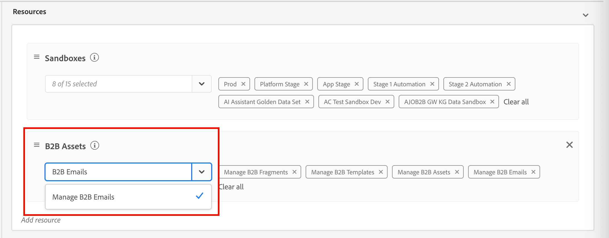{width="700" zoomable="yes"}でのB2B メールの権限設定の管理

1. **[!UICONTROL 保存]**&#x200B;をクリックして変更を適用します。

   権限は、既に役割に割り当てられているユーザーに対して自動的に更新されます。

1. この役割を新しいユーザーに割り当てるには、_[!UICONTROL 役割]_ ダッシュボード内の&#x200B;**[!UICONTROL ユーザー]** タブを選択し、**[!UICONTROL ユーザーを追加]**&#x200B;をクリックします。

   * ユーザー名と電子メールアドレスを入力するか、リストから既存のユーザーを選択します。

     ユーザーがまだ作成されていない場合は、[Experience Platform ドキュメント ](https://experienceleague.adobe.com/ja/docs/experience-platform/access-control/abac/permissions-ui/users){target="_blank"}を参照してください。

   * **[!UICONTROL 保存]**&#x200B;をクリックして変更を適用します。

+++

## コラボレーションツールとコメントの表示

メールデザイン領域でコンテンツを作成、編集、またはレビューする際に、_Collaboration_ パネルにアクセスして、メールコンテンツのコメントを追加または管理できます。

右側のナビゲーションで「_Collaboration_」（）アイコンをクリックします。

メールデザインの右ナビゲーションの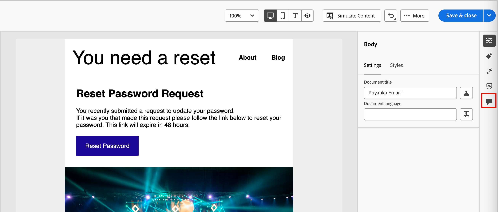{width="700" zoomable="yes"}

## Collaboration workflow

コラボレーションツールを使用して、標準的なコンテンツワークフローに従うことができます。

1. [共同作業者とレビュー担当者を](#invite-collaborators-and-reviewers)招待してください。
1. レビュー担当者[ コメントを追加](#add-comments)。
1. コメントを読み、[返信を追加](#reply-to-a-comment)してフィードバックについて話し合い、必要な編集をおこないます。
1. レビュー担当者または作成者[ コメントを解決](#resolve-comments)。

>[!BEGINSHADEBOX]

**コラボレーションツールの使用に関するベストプラクティス**

* フィードバックが適切なチームメンバーにすばやく届くように、`@`のタグ付けを使用します。

* 関連するフィードバックを、複数のメモをまとめて表示するのではなく、単一のコメントスレッドにグループ化します。

* 常にコメントを追加することで、すぐに返信できるようになります。コメントが削除された場合は、すぐに返信することが重要です。

* コンプライアンス/監査の目的で最終承認バージョンを保存します。

>[!ENDSHADEBOX]

### 共同作業者とレビューアーを招待

1. メールの本文を選択します。

1. 右側のナビゲーションで「_Collaboration_」（）アイコンをクリックします。

1. 右側のパネルの上部に、ユーザーが共同作業を行ってフィードバックを提供するための招待テキストを入力します。

   `@`記号を使用して、ユーザーにアドレスを指定し、ユーザーに通知します。 電子メールや製品内でパルス通知を受信します。

   シンボルの後に名前の最初の数文字を入力すると、一致するユーザー名がポップアップリストに表示されます。 名前にさらに文字を入力すると、結果を改善できます。

   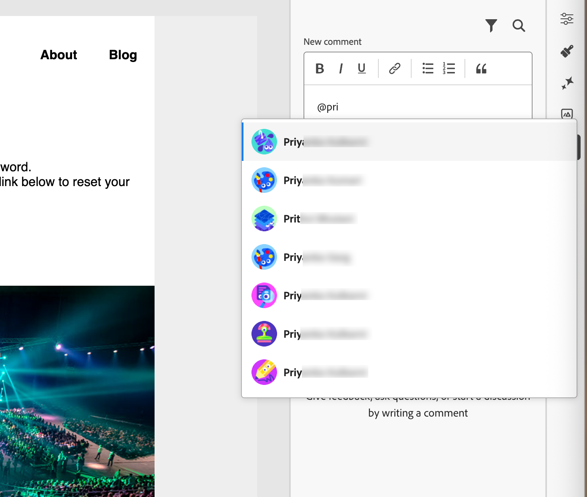{width="550"}

   通知用に追加する名前を選択します。

   招待に含める共同作業者またはレビュー担当者を何人追加してください。

   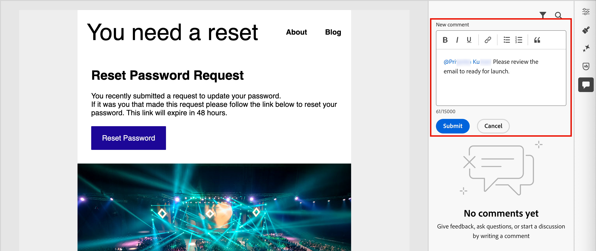{width="700" zoomable="yes"}

1. 「**[!UICONTROL 送信]**」をクリックします。

### コメントを追加

電子メールの共同作業者またはレビュー担当者として、デザインスペースで電子メールを開き、フィードバックを追加します。 _Collaboration_ パネルに一般的なフィードバックを入力するか、カンバスでコンポーネントを選択して、そのデザイン要素に固有のコメントを追加できます。 _など、`@`を使用してチームメイトにタグ付けします@JohnCTA コピー_&#x200B;を更新してください。

新しいコメントごとに、共同作業者が&#x200B;_返信_&#x200B;を使用して議論を続行できるスレッドが開始されます。 デザイン要素に関連付けられている各コメントやスレッドには番号が付けられているため、その要素が適用される場所を簡単に特定できます。

#### 一般的なコメントとフィードバック

_Collaboration_ パネルで、上部のテキストフィールドを使用して、メールコンテンツに関する一般的なコメントを入力します。 `@`記号を使用して、ユーザーにアドレスを指定し、ユーザーに通知します。

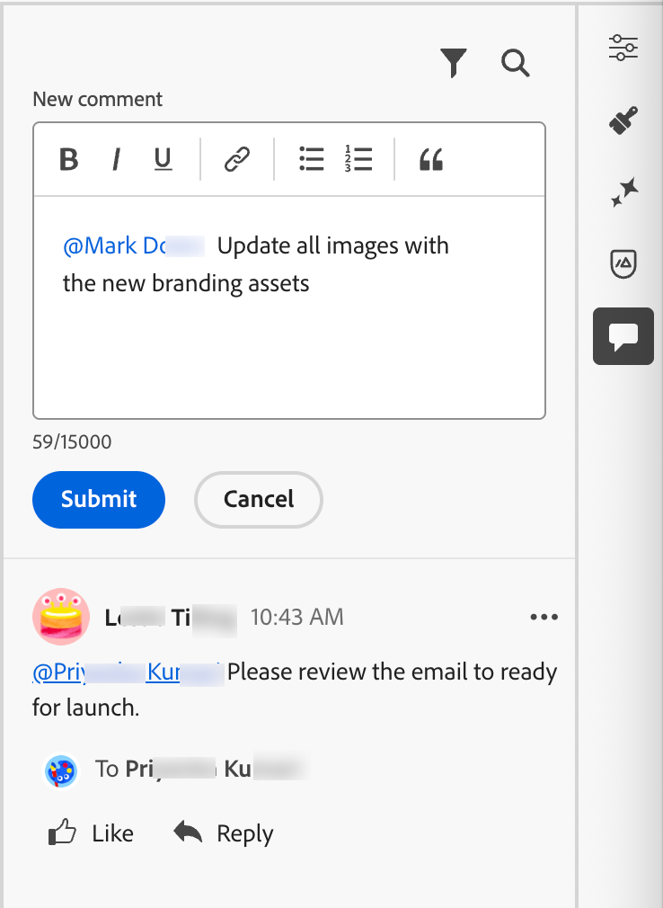{width="400"}

「**[!UICONTROL 送信]**」をクリックしてコメントを記録し、タグ付けされたユーザーに通知を送信します。

#### コンポーネントコメント

1. 構造またはコンテンツコンポーネントを選択します。

1. ツールバーで、_Collaboration_ ツールをクリックします。

   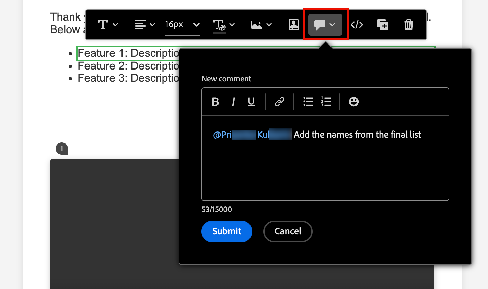{width="600"}

1. テキストフィールドにコメントを入力します。

1. 「**[!UICONTROL 送信]**」をクリックします。

共同作業者は、電子メールキャンバスの番号付きピンのアイコンをクリックして、コメントを表示できます。

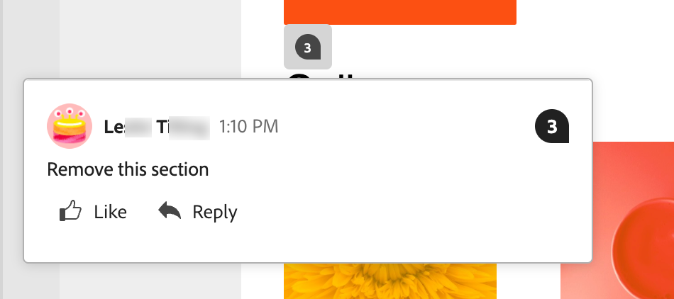{width="450"}

#### コメントへの返信

各コメントに対して、_[!UICONTROL 返信]_&#x200B;関数を使用して、ディスカッションを続行したり、質問に回答したりできます。

コメントの下部にある「**[!UICONTROL 返信]**」をクリックし、返信するテキストを入力します。 現在のコメントの引用を返信に含めるには、_詳細メニュー_ （**...**）アイコンをクリックし、**[!UICONTROL 見積返信]**&#x200B;を選択します。

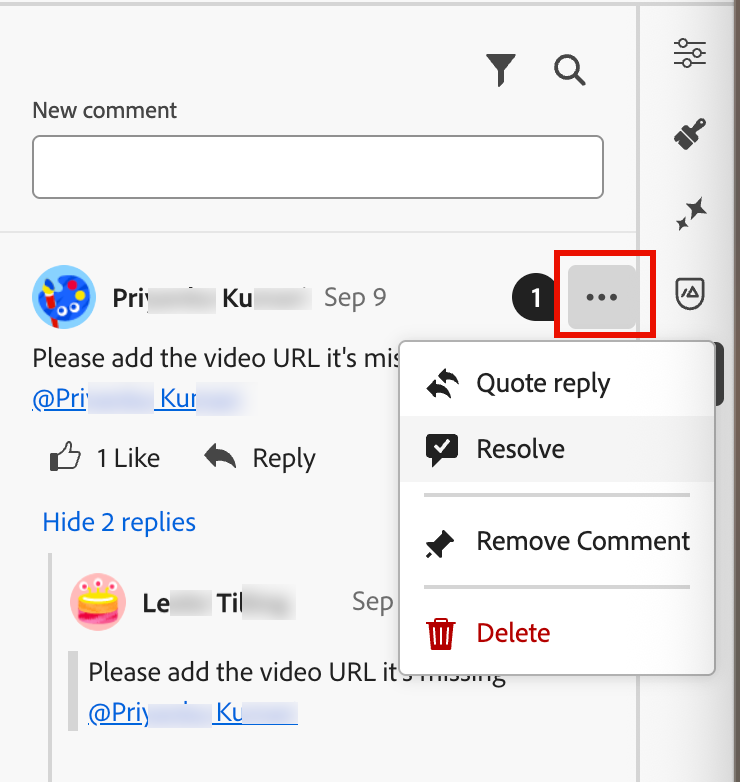{width="350"}

### コメントを解決

作成者またはデザイナーは、レビュー担当者からのフィードバックを評価し、変更したい点を決定します。 変更が完了し、リクエストが満たされたら、_詳細メニュー_ （**...**）アイコンをクリックし、**[!UICONTROL 解決]**&#x200B;を選択します。

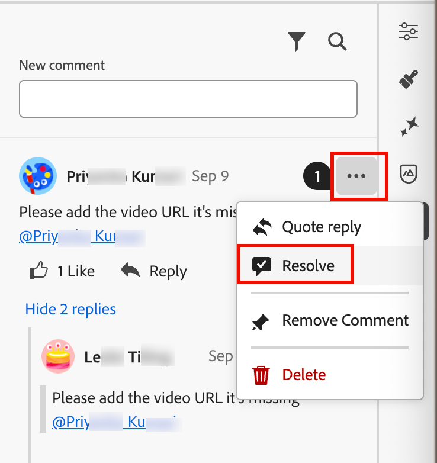{width="350"}

確認ダイアログで、**[!UICONTROL 解決]**&#x200B;をクリックします。

## コメントの管理

コメントやスレッドを管理して、コラボレーション作業のステータスを評価します。

### コメントを配置

コメントがメールキャンバス上の要素に関連付けられていない場合は、必要に応じてコメントを要素に&#x200B;_ピン_&#x200B;できます。 _詳細メニュー_ （**...**）アイコンをクリックし、**[!UICONTROL コメントを配置]**&#x200B;を選択します。 次に、キャンバス上のデザインコンポーネントを選択します。

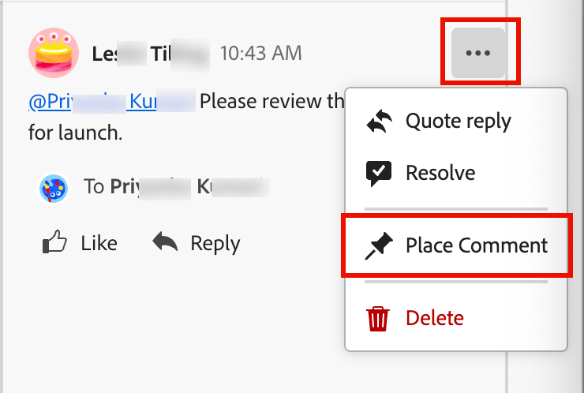{width="350"}

### コメントの削除または削除

コメントを削除して削除することで、コメントのログをクリーンアップできます。 _詳細メニュー_ （**...**）アイコンをクリックし、**[!UICONTROL コメントの削除]**&#x200B;または&#x200B;**[!UICONTROL 削除]**&#x200B;を選択します。

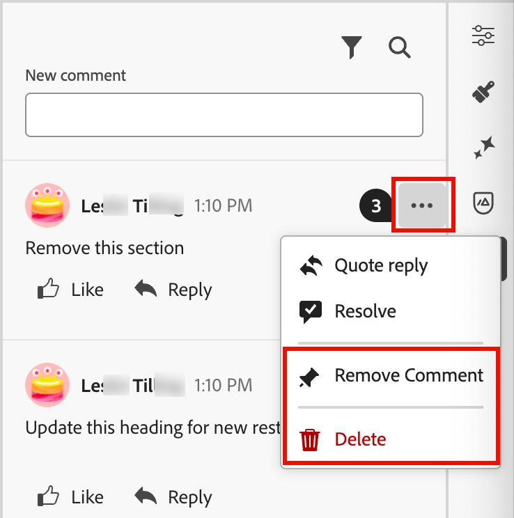{width="350"}

* コメントを削除すると、アクションはコメントをデザイン要素（コメントの作成時に選択）から切り離します。 このコメントは、電子メールのコメントレコードの一部です。

* コメントを削除すると、そのコメントはレコードから完全に削除されます。

### 解決されたコメント

デフォルトでは、解決されたコメントは&#x200B;_Collaboration_ パネルに表示されません。 フィルターをクリアすると、解決されたコメントをいつでも表示できます。 _フィルター_ （）アイコンをクリックし、**[!UICONTROL 解決されたコメントを非表示]** チェックボックスをオフにします。

解決された電子メールコメントを表示するフィルターを表示する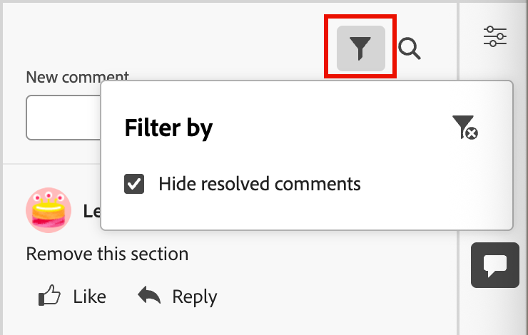{width="350"}

解決されたコメントには、_未解決_ （）アイコンが含まれます。 コメント/スレッドが解決されず、さらに変更が必要であると判断した場合は、アイコンをクリックして、_[!UICONTROL 解決済み]_&#x200B;の指定を削除します。

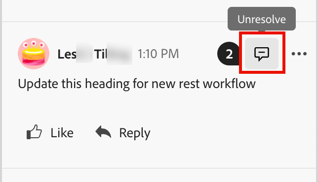{width="300"}
