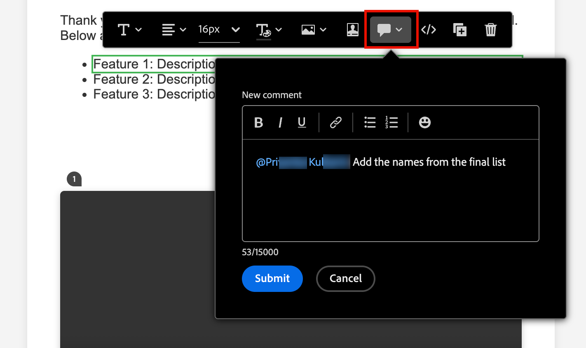

# メールコラボレーションツール

[&#x200B; メールデザインのスペース &#x200B;](./email-authoring.md) には、コメントと解決のためのコラボレーションツールが含まれており、マーケティングチームがメールアセットを直接 [!DNL Journey Optimizer B2B Edition] 内でシームレスにレビュー、ディスカッション、最終決定できるようになります。 ユーザーは、外部ツール（チャット、メールスレッド、スプレッドシートなど）でドラフトを共有する代わりに、メールデザイン空間内でコメントを作成し、編集を提案して、フィードバックを解決できます。 これらのツールを使用して、ワークフローを合理化し、エラーを減らし、アカウントジャーニー内でメールキャンペーンを開始する前に関係者が連携していることを確認します。

* **_フィードバックの一元化_** – すべてのフィードバックを 1 か所で収集および追跡します。

* **_レビューを迅速化_** – 共同作業者は、オーサリング環境内でメールコピーとアセットをレビューできます。

* **_精度の向上_** – すべての編集内容をメール自体に関連付けることで、コミュニケーション誤りのリスクを軽減します。

* **_透明性_** – すべてのコメントと解決策がログに記録され、提案および実装された変更が明確になります。

* **_コンテキスト内のCollaboration_** - レイアウト内のメール本文のコピー、画像、call-to-action（CTA）要素を確認します。

<!-- Enable asynchronous collaboration between team members for an email asset
Allow users to attach comments to specific design elements
Provide a unified interface for viewing and managing all comments within a project
Support comment placement, editing, deleting, and navigation
Display visual indicators (badges) for elements with associated comments -->

## レビュー担当者向けの電子メールコラボレーションツールの有効化

製品管理者は、Adobe Experience Cloudの **[!UICONTROL 権限]** UI を使用して _B2B メールの管理_ 権限を割り当てることで、メールコラボレーションツールへのアクセスを有効にできます。

+++ メール権限を有効にする

1. 権限アプリで、「**[!UICONTROL 役割]**」タブに移動し、目的の [&#x200B; 役割 &#x200B;](https://experienceleague.adobe.com/ja/docs/experience-platform/access-control/abac/permissions-ui/roles){target="_blank"} を選択します。

1. 「**[!UICONTROL 編集]**」をクリックして、権限を変更します。

1. **[!UICONTROL B2B Assets]** リソースを追加し、「**[!UICONTROL B2B メールの管理]**」を選択します。

   {width="700" zoomable="yes"}

1. 「**[!UICONTROL 保存]**」をクリックして、変更を適用します。

   役割に既に割り当てられているユーザーの権限は自動的に更新されます。

1. この役割を新しいユーザーに割り当てるには、**[!UICONTROL 役割]** ダッシュボード内の _[!UICONTROL ユーザー]_ タブを選択し、**[!UICONTROL ユーザーを追加]** をクリックします。

   * ユーザー名とメールアドレスを入力するか、リストから既存のユーザーを選択します。

     ユーザーがまだ作成されていない場合は、[Experience Platform ドキュメント &#x200B;](https://experienceleague.adobe.com/ja/docs/experience-platform/access-control/abac/permissions-ui/users){target="_blank"} を参照してください。

   * 「**[!UICONTROL 保存]**」をクリックして、変更を適用します。

+++

## 共同作業ツールとコメントを表示する

メールデザインスペースでコンテンツの作成、編集、レビューを行う際に、_Collaboration_ パネルにアクセスして、メールコンテンツのコメントを追加または管理できます。

右側のナビゲーションで「_Collaboration_」（）アイコンをクリックします。

{width="700" zoomable="yes"}

## Collaboration ワークフロー

コラボレーションツールを使用して、標準のコンテンツワークフローに従うことができます。

1. 共同作業者とレビュー担当者を [&#x200B; 招待 &#x200B;](#invite-collaborators-and-reviewers) します。
1. レビュー担当者 [&#x200B; コメントを追加 &#x200B;](#add-comments)。
1. コメントを読んだり [&#x200B; 返信を追加 &#x200B;](#reply-to-a-comment) してフィードバックについて話し合ったり、必要な編集を行ったりします。
1. レビュー担当者または作成者 [&#x200B; コメントを解決 &#x200B;](#resolve-comments)。

>[!BEGINSHADEBOX]

**共同作業ツール使用のベストプラクティス**

* フィードバックが適切なチームメンバーにすぐに届くように、タグ付けを `@` 用します。

* 関連するフィードバックを、複数の散乱したメモではなく、単一のコメントスレッドにグループ化します。

* クリーンなワークフローを維持するために、コメントが解決されるとすぐにコメントを解決します。

* コンプライアンスや監査の目的で、最終的な承認済みバージョンを保存します。

>[!ENDSHADEBOX]

### 共同作業者とレビュアーの招待

1. メールの本文を選択します。

1. 右側のナビゲーションで「_Collaboration_」（）アイコンをクリックします。

1. 右側のパネルの上部に、ユーザーが共同作業してフィードバックを提供するための招待テキストを入力します。

   `@` の記号を使用して、ユーザーにアドレスを指定し、通知します。 これらのユーザーは、メールおよび製品内パルス通知を受信します。

   記号の後に名前の最初の数文字を入力すると、一致するユーザ名がポップアップ リストに表示されます。 名前にさらに文字を入力すると、結果を改善できます。

   {width="550"}

   通知用に追加する名前を選択します。

   招待状に含める共同作業者またはレビュー担当者をいくつでも追加します。

   {width="700" zoomable="yes"}

1. 「**[!UICONTROL 送信]**」をクリックします。

### コメントを追加

メールの共同作業者またはレビュアーとして、デザインスペースでメールを開き、フィードバックを追加します。 一般的なフィードバックを _Collaboration_ パネルに入力するか、キャンバスでコンポーネントを選択して、そのデザイン要素に固有のコメントを追加できます。 `@` などの _を使用してチームメイトにタグ付けし@John す。Doe CTAのコピーを更新してください_。

新しいコメントが作成されるたびにスレッドが開始され、共同作業者は _返信_ を使用してディスカッションを続行できます。 デザイン要素に関連付けられている各コメント/スレッドには、適用する要素を簡単に識別できるように番号が付けられます。

#### 一般的なコメントとフィードバック

_Collaboration_ パネルの上部にあるテキストフィールドに、メールコンテンツに関する一般的なコメントを入力します。 `@` の記号を使用して、ユーザーにアドレスを指定し、通知します。

{width="400"}

**[!UICONTROL 送信]** をクリックしてコメントを記録し、タグ付けされたユーザーに通知を送信します。

#### コンポーネントのコメント

1. 構造またはコンテンツコンポーネントを選択します。

1. ツールバーの _0&rbrace;Collaboration&rbrace; ツールをクリックします。_

   {width="600"}

1. テキストフィールドにコメントを入力します。

1. 「**[!UICONTROL 送信]**」をクリックします。

共同作業者は、メールキャンバスの番号付きピンアイコンをクリックして、コメントを表示できます。

{width="450"}

#### コメントに返信する

コメントごとに _[!UICONTROL 返信]_ 関数を使用して、ディスカッションを継続したり、質問に回答したりできます。

コメントの下部にある「**[!UICONTROL 返信]**」をクリックし、返信のテキストを入力します。 返信に現在のコメントの引用を含めるには、_詳細メニュー_ （**...**）アイコンをクリックし、「**[!UICONTROL 返信の引用]**」を選択します。

{width="350"}

### コメントを解決する

作成者またはデザイナーは、レビュー担当者からのフィードバックを評価し、必要な変更を判断します。 変更が完了し、リクエストが満たされたら、_その他メニュー_ （**...**）アイコンをクリックし、「**[!UICONTROL 解決]**」を選択します。

{width="350"}

確認ダイアログで、「**[!UICONTROL 解決]**」をクリックします。

## コメントの管理

コメントとスレッドを管理して、共同作業のステータスを評価します。

### コメントを配置

コメントがメールキャンバス上の要素に関連付けられていない場合は、必要に応じて、コメントを要素に _ピン留め_ ことができます。 _詳細メニュー_ （**...**）アイコンをクリックし、**[!UICONTROL コメントを配置]** を選択します。 次に、キャンバスでデザインコンポーネントを選択します。

{width="350"}

### コメントの削除

コメントログを削除して消去すると、コメントログを消去できます。 _詳細メニュー_ （**...**）アイコンをクリックし、**[!UICONTROL コメントを削除]** または **[!UICONTROL 削除]** を選択します。

{width="350"}

* コメントを削除すると、そのコメントがデザイン要素（コメントの作成時に選択した要素）から切り離されます。 コメントは、メールのコメントレコードに残っています。

* コメントを削除すると、アクションによってレコードからコメントが完全に削除されます。

### 解決済みのコメント

デフォルトでは、解決されたコメントは _0&rbrace;Collaboration&rbrace; パネルに表示されません。_&#x200B;フィルターをクリアすれば、いつでも解決済みのコメントを表示できます。 _フィルター_ （ アイコン）アイコンをクリックし、「**[!UICONTROL 解決済みコメントを非表示にする]**」チェックボックスをオフにします。

{width="350"}

解決済みのコメントには、「_解決解除_ （）アイコンが含まれます。 コメント/スレッドが解決されず、さらに変更が必要であると判断した場合は、アイコンをクリックして _[!UICONTROL 解決済み]_ の指定を削除します。

{width="300"}
