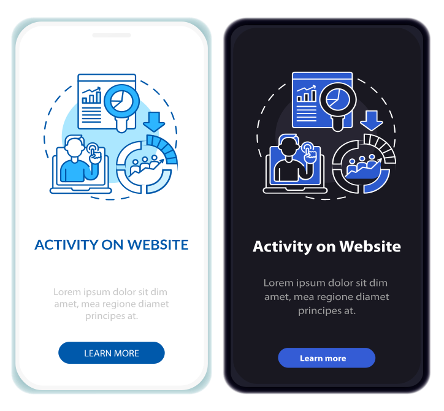

# メールコンテンツのダークモード {#dark-mode}

>[!CONTEXTUALHELP]
>id="ajo-b2b_dark_mode"
>title="ダークモードに切り替え"
>abstract="ダークモードに切り替えると、レンダリング方法のプレビューや、特定のカスタム設定の定義ができます。 最終的なレンダリングは、受信者のメールクライアントに応じて異なります。すべてのメールクライアントがカスタムダークモードをサポートしているわけではありません。"

>[!CONTEXTUALHELP]
>id="ajo-b2b_dark_mode_preview"
>title="ダークモードに切り替え"
>abstract="ダークモードに切り替えると、サポートされているメールクライアントでどのようにレンダリングされるかをプレビューできます。  最終的なレンダリングは、受信者のメールクライアントに応じて異なります。すべてのメールクライアントがダークモードをサポートしているわけではありません。"

_ダークモード_ を使用すると、サポートされるメールクライアントまたはアプリで、テキスト、ボタン、その他の視覚的要素に対して、暗い背景と明るい色のメールを表示できます。 このタイプのディスプレイは、目の疲れを軽減し、バッテリー寿命を節約し、低輝度環境での読みやすさを向上させて、より快適な視聴体験を提供します。 主要なオペレーティングシステムやアプリ全体で高まる傾向として、コンテンツをすべてのユーザーにとって読みやすく、視覚的に魅力あるものにするために、最新のメールデザインでは重要な検討事項になりました。

{width="50%"}

[&#x200B; のビジュアルデザインスペースで &#x200B;](./email-authoring.md) メールコンテンツを作成 [!DNL Journey Optimizer B2B Edition] すると、_&#x200B;**[!UICONTROL ダークモード]**&#x200B;_ 表示に切り替えることができます。 この表示では、ダークモードが有効な場合にメールクライアントをサポートするための特定のカスタム設定を定義することもできます。

## メールクライアントに関する考慮事項

ダークモードを適用する方法は、メールクライアントやアプリによって大きく異なります。 このため、ダークモードでのレンダリングに期待される結果を慎重に検討する必要があります。 メールデザイン領域でダークモードを使用する前に、次のようなメールクライアントの使用例を考慮してください。
<!--
* Check out the list of [email clients supporting dark mode](https://www.caniemail.com/search/?s=dark){target="_blank"}

* Learn more on Dark mode in this [Litmus blog post](https://www.litmus.com/blog/the-ultimate-guide-to-dark-mode-for-email-marketers){target="_blank"}
-->

+++ダークモードをサポートしていないクライアント

次のような一部のメールクライアントでは、この機能をまったくサポートしていません。

* [!DNL Yahoo! Mail]
* [!DNL AOL]

メールデザインでダークモードのカスタム設定を定義すると、これらのメールクライアントはダークモードのレンダリングを表示できません。<!--Regardless of whether the interface is in light or dark mode, your email will render the same.-->

+++

+++独自のダークモード {#default-support} を適用するクライアント

一部のメールクライアントは、受信したすべてのメールに独自のデフォルトのダークモードを体系的に適用しています。 ダークモードの設定と外部設定に応じて、色、背景、画像、その他の要素を自動的に調整します。 次のクライアントが含まれます。

* Gmail （デスクトップ Web メール、iOS、Android™、モバイル Web メール）
* Windows 版 Outlook
* Outlook Windows メール

<!--It is important to note that less than 25% of email clients offer customization options for dark mode. Clients such as Gmail implement their own dark mode rendering, which is not subject to external modification.-->
この場合、クライアントのダークモード設定は、[!DNL Journey Optimizer B2B Edition] で定義したカスタムのダークモード設定よりも優先されます

+++

+++カスタムダークモードをサポートするクライアント

最も人気のあるメールクライアントの多くは、カスタムダークモードを `@media (prefers-color-scheme: dark)` クエリでレンダリングするオプションを提供しています。これは、[!DNL Journey Optimizer B2B Edition] メールスタイルで使用される方法です。 このクライアントのリストには、次のものが含まれます。

* Apple メール macOS
* Apple メール iOS
* Outlook macOS
* Outlook.com
* Outlook iOS
* Outlook Android™

この場合、[!DNL Journey Optimizer B2B Edition] で定義した特定の設定がレンダリングされます。 ただし、電子メールクライアントごとに適用される制限もあります。 例えば、一部のクライアント（Apple Mail 16 （macOS 13）など）では、メールのコンテンツに画像が存在してもダークモードが生成されません。

最適な結果を得るには、ターゲット設定しているメールクライアントでコンテンツをテストします。 各クライアントの最終結果にできるだけ近いシミュレーションを確認するには、メールデザイン領域で [Litmus メールテストレンダリング &#x200B;](./email-test-rendering.md) 統合を使用します。

+++

## ダークモードに対応したデザイン

[!DNL Journey Optimizer B2B Edition] でダークモード用にメールコンテンツのスタイルを設定する場合、ビジュアルデザインスペースには、次の 2 種類のツールが用意されています。

* [&#x200B; プレビュー関数 &#x200B;](#preview-default-dark-mode) を使用して、ほとんどのサポートメールクライアントに対するデフォルトのダークモードレンダリングを確認します。

* サポートされるメールクライアントのデフォルト設定を上書きする場合は、カスタムのダークモード設定を定義し、メールコンテンツに適用します。 [詳細情報](#define-custom-dark-mode)

### デフォルトのダークモードのプレビュー {#preview-dark-mode}

<!-- Should work with templates and themes, NOT for LP and fragments - but TBC with eng. 
>[!NOTE]
>
>Currently you may not be able to switch to dark mode if you select an [email template](use-email-templates.md) or if you apply a [theme](apply-email-themes.md).-->

1. メールデザイン スペースでメールコンテンツを開きます。

   キャンバスの右上には、コンテンツの表示をライト（デフォルト）とダークモードの間で切り替えるライトダークセレクターがあります。

   {width="700" zoomable="yes"}

1. セレクターを _ダークモード_ （）に変更します。

   キャンバスには、デフォルトのダークモードプレビューを使用してコンテンツが表示されます。x

   デフォルトでは、ダークモードプレビューは、画像とアイコンを除くすべての要素に `full color invert` のカラースキームを適用します。 このカラースキームは、明るい要素と暗い要素を持つ領域を検出し、それらを反転します。 明るい背景は暗くなり、暗いテキストは明るくなり、暗い背景は明るくなり、明るいテキストは暗くなります。

   {width="700" zoomable="yes"}

>[!CAUTION]
>
>最終的なレンダリングは、受信者のメールクライアントによって異なる場合があります。 各メールクライアントの最終結果にできるだけ近いシミュレーションを確認するには、[Litmus テストメールのレンダリング &#x200B;](./email-test-rendering.md) 統合を使用します。

### ダークモードのカスタム設定の定義 {#custom-dark-mode}

>[!CONTEXTUALHELP]
>id="ajo-b2b_dark_mode_image"
>title="特定の画像をダークモードで使用"
>abstract="ダークモードがオンの場合に表示する別の画像を選択できます。   ダークモード用に特定の画像を追加しても、すべてのメールクライアントで正しくレンダリングされるとは限りません。 すべてのメールクライアントがカスタムダークモードをサポートしているわけではありません。"

ダークモードに切り替えた後、受信者のメールクライアントでダークモードが有効な場合にのみ表示される、コンテンツの特定のスタイル要素を編集するように選択できます（その機能をサポートしている場合）。

>[!NOTE]
>
>ダークモードの最終的なレンダリングは、各メールクライアントに応じて異なるので、結果はクライアントごとに異なる場合があります。詳しくは、[&#x200B; メールクライアントの考慮事項 &#x200B;](#email-client-considerations) を確認してください。

メールデザインスペースのカスタムダークモードのスタイル設定には、<!-- `@media (prefers-color-scheme: dark)` method--> の要素が使用されます。 CSS クエリ `@media (prefers-color-scheme: dark)` メールクライアントがダークモードに設定されているかどうかを検出し、メールで定義されているダークテーマのデザインを適用します。

カスタムのダークモード設定を定義するには（_T） :_

1. 必要に応じて、デザインキャンバスの右上にあるセレクターを _ダークモード_ （）に移動します。

1. テキスト、背景、ボタンなどのスタイル設定色属性を編集します。

   {width="700" zoomable="yes"}

1. 画像とアイコンには、ダークモード専用のアセットを定義します。

   画像やアイコンの色は変更できませんが、ダークモードで使用する代替アセットを定義できます。 アイコンに対して様々な色の組み合わせを試したり、写真画像の色と彩度を調整したりできます。

   {width="80%"}

   任意の画像を選択し、**[!UICONTROL 設定]** パネルの専用トグルを使用して **[!UICONTROL ダークモード]** に切り替えます。 次に、別の画像アセットを選択します。

   {width="700" zoomable="yes"}

   画像アセットの選択について詳しくは、[&#x200B; 画像アセットの追加 &#x200B;](./email-authoring.md#add-image-assets) を参照してください。

1. デザインの変更中はいつでも、「**[!UICONTROL ライブビューに切り替える]** を選択して、様々なデバイスサイズでのコンテンツのレンダリング方法を確認できます。

   この表示で、セレクターを _ダークモード_ （）に変更し、様々なデバイスでのダークモードバージョンのコンテンツをプレビューします。

   {width="800" zoomable="yes"}

   >[!CAUTION]
   >
   >ライブビューは、様々なデバイスサイズをまたいでレンダリングがどのように表示される可能性があるかを比較するのにデザインされた汎用プレビューです。最終的なレンダリングは、受信者のメールクライアントによって異なる場合があります。

1. ダークモードの変更が完了したら、「**[!UICONTROL コンテンツをシミュレート]**」をクリックします。

   {width="700" zoomable="yes"}

   プレビューツールとプルーフツールを使用して、メールデザインをテストします。 詳しくは [&#x200B; メールコンテンツのプレビューとテスト &#x200B;](./email-simulate-content.md) を参照してください。

1. Litmus Enterprise アカウントをお持ちの場合、「**[!UICONTROL メールをレンダリング]**」を選択して、Litmus の様々なメールクライアント向けの最終的なダークモードのレンダリングを確認します。

   詳しくは、「[Litmus でのメールのレンダリングのテスト &#x200B;](./email-test-rendering.md)」を参照してください。

   >[!CAUTION]
   >
   >シミュレーションはダークモードでのメールの表示に非常に近いのですが、メールサービスプロバイダーやデバイスレベルの設定の違いにより、実際のレンダリングは異なる場合があります。

## ベストプラクティス {#best-practices}

主要なメールクライアント間でダークモードの採用が増加するにつれて、[カスタムダークモード](#define-custom-dark-mode)を使用しているかどうかに関係なく、明るい環境と暗い環境の両方でメールがどのようにレンダリングされるかを考慮することが重要になります。

ダークモードでは、色、背景、画像が変更される可能性があり、場合によってはデザインの選択が上書きされることもあります。 ビジュアルの一貫性、アクセシビリティ、ブランドの整合性を確保するには、次のベストプラクティスに従います。

| 練習 |            |
| -------- | ---------- |
| 画像とロゴの最適化 | チェックリスト：<ul><li>ロゴとアイコンを背景が透明な PNG ファイルとして保存して、ダークモードで白いボックスが表示されないようにします。 <li>白色の背景または明るい背景がハードコードされた画像は回避します。 <li>透明度がオプションでない場合は、不自然な色の反転を防ぐために、デザインでは単色の背景に画像を配置します。 |
| 背景を見る | チェックリスト：<ul><li>ライトモードとダークモードの両方で読みやすくするには、テキストと背景色の間に十分なコントラストを確保します。 <li>重要なコンテンツについては、背景色にのみ依存することは回避します。一部のクライアントは、ダークモードでは背景色をオーバーライドするので、キー情報が表示されていることを確認します。 |
| アクセス可能なコンテンツをダークモードでデザイン | チェックリスト：<ul><li>色覚異常のある人物でも簡単に区別できる色の組み合わせを使用します。 <li>明るい背景と暗い背景の両方に対してコントラストを確保するのに、ミッドトーンパレットを使用します。 <li>アクセシブルな色の組み合わせを高コントラストで使用して、読みやすさを向上させ、[!DNL Web Content Accessibility Guidelines (WCAG)] の標準に準拠します。 [!DNL WebAIM Contrast Checker] などのツールを使用して、カラーコントラストを確認します。 <li>読みやすさに影響する場合があるので、細いフォントは回避します。ブランドに細いフォントが必要な場合は、ダークモードで太字にします。 <li>純粋な黒の上に純粋な白をスキップすると、目の緊張を引き起こす可能性があり、一部のメールクライアントでは自動的に反転する可能性があります。 <li>ダークモードがサポートされていない場合は、アクセスできるフォールバックスタイル設定を指定します。 |
| ダークモード環境でのメールのテスト | チェックリスト：<ul><li>電子メールデザインスペースでは、反転したカラースキームを使用して問題を早期に発見する [&#x200B; ダークモードプレビュー &#x200B;](#preview-dark-mode) を使用します。 <li>[[!UICONTROL &#x200B; メールをレンダリング &#x200B;]](./email-test-rendering.md) オプションを使用して Litmus Enterprise アカウントを使用し、主要なメールクライアント（Apple Mail、Gmail、Outlook など）をまたいでデザインをシミュレーションし、ダークモードでのカラーと画像の動作を確認します。 |

<!--KEEP dark mode accessibility best practices IN ONE SINGLE LOCATION - for now listed on this page.
If needed, it can be moved to the Design accessible content page:
The best practices for designing accesible content in dark mode are listed in [this section](accessible-content.md#dark-mode).-->

<!--**Inline critical styles**

Inline CSS helps maintain more control over styling, as some clients strip external styles in dark mode.-->
