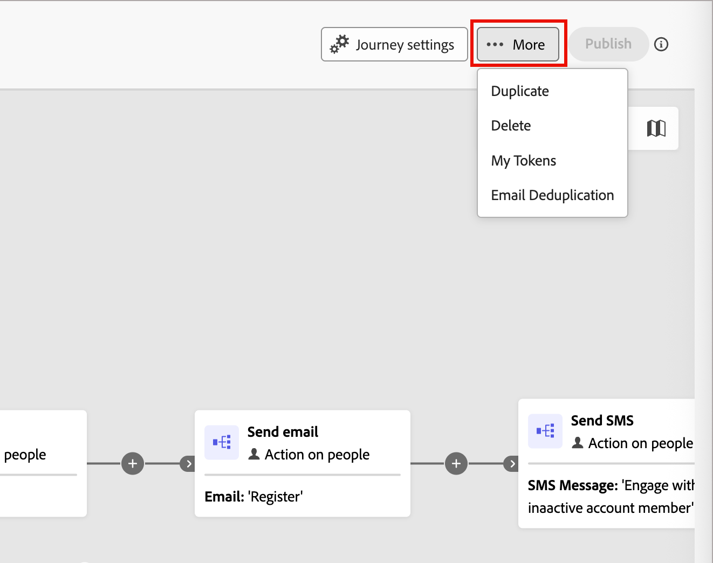

# メールの重複排除

ジャーニー内で同じメールアドレスに同じメールが複数回送信されないようにするには、アカウントジャーニーでメールの重複排除を使用します。 この機能を有効にすると、そのメールアドレスを持つ最初のレコードがジャーニーを完了するまで、重複するメールアドレスがブロックされます。 アカウントがジャーニーを完了すると、新規アカウントがジャーニーにエントリする際に、メールを再度受信する資格を得ることができます。

## メールの重複排除の使用例

メールの重複排除を有効にするために考慮すべき重要なシナリオがいくつかあります。

* **電子メールは、Real-Time CDPのIDとして使用されていません** – 同じ電子メールアドレスが複数の人物プロファイルに表示される場合があります。 重複したプロファイルが同じジャーニーに該当し、メールの送信を複数回防ぐ場合は、この機能を有効にします。

* **複数のアカウントに関連付けられた単一の人物** - [!DNL Real-Time CDP] データモデルが1人の人物を複数のアカウントに関連付ける場合、同じメールアドレスを持つ複数のプロファイルが同じジャーニーに適格である場合に、同じメールを2回送信しないようにするには、この機能を有効にします。

>[!NOTE]
>
>メールの重複は、ジャーニーレベルで適用されます。 同じメールアドレスを持つ個人が異なるジャーニーに適格である場合でも、各ジャーニーからメールを受け取ることができます。

## ジャーニーのメール重複排除を有効にする

アカウントジャーニーのメール重複排除を有効にするには：

1. アカウントジャーニーを開きます。

1. **[!UICONTROL 詳細]** （**...**）をクリックします ジャーニーワークスペースの右上隅にあります。

   {width="450"}

1. **[!UICONTROL メールの重複排除]**&#x200B;を選択します。

1. ダイアログで、「**[!UICONTROL 電子メールの重複排除]**」チェックボックスを選択します。

   {width="400"}

1. 「**[!UICONTROL 保存]**」をクリックします。

メールの重複排除が有効になっている場合、ジャーニーはメールを送信する前に各メールアドレスを確認します。 同じメールアドレスのレコードがそのジャーニーノードに既に入力されている場合、最初のレコードがジャーニーを完了するまで、新しいエントリはブロックされます。
