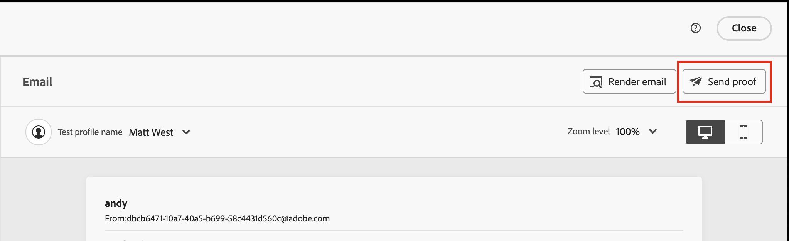

# メールコンテンツのプレビューとテスト {#preview-simulate}

>[!CONTEXTUALHELP]
>id="ajo-b2b_email_preview_simulate"
>title="コンテンツのレンダリング方法の確認"
>abstract="コンテンツを定義したら、プレビューして、使用しているチャネルのレンダリングが正しいことを確認できます。"

_コンテンツをシミュレート_ 機能を使用して、メールコンテンツをプレビューし、特定の受信者にテスト配信を送信します。 プレビューおよびテスト機能にアクセスするには、必須のメールフィールド _[!UICONTROL 送信者名]_、_[!UICONTROL 送信元アドレス]_、_[!UICONTROL 返信先アドレス]_ および _[!UICONTROL 件名]_ を定義する必要があります。

>[!IMPORTANT]
>
>エラーがある場合、メールをプレビューできません。 _アラート_ をチェックして、プレビュー機能をブロックしているエラーがないことを確認します。 警告はプレビューをブロックしませんが、メール配信をトリガーにするジャーニーを公開する前に警告に対処する必要があります。

## メールのプレビューを表示

レンダリングプレビューには、[ メールデザインスペース ](./email-authoring.md) または _[!UICONTROL メール一覧からメールを開く]_ 際の [ 概要 ](./emails-list.md#edit-emails) からアクセスできます。

1. 上部の「**[!UICONTROL コンテンツをシミュレート]**」をクリックします。

   {width="800" zoomable="yes"}

   >[!NOTE]
   >
   >エラーがある場合や、メールの必須フィールドが定義されていない場合、このボタンは使用できません。

1. _[!UICONTROL シミュレート]_ ページの **[!UICONTROL 人物]** リストで、メールのレンダリングに使用するユーザープロファイルを選択します。

   コンテンツプレビューでは、選択したユーザープロファイルに従ってパーソナライズされた要素が入力されます。

   {width="800" zoomable="yes"}

   左側の _[!UICONTROL ユーザー]_ リストに何も表示されていない場合は、接続されたMarketo Engage インスタンスからの連絡先を使用して [ ユーザーを追加 ](#add-people-to-the-profiles-list) します。

   >[!TIP]
   >
   >また、[Litmus テストレンダリング統合 ](./email-test-rendering.md) を使用して、一般的なデスクトップ、モバイルおよび web ベースのクライアントでのメールメッセージのレンダリングを確認することもできます。

## 表示オプションの調整

表示ツールを使用して、デバイスのタイプやズームレベルに応じてプレビューを変更します。

* _デスクトップ_ （）アイコンを選択し、デスクトップスタイルと縦横比を使用してプレビューを表示します。
* _モバイル_ （）アイコンを選択し、モバイルデバイスのスタイルと縦横比を使用してプレビューを表示します。
* _ズームレベル_ 矢印をクリックし、ズーム率を選択して、ズームレベルに応じたコンテンツの変化を確認します。

{width="600" zoomable="yes"}

## 配達確認の送信

配達確認は、オーディエンスのメンバーに送信する前に、ユーザーとチームメンバーがメールメッセージを確認できる、配信されたテストメッセージです。 配達確認の受信者は、メッセージのレンダリング、コンテンツ、パーソナライゼーションの設定および設定を確認できます。 選択したテストプロファイルを使用して配達確認を送信できます。

1. 右上の **[!UICONTROL 配達確認を送信]** をクリックします。

   {width="500"}

1. _配達確認を送信_ ページで、最初の受信者のメールアドレスを入力します。

1. レビューに含める追加の受信者ごとに、「**[!UICONTROL 受信者を追加]**」をクリックし、「**[!UICONTROL 送信先]**」フィールドにメールアドレスを入力します。

   配達確認配信には、最大 10 人の受信者を追加できます。

1. 受信者ごとに、メッセージコンテンツのパーソナライズに使用するテストプロファイルを選択して、「**[!UICONTROL 次の形式でシミュレート]**」フィールドを設定します。

   {width="700" zoomable="yes"}

1. 「**[!UICONTROL 配達確認を送信]**」をクリックします。

## プロファイルリストにユーザーを追加

1. _[!UICONTROL ユーザー]_ リストの上部にある「**[!UICONTROL ユーザーを追加]**」をクリックします。

   {width="500"}

1. _[!UICONTROL テストするユーザーを追加]_ ダイアログで、連絡先の完全なメールアドレスを入力します。

   複数の連絡先を追加するには、複数のアドレスをコンマで区切って入力します。

1. テストプロファイルのリストに追加する、一致した各連絡先のチェックボックスを選択します。

   {width="700" zoomable="yes"}

1. 右上の **[!UICONTROL 追加]** をクリックします。
