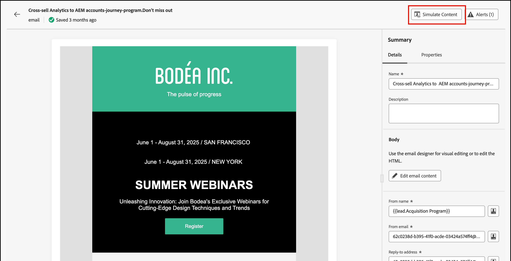

# メールコンテンツのプレビューとテスト {#preview-simulate}

>[!CONTEXTUALHELP]
>id="ajo-b2b_email_preview_simulate"
>title="コンテンツのレンダリング方法の確認"
>abstract="コンテンツを定義したら、プレビューし、使用しているチャネルのレンダリングが正しいことを確認できます。"

_コンテンツをシミュレート_&#x200B;機能を使用して、メールコンテンツをプレビューし、特定の受信者にテスト配信を送信します。 プレビューとテスト機能にアクセスするには、_[!UICONTROL 送信者名]_、_[!UICONTROL 送信者アドレス]_、_[!UICONTROL 返信先アドレス]_、_[!UICONTROL 件名]_&#x200B;などの必須メールフィールドを定義する必要があります。

>[!IMPORTANT]
>
>エラーがある場合は、メールをプレビューできません。 _アラート_&#x200B;を確認して、プレビュー機能をブロックしているエラーがないことを確認します。 警告によってプレビューがブロックされることはありませんが、メール配信をトリガーするジャーニーを公開する前に、警告に対応する必要があります。

## メールのプレビューを表示

レンダリングプレビューには、[電子メールデザインスペース &#x200B;](./email-authoring.md)から、または[電子メールリスト &#x200B;](./emails-list.md#edit-emails)から電子メールを開いたときに&#x200B;_[!UICONTROL 概要]_&#x200B;からアクセスできます。

1. 上部の「**[!UICONTROL コンテンツをシミュレート]**」をクリックします。

   {width="800" zoomable="yes"}をクリック

   >[!NOTE]
   >
   >このボタンは、エラーがある場合や、電子メールに必須フィールドが定義されていない場合は使用できません。

1. _[!UICONTROL シミュレート]_ ページで、メールのレンダリングに使用する&#x200B;**[!UICONTROL 人物]** リストの人物プロファイルを選択します。

   コンテンツプレビューでは、選択した人物プロファイルに従って、パーソナライズされた要素が入力されます。

   {width="800" zoomable="yes"}

   左側の&#x200B;_[!UICONTROL 人物]_ リストが空の場合は、接続されたMarketo Engage インスタンスの連絡先を使用して[人物](#add-people-to-the-profiles-list)を追加します。

   >[!TIP]
   >
   >また、[Litmus テストレンダリング統合](./email-test-rendering.md)を使用して、一般的なデスクトップ、モバイル、およびweb ベースのクライアントでのメールメッセージのレンダリングを確認することもできます。

## 表示オプションの調整

表示ツールを使用して、デバイスの種類またはズームレベルに応じてプレビューを変更します。

* _デスクトップ_ （）アイコンを選択して、デスクトップのスタイルと縦横比を使用してプレビューを表示します。
* _モバイル_ （）アイコンを選択して、モバイルデバイスのスタイルと縦横比を使用してプレビューを表示します。
* _ズームレベル_&#x200B;矢印をクリックし、ズーム率を選択して、ズームレベルに応じてコンテンツがどのように変化するかを確認します。

{width="600" zoomable="yes"}

## 配達確認の送信

プルーフとは、チームメンバーがメールメッセージをレビューしてからオーディエンスのメンバーに送信できるようにする、配信されたテストメッセージのことです。 プルーフの受信者は、メッセージのレンダリング、コンテンツ、パーソナライゼーション設定、設定を確認できます。 選択したテストプロファイルを使用してプルーフを送信できます。

1. 右上の「**[!UICONTROL プルーフを送信]**」をクリックします。

   {width="500"}

1. _プルーフを送信_ ページで、最初の受信者の電子メールアドレスを入力します。

1. レビューに含める追加の受信者ごとに、**[!UICONTROL 受信者を追加]**&#x200B;をクリックし、**[!UICONTROL 送信先]** フィールドに電子メールアドレスを入力します。

   プルーフ配信には、最大10人の受信者を追加できます。

1. 受信者ごとに、メッセージコンテンツのパーソナライズに使用するテストプロファイルを選択して、**[!UICONTROL 別名でシミュレート]** フィールドを設定します。

   {width="700" zoomable="yes"}

1. 「**[!UICONTROL 配達確認を送信]**」をクリックします。

## プロファイルリストへのユーザーの追加

1. _[!UICONTROL ユーザー]_&#x200B;のリストの上部にある「**[!UICONTROL ユーザーを追加]**」をクリックします。

   {width="500"}

1. _[!UICONTROL テスト用にユーザーを追加]_ ダイアログで、連絡先の完全な電子メールアドレスを入力します。

   複数の連絡先を追加するには、複数のアドレスをコンマで区切って入力します。

1. テストプロファイルのリストに追加する、一致した各連絡先のチェックボックスを選択します。

   {width="700" zoomable="yes"}

1. 右上の「**[!UICONTROL 追加]**」をクリックします。
