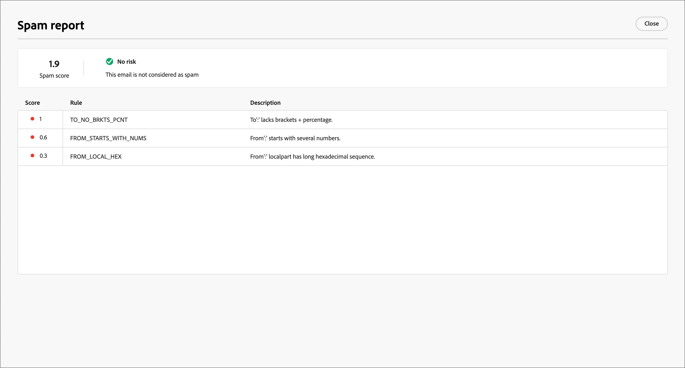

# スパムレポートの確認

多くの電子メールインボックスプロバイダーとほとんどの企業システムでは、スパムフィルタリングプロセスを採用しています。 これらのフィルターをトリガーとするメールを送信すると、配信品質に大きな影響を与える可能性があります。 Journey Optimizer B2B editionでは、スパムレポートを生成して、メールコンテンツのスパムのスコアを確認できます。 このレポートは、[[!DNL SpamAssassin]](https://spamassassin.apache.org/) を使用してメールをテストし、メッセージがスパム対策ツールによってスパムと見なされるかどうかを判断するのに役立ちます。 レポートの情報を使用して、メールコンテンツのスコアと配信品質を向上させるアクションを実行できます。

メールの設定を確認したりコンテンツを編集したりする場合は、_[!UICONTROL シミュレート]_ ページを開いて、_スパムレポート_ を生成し、スパム対策フィルタリングのトリガーとなり得るスコアおよびフラグの付いた要素を確認します。

1. _[!UICONTROL シミュレート]_ ページで、右上の **[!UICONTROL スパムレポート]** をクリックします。

   {width="700" zoomable="yes"}

   レポートプロセスは、メールコンテンツをスキャンし、スコアの生成に使用されるトリガーフィルタリングルールのリストを含むスコアを生成します。 要因には、本文のレイアウト、構造、画像サイズ、スパムトリガーの語句、その他の要素が含まれます。 メール要素のルール評価テストのリストについては、[[!DNL SpamAssassin]  テストリスト ](https://spamassassin.apache.org/old/tests_3_0_x.html) を参照してください。

1. 各項目のスコアと説明を確認します。

   >[!NOTE]
   >
   >スパムスコアは SpamAssassin を使用して計算され、Adobeはルールやスコアリングロジックを所有していません。 [!DNL SpamAssassin] オープンソースプロジェクトについて詳しくは、[[!DNL SpamAssassin]  ドキュメント ](https://cwiki.apache.org/confluence/display/SPAMASSASSIN/) を参照してください。

   スコアが低いほど、メールがスパムとしてマークされる可能性が低くなります。

   {width="600" zoomable="yes"}

   スコアが 5 を超えるレポートには、一部のメッセージが受信時にブロックされるかスパムと見なされる可能性があるという警告が含まれます。 ベストプラクティスとして、スコアを 2 未満に抑えます。

   {width="600" zoomable="yes"}

1. メールコンテンツ内に改善可能な要素がある場合は、コンテンツを編集して必要な更新を適用します。

1. 変更が完了したら、_[!UICONTROL シミュレート]_ ページに戻り、**[!UICONTROL スパムレポート]** を再度クリックして、結果として生じるスコアの改善を確認します。
