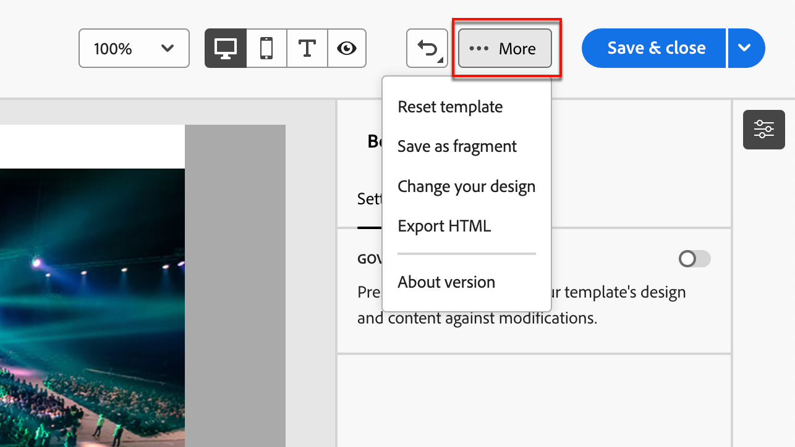

# メールテンプレートオーサリング

[ メールテンプレートを作成 ](./email-templates.md#create-an-email-template) した後、ビジュアルデザインスペースを使用して、メールテンプレートの構造コンポーネントとコンテンツコンポーネントをオーサリングします。

## 構造とコンテンツの追加 {#structure-content}

{{$include /help/_includes/content-design-components.md}}

### カスタム CSS を追加

独自のカスタム CSS をメールテンプレートデザインスペース内に直接追加できます。 カスタム CSS を使用して高度な特定のスタイル設定を適用し、コンテンツの外観をより柔軟に制御できます。 画像、ボタン、テキストなどのコンポーネントを含める前に、この最高レベルのスタイルを追加することをお勧めします。

キャンバスに 1 つ以上のコンテンツコンポーネントがある状態で、左側のナビゲーションツリーで **[!UICONTROL 本文]** コンポーネントを選択して、カスタム CSS エディターにアクセスします。

{width="800" zoomable="yes"}

{{$include /help/_includes/content-design-custom-css.md}}

### フラグメントを追加

>[!NOTE]
>
>フラグメントは、メールコンテンツの _テーマモード_ と _手動モード_ の間で相互互換性がありません。 また、テーマが適用されるメールコンテンツでフラグメントを使用するには、フラグメントを _テーマモード_ で作成する必要があります。

{{$include /help/_includes/content-design-use-fragments.md}}

テンプレートが保存されると、概要の「_[!UICONTROL 使用]_」タブを選択したときに、フラグメントの詳細ページに表示されます。

### 画像アセットの追加

{{$include /help/_includes/content-design-assets.md}}

### レイヤー、設定、スタイルの移動

{{$include /help/_includes/content-design-navigation.md}}

### コンテンツのパーソナライズ

{{$include /help/_includes/content-design-personalization-email.md}}

### リンクされた URL トラッキングを編集

{{$include /help/_includes/content-design-links.md}}

### ダークモードのスタイル設定を適用

_ダークモード_ を使用して、メールクライアントでのダークテーマのメール表示を確認します。 ダークモードまたはテーマを使用すると、サポートされるメールクライアントまたはアプリで、テキスト、ボタン、その他の視覚的要素に対して、暗い背景と明るい色のメールを表示できます。 デザインキャンバスの右上で、セレクターを _ダークモード_ （）に変更します。 次に、サポートしているメールクライアントのダークテーマが有効になっている場合に、表示に使用される特定のカスタム設定をプレビューして定義します。

{width="700" zoomable="yes"}

ダークモードのスタイル設定とベストプラクティスについて詳しくは、[ メールコンテンツのダークモード ](./email-dark-mode.md) を参照してください。

## オプションを表示

ビジュアルデザインスペースで使用できる表示およびコンテンツの検証オプションを活用します。

* プリセットのズームオプション全体でコンテンツをズームイン/ズームアウトします。

* デスクトップ、モバイル、テキストのみ/プレーンテキストのいずれかでコンテンツの表示を切り替えます。
   * _目_ アイコンをクリックすると、デバイス間でコンテンツをプレビューできます。
   * 標準提供のデバイスの 1 つを選択するか、カスタムサイズを入力してコンテンツをプレビューします。

### 詳細オプション

メールデザインスペースの上部にある _[!UICONTROL その他…]_ メニューから、次のアクションを実行できます。

{width="500"}

* **[!UICONTROL テンプレートをリセット]** – このオプションをクリックすると、デザインキャンバスを空白のスレートにクリアして、コンテンツの作成を再開できます。
* **[!UICONTROL フラグメントとして保存]** - テンプレートのすべてまたは一部をフラグメントとして保存し、複数のメールまたはメールテンプレートで再利用します。 フラグメントの名前と説明を指定し、使用可能なフラグメントのリストに保存します。
* **[!UICONTROL デザインを変更]** - _メールのデザイン_ ページに戻ります。 ここから、別のテンプレートを選択して設計プロセスを再開できます。 また、空のキャンバス（_クラシックモード_）または [ ブランドテーマ ](./brand-themes.md) （_テーマモード_）を使用して、ゼロからコンテンツをデザインすることもできます。
* **[!UICONTROL HTMLを書き出し]** - ビジュアルキャンバスのコンテンツを、zip ファイルとしてパッケージ化されたHTML形式のローカルシステムにダウンロードします。
