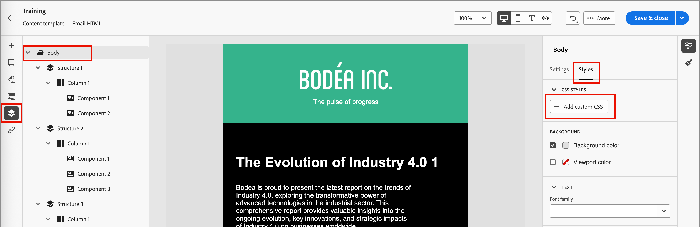
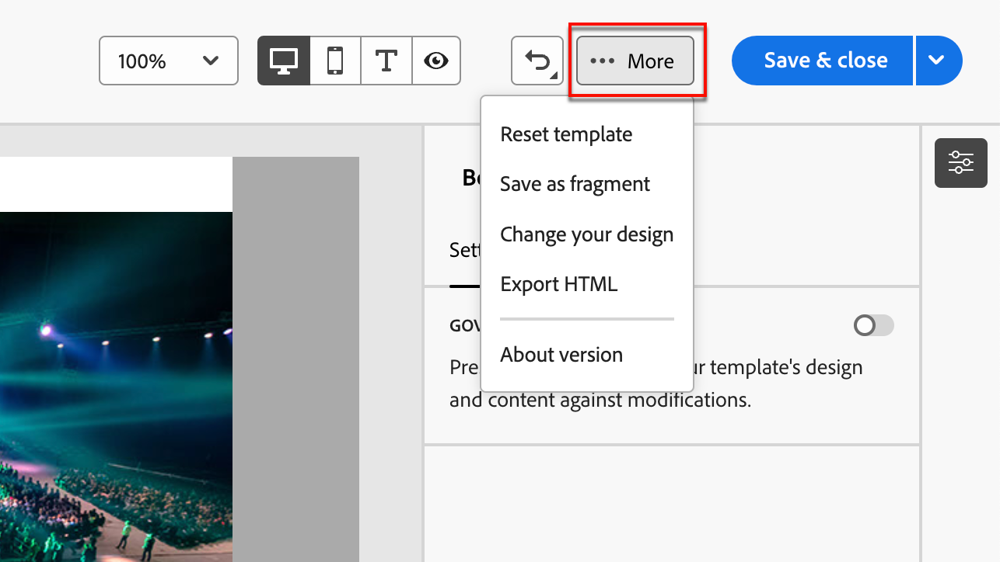

# メールテンプレートオーサリング

[&#x200B; メールテンプレートを作成した後](./email-templates.md#create-an-email-template)、ビジュアルデザインスペースを使用して、メールテンプレート内の構造コンポーネントとコンテンツコンポーネントを作成します。

## 構造とコンテンツの追加 {#structure-content}

{{$include /help/_includes/content-design-components.md}}

### カスタム CSS を追加

電子メールテンプレートデザイン空間で独自のカスタム CSSを直接追加できます。 カスタム CSSを使用して、高度で特定のスタイルを適用し、コンテンツの外観をより柔軟に制御できます。 画像、ボタン、テキストなどのコンポーネントを含める前に、この最高レベルのスタイル設定を追加することをお勧めします。

キャンバス内に少なくとも1つのコンテンツコンポーネントがある場合は、左側のナビゲーションツリーで&#x200B;**[!UICONTROL Body]** コンポーネントを選択して、カスタム CSS エディターにアクセスします。

{width="800" zoomable="yes"}

{{$include /help/_includes/content-design-custom-css.md}}

### フラグメントを追加

>[!NOTE]
>
>フラグメントは、メールコンテンツの&#x200B;_テーマモード_&#x200B;と&#x200B;_手動モード_&#x200B;の間で互換性がありません。 テーマが適用されているメールコンテンツでフラグメントを使用するには、フラグメントを&#x200B;_テーマモード_&#x200B;で作成する必要があります。

{{$include /help/_includes/content-design-use-fragments.md}}

テンプレートを保存した後、概要で「_[!UICONTROL 使用者]_」タブを選択すると、フラグメントの詳細ページに表示されます。

### 画像アセットの追加

{{$include /help/_includes/content-design-assets.md}}

### レイヤー、設定、スタイルの移動

{{$include /help/_includes/content-design-navigation.md}}

### コンテンツのパーソナライズ

{{$include /help/_includes/content-design-personalization-email.md}}

### リンクされたURL トラッキングを編集

{{$include /help/_includes/content-design-links.md}}

### ダークモードのスタイル設定の適用

_ダークモード_&#x200B;を使用して、電子メールクライアントでダークテーマの電子メール表示を確認します。 ダークモードまたはテーマを使用すると、サポートメールクライアントまたはアプリで、テキスト、ボタン、その他のビジュアル要素の背景が暗く、色が明るいメールを表示できます。 デザインキャンバスの右上で、セレクターを&#x200B;_ダークモード_ （）に変更します。 次に、ダークテーマが有効になっている場合に、サポートするメールクライアントが表示に使用する特定のカスタム設定をプレビューして定義します。

{width="700" zoomable="yes"}

ダークモードのスタイル設定とベストプラクティスについて詳しくは、[&#x200B; メールコンテンツのダークモード &#x200B;](./email-dark-mode.md)を参照してください。

## 表示オプション

ビジュアルデザイン分野で利用可能な表示およびコンテンツ検証オプションを活用します。

* プリセットのズームオプション全体でコンテンツをズームイン/ズームアウトします。

* デスクトップ、モバイル、またはテキストのみ/プレーンテキストのコンテンツ表示を切り替えます。
   * デバイス間でコンテンツをプレビューするには、_Eye_ アイコンをクリックします。
   * すぐに使えるデバイスのいずれかを選択するか、カスタムディメンションを入力してコンテンツをプレビューします。

### 詳細オプション

メールデザインスペースの上部にある&#x200B;_[!UICONTROL その他…]_ メニューから、次の操作を実行できます。

{width="500"}

* **[!UICONTROL テンプレートをリセット]** – このオプションをクリックして、デザインキャンバスを空のスレートにクリアし、コンテンツの構築を再開します。
* **[!UICONTROL フラグメントとして保存]** - テンプレートの全部または一部をフラグメントとして保存し、複数のメールまたはメールテンプレートで再利用できます。 フラグメントの名前と説明を指定し、使用可能なフラグメントのリストに保存します。
* **[!UICONTROL デザインを変更]** - _メールをデザイン_ ページに戻ります。 そこから、別のテンプレートを選択してデザインプロセスを再起動できます。 また、空白のキャンバス（_クラシックモード_）を使用するか、[&#x200B; ブランドテーマ &#x200B;](./brand-themes.md) （_テーマモード_）を使用して、コンテンツをゼロからデザインすることもできます。
* **[!UICONTROL HTMLを書き出し]** - ビジュアルキャンバスのコンテンツを、zip ファイルとしてパッケージ化されたHTML形式でローカルシステムにダウンロードします。
