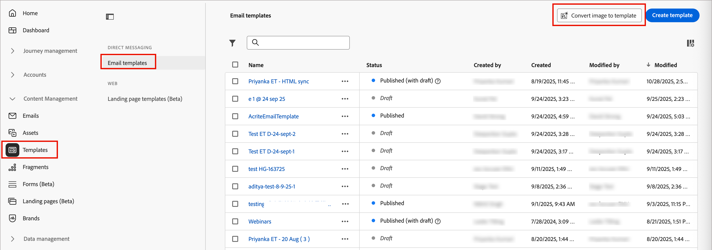
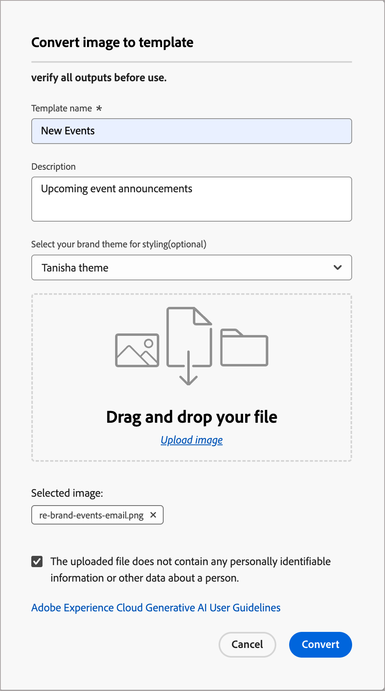

# 画像をメールテンプレートに変換

メールテンプレートの作成と更新は、マーケティングコンテンツsupply chainの基盤となるコンポーネントです。しかし、HTMLの手作業によるコーディングが原因で、多くの場合、これらのタスクには多大な時間とリソースが必要になります。 マーケティング部門は従来、これらのテンプレートを作成するするために代理店やIT部門に依存してきました。 メールテンプレート用の新しい画像からHTMLへのツールは、マーケターがデザインファイルをHTMLコードテンプレートに変換できるようにすることで、このプロセスを簡素化します。 変換されたHTMLは、メールデザインの分野でさらに編集する準備が整います。 このツールは、JPEGとPNGの両方のファイル形式をサポートしており、ドラッグ&amp;ドロップ操作のインターフェイスを備えています。

画像（PNGまたはJPEG）として保存されたデザインファイルを、メールテンプレート用のHTMLに簡単に変換できるため、web チームの貴重な時間とリソースを節約できます。 直感的なテンプレートジェネレーターは、画像をHTMLでコーディングされたメールテンプレートに変換し、メールデザインツールで変更できます。 マーケターやデザインの担当者は、HTMLを手作業でコーディングすることなく、画像をアップロードしてメールテンプレートをすばやく生成できます。 このツールは、JPEGおよびPNG ファイル形式からHTMLでコーディングされた電子メールテンプレートへの変換をサポートしています。

>[!BEGINSHADEBOX]

**ブランドテーマの使用**

Journey Optimizer B2B editionで[&#x200B; ブランドテーマ &#x200B;](./brand-themes.md)が定義されている場合、生成された出力HTMLがブランドテーマのパラメーターに従ってスタイル設定されるように、ブランドテーマを入力として選択できます。 この入力では、生成されたテンプレートに背景色、ボタンの色、フォント、行間、余白、パディングなどのスタイル設定が適用されます。  ブランドテーマを使用することで、スタイルやフォーマットのための追加のデザイン作業を排除し、最小限の編集ですぐに使用できるテンプレートを作成できます。

>[!ENDSHADEBOX]

1. 左側のナビゲーションで、**[!UICONTROL コンテンツ管理]** > **[!UICONTROL テンプレート]**&#x200B;に移動します。

   このアクションを実行すると、テーブルにリストされているインスタンスに対して作成されたすべてのメールテンプレートを含むリストページが開きます。

1. リストの上のヘッダーで、**[!UICONTROL 画像をテンプレートに変換]**&#x200B;をクリックします。

   {width="800" zoomable="yes"}

1. ダイアログで、生成された電子メールテンプレートに便利な&#x200B;**[!UICONTROL テンプレート名]**&#x200B;と&#x200B;**[!UICONTROL 説明]** （オプション）を入力します。

1. （オプション） **[!UICONTROL ブランドテーマ]**&#x200B;を選択して、生成されたHTMLにテーマの仕様に応じた特定のスタイルを適用します。

1. 画像ファイルをアップロードするには、次のいずれかの方法を使用します。

   * 画像ファイルをダイアログファイル領域にドラッグ&amp;ドロップします。
   * 「**[!UICONTROL 画像をアップロード]**」をクリックして、ローカルファイルシステムを使用して画像ファイルを検索し、選択します。

1. 画像ファイルに個人情報や個人データが含まれていないことを確認し、ダイアログの下部にあるチェックボックスをオンにして確認します。

   ガイドラインを確認するには、**[!UICONTROL Adobe Experience Cloud生成AI ユーザーガイドライン]** リンクをクリックします。

   {width="400" zoomable="yes"}

1. 「**[!UICONTROL 変換]**」をクリックします。

   ダイアログが閉じ、新しいテンプレート名がリストに表示されます。ステータスは&#x200B;_[!UICONTROL テンプレートに変換…]_&#x200B;です。ソース画像の複雑さや、適用されるブランドテーマ（使用する場合）によっては、コンバージョンプロセスに時間がかかる場合があります。

1. プロセスが完了したら、テンプレート名をクリックして、レンダリングされたメールコンテンツをプレビューし、必要な編集をおこないます。
