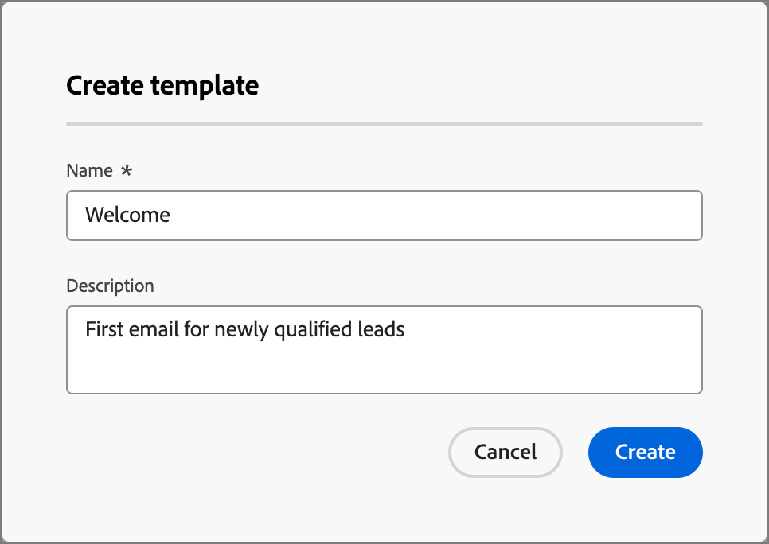

# メールテンプレート

高速で改善された設計プロセスを実現するために、スタンドアロンのメールテンプレートを作成して、Adobe Journey Optimizer B2B Edition アカウントジャーニー全体でカスタムコンテンツを再利用できます。 コンテンツ指向のチームメンバーは、テンプレートを使用することで、ジャーニーの外部でメールコンテンツに取り組むことができます。 その後、マーケティングストラテジストは、これらのスタンドアロンテンプレートをアカウントジャーニー内で再利用、調整できます。 例えば、1 人のチームメンバーがコンテンツのみを担当し、アカウントジャーニーにはアクセスできません。 ただし、マーケターがメール通信の出発点として選択できるメールテンプレートを作成し、ジャーニーの要件に応じてカスタマイズすることはできます。

## メールテンプレートへのアクセスと管理

Adobe Journey Optimizer B2B Edition でメールテンプレートにアクセスするには、左側のナビゲーションに移動して、**[!UICONTROL コンテンツ管理]**/**[!UICONTROL テンプレート]** をクリックします。 このアクションを実行するとリストページが開き、インスタンスで作成されたすべてのメールテンプレートがテーブルに表示されます。

テーブルは「_[!UICONTROL 変更済み]_ 列で並べ替えられ、デフォルトでは最近更新されたテンプレートがリストの先頭に表示されます。 列タイトルをクリックして、昇順と降順を切り替えます。

名前でテンプレートを検索するには、検索バーにテキスト文字列を入力します。 左上の _フィルター_ アイコンをクリックし、作成日または変更日、および作成または変更したテンプレートに従ってリストをフィルタリングします。

{width="700" zoomable="yes"}

右上の _テーブルをカスタマイズ_ アイコンをクリックして、テーブルに表示する列をカスタマイズします。 表示する列を選択し、「**[!UICONTROL 適用]**」をクリックします。

リストページから、次の節で説明するアクションを実行できます。

## メールテンプレートの作成

右上の **[!UICONTROL テンプレートを作成]** をクリックすると、メールテンプレートリストページから新しいメールテンプレートを作成できます。

1. ダイアログで、便利な **[!UICONTROL 名前]** と **[!UICONTROL 説明]** （オプション）を入力します。

   {width="400"}。

1. 最初の **[!UICONTROL 画像ソース]** を設定します。

   Experience Manager Assetsas a Cloud ServiceのサブスクリプションにデフォルトのAdobe Marketo Engage Design Studio が含まれている場合は、どちらのソースからも画像アセットを選択できます。 それには、メールテンプレートまたはビジュアルフラグメントの作成時に画像ソースを選択する必要があります。 ただし、コンテンツの編集時に画像のソースを選択することもできます。

   イメージ ソースの詳細については、[Assets](./assets-overview.md) を参照してください。

1. 「**[!UICONTROL 作成]**」をクリックします。

_[!UICONTROL テンプレートをデザイン]_ ページが開き、テンプレートを作成するための複数のオプション（_[!UICONTROL ゼロからデザイン]_、_[!UICONTROL テンプレートを読み込み]_、_[!UICONTROL デザインHTMLを選択]_ が表示されます。

{width="800" zoomable="yes"}

### ゼロからデザイン {#design-from-scratch}

>[!CONTEXTUALHELP]
>id="ajo-b2b_structure_components_template"
>title="構造コンポーネントの追加"
>abstract="構造コンポーネントはテンプレートのレイアウトを定義します。 **構造**&#x200B;コンポーネントをキャンバスにドラッグ＆ドロップして、テンプレートのコンテンツのデザインを開始します。"

>[!CONTEXTUALHELP]
>id="ajo-b2b_content_components_template"
>title="コンテンツコンポーネントについて"
>abstract="コンテンツコンポーネントは、テンプレートのレイアウトの作成に使用できる空のコンテンツプレースホルダーです。"

E メールデザイナーを使用して、メールコンテンツの構造を定義します。 簡単なドラッグ&amp;ドロップ操作で構造コンポーネントを追加して移動することで、再利用可能なメールコンテンツの形状を数秒でデザインできます。

1. _[!UICONTROL テンプレートをデザイン]_ ホームページで「**[!UICONTROL ゼロからデザイン]**」オプションを選択します。

1. コンテンツのデザインを開始するには、キャンバスにコンポーネントをドラッグ&amp;ドロップして、メールの構造レイアウトを定義します。

   使用可能なデザインツールは、[ メールオーサリング ](./email-authoring.md) に使用されるツールと同等です。 違いは、このコンテンツはテンプレートとして保存され、アカウントジャーニー内の複数の送信メールノードで再利用できることです。

### HTML の読み込み

Adobe Journey Optimizer B2B Edition では、既存のHTMLコンテンツを読み込んでメールテンプレートをデザインできます。 このコンテンツには次のようなものがあります。

* スタイルシートが組み込まれたHTMLファイル。
* HTMLファイル、スタイルシート（.css）および画像を含んだ.zip ファイル

  >[!NOTE]
  >
  >.zip ファイル構造に制限はありません。ただし、.zip フォルダーのツリー構造に合わせて、相対参照を指定する必要があります。

_HTMLコンテンツを含むファイルを読み込むには：_

1. _[!UICONTROL テンプレートのデザイン]_ ホームページで「**[!UICONTROL HTMLの読み込み]**」オプションを選択します。

1. HTML コンテンツを含んだ HTML または .zip ファイルをドラッグ＆ドロップし、「**[!UICONTROL 読み込み]**」をクリックします。

   HTMLコンテンツがアップロードされると、コンテンツは _互換モード_ になります。 このモードでは、テキストのパーソナライズ、リンクの追加またはコンテンツへのアセットの組み込みのみ可能です。

1. 電子メールデザイナーのコンテンツコンポーネントを使用するには、「**[!UICONTROL HTMLコンバーター]**」タブをクリックし、「**[!UICONTROL 変換]**」をクリックします。

>[!NOTE]
>
>`<table>` タグを HTML ファイルの最初のレイヤーとして使用すると、上部レイヤータグの背景や幅の設定などのスタイルが失われる可能性があります。

読み込んだコンテンツは、必要に応じて、視覚的なメールエディターツールを使用してパーソナライズできます。

### デザインテンプレートを選択

_[!UICONTROL テンプレートをデザイン]_ ホームページから、「デザインテンプレートを選択」セクションを使用して、テンプレートからコンテンツを作成します。 Journey Optimizer B2B Edition インスタンスから、サンプルテンプレートまたは保存済みのメールテンプレートを使用できます。

>[!BEGINTABS]

>[!TAB  保存済みテンプレート ]

_テンプレートのデザイン_ ホームページでは、「_サンプルテンプレート_」タブがデフォルトで選択されています。 カスタムテンプレートを使用するには、「**[!UICONTROL 保存済みのテンプレート]**」タブを選択します。

現在のサンドボックスに作成されたすべてのメールテンプレートのリストが表示されます。 _[!UICONTROL 名前]_、_[!UICONTROL 最終変更日]_ および _[!UICONTROL 最終作成日]_ で並べ替えることができます。

{width="800" zoomable="yes"}

リストから目的のテンプレートを選択します。

選択後、テンプレートのプレビューが表示されます。 プレビューモードでは、左右の矢印を使用して、1 つのカテゴリのすべてのテンプレート（選択に応じて、サンプルまたは保存済みのテンプレート）間を移動できます。

{width="800" zoomable="yes"}

表示が使用する内容と一致したら、プレビューウィンドウの右上にある **[!UICONTROL このテンプレートを使用]** をクリックします。

このアクションにより、コンテンツがビジュアルコンテンツデザイナーにコピーされ、必要に応じてコンテンツを編集できます。

>[!TAB  サンプルテンプレート ]

Adobe Journey Optimizer B2B Edition には、様々なメールテンプレートが用意されており _すぐに使用できます_ メールおよびメールテンプレートの作成に使用できます。

{width="800" zoomable="yes"}

>[!ENDTABS]

## 構造とコンテンツを追加

**[!UICONTROL コンポーネント]** メニューからキャンバスに構造をドラッグ&amp;ドロップしてコンテンツのデザインを開始し、メールのレイアウトを定義します。

必要に応じて構造を追加し、右側の要素プロパティで設定を編集します。

_[!UICONTROL n:n 列]_ コンポーネントを選択して、列数（3～10）を任意に定義します。 下部にある矢印を移動して、各列の幅を定義します。

>[!NOTE]
>
>各列のサイズを構造コンポーネントの全幅の 10％未満にすることはできません。削除できるのは空の列のみです。

「**[!UICONTROL コンテンツ]**」セクションを展開し、必要な数の要素を 1 つ以上の構造コンポーネントに追加します。

各コンポーネントは、右側のパネルの _[!UICONTROL 設定]_ タブまたは _[!UICONTROL スタイル]_ タブを使用して、さらにカスタマイズできます。 例えば、各コンポーネントのテキストスタイル、パディングまたは余白を変更できます。

### 画層、設定、およびスタイルをナビゲートする

次の例では、3 列で構成される構造コンポーネント内のパディングと垂直方向の整列を調整する手順について説明します。

1. メール内で構造コンポーネントを直接選択するか、左側のメニューで使用可能なナビゲーションツリーを使用します。

1. ツールバーから **[!UICONTROL 列を選択]** をクリックし、編集する列を選択します。

   キャンバスに表示される {width="800" zoomable="yes"}

   構造ツリーから選択することもできます。 その列の編集可能なパラメーターが、「_[!UICONTROL スタイル]_」タブに表示されます。

1. 「**[!UICONTROL 整列]**」で、_上_、_中央_、または _下_ アイコンを選択します。

1. **[!UICONTROL パディング]** の下で、すべての辺のパディングを定義します。

   パディングを微調整する場合は、「**[!UICONTROL 各辺に異なるパディングを使用]**」を選択します。鍵アイコンをクリックして、同期を解除します。

1. 必要に応じて、他の列の整列とパディングを調整します。

1. 変更を保存します。

### コンテンツのパーソナライズ

次の例では、リード/アカウント属性とシステムトークンを使用してテンプレートコンテンツをパーソナライズする手順の概要を説明します。

1. テキストコンポーネントを選択し、ツールバーの _パーソナライゼーションを追加_ アイコンをクリックします。

   {width="500"}

   これにより、「_Personalizationを編集_ ダイアログが開きます。

1. **+** または **...** をクリックして、空白スペースにトークンを追加します。

   {width="700" zoomable="yes"}

1. 「**[!UICONTROL 保存]**」をクリックします。

### フラグメントを追加

ビジュアルコンテンツエディターでは、「_フラグメント_」アイコンが左側に表示されます。 次の例では、フラグメントをテンプレートコンテンツに追加する手順の概要を説明します。

1. フラグメントリストを開くには、「_フラグメント_」アイコンをクリックします。

   次の操作が可能です。

   * リストを並べ替えます。
   * リストを参照、検索またはフィルターします。
   * サムネール表示とリスト表示を切り替えます。
   * 最近作成したフラグメントが反映されるように、リストを更新します。

   {width="700" zoomable="yes"}

1. 任意のフラグメントを構造コンポーネントプレースホルダーにドラッグ&amp;ドロップします。

   エディターは、メール構造のセクション/要素内でフラグメントをレンダリングします。

フラグメントのコンテンツは、構造内で動的に更新され、コンテンツがメールにどのように表示されるかが視覚的に表示されます。

メール内の水平レイアウト全体を占めるようにフラグメントを追加する場合は、1:1 列構造を追加してから、フラグメントをドラッグ&amp;ドロップします。

メールを保存した後、概要の「_[!UICONTROL 使用者]_」タブを選択すると、フラグメントの詳細ページに表示されます。 メールテンプレートに追加されたフラグメントは、テンプレート内では編集できません。コンテンツは、ソースフラグメントによって定義されます。

### アセットの追加

ビジュアルコンテンツエディターで、左側に表示されている「_Assets_」アイコンを選択します。

>[!NOTE]
>
>Experience Manager Assetsas a Cloud ServiceのサブスクリプションにデフォルトのAdobe Marketo Engage Design Studio が含まれている場合は、テンプレートの詳細ページで選択されたソースから画像アセットを選択できます。

次の例では、テンプレートコンテンツにアセットを追加する手順の概要を説明します。

1. アセットライブラリを開くには、_Assets_ アイコンをクリックします。

   アセットセレクターから、ソースライブラリに保存されたアセットを直接選択できます。

1. 新しいアセットを追加するには、画像アセットを構造コンポーネントにドラッグ&amp;ドロップします。

1. キャンバスで画像アセットを選択して置き換え、画像ソースツールの **[!UICONTROL アセットを選択]** をクリックします。

   {width="700" zoomable="yes"}

### URL のプレビューと編集

1. 左側の _[!UICONTROL リンク]_ アイコンをクリックすると、追跡するコンテンツのすべての URL が表示されます。

1. 必要に応じて、_編集_ （鉛筆）アイコンをクリックし、_トラッキングタイプ_ または _ラベル_ を変更して、リンクに _タグ_ を追加します。

{width="500"}

### オプションを表示

ビジュアルメールエディターで使用できる表示およびコンテンツの検証オプションを活用します。

* プリセットのズームオプション全体でコンテンツをズームイン/ズームアウトします。

* デスクトップ、モバイル、テキストのみ/プレーンテキストのいずれかでコンテンツの表示を切り替えます。
   * _目_ アイコンをクリックすると、デバイス間でコンテンツをプレビューできます。
   * 標準提供のデバイスの 1 つを選択するか、カスタムサイズを入力してコンテンツをプレビューします。

### 詳細オプション

ビジュアルコンテンツエディターの _その他のオプション_ セレクターから、次のアクションを実行できます。

{width="500"}

* **テンプレートをリセット** – このオプションをクリックすると、ビジュアルメールデザイナーキャンバスが空白のスレートに戻り、コンテンツの作成を再開できます。
* **フラグメントとして保存** – すべてのフラグメントまたは一部をフラグメントとして保存し、複数のメールまたはメールテンプレートで再利用します。 フラグメントの名前と説明を指定し、使用可能なフラグメントのリストに表示します。
* **デザインを変更** - _テンプレートのデザイン_ ページに戻ります。 ここから、「メールテンプレートの作成」セクションで説明されている任意のコースを実行できます。
* **書き出しHTML** - ビジュアルキャンバスのコンテンツを、zip ファイルとしてパッケージ化されたHTML形式でローカルシステムにダウンロードします。

## メールテンプレートの詳細を表示

テンプレートのリストページで、メールテンプレートの名前をクリックして、メールテンプレートの詳細ページを開きます。 ここから、メールテンプレートの基本プロパティを表示し、ビジュアルコンテンツエディターにアクセスしてテンプレートコンテンツを変更できます。

{width="700" zoomable="yes"}

* 名前や説明など、メールテンプレートの詳細を表示します。 これらの設定は編集できます。 説明ボックスの外側をクリックすると、変更が自動的に保存されます。

* 作成者、作成日、最終更新日、変更者など、メールテンプレートのプロパティを表示します。

* 右上の **[!UICONTROL 詳細]** をクリックすると、_複製_ や _削除_ など、メールテンプレートに関するクイックアクションが表示されます。

* アクティブなアラート（メールテンプレートのエラーと警告）がある場合は、右上の **[!UICONTROL アラート]** をクリックして情報を表示します。

  これらのアラートでは、メールの作成にメールテンプレートの使用が禁止されているわけではありませんが、この情報により、マーケターは、配信に使用する前に、機能しない可能性のある内容と必要な更新に関する情報を入手できます。

## 参照別に使用される E メール テンプレートの表示

メールテンプレートの詳細ページ内で、「**[!UICONTROL 使用者]** タブをクリックして、アカウントジャーニー全体のメールにおけるこのメールテンプレートの使用箇所の詳細を表示します。

{width="400"}

Journey Optimizer B2B Edition のメールは、ジャーニー内に埋め込まれて作成されるので、テンプレートを使用するメールの親ジャーニーは参照に表示されます。

* リンクをクリックすると、メールテンプレートが使用されている、対応するジャーニーメールに移動します。

* 「戻る」矢印をクリックしてビューを終了すると、リストページに戻ります。

## メールテンプレートの編集

このアクションは、次の場所から実行できます。

* 詳細ページ – 「**[!UICONTROL メールテンプレートを編集]**」をクリックします。
* リストページ – メールテンプレートの横にある省略記号（**...**）をクリックし、「**[!UICONTROL 編集]**」を選択します。

このアクションを実行すると、メールテンプレートが最後に保存されたステータスに基づいて、_テンプレートをデザイン_ ページまたはビジュアルコンテンツエディターページに移動します。 ここから、必要に応じてメールテンプレートのコンテンツを編集できます。 編集オプションについて詳しくは、[ メールテンプレートの作成 ](#create-email-templates) を参照してください。

## メールテンプレートの複製

次のいずれかの方法を使用して、メールテンプレートを複製できます。

* 右側のメールテンプレートの詳細で、「詳細 **[!UICONTROL を展開し、「**[!UICONTROL  複製 ]**をクリックし]** す。

  {width="400"}

* _メールテンプレート_ リストページで、テンプレートの横の省略記号（...）をクリックし、「**[!UICONTROL 複製]**」を選択します。

ダイアログで、便利な名前（一意の）と説明を入力します。 「**[!UICONTROL 複製]**」をクリックして、アクションを完了します。

複製された（新規）メールテンプレートが _メールテンプレート_ リストに表示されます。

## メールテンプレートの削除

メールテンプレートの削除は取り消すことができないので、削除アクションを開始する前に確認します。 メールテンプレートは、次のいずれかの方法を使用して削除できます。

* 右側のテンプレートの詳細で、「**[!UICONTROL 詳細]**」を展開し、「**[!UICONTROL 削除]**」をクリックします。
* _メールテンプレート_ リストページで、テンプレートの横の省略記号（...）をクリックし、「**[!UICONTROL 削除]**」を選択します。

  {width="500"}

この操作を実行すると、確認ダイアログが開きます。 このプロセスを中止するには、「**[!UICONTROL キャンセル]**」をクリックします。削除を確定するには、「**[!UICONTROL 削除]**」をクリックします。

## 一括アクションの実行

メールテンプレートのリストページで、左側のチェックボックスをオンにして、一度に複数のテンプレートを選択します。 複数のテンプレートを選択すると、バナーが下部に表示されます。

{width="600"}

**[!UICONTROL 削除]** – 一度に最大 20 個のテンプレートを削除できます。 確認ダイアログでは、アクションを中止したり、テンプレートの削除を確定したりできます。

## 保存済みテンプレートからのメールのオーサリング

「_メールを作成_」画面から、「_デザインテンプレートを選択_」セクションを使用して、テンプレートからコンテンツを作成します。

作成したメールテンプレートの 1 つを使用してコンテンツの作成を開始するには、次の手順に従います。

1. _コンテンツを編集_ ページからメールDesignerにアクセスします。

   _メールを作成_ ページでは、「_サンプルテンプレート_」タブがデフォルトで選択されています。

1. カスタムメールテンプレートを使用するには、「**[!UICONTROL 保存済みのテンプレート]**」タブを選択します。

   このタブには、サンドボックスで作成されたすべてのメールテンプレートのリストが表示されます。 _名前別_、_最終変更日_ および _最終作成日_ で並べ替えることができます。

1. リストから目的のテンプレートを選択します。

   選択後、テンプレートのプレビューが表示されます。 プレビューモードでは、左右の矢印を使用して、1 つのカテゴリのすべてのテンプレート（選択に応じて、サンプルまたは保存済みのテンプレート）間を移動できます。

1. 右上で **[!UICONTROL このテンプレートを使用]** をクリックします。

1. 必要に応じて、ビジュアルコンテンツデザイナーからコンテンツを編集します。
