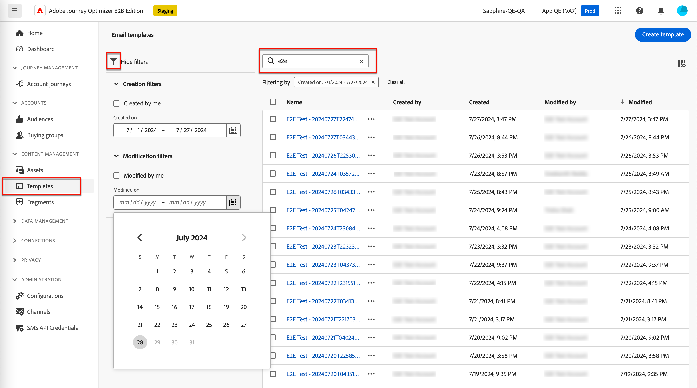
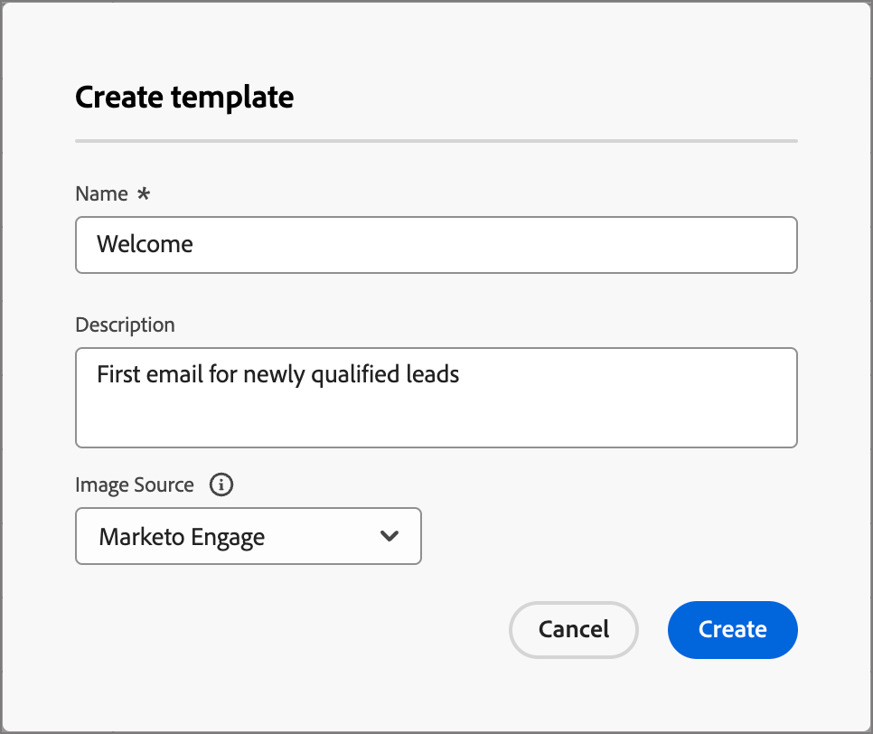
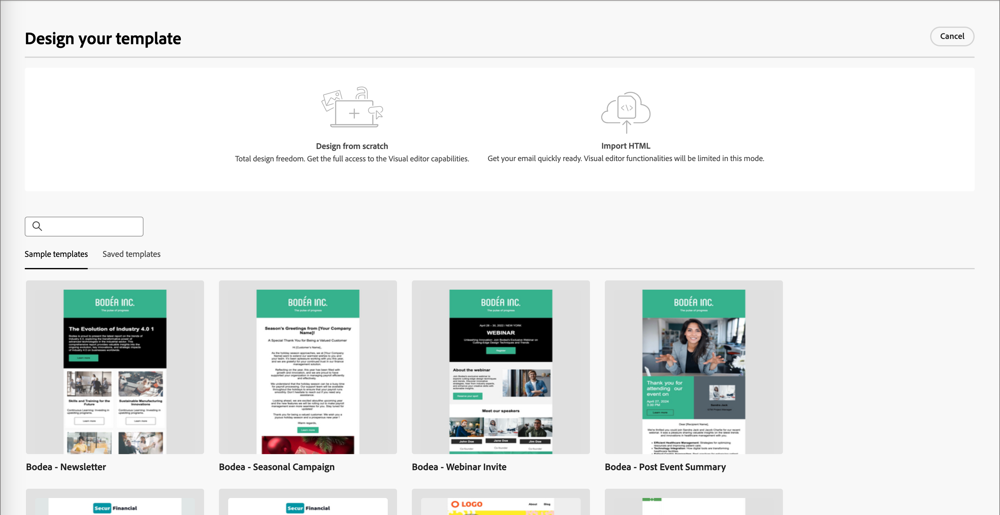
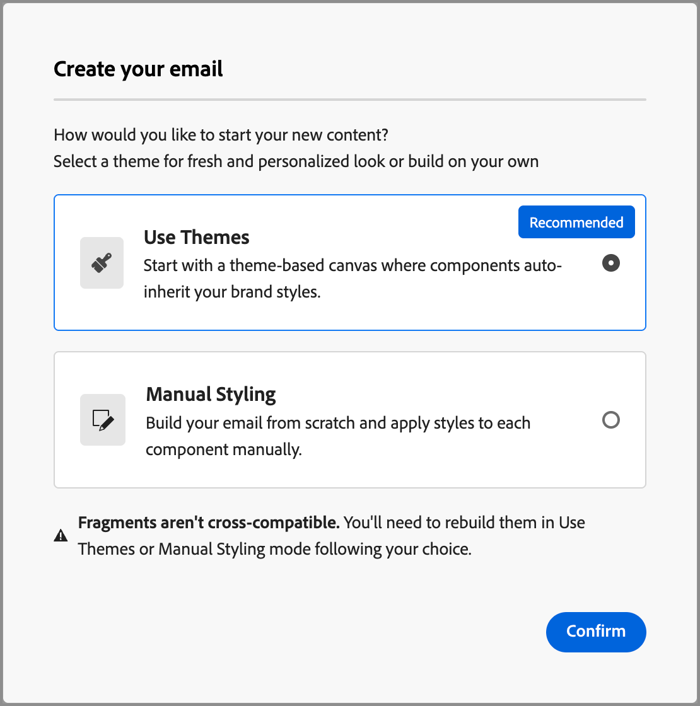
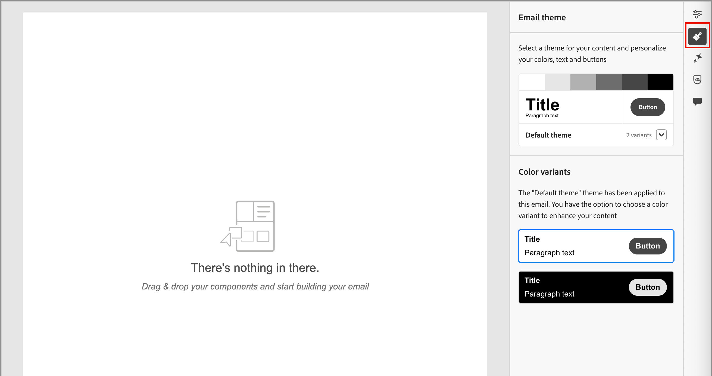
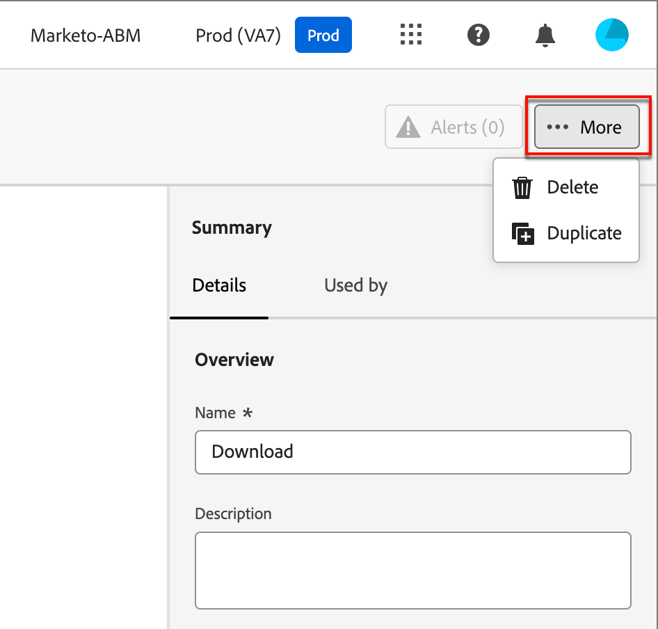
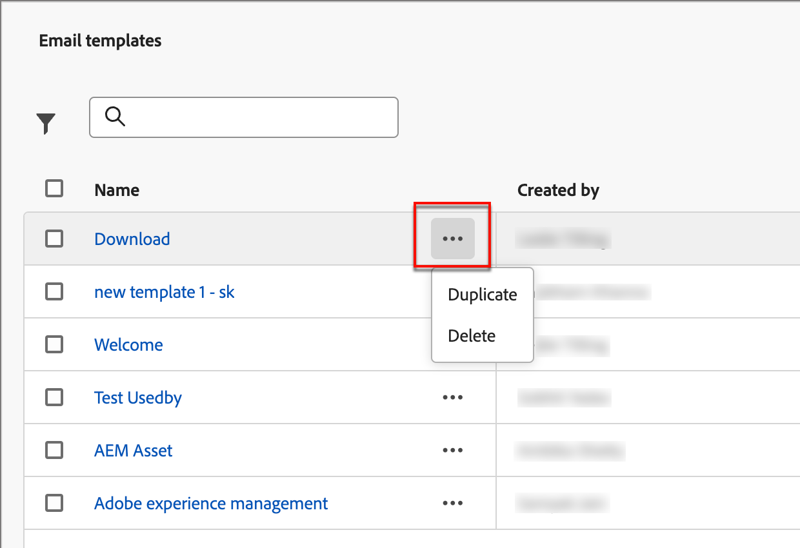
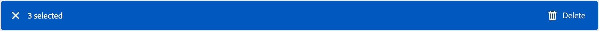

# メールテンプレート

デザインプロセスを高速化および改善するために、スタンドアロンのメールテンプレートを作成して、[!DNL Adobe Journey Optimizer B2B Edition]のアカウントジャーニーでカスタムコンテンツを再利用できます。 テンプレートを通じて、コンテンツを重視するチームメンバーは、ジャーニー外でメールコンテンツに取り組むことができます。 マーケティング戦略担当者は、それらのスタンドアロンテンプレートを再利用して、ジャーニーに適合させることができます。 たとえば、あるチームメンバーはコンテンツのみを担当し、アカウントジャーニーにはアクセスできません。 しかし、マーケターがメールコミュニケーションのベースとして選択できるメールテンプレートを作成し、ジャーニーの要件に応じてカスタマイズすることができます。

## メールテンプレートへのアクセスと管理

[!DNL Journey Optimizer B2B Edition]でメールテンプレートにアクセスするには、左側のナビゲーションで&#x200B;**[!UICONTROL コンテンツ管理]**/**[!UICONTROL テンプレート]**&#x200B;をクリックします。 サイドパネルで、**[!UICONTROL メールテンプレート]**&#x200B;を選択します。

このアクションを実行すると、インスタンスで作成されたすべてのメールテンプレートがテーブル形式で一覧表示されたリストページが開きます。

リストは、デフォルトで&#x200B;_[!UICONTROL Modified]_&#x200B;列で並べ替えられ、最も最近更新されたテンプレートが上部に表示されます。 列のタイトルをクリックして、昇順と降順を変更します。

テンプレートを名前で検索するには、検索バーにテキスト文字列を入力します。 左上の&#x200B;_フィルター_ アイコンをクリックして、作成または変更日、作成または変更したテンプレートに従ってリストをフィルタリングします。

{width="800" zoomable="yes"}

右上の&#x200B;_テーブルをカスタマイズ_ アイコン （）をクリックして、テーブルに表示する列をカスタマイズします。 表示する列を選択し、**[!UICONTROL 適用]**&#x200B;をクリックします。

表示されたテンプレートのリストから、次の節で説明するアクションを実行できます。

## メールテンプレートの作成

メールテンプレートのリストページからメールテンプレートを作成するには、右上の「**[!UICONTROL テンプレートを作成]**」をクリックします。

1. ダイアログで、便利な&#x200B;**[!UICONTROL 名前]**&#x200B;と&#x200B;**[!UICONTROL 説明]** （オプション）を入力します。

   {width="400"}

1. 「**[!UICONTROL 作成]**」をクリックします。

_[!UICONTROL テンプレートをデザイン]_ ページが開き、テンプレートを作成するための複数のオプションが表示されます。_[!UICONTROL ゼロからデザイン]_、_[!UICONTROL HTMLを読み込む]_、または&#x200B;_[!UICONTROL デザインテンプレートを選択]_。

{width="800" zoomable="yes"}

電子メールテンプレートデザインの開始に使用する方法を選択したら、ビジュアルデザインスペースを使用して[電子メールテンプレートコンテンツを作成します](./email-template-authoring.md)。

### ゼロからデザイン

ビジュアルコンテンツエディターを使用して、メールコンテンツの構造を定義します。 シンプルなドラッグ&amp;ドロップ操作で構造コンポーネントを追加、移動させることで、再利用可能なメールコンテンツの形を数秒でデザインすることができます。

>[!NOTE]
>
>使用可能なデザインツールは、[電子メール作成](./email-authoring.md)で使用されるツールと同等です。 違いは、このコンテンツがテンプレートとして保存され、アカウントジャーニー内の複数の&#x200B;_メール送信_ ノードで再利用できることです。

1. _[!UICONTROL テンプレートのデザイン]_ ホームページから、**[!UICONTROL 最初からデザイン]** オプションを選択します。

1. _[!UICONTROL メールを作成]_ ダイアログで、テンプレートに使用するメールコンテンツのタイプを選択します。

   * **[!UICONTROL テーマを使用]** – 電子メールテンプレートを&#x200B;_テーマモード_&#x200B;で作成するには、このオプションを選択します。 このモードでは、定義済みのブランドテーマを使用して、コンテンツのオーサリングプロセスを効率化し、定義された標準に合わせてデザインを調整できます。

   {width="450"}

   * **[!UICONTROL 手動スタイル設定]** – 電子メールテンプレートを&#x200B;_手動モード_&#x200B;で作成するには、このオプションを選択します。 このモードでは、空白のカンバスに追加するすべての構造およびコンテンツコンポーネントのスタイル設定を手動で設定します。

1. （_テーマモード_&#x200B;のみ）テーマを適用します。

   メールデザインスペースで、右側の&#x200B;_テーマ_ （）アイコンをクリックします。

   {width="600" zoomable="yes"}

   デフォルトのテーマまたはテンプレートに適用されたテーマが表示されます。 このテーマのカラーバリエーションを切り替えることができます。

   表示されているテーマの横にある矢印をクリックして、使用可能なカスタムテーマとAdobe テーマのリストを表示します。 組織に対して作成されたカスタムテーマを使用するには、**[!UICONTROL マイテーマ]**&#x200B;を選択します。

   リストの外側をクリックすると、選択したテーマによってスタイルが適用されます。 カラーバリエーションを切り替えることができます。

1. [構造とコンテンツ &#x200B;](./email-authoring.md#add-structure-and-content)をテンプレートに追加します。

   適用されたテーマがある場合、追加されたコンポーネントは、テーマで定義されたスタイルを自動的に継承します。

### HTML の読み込み

Adobe Journey Optimizer B2B Editionを使用すると、既存のHTML コンテンツを読み込んで、メールテンプレートをデザインできます。

{{$include /help/_includes/content-design-import.md}}

{width="500"}

>[!NOTE]
>
>`<table>` タグを HTML ファイルの最初のレイヤーとして使用すると、上部レイヤータグの背景や幅の設定などのスタイルが失われる可能性があります。

ビジュアルデザイン領域では、必要に応じて読み込んだコンテンツをパーソナライズできます。

### デザインテンプレートの選択

{{$include /help/_includes/content-design-select-template.md}}

## 電子メールテンプレートの詳細を表示

テンプレートリストページで、メールテンプレートの名前をクリックして、メールテンプレートの詳細ページを開きます。 ここから、メールテンプレートの基本的なプロパティを表示したり、ビジュアルコンテンツエディターにアクセスしてテンプレートコンテンツに変更を加えたりできます。

{width="700" zoomable="yes"}

* 名前や説明など、メールテンプレートの詳細を表示します。 これらの設定は編集可能です。 説明ボックスの外側をクリックすると、変更が自動的に保存されます。

* 作成者、作成日、最終更新日、変更者など、メールテンプレートのプロパティを表示します。

* 右上の&#x200B;**[!UICONTROL 詳細]**&#x200B;をクリックして、メールテンプレートに対して&#x200B;_重複_&#x200B;や&#x200B;_削除_&#x200B;などの素早いアクションを実行します。

* アクティブなアラート（メールテンプレートのエラーと警告）がある場合は、右上の「**[!UICONTROL アラート]**」をクリックして情報を表示します。

  これらのアラートは、メール作成にメールテンプレートを使用することを禁止するものではありません。 この情報は、何が機能しないかをマーケティング部門に可視化し、配信に使用する前に必要な更新情報を提供します。

## 使用した電子メールテンプレートの表示

メールテンプレートの詳細ページで、「**[!UICONTROL 使用者]**」タブをクリックして、このメールテンプレートがアカウントジャーニー全体のメールで使用されている場所の詳細を表示します。

{width="400"}

Journey Optimizer B2B Editionの電子メールはジャーニー内に埋め込まれ、作成されるため、テンプレートを使用する電子メールの親ジャーニーが参照として表示されます。

* リンクをクリックすると、メールテンプレートが使用されている対応するジャーニーメールに移動します。

* 戻る矢印をクリックして、いつでもビューを終了し、リストページに戻ります。

## メールテンプレートの編集

このアクションは、次から実行できます。

* 詳細ページ - **[!UICONTROL 電子メールテンプレートを編集]**&#x200B;をクリックします。
* リスト ページ – 省略記号（**...**）をクリックします。 電子メールテンプレートの横にある「**[!UICONTROL 編集]**」を選択します。

このアクションを実行すると、_テンプレートのデザイン_ ページまたはビジュアルコンテンツエディターページ（メールテンプレートの最後に保存されたステータスに基づく）に移動します。 ここから、必要に応じてメールテンプレートコンテンツを編集できます。 編集オプションについて詳しくは、[電子メールテンプレートの作成](#create-email-templates)を参照してください。

## メールテンプレートの重複

次のいずれかの方法を使用して、メールテンプレートを複製できます。

* 右側のメールテンプレートの詳細から、**[!UICONTROL 詳細]**&#x200B;を展開し、**[!UICONTROL 複製]**&#x200B;をクリックします。

  {width="400"}

* _[!UICONTROL メールテンプレート]_&#x200B;のリストページで、省略記号（。..）をクリックします。 テンプレートの横にある「**[!UICONTROL 複製]**」を選択します。

ダイアログで、便利な名前（一意）と説明を入力します。 「**[!UICONTROL 複製]**」をクリックして、アクションを完了します。

複製された（新しい）電子メールテンプレートが、_[!UICONTROL 電子メールテンプレート]_&#x200B;のリストに表示されます。

## メールテンプレートの削除

メールテンプレートの削除は元に戻すことができません。削除アクションを開始する前に確認してください。 次のいずれかの方法を使用して、メールテンプレートを削除できます。

* 右側のテンプレートの詳細から、**[!UICONTROL 詳細]**&#x200B;を展開し、**[!UICONTROL 削除]**&#x200B;をクリックします。
* _[!UICONTROL メールテンプレート]_&#x200B;のリストページで、省略記号（。..）をクリックします。 テンプレートの横にある「**[!UICONTROL 削除]**」を選択します。

  {width="500"}

このアクションを実行すると、確認ダイアログが開きます。 「**[!UICONTROL キャンセル]**」をクリックするか、「**[!UICONTROL 削除]**」をクリックして削除を確認することで、プロセスを中止できます。

## 一括操作

メールテンプレートのリストページで、左側のチェックボックスを選択して、一度に複数のテンプレートを選択します。 複数のテンプレートを選択すると、下部にバナーが表示されます。

{width="600"}がバナーに表示されます

**[!UICONTROL 削除]** – 一度に最大20個のテンプレートを削除できます。 確認ダイアログでは、アクションを中止したり、テンプレートの削除を確認したりできます。

## 保存したテンプレートからメールを作成する

「_メールを作成_」画面から、「_デザインテンプレートを選択_」セクションを使用して、テンプレートからコンテンツを作成します。

作成したメールテンプレートのいずれかを使用してコンテンツの作成を開始するには、次の手順に従います。

1. ビジュアルデザインスペースに&#x200B;_コンテンツを編集_ ページからアクセスします。

   _メールを作成_ ページで、_サンプルテンプレート_ タブがデフォルトで選択されています。

1. カスタムメールテンプレートを使用するには、「**[!UICONTROL 保存したテンプレート]**」タブを選択します。

   このタブには、サンドボックスで作成されたすべてのメールテンプレートのリストが表示されます。 _名前別_、_最終変更日_、_最終作成日_&#x200B;に並べ替えることができます。

1. リストから目的のテンプレートを選択します。

   選択後、テンプレートのプレビューが表示されます。 プレビューモードでは、右向き矢印と左向き矢印を使用して、1つのカテゴリのすべてのテンプレート（選択内容に応じてサンプルまたは保存済み）間を移動できます。

1. 右上の「**[!UICONTROL このテンプレートを使用]**」をクリックします。

1. ビジュアルデザインから、必要に応じてコンテンツを編集します。
