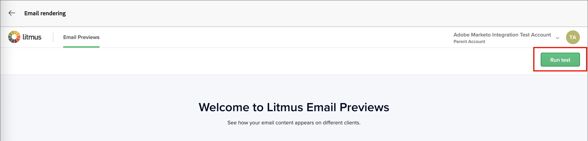

# Litmus を使用したメールのレンダリングのテスト

メールをテストするには、Journey Optimizer B2B editionの[Litmus](https://www.litmus.com/email-testing){target="_blank"} Enterprise アカウントを活用します。 この統合により、一般的なメールクライアントでメールのレンダリングをプレビューできます。 このツールは、電子メールコンテンツが適切に表示され、あらゆる受信トレイに適切に表示されることを確認するのに役立ちます。

>[!AVAILABILITY]
>
>この統合は、Litmus Enterprise アカウントを持つJourney Optimizer B2B edition ユーザーのみが使用できます。 詳しくは、Litmus web サイト [&#128279;](https://www.litmus.com/solutions/esp/adobe-journey-optimizer){target="_blank"}の解決策ページを参照してください。

1. 電子メールデザインが完了し、テストの準備ができたら、電子メールデザインスペースの「**[!UICONTROL コンテンツをシミュレート]**」をクリックします。

1. 右上の「**[!UICONTROL メールをレンダリング]**」をクリックします。

   {width="700" zoomable="yes"}

   Journey Optimizer B2B editionからLitmus アカウントにまだ接続していない場合、表示されたページには、体験版アカウントを開始するか、既存のアカウントに接続するためのオプションが表示されます。

1. 右上の&#x200B;**[!UICONTROL Litmus アカウントを接続]**&#x200B;するか、ページ内のリンクを使用します。

   {width="700" zoomable="yes"}

1. Litmus アカウントの資格情報を入力し、**[!UICONTROL ログイン]**&#x200B;をクリックします。

1. 「**[!UICONTROL Connect]**」をクリックして、LitmusとJourney Optimizer B2B editionの連携を確定し、レンダリング用にメールコンテンツを送信します。

   >[!IMPORTANT]
   >
   >Litmus アカウントをJourney Optimizer B2B editionに接続すると、テストメッセージがLitmusに送信されることに同意したことになります。 このコンテンツは、AdobeではなくLitmus内で管理されます。 そのため、Litmus データ保持メールポリシーは、テストメッセージに含まれる可能性のあるパーソナライゼーションデータを含む、これらのメールに適用されます。

1. 右上の「**[!UICONTROL テストを実行]**」をクリックして、メールのプレビューを生成します。

   {width="700" zoomable="yes"}

1. 一般的なデスクトップ、モバイル、Web ベースのクライアントでメールの内容を確認します。

   表示されたサムネールをクリックして、レンダリングされたクライアントテストの詳細を表示します。

   {width="700" zoomable="yes"}

1. レビューが完了したら、左上の戻る矢印（）をクリックして、コンテンツシミュレーションページに戻ります。

   別のプロファイルを選択して別のレンダリングテストを行うか、メールデザインスペースに戻ってレビューに基づいて必要な調整を行うことができます。
