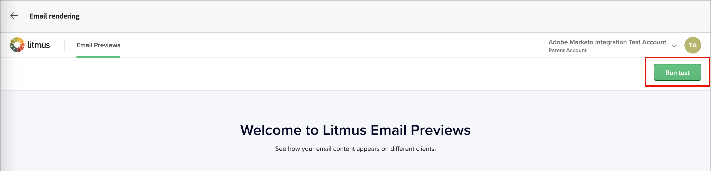
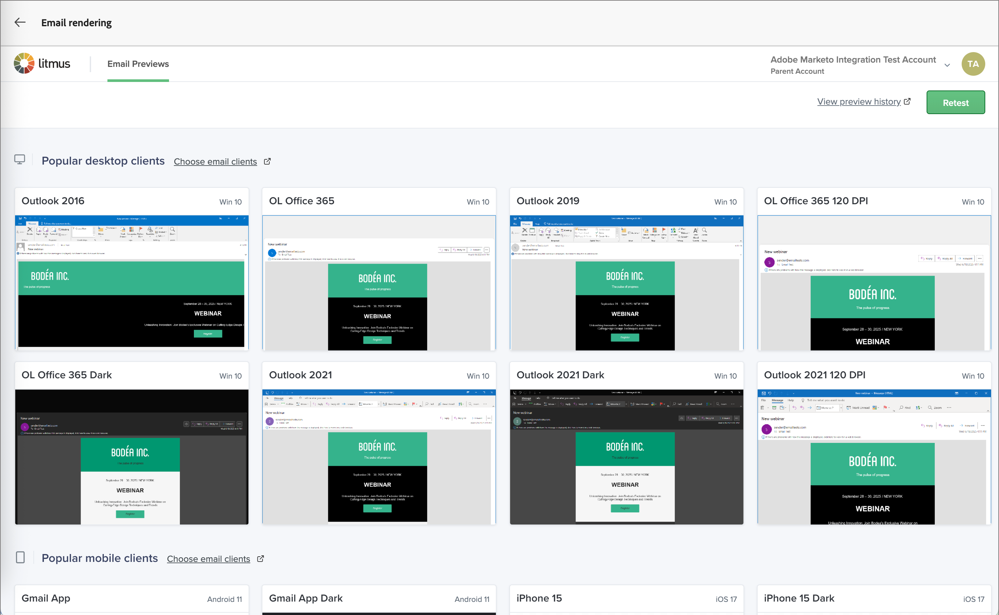

# Litmus でのメールのレンダリングのテスト

メールをテストするには、Journey Optimizer B2B editionから [Litmus](https://www.litmus.com/email-testing){target="_blank"} Enterprise アカウントを利用します。 この統合を使用すると、一般的なメールクライアントでのメールのレンダリングをプレビューできます。 このツールを使用すると、メールコンテンツを適切に表示し、すべてのインボックスで設計どおりに動作させることができます。

>[!AVAILABILITY]
>
>この統合は、Litmus Enterprise アカウントを持つJourney Optimizer B2B edition ユーザーのみが利用できます。 詳しくは、[Litmus web サイトのソリューションページ &#x200B;](https://www.litmus.com/solutions/esp/adobe-journey-optimizer){target="_blank"} を参照してください。

1. メールデザインが完了し、テストする準備が整ったら、メールデザイン領域で **[!UICONTROL コンテンツをシミュレート]** をクリックします。

1. 右上の **[!UICONTROL メールをレンダリング]** をクリックします。

   {width="700" zoomable="yes"}

   Journey Optimizer B2B editionから Litmus アカウントにまだ接続していない場合は、表示されるページで体験版アカウントを開始するか、既存のアカウントに接続するかを選択できます。

1. 右上の **[!UICONTROL Litmus アカウントを接続]** をクリックするか、ページ内のリンクを使用します。

   {width="700" zoomable="yes"}

1. Litmus アカウントの資格情報を入力し、「**[!UICONTROL ログイン]**」をクリックします。

1. 「**[!UICONTROL 接続]**」をクリックして、Litmus とJourney Optimizer B2B edition間の接続を確認し、レンダリング用のメールコンテンツを送信します。

   >[!IMPORTANT]
   >
   >Litmus アカウントをJourney Optimizer B2B editionに接続する場合、テストメッセージが Litmus に送信されることに同意する必要があります。 このコンテンツは、Adobeではなく Litmus 内で管理されます。 その結果、テストメッセージに含まれる可能性のあるパーソナライゼーションデータも含め、Litmus データ保持メールポリシーがこれらのメールに適用されます。

1. 右上の **[!UICONTROL テストを実行]** をクリックして、メールのプレビューを生成します。

   {width="700" zoomable="yes"}

1. 一般的なデスクトップ、モバイル、Web ベースのクライアントでメールの内容を確認します。

   表示されたサムネールをクリックして、レンダリングされたクライアントテストの詳細を表示します。

   {width="700" zoomable="yes"}

1. 確認が完了したら、左上の背面矢印（）をクリックして、コンテンツをシミュレート ページに戻ります。

   別のプロファイルを選択して別のレンダリングテストを行ったり、電子メールデザインスペースに戻ってレビューに基づいて必要な調整を行ったりできます。
