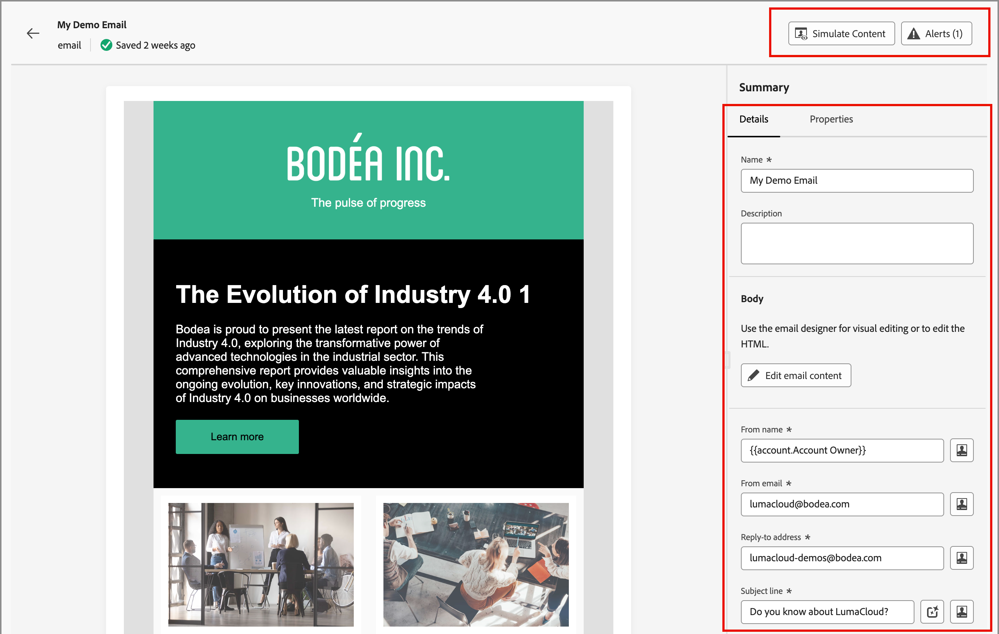

# メール

[&#x200B; メールを作成](./add-email.md)する場合は、ジャーニーノードのコンテキストにメールを追加します。 ジャーニーマップ外のメールコンテンツを操作する場合は、_[!UICONTROL メール]_ リストを使用してメールを検索し、更新します。 メールを確認したり、設定やコンテンツを更新したりできます。

## メールのアクセスと管理

Adobe Journey Optimizer B2B editionで電子メールにアクセスするには、左側のナビゲーションに移動し、**[!UICONTROL コンテンツ管理]**/**[!UICONTROL 電子メール]**&#x200B;をクリックします。 このアクションを実行すると、インスタンスに対して作成されたすべてのメールが表に一覧表示されたリストページが開きます。

テーブルは、デフォルトで&#x200B;_[!UICONTROL Modified]_&#x200B;列で並べ替えられ、最も最近更新されたメールが上部に表示されます。 列のタイトルをクリックして、昇順と降順を変更します。

名前でメールを検索するには、検索バーにテキスト文字列を入力します。 左上の&#x200B;_フィルター_ （）アイコンをクリックして、作成日と変更日で表示されるメールをフィルタリングします。 作成または変更したメールにリストを制限することもできます。

{width="700" zoomable="yes"}

## メールを開いて編集する

リスト内のメール名をクリックして開きます。 [電子メール設定](./add-email.md#define-the-email-settings)を確認して変更できます。 「**[!UICONTROL メールコンテンツを編集]**」をクリックして、[&#x200B; コンテンツを更新](./email-authoring.md)します。

ページの右上に[&#x200B; アラートが表示される](./add-email.md#check-alerts)場合は、クリックして警告またはエラーを確認し、必要に応じてアイテムに対処します。

{width="700" zoomable="yes"}

[_[!UICONTROL &#x200B; コンテンツをシミュレート &#x200B;]_](./email-simulate-content.md) ウィンドウにアクセスすることもできます。 これらのツールを使用して、テストプロファイルを使用してコンテンツをプレビューし、配達確認を送信し、メールの配信品質とメールクライアントのレンダリングをテストします。
