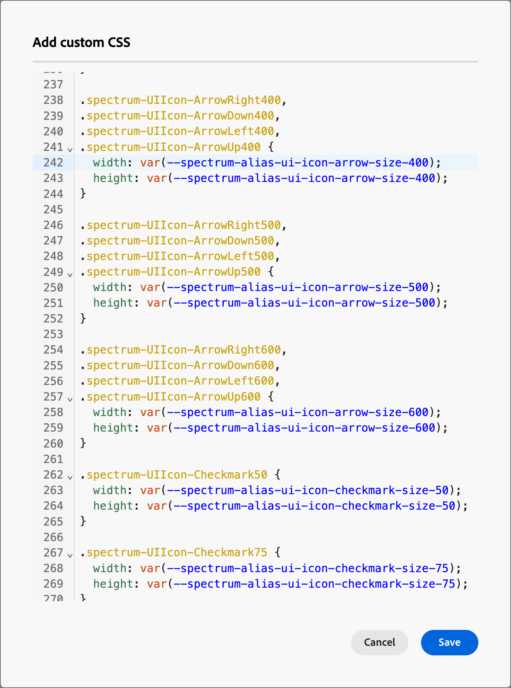

# フォームのデザイン

[&#x200B; フォームを作成](./forms.md#create-forms)すると、ビジュアルデザインスペースでドラフトが開き、デフォルトの基本フォーム定義が表示されます。 右側の&#x200B;_[!UICONTROL 概要]_ パネルで、**[!UICONTROL フォームを編集]**&#x200B;をクリックし、ビジュアルデザインスペースを使用して、フォームのスタイルとフィールドコンポーネントを定義します。

{width="700" zoomable="yes"}

## フィールド

フォームフィールドは、人物をターゲットにして、アカウントや購買グループに関連付けるために使用できる人物プロファイルデータを取得するために使用されます。 すべての新しいフォームは、1列レイアウトの次のフィールドで始まります。

* 名
* 姓
* メールアドレス

フィールドデザインツールを使用して、アカウントベースドマーケティング活動に必要なデータを収集するために必要なフィールドとレイアウトのセットを構築します。

### フィールドを追加 {#add-field}

1. 左側の&#x200B;_[!UICONTROL コンポーネント]_ パネルで、**[!UICONTROL フィールド]** コンテンツコンポーネントをドラッグして、キャンバスにドロップします。

   {width="700" zoomable="yes"}

1. **[!UICONTROL フィールド属性を選択]**&#x200B;をクリックします。

1. _[!UICONTROL フィールド属性を選択]_ ダイアログで、フィールドに使用する人物プロファイル属性のチェックボックスを選択し、**[!UICONTROL 選択]**&#x200B;をクリックします。

   [XDM ビジネススキーマ &#x200B;](../admin/field-mapping.md#xdm-business-person-attributes)は、使用可能な属性を決定します。  Journey Optimizer B2B edition インスタンスに定義されているすべてのカスタムフィールドも使用できます。 検索テキストボックスを使用してリストを名前でフィルタリングするか、フィルターアイコンをクリックしてスキーマ/データタイプでリストをフィルタリングします。

   {width="700" zoomable="yes"}

   キャンバスでは、選択した属性のデフォルトのフィールドラベルがキャンバスに入力されます。 右側のパネルに&#x200B;**[!UICONTROL フィールドの詳細]**&#x200B;が表示されます。

1. 必要に応じて、**[!UICONTROL Label]** テキストを変更します。

   このテキストは、フォームのフィールドの横に表示されます。 デフォルトのテキストは、フィールド属性から入力されます。

1. フィールドのデータの種類に応じて&#x200B;**[!UICONTROL フィールドタイプ]**&#x200B;を設定します。

   | フィールドタイプ | 使用方法 | 例 |
   | ---------- | ----- | ------- |
   | **[!UICONTROL チェックボックス]** | このタイプを使用すると、訪問者は&#x200B;_true_ （チェック済み）または&#x200B;_false_ （チェックなし）の値を選択できます。 | |
   | **[!UICONTROL チェックボックスグループ]** | このタイプを使用すると、訪問者は複数の項目に対して&#x200B;_true_ （オン）または&#x200B;_false_ （オフ）の値を選択できます。 | |
   | **[!UICONTROL 通貨]** | このタイプを使用すると、Journey Optimizer B2B edition インスタンスで選択されたデフォルトの通貨タイプを表す浮動小数点フィールドを許可できます。 | |
   | **[!UICONTROL 日付]** | このタイプを使用して、入力を日付形式に制限し、フィールドにカレンダーセレクターを指定します。 | |
   | **[!UICONTROL 倍精度浮動小数点]** |  | |
   | **[!UICONTROL メール]** | このタイプを使用して、入力を電子メールアドレス形式に制限します。 | |
   | **[!UICONTROL 数値]** | フィールドを数値に制限するには、このタイプを使用します。 | |
   | **[!UICONTROL ラジオ グループ]** | このタイプを使用すると、訪問者はオプションのセットのいずれかを選択できます。 | |
   | **[!UICONTROL 選択]** | このタイプを使用すると、訪問者がドロップダウンリストを使用して一連のオプションのいずれかを選択できるようにします。 | |
   | **[!UICONTROL スライダー]** | 訪問者がスライダーを使用して数値を設定できるようにするには、このタイプを使用します。 | |
   | **[!UICONTROL 電話]** | このタイプは、電話番号の入力フィールドに使用します。 | |
   | **[!UICONTROL テキスト]** | このタイプは、標準テキスト（文字列）入力フィールドに使用します。 | |
   | **[!UICONTROL Textarea]** | このタイプは、長いテキスト入力をサポートするために使用します。 | |
   | **[!UICONTROL URL]** | このタイプを使用すると、テキスト入力を標準のURL プロトコルを含むURLに制限できます。 | |

1. 選択したフィールドタイプに応じて、フィールドの入力と検証に関するその他のオプションを設定します。

   {width="400" zoomable="yes"}

   * **[!UICONTROL プレースホルダー]** - フィールドのプレースホルダー値。この値は、訪問者にフィールドに期待される内容の例を提供します。

   * **[!UICONTROL 説明]** – 訪問者がフィールドを完了するのに役立つ説明テキスト。 フィールドに&#x200B;_ホバーテキスト_&#x200B;として表示するテキストを入力します。

     >[!TIP]
     >
     >_説明とプレースホルダーテキスト_ 
     >
     >これら2つのプロパティを使用して、訪問者がフィールドに入力するように誘導します。 フィールドの上にポインターを置くと、指示テキストがツールヒント/ポップアップテキストとして表示されます。 プレースホルダーテキストは、フィールド内に&#x200B;_グレー表示_&#x200B;され、訪問者がフィールドにテキストを入力すると消えます。 両方の方法を使用することも、1つの方法のみを使用することもできます。

   * **[!UICONTROL デフォルト値]** – このオプションを使用して、フィールドのデフォルト値を指定します。

   * **[!UICONTROL 検証メッセージ]** – このオプションを使用して、フィールドの検証メッセージを指定します。 このメッセージは、訪問者がフィールドに無効な値を入力した場合に表示されます。 _[!UICONTROL Standard]_ メッセージはデフォルトで設定されています。 **[!UICONTROL カスタム]**&#x200B;を選択し、独自のメッセージを入力します。

   * **最大長** - フィールドに入力できる最大文字数を入力します。

1. 必要に応じて&#x200B;**[!UICONTROL フィールドの動作]**&#x200B;を設定します。

   * **必須** - フォームの送信に必要なフィールド入力を行うには、チェックボックスを選択します。

   * **入力マスクを有効にする** – 入力マスクを使用して訪問者からの入力を制限するには、チェックボックスを選択します。 例えば、訪問者に特定の形式の電話番号を入力してもらうとします。 ダイアログで、任意の数字に`9`、任意の文字に`a`、どちらか一方に`*`を使用してマスクを入力します。 「保存」をクリックして、指定した入力マスクを有効にします。

     {width="500" zoomable="yes"}

### フィールドのスタイル設定を変更 {#field-styling}

右側のパネルの「**[!UICONTROL スタイル]**」タブを選択して、選択したフィールドのスタイルを変更します。

* **[!UICONTROL 背景]** - フィールドに背景色を適用するには、チェックボックスを選択します。 白はデフォルトの色です。 **[!UICONTROL 背景色]**&#x200B;正方形をクリックしてポップアップカラーピッカーを開き、フィールドの背景色を選択します。

  {width="600" zoomable="yes"}

* **[!UICONTROL ラベル]** - ラベルのスタイル設定により、フィールドの横に表示されるテキストの視覚的特性が制御されます。 フィールドに関連する上部またはサイドラベルの表示を選択します。 フォントサイズ、行の高さ、テキストスタイル、テキストの整列を設定できます。 **[!UICONTROL フォントカラー]**&#x200B;正方形をクリックしてポップアップカラーピッカーを開き、ラベルテキストのカラーを選択します。

  {width="600" zoomable="yes"}

* **[!UICONTROL 境界線]** - **[!UICONTROL 境界線カラー]**&#x200B;正方形をクリックしてポップアップカラーピッカーを開き、境界線の色を選択します。 フィールドの境界線（色と線幅を含む）を定義できます。 表示されているフィールドの境界線を削除するには、チェックボックスをオフにします。 角の境界線のサイズ（ピクセル幅）、スタイル、および半径の設定を変更することもできます。

  {width="600" zoomable="yes"}

* **[!UICONTROL サイズ]** - サイズ設定を選択して、フィールドの表示幅を決定します。 _[!UICONTROL 全幅]_、_[!UICONTROL 半幅]_、または&#x200B;_[!UICONTROL 自動]_&#x200B;を選択します。

* **[!UICONTROL 余白]** - フィールドの周囲の余白（ピクセル単位）を設定します。 4つの側面すべてで同じマージンを設定するか、「**[!UICONTROL 各側面に異なるマージン]**」チェックボックスを選択して、水平方向と垂直方向のマージンを別々に設定できます。

* **[!UICONTROL パディング]** - フィールドの周囲にパディング（ピクセル単位）を設定します。 4つの辺すべてで同じ余白を設定するか、「**[!UICONTROL 各辺に異なる余白]**」チェックボックスを選択して、水平余白と垂直余白を別々に設定できます。

  {width="600" zoomable="yes"}

### フィールドを並べ替え {#field-reorder}

フォームフィールドは、ビジュアルワークスペースで直接移動できます。 選択したフィールドの右端にある&#x200B;_移動_ ツールをクリックし、新しい場所にドラッグします。

構造コンポーネントをフォームに追加し、フィールドを列に移動してグループ化し、レイアウトを変更します。 選択した列コンポーネントの左端にある&#x200B;_移動_ ツールをクリックし、フォーム内の新しい場所にドラッグします。

{width="500"}

### フィールドの削除または複製 {#field-delete-duplicate}

ツールバーまたは右側のパネルの&#x200B;_削除_ アイコン（）をクリックして、選択したフィールドを削除します。 確認ダイアログで、「**[!UICONTROL 削除]**」をクリックします。

ツールバーまたは右側のパネルの&#x200B;_重複_ アイコン（）をクリックして、選択したフィールドを複製します。 新しいフィールドは、元のフィールドのすぐ下に表示されます。 「**[!UICONTROL フィールド属性を選択]**」をクリックして、フィールドの属性を設定します。 必要に応じて、フィールドタイプ、詳細、スタイルを設定します。

{width="600" zoomable="yes"}

## 「送信」ボタン

送信ボタン（フッターフィールド）は、デフォルトではフォームの一部であり、削除できません。 フォームのボタン/フッターコンポーネントを選択して、ボタンのテキストとスタイルを変更します。

### ボタンのコンテンツの編集 {#button-content}

右側のパネルに「_[!UICONTROL コンテンツ]_」タブが表示されたら、「**[!UICONTROL ボタンのテキスト]**」フィールドのテキストを変更します。 ボタンのサイズは、テキストの長さに合わせて調整されます。

{width="600" zoomable="yes"}

### 送信ボタンのスタイル設定 {#button-styles}

右側のパネルの「**[!UICONTROL スタイル]**」タブを選択して、選択したボタン/フッターコンポーネントのスタイルを変更します。

* **[!UICONTROL 背景]** - ボタンの背景色を適用するには、チェックボックスを選択します。 青はデフォルトの色です。 **[!UICONTROL 背景色]**&#x200B;正方形をクリックしてポップアップカラーピッカーを開き、ボタンの背景色を選択します。

  {width="600" zoomable="yes"}

* **[!UICONTROL ラベル]** - ラベルのスタイル設定により、ボタン内のテキストの視覚的特徴が制御されます。 フォントサイズ、行の高さ、テキストスタイル、テキストの整列を設定できます。 **[!UICONTROL フォントカラー]**&#x200B;正方形をクリックしてポップアップカラーピッカーを開き、ラベルテキストのカラーを選択します。

* **[!UICONTROL 境界線]** - **[!UICONTROL 境界線カラー]**&#x200B;正方形をクリックしてポップアップカラーピッカーを開き、境界線の色を選択します。 ボタンの境界線（色や線幅など）を定義できます。 表示されているボタンの境界線を削除するには、チェックボックスをオフにします。 丸みを帯びた角の境界線のサイズ（ピクセル幅）、スタイル、および半径の設定を変更することもできます。

* **[!UICONTROL サイズ]** - ボタンの表示幅を決定するサイズ設定を選択します。 _[!UICONTROL 全幅]_、_[!UICONTROL 半幅]_、または&#x200B;_[!UICONTROL 自動]_&#x200B;を選択します。 パディングは、サイズと整列の設定に従って調整されます。

  {width="600" zoomable="yes"}

* **[!UICONTROL ボタンの整列]** - ボタンの&#x200B;_半幅_&#x200B;または&#x200B;_自動_ サイズを選択すると、整列は左、右、または中央に設定されます。 パディングは、サイズと整列の設定に従って調整されます。

* **[!UICONTROL 余白]** - フィールドの周囲の余白（ピクセル単位）を設定します。 4つの側面すべてで同じマージンを設定するか、「**[!UICONTROL 各側面に異なるマージン]**」チェックボックスを選択して、水平方向と垂直方向のマージンを別々に設定できます。

* **[!UICONTROL パディング]** - フィールドの周囲にパディング（ピクセル単位）を設定します。 4つの辺すべてで同じ余白を設定するか、「**[!UICONTROL 各辺に異なる余白]**」チェックボックスを選択して、水平余白と垂直余白を別々に設定できます。 サイズと整列の設定を変更すると、パディングが調整されます。

  {width="600" zoomable="yes"}

## フォームのスタイル {#form-styling}

構造コンポーネントまたはフォームコンポーネントの外側をクリックすると、フォーム領域のスタイルを変更できます。 フォームコンポーネント（フィールドとボタン）は、フィールドまたはボタン/フッターレベルで他のスタイルが定義されていない限り、トップレベルのスタイルを定義した&#x200B;_本文_&#x200B;のスタイルを継承します。

{width="600" zoomable="yes"}

### CSS スタイル

新しいフォームでは、スタイル設定にデフォルトのCSSが使用されます。 CSSを変更してスタイルを変更する場合は、それをコピーしてから、それを使用してフォームのカスタム CSSを定義できます。

_フォームのカスタム CSSを定義するには&#x200B;:_

1. 右側のパネルの「**[!UICONTROL CSSを表示]**」をクリックして、CSS コードを確認します。

   {width="450" zoomable="yes"}

1. スクロールウィンドウでCSS コードを選択し、クリップボードにコピーします。

1. 「**[!UICONTROL 閉じる]**」をクリックします。

1. （オプション）コピーしたコードをお気に入りのCSS ツールに貼り付け、CSSを編集して、必要なスタイルを反映します。

1. 右側のパネルで「**[!UICONTROL カスタム CSSを追加]**」をクリックします。

1. ウィンドウにCSS コードを貼り付けます。

   {width="450" zoomable="yes"}

   このウィンドウでペーストしたテキストを編集できます。

1. 「**[!UICONTROL 保存]**」をクリックします。

### 手動スタイル設定

右パネルの設定を変更して、フォーム全体の表示を定義します。

* **[!UICONTROL 背景色]** - チェックボックスを選択して、フォーム領域の周囲に背景色を適用します。 白はデフォルトの色です。 カラー正方形をクリックしてポップアップカラーピッカーを開き、フォームの背景のカラーを選択します。

* **[!UICONTROL ビューポートの背景]** - チェックボックスを選択して、すべてのフォームコンポーネントに背景色を適用します。 デフォルトはカラーなし（外部背景から継承）。 カラー正方形をクリックしてポップアップカラーピッカーを開き、フォーム構造コンポーネントのカラーを選択します。

  {width="600" zoomable="yes"}

* **[!UICONTROL テキスト]** - フォームフィールドのラベル、ヒント、プレースホルダーテキストに影響するフォームの&#x200B;**[!UICONTROL フォントファミリー]**&#x200B;を選択します。 デフォルトの送信ボタンのテキストにも影響します。

* **[!UICONTROL サイズ]** - フォームのサイズ （幅）をピクセル単位で変更します。

* **[!UICONTROL 余白]** - フォームコンポーネントの周囲の余白（ピクセル単位）を設定します。 4つの側面すべてで同じマージンを設定するか、「**[!UICONTROL 各側面に異なるマージン]**」チェックボックスを選択して、水平方向と垂直方向のマージンを別々に設定できます。

  {width="600" zoomable="yes"}
