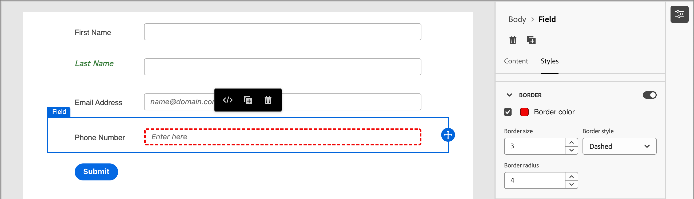
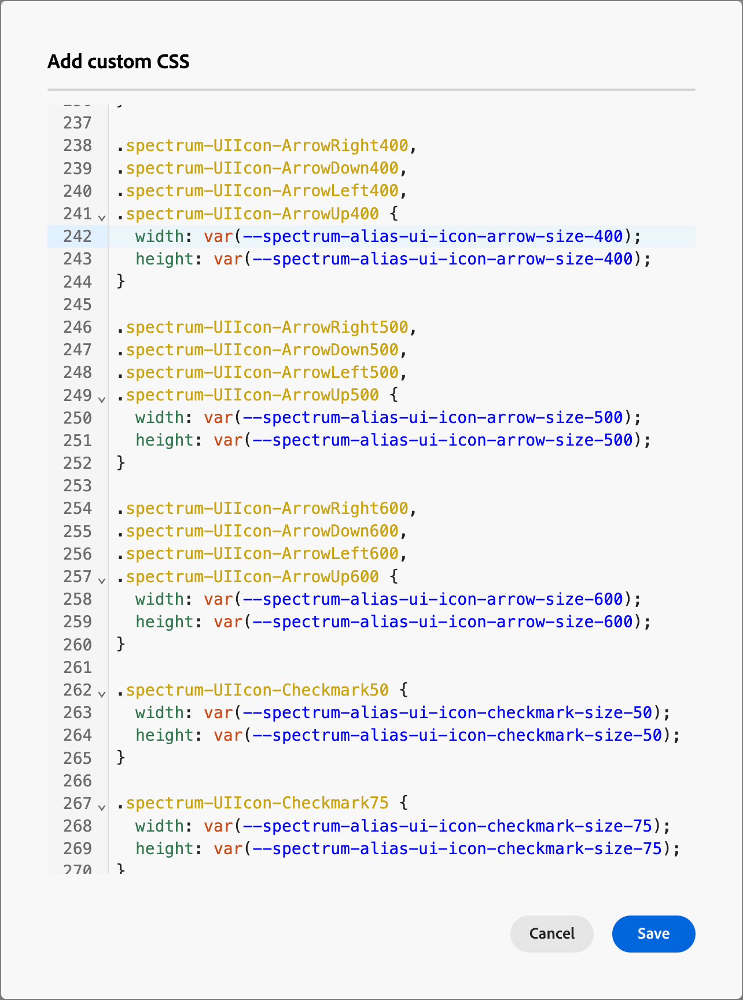

# フォームデザイン

[ フォームを作成 ](./landing-pages.md#create-a-landing-page) した後、ビジュアルデザインスペースは、デフォルトの基本フォーム定義でドラフトを開きます。 右側の _[!UICONTROL 概要]_ パネルで **[!UICONTROL フォームを編集]** をクリックし、ビジュアルデザインスペースを使用してフォームのスタイルとフィールドコンポーネントを定義します。

{width="700" zoomable="yes"}

## フィールド

フォームフィールドを使用して人物プロファイルデータを取得し、そのデータを使用して人物をターゲットにして、アカウントや購入グループに関連付けることができます。 すべての新しいフォームは、1 列レイアウトの次のフィールドから始まります。

* 名
* 姓
* メールアドレス

フィールドデザインツールを使用して、アカウントベースのマーケティングアクティビティに必要なデータを収集するために必要な、一連のフィールドとレイアウトを作成します。

### フィールドを追加 {#add-field}

1. 左側の _[!UICONTROL コンポーネント]_ パネルで、**[!UICONTROL フィールド]** コンテンツコンポーネントをドラッグし、キャンバスにドロップします。

   {width="700" zoomable="yes"}

1. **[!UICONTROL フィールド属性を選択]** をクリックします。

1. _[!UICONTROL フィールド属性を選択]_ ダイアログで、フィールドに使用するユーザープロファイル属性のチェックボックスを選択し、「**[!UICONTROL 選択]**」をクリックします。

   [XDM ビジネススキーマ ](../data/field-mapping.md#xdm-business-person-attributes) によって、使用可能な属性が決まります。  Journey Optimizer B2B edition インスタンス用に定義されている任意のカスタムフィールドも使用できます。 「検索」テキストボックスを使用して名前でリストをフィルタリングするか、フィルターアイコンをクリックしてスキーマ/データタイプでリストをフィルタリングします。

   {width="700" zoomable="yes"}

   キャンバス上で、選択した属性のデフォルトのフィールドラベルがキャンバス上に入力されます。 **[!UICONTROL フィールドの詳細]** は、右側のパネルに表示されます。

1. 必要に応じて、**[!UICONTROL ラベル]** テキストを変更します。

   このテキストは、フォームのフィールドの横に表示されます。 デフォルトのテキストは field 属性から投入されます。

1. フィールドのデータのタイプに応じて **[!UICONTROL フィールドタイプ]** を設定します。

   | フィールドタイプ | 使用方法 | 例 |
   | ---------- | ----- | ------- |
   | **[!UICONTROL チェックボックス]** | このタイプを使用すると、訪問者は _true_ （オン）または _false_ （オフ）の値を選択できます。 | |
   | **[!UICONTROL チェックボックスグループ]** | このタイプを使用すると、複数の項目に対して訪問者が _true_ （オン）または _false_ （オフ）の値を選択できるようになります。 | |
   | **[!UICONTROL 通貨]** | この型を使用すると、Journey Optimizer B2B edition インスタンスに対して選択されたデフォルトの通貨タイプを表す浮動小数フィールドを許可できます。 | |
   | **[!UICONTROL 日付]** | このタイプを使用して、入力を日付形式に制限し、フィールドにカレンダーセレクターを指定します。 | |
   | **[!UICONTROL 倍精度浮動小数点]** |  | |
   | **[!UICONTROL メール]** | 入力を電子メール アドレス形式に制限するために使用します。 | |
   | **[!UICONTROL 数値]** | フィールドを数値に制限する場合に使用します。 | |
   | **[!UICONTROL ラジオグループ]** | このタイプを使用すると、訪問者はオプションのセットの 1 つを選択できます。 | |
   | **[!UICONTROL 選択]** | このタイプを使用すると、訪問者はドロップダウンリストを使用して一連のオプションの 1 つを選択できます。 | |
   | **[!UICONTROL Slider]** | 訪問者がスライダーを使用して数値を設定できるようにするには、このタイプを使用します。 | |
   | **[!UICONTROL 電話番号]** | このタイプを電話番号入力フィールドに使用します。 | |
   | **[!UICONTROL テキスト]** | このタイプは、標準のテキスト（文字列）入力フィールドに使用します。 | |
   | **[!UICONTROL テキスト領域]** | 長いテキスト入力をサポートするには、このタイプを使用します。 | |
   | **[!UICONTROL URL]** | このタイプを使用すると、標準の URL プロトコルを含む、URL へのテキスト入力を制限できます。 | |

1. 選択したフィールドタイプに応じて、フィールド入力と検証のその他のオプションを設定します。

   {width="400" zoomable="yes"}

   * **[!UICONTROL プレースホルダー]** - フィールドに期待される内容の例を訪問者に提供する、フィールドのプレースホルダー値。

   * **[!UICONTROL 説明]** – 訪問者がフィールドに入力するのに役立つ説明テキスト。 フィールドの _ホバーテキスト_ として表示するテキストを入力します。

     >[!TIP]
     >
     >_説明とプレースホルダーテキスト_ 
     >
     >これらの 2 つのプロパティを使用して、訪問者がフィールドに入力できるようガイドします。 フィールド上にポインターを置くと、指示テキストがツールヒントまたはポップアップテキストとして表示されます。 フィールド内にプレースホルダーテキストが表示 _淡色表示_ され、訪問者がフィールドにテキストを入力するとプレースホルダーテキストが消えます。 両方の方法を使用することも、どちらか一方のみを使用することもできます。

   * **[!UICONTROL デフォルト値]** – このオプションを使用して、フィールドのデフォルト値を指定します。

   * **[!UICONTROL 検証メッセージ]** - フィールドの検証メッセージを指定できます。 このメッセージは、訪問者がフィールドに無効な値を入力した場合に表示されます。 _[!UICONTROL 標準]_ メッセージはデフォルトで設定されます。 **[!UICONTROL カスタム]** を選択し、独自のメッセージを入力します。

   * **最大長** - フィールドに入力できる最大文字数を入力します。

1. 必要に応じて、**[!UICONTROL フィールドの動作]** を設定します。

   * **必須** - フォームの送信にフィールド入力を必須にするには、このチェックボックスを選択します。

   * **定型入力を有効にする** – このチェックボックスを選択すると、定型入力を使用して訪問者からの入力を制限します。 例えば、訪問者に特定の形式で電話番号を入力してもらうことができます。 ダイアログで、任意の数字に対して `9`、任意の文字に対して `a`、またはいずれかに対して `*` を使用してマスクを入力します。 「保存」をクリックして、指定した定型入力を有効にします。

     {width="500" zoomable="yes"}

### フィールドのスタイル設定を変更 {#field-styling}

右側のパネルの **[!UICONTROL スタイル]** タブを選択し、選択したフィールドのスタイル設定を変更します。

* **[!UICONTROL 背景]** - フィールドの背景色を適用するには、このチェックボックスを選択します。 デフォルトの色は白です。 **[!UICONTROL 背景色]** の正方形をクリックして、ポップアップカラーピッカーを開き、フィールドの背景の色を選択します。

  {width="600" zoomable="yes"}

* **[!UICONTROL ラベル]** - ラベルのスタイル設定は、フィールドの横に表示されるテキストの視覚特性を制御します。 フィールドに関連して表示する上部ラベルまたは側面ラベルを選択します。 フォントサイズ、行の高さ、テキストスタイル、テキストの整列を設定できます。 **[!UICONTROL フォントカラー]** の正方形をクリックして、ポップアップカラーピッカーを開き、ラベルテキストの色を選択します。

  {width="600" zoomable="yes"}

* **[!UICONTROL ボーダー]** - **[!UICONTROL ボーダーの色]** の正方形をクリックしてポップアップカラーピッカーを開き、ボーダーの色を選択します。 色や線の幅など、フィールドの境界線を定義できます。 チェックボックスをオフにして、表示されているフィールドの境界線を削除します。 また、隅の境界線のサイズ（ピクセル幅）、スタイル、半径の設定を変更することもできます。

  {width="600" zoomable="yes"}

* **[!UICONTROL サイズ]** - サイズ設定を選択して、フィールドの表示幅を決定します。 _[!UICONTROL 全幅]_、_[!UICONTROL 半幅]_ または _[!UICONTROL 自動]_ を選択します。

* **[!UICONTROL 余白]** - フィールドの周囲の余白（ピクセル単位）を設定します。 4 つの辺すべてに同じ余白を設定するか、「**[!UICONTROL 各辺に異なる余白]**」チェックボックスをオンにして、水平と垂直の余白を別々に設定できます。

* **[!UICONTROL パディング]** - フィールドの周囲のパディングをピクセル単位で設定します。 4 つの辺すべてに同じ余白を設定するか、「**[!UICONTROL 各辺に異なるパディングを使用]**」チェックボックスをオンにして、水平方向と垂直方向の余白を別々に設定できます。

  {width="600" zoomable="yes"}

### フィールドの並べ替え {#field-reorder}

ビジュアルワークスペース内でフォームフィールドを直接移動できます。 選択したフィールドの右端にある _移動_ ツールをクリックして、新しい場所にドラッグします。

構造コンポーネントをフォームに追加し、フィールドを列に移動してそれらをグループ化し、レイアウトを変更します。 選択した列コンポーネントの左端にある _移動_ ツールをクリックし、フォーム内の新しい場所にドラッグします。

{width="500"}

### フィールドの削除または複製 {#field-delete-duplicate}

選択したフィールドを削除するには、ツールバーまたは右側のパネルの _削除_ アイコン（）をクリックします。 確認ダイアログで、「**[!UICONTROL 削除]**」をクリックします。

ツールバーまたは右側のパネルの _複製_ アイコン（）をクリックして、選択したフィールドを複製します。 新しいフィールドは、元のフィールドのすぐ下に表示されます。 **[!UICONTROL フィールド属性を選択]** をクリックして、フィールドの属性を設定します。 必要に応じて、フィールドタイプ、詳細およびスタイルを設定します。

{width="600" zoomable="yes"}

## 送信ボタン

送信ボタン（フッターフィールド）はデフォルトではフォームの一部であり、削除することはできません。 フォームでボタン/フッターコンポーネントを選択して、ボタンのテキストとスタイルを変更します。

### ボタンのコンテンツの編集 {#button-content}

右側のパネルに表示された「_[!UICONTROL コンテンツ]_」タブで、「**[!UICONTROL ボタンテキスト]**」フィールドのテキストを変更します。 ボタンのサイズは、テキストの長さに合わせて調整されます。

{width="600" zoomable="yes"}

### 送信ボタンのスタイル設定 {#button-styles}

右側のパネルの「**[!UICONTROL スタイル]**」タブを選択し、選択したボタン/フッターコンポーネントのスタイル設定を変更します。

* **[!UICONTROL 背景]** - ボタンの背景色を適用するには、このチェックボックスを選択します。 デフォルトの色は青です。 **[!UICONTROL 背景色]** の正方形をクリックして、ポップアップカラーピッカーを開き、ボタンの背景の色を選択します。

  {width="600" zoomable="yes"}

* **[!UICONTROL ラベル]** - ラベルのスタイル設定は、ボタン内のテキストの視覚的特性を制御します。 フォントサイズ、行の高さ、テキストスタイル、テキストの整列を設定できます。 **[!UICONTROL フォントカラー]** の正方形をクリックして、ポップアップカラーピッカーを開き、ラベルテキストの色を選択します。

* **[!UICONTROL ボーダー]** - **[!UICONTROL ボーダーの色]** の正方形をクリックしてポップアップカラーピッカーを開き、ボーダーの色を選択します。 色や線の幅など、ボタンの境界線を定義できます。 チェックボックスをオフにすると、表示されているボタンの境界線が削除されます。 また、角丸の境界線のサイズ（ピクセル幅）、スタイル、半径の設定を変更することもできます。

* **[!UICONTROL サイズ]** - サイズ設定を選択して、ボタンの表示幅を決定します。 _[!UICONTROL 全幅]_、_[!UICONTROL 半幅]_ または _[!UICONTROL 自動]_ を選択します。 パディングは、サイズと整列の設定に従って調整されます。

  {width="600" zoomable="yes"}

* **[!UICONTROL ボタンの位置揃え]** - ボタンのサイズとして _幅の半分_ または _自動_ を選択した場合、位置揃えを左、右または中央に設定します。 パディングは、サイズと整列の設定に従って調整されます。

* **[!UICONTROL 余白]** - フィールドの周囲の余白（ピクセル単位）を設定します。 4 つの辺すべてに同じ余白を設定するか、「**[!UICONTROL 各辺に異なる余白]**」チェックボックスをオンにして、水平と垂直の余白を別々に設定できます。

* **[!UICONTROL パディング]** - フィールドの周囲のパディングをピクセル単位で設定します。 4 つの辺すべてに同じ余白を設定するか、「**[!UICONTROL 各辺に異なるパディングを使用]**」チェックボックスをオンにして、水平方向と垂直方向の余白を別々に設定できます。 サイズと整列の設定を変更すると、パディングが調整されます。

  {width="600" zoomable="yes"}

## フォームのスタイル {#form-styling}

構造コンポーネントまたはフォームコンポーネントの外側をクリックすると、フォーム領域のスタイルを変更できます。 フォームコンポーネント（フィールドとボタン）は、最上位のスタイルを定義した _本文_ スタイルを継承します。ただし、フィールドレベルまたはボタン/フッターレベルで他のスタイルが定義されている場合を除きます。

{width="600" zoomable="yes"}

### CSS スタイル

新しいフォームでは、スタイル設定にデフォルトの CSS を使用します。 CSS を変更してスタイルを変更する場合は、その CSS をコピーしてから、それを使用してフォームのカスタム CSS を定義します。

_フォームのカスタム CSS を定義するには：_

1. 右側のパネルで **[!UICONTROL CSS を表示]** をクリックして、CSS コードを確認します。

   {width="450" zoomable="yes"}

1. スクロールウィンドウで CSS コードを選択し、クリップボードにコピーします。

1. 「**[!UICONTROL 閉じる]**」をクリックします。

1. （オプション）コピーしたコードをお気に入りの CSS ツールに貼り付け、CSS を編集して目的のスタイルを反映します。

1. 右側のパネルで「**[!UICONTROL カスタム CSS を追加]**」をクリックします。

1. CSS コードをウィンドウに貼り付けます。

   {width="450" zoomable="yes"}

   このウィンドウで貼り付けたテキストを編集できます。

1. 「**[!UICONTROL 保存]**」をクリックします。

### 手動でのスタイル設定

フォーム全体の表示を定義するには、右側のパネルで設定を変更します。

* **[!UICONTROL 背景色]** - フォーム領域の周囲に背景色を適用するには、このチェックボックスをオンにします。 デフォルトの色は白です。 カラーの四角形をクリックして、ポップアップカラーピッカーを開き、フォームの背景の色を選択します。

* **[!UICONTROL ビューポートの背景]** – すべてのフォームコンポーネントに背景色を適用するには、このチェックボックスを選択します。 デフォルトはカラーなし（外側の背景から継承）です。 カラーの四角形をクリックして、ポップアップカラーピッカーを開き、フォーム構造コンポーネントの色を選択します。

  {width="600" zoomable="yes"}

* **[!UICONTROL テキスト]** - フォームの **[!UICONTROL フォントファミリー]** を選択します。これは、フォームフィールドのラベル、ヒント、プレースホルダーテキストに影響します。 また、デフォルトの送信ボタンのテキストにも影響します。

* **[!UICONTROL サイズ]** - フォームのサイズ（幅）をピクセル単位で変更します。

* **[!UICONTROL 余白]** - フォームコンポーネントの周囲の余白（ピクセル単位）を設定します。 4 つの辺すべてに同じ余白を設定するか、「**[!UICONTROL 各辺に異なる余白]**」チェックボックスをオンにして、水平と垂直の余白を別々に設定できます。

  {width="600" zoomable="yes"}
