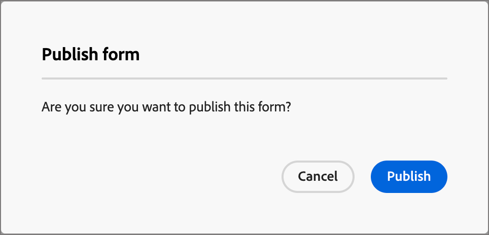
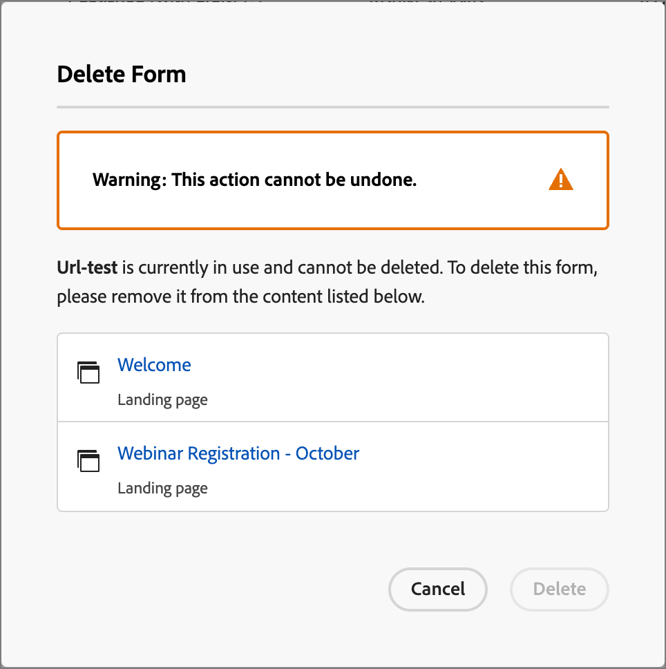

# フォーム

Web ページの訪問者から情報を取得するには、フォームを作成してランディングページに追加します。 フォームは、ホワイトペーパー、オンデマンドウェビナー、無料トライアルなど、何らかのコンテンツやオファーを取得するために、ページ訪問者が入力して送信する一連のフィールドです。

フォームで取得する情報の量は、コンテンツまたはオファーの値によって異なります。 ホワイトペーパーなどのシンプルなものを提供する場合は、名前、メール、会社などの最小限の情報のみを収集する必要があります。 デモや無料トライアルなど、オファーの価値が高い場合は、詳細情報を収集できます。 コンテンツの表示を許可するために送信済みフォームを必要とすることは、_ゲートコンテンツ_ と呼ばれます。 ゲートするコンテンツとゲートしないコンテンツは、組織が決定します（_無料_）。 ベストプラクティスは、一部のコンテンツを無料で許可し、プレミアムコンテンツまたは需要の高いコンテンツのみをゲートすることです。

## フォームへのアクセスと管理

Journey Optimizer B2B editionのフォームにアクセスするには、左側のナビゲーションに移動して、**[!UICONTROL コンテンツ管理]**/**[!UICONTROL Forms]** をクリックします。 このアクションを実行するとリストページが開き、インスタンスで作成されたすべてのフォームがテーブルに表示されます。

{width="700" zoomable="yes"}

テーブルは _[!UICONTROL 変更済み]_ 列で並べ替えられ、デフォルトでは最近更新されたフォームが先頭に表示されます。 列タイトルをクリックして、昇順と降順を切り替えます。

### フォームのステータスとライフサイクル

フォームのステータスは、ランディングページまたはランディングページテンプレートで使用できる状態と、ユーザーが変更できる状態を決定します。

| ステータス | 説明 |
| -------------------- | ----------- |
| 下書き | 作成したフォームは、ドラフトステータスになります。 ランディングページまたはランディングページテンプレートで使用するためにフィールドを公開するまで、フィールドを定義または編集するとこのステータスのままになります。 使用可能なアクション： <ul><li>すべての詳細を編集<li>ビジュアルデザインスペースで編集<li>公開<li>複製<li>削除 |
| 公開日 | フォームを公開すると、ランディングページまたはランディングページテンプレートで使用できるようになります。 公開されたフォームコンテンツは、ビジュアルデザイン領域では変更できません。 使用可能なアクション： <ul><li>名前、説明、ありがとうページを編集する<li>ランディングページまたはランディングページテンプレートへの追加<li>ドラフトバージョンを作成<li>複製<li>削除（使用中でない場合）<li>埋め込みコード |
| 公開済み下書きあり | 公開済みフォームからドラフトを作成する場合、公開されたバージョンはランディングページやランディングページテンプレートで使用でき、ドラフトコンテンツはビジュアルデザインスペースで変更できます。 ドラフトバージョンを公開すると、現在の公開バージョンが置き換えられ、使用中のランディングページまたはランディングページテンプレートのコンテンツが更新されます。 使用可能なアクション： <ul><li>名前、説明、ありがとうページを編集する<li>ランディングページまたはランディングページテンプレートへの追加<li>ビジュアルデザイン領域でのドラフトバージョンの編集<li>ドラフトバージョンを公開<li>複製<li>削除（使用中でない場合）<li>埋め込みコード |

{zoomable="yes"}

### フォームリストのフィルタリング

フォームを名前で検索するには、検索バーにテキスト文字列を入力して一致を見つけます。 _フィルター_ アイコン（）をクリックして、使用可能なフィルターオプションを表示し、表示される項目を指定した条件に従ってフィルタリングするための設定を変更します。

{width="700" zoomable="yes"}

### 列表示のカスタマイズ

右上の _テーブルをカスタマイズ_ アイコン（）をクリックして、テーブルに表示する列をカスタマイズします。

ダイアログで、表示する列を選択し、「**[!UICONTROL 適用]**」をクリックします。

{width="300"}

## フォームの作成

Journey Optimizer B2B editionで再利用可能なフォームの作成を開始する前に、考慮すべきことがいくつかあります。

* 必要なフォームを決定します。

  4 つの標準フォームのみを使用できる場合があります。 1 つはダウンロード可能なコンテンツにアクセスするためのもので、もう 1 つはプレミアム web ページにアクセスするためのもので、もう 1 つはビデオの視聴に使用され、もう 1 つはウェビナーなどの登録に使用されます。 フォームのフィールドを変更する必要がある場合は、すべてのマーケティングプログラムにわたって複数のフォームを変更する代わりに、グローバルに使用される 4 つの標準フォームを更新するほうが簡単です。<!-- Global forms also make progressive profiling much easier to implement. -->

* 標準フォームごとに、使用するフィールドと表示方法を決定します。

  コンバージョンに適していることが証明されているため、短いフォームの使用を検討します。 各フォームを検討する際には、どのようなフィールドが目的に合っており、必要なのかを判断します。

  名前やメールなどの基本情報が事前入力されるように、フォームフィールドに事前入力するかどうかを検討します。 しかし、役職や組織の規模など、他の情報は考慮されません。 この方法で、訪問者は 2 つのフィールドのみを入力し、フォームを送信する必要があります。 また、Facebook や Twitter からのデータでソーシャルフォームを埋め込んで使用することもできます。

* 訪問者がフォームを送信した後に表示されるフォローアップページを計画します（_ありがとうございました_ ページ）。

  全員が同じページを取得しますか、それとも動的で、データに基づいていますか？ 例えば、ヘルスケア業界のユーザーは、テクノロジー業界のユーザーとは異なるページコンテンツを表示する場合があります。

* 必要な情報が既にある場合は、フォームを完全にバイパスするかどうかを検討します。

  ランディングページを訪問した既知のユーザーに対してフォームのバイパスを許可した場合、そのユーザーはコンテンツに直接アクセスできます。 フォームをバイパスすると、より効率的な訪問者エクスペリエンスが提供されます。

### 新しいフォームを追加

Journey Optimizer B2B editionでフォームを作成するには、_[!UICONTROL Forms **[!UICONTROL リストページの右上にある]**フォームを作成]_ をクリックします。

1. _[!UICONTROL フォームを作成]_ ダイアログで、便利な **[!UICONTROL 名前]** （必須）と **[!UICONTROL 説明]** （オプション）を入力します。

   フォーム要件：

   * 名前 – 最大 100 文字。一意である必要があります。大文字と小文字は区別されません

   * 説明 – 最大 300 文字

   * Alpha、数字、特殊文字を使用できます

   * 予約文字は使用できません **_使用できません_**: `\ / : * ? " < > |`

   {width="400"}

1. 「**[!UICONTROL 作成]**」をクリックします。

   フォームの詳細ページが開き、デフォルトの基本フォーム定義が表示されます。

   {width="700" zoomable="yes"}

### デフォルトのフォームデザインの変更

必要に応じて、ビジュアルデザインツールを使用してフォームコンテンツを変更します。

* [フィールドを追加](./form-design.md#add-a-field)
* [フィールドのスタイル設定を変更](./form-design.md#change-field-styling)
* [フィールドの並べ替え](./form-design.md#reorder-fields)
* [送信ボタンのテキストとスタイルの変更](./form-design.md#edit-and-style-the-submit-button)
* [フォームのスタイル設定を変更する](./form-design.md#change-form-styling)

**[!UICONTROL 保存して閉じる]** をクリックして、フォームコンテンツデザインの変更を保存し、フォームの詳細に移動します。

### 「ありがとうございます」ページを設定します

右側の _[!UICONTROL 概要]_ パネルで、「ありがとうページ **** セクションまでスクロールし、「**[!UICONTROL フォローアップ]** 設定を使用して、訪問者がフォームを送信したときの動作を定義します。

* **[!UICONTROL ページを維持]** - フォームの送信時に訪問者のページを変えない場合は、このオプションを選択します。

* **[!UICONTROL ランディングページ]** – フォローアップとしてJourney Optimizer B2B editionまたはMarketo Engage ランディングページを選択する場合は、このオプションを選択します。

* **[!UICONTROL 外部 URL]** – 任意の URL をフォローアップページとして指定する場合は、このオプションを選択します。 訪問者がフォームを送信すると、ブラウザーは指定された URL を読み込みます。

  >[!TIP]
  >
  >フォームを使用してファイルをダウンロードする場合は、ホストされるファイルの URL を指定できます。 この設定では、送信ボタンはダウンロードボタンとして機能します。

### フォームドラフトの公開

フォームをランディングページまたはランディングページテンプレートで使用できるようにする準備が整ったら、「**[!UICONTROL 公開]**」をクリックします。

{width="400"}

この操作を実行すると、確認ダイアログが開きます。 公開プロセスを中止するには、「**[!UICONTROL キャンセル]**」をクリックするか、「**[!UICONTROL 公開]**」をクリックして確定します。

## フォームの詳細を表示

リストページ内の任意のフォームの名前をクリックして、フラグメントの詳細ページを開きます。 フォームの編集、名前の変更、フォームの説明の更新のいずれかを選択できます。 更新を行い、「名前」フィールドまたは「説明」フィールドの外側をクリックして、変更を自動保存します。

>[!NOTE]
>
>公開されたフォームがランディングページまたはランディングページテンプレートで使用されている場合、コンテンツを編集したり、ありがとうページを変更したりすることはできません。 フォームに変更を加える場合は、ドラフトバージョンを作成できます。

{width="600" zoomable="yes"}

**[!UICONTROL フォームを編集]** をクリックして、ビジュアルデザイン領域でフラグメントを開きます。

左上の _戻る_ 矢印をクリックして、いつでもビューを閉じることができます。この矢印をクリックすると、_[!UICONTROL Forms]_ の一覧ページに戻ります。

## 参照別に使用するフォームの表示

右側の _[!UICONTROL 概要]_ パネルで「**[!UICONTROL 使用者]** タブをクリックすると、ランディングページとランディングページテンプレートをまたいでJourney Optimizer B2B edition内で現在使用されているフォームの場所の詳細が表示されます。

>[!IMPORTANT]
>
>ランディングページまたはランディングページテンプレートで現在使用されているフォームは、削除できません。

{width="600" zoomable="yes"}

参照は、カテゴリ _ランディングページ_ または _ランディングページテンプレート_ に従って表示されます。 リンクをクリックして、フォームが使用されている対応するページまたはテンプレートを開きます。

## フォームの削除

ランディングページまたはランディングページテンプレートで現在使用されているフォームは、削除できません。 フォームの削除を開始する前に _使用_ 参照を確認できます。 また、削除を取り消すことはできないので、削除操作を開始する前に確認します。

フォームを削除するには、次のいずれかの方法を使用します。

* 右上で、「**[!UICONTROL ...」をクリックします。その他]** 「削除 **[!UICONTROL 」を選択し]** す。
* _[!UICONTROL Forms]_ リストページで、フォーム名の横の省略記号をクリックし、「**[!UICONTROL 削除]**」を選択します。

この操作を実行すると、確認ダイアログが開きます。 **[!UICONTROL キャンセル]** をクリックするか、「**[!UICONTROL 削除]**」をクリックして削除を確定すると、プロセスを中止できます。

{width="400"}

フォームが現在使用中の場合は、削除できないことを警告する情報ダイアログが開きます。 「**[!UICONTROL OK]**」をクリックすると、削除アクションは中止されます。

{width="400"}

## フォームを複製

既存のフォームをフォームデザインの出発点として使用して、新しいフォームをすばやく簡単に作成する方法としてフォームを複製します。

次のいずれかの方法を使用して、フォームを複製できます。

* フォーム詳細ページの右上にある「**[!UICONTROL ..」をクリックします。詳細を表示して]** 「複製 **[!UICONTROL を選択]** ます。
* _[!UICONTROL Forms]_ リストページで、フォーム名の横の省略記号をクリックし、「**[!UICONTROL 複製]**」を選択します。

{width="450"}

ダイアログで、便利な名前（一意の）と説明を入力します。 「**[!UICONTROL 複製]**」をクリックして、アクションを完了します。

{width="400"}

複製したフォームを編集して、必要に応じて名前を変更し、使用目的に合わせてフォームを変更します。

## フォームを編集

フォームの変更は、現在のステータスによって異なります。

* フォームが _ドラフト_ ステータスの場合は、その詳細とコンテンツ（フィールド、ボタン、スタイル設定）を編集できます。
* フォームが _公開済み_ ステータスの場合、フォーム名または説明を編集できます。 コンテンツを編集することはできません。
* フォームが _ドラフトで公開済み_ ステータスの場合、フォーム名または説明を編集できます。 ドラフトバージョンでは、コンテンツとありがとうページを編集することもできます。

>[!BEGINTABS]

>[!TAB  ドラフト ]

1. _[!UICONTROL Forms]_ リストページで、フォーム名をクリックして開きます。

   フォームコンテンツのプレビューが表示され、フォームの詳細が右側に表示されます。

1. 名前や説明など、詳細を変更します。

   {width="600" zoomable="yes"}

1. ビジュアルデザインスペースでフォームに変更を加えるには、「**[!UICONTROL フォームを編集]**」をクリックします。

   必要に応じて、ビジュアルデザインツールを使用します。

   * [フィールドを追加](./form-design.md#add-a-field)
   * [フィールドのスタイル設定を変更](./form-design.md#change-field-styling)
   * [フィールドの並べ替え](./form-design.md#reorder-fields)
   * [送信ボタンのテキストとスタイルの変更](./form-design.md#submit-button)
   * [フォームのスタイル設定を変更する](./form-design.md#change-form-styling)

   「**[!UICONTROL 保存して閉じる]**」をクリックして、フォームの詳細に戻ります。

1. 条件を満たすフォームを、ランディングページまたはランディングページテンプレートで使用できるようにするには、「**[!UICONTROL 公開]**」をクリックします。

>[!TAB パブリッシュ済み]

1. _[!UICONTROL Forms]_ リストページで、フォーム名をクリックして開きます。

   フォームコンテンツのプレビューが表示され、フォームの詳細が右側に表示されます。

1. フォームを編集するためのドラフトバージョンを作成するには、右側の **[!UICONTROL 概要]** パネルにある _[!UICONTROL フォームを編集]_ をクリックします。

1. ダイアログで **[!UICONTROL ドラフトバージョンを作成]** をクリックして、ビジュアルデザイン領域でドラフトバージョンを開きます。

   {width="400"}

1. 必要に応じて、ビジュアルデザインツールを使用してフォームコンテンツを更新します。

   * [フィールドを追加](./form-design.md#add-a-field)
   * [フィールドのスタイル設定を変更](./form-design.md#change-field-styling)
   * [フィールドの並べ替え](./form-design.md#reorder-fields)
   * [送信ボタンのテキストとスタイルの変更](./form-design.md#submit-button)
   * [フォームのスタイル設定を変更する](./form-design.md#change-form-styling)

   「**[!UICONTROL 保存して閉じる]**」をクリックして、フォームの詳細に戻ります。

1. ドラフトフォームが条件を満たしていて、変更をランディングページまたはランディングページテンプレートで使用できるようにする場合は、「**[!UICONTROL 公開]**」をクリックします。

   ドラフトバージョンを公開すると、現在の公開バージョンが置き換えられ、既に使用中のランディングページまたはランディングページテンプレートでフォームコンテンツが更新されます。

>[!TAB  ドラフトで公開済み ]

1. フォーム名をクリックして開きます。

1. 「**[!UICONTROL ドラフト]**」タブを選択します。

   ドラフトバージョンのフォームコンテンツのプレビューが表示され、フォームの詳細が右側に表示されます。

   {width="700" zoomable="yes"}

1. 右側の **[!UICONTROL 概要]** パネルの _[!UICONTROL フォームを編集]_ をクリックし、必要に応じてビジュアルデザインツールを使用します。

   * [フィールドを追加](./form-design.md#add-a-field)
   * [フィールドのスタイル設定を変更](./form-design.md#change-field-styling)
   * [フィールドの並べ替え](./form-design.md#reorder-fields)
   * [送信ボタンのテキストとスタイルの変更](./form-design.md#submit-button)
   * [フォームのスタイル設定を変更する](./form-design.md#change-form-styling)

   「**[!UICONTROL 保存して閉じる]**」をクリックして、フォームの詳細に戻ります。

1. ドラフトフォームが条件を満たしていて、変更をランディングページおよびランディングページテンプレートで使用できるようにする場合は、「**[!UICONTROL 公開]**」をクリックします。

   ドラフトバージョンを公開すると、現在の公開バージョンが置き換えられ、既に使用されているランディングページとテンプレートでフォームが更新されます。

>[!ENDTABS]

## ランディングページまたはテンプレートへのフォームの追加

Formsは再利用できるように設計されており、[ ランディングページ ](./landing-page-design.md) または [ ランディングページテンプレート ](./landing-page-templates.md) をデザインする際に挿入できます。

{{$include /help/_includes/content-design-add-forms.md}}

## ページおよびテンプレートオーサリング用のフォームアクション

フォームがランディングページまたはランディングページテンプレートに含まれている場合、そのフォームのコンテンツをページまたはテンプレート内で変更することはできません。 ただし、次の操作を適用できます。

* **[!UICONTROL 削除]** – 現在のページまたはテンプレートのコンテンツからフォームを削除します（フラグメントソースは影響を受けません）。
* **[!UICONTROL 複製]** - エディター内の同じページまたはテンプレート内のフォームを同じディメンションで複製し、その下に追加します。
* **[!UICONTROL HTMLを表示]** – この操作を実行すると、フォームのHTMLを含むポップアップが開きます。 HTMLは編集することも、他の web コンテンツで使用するためにコピーすることもできます。
* **[!UICONTROL フォームを編集]** – このアクションを実行すると、フォームエディターページと詳細を含む新しいブラウザータブが開きます。

ランディングページデザインスペースでフォームを選択すると、これらのアクションはコンテキストツールバーと、右側のプロパティパネルから使用できます。

{width="600" zoomable="yes"}
