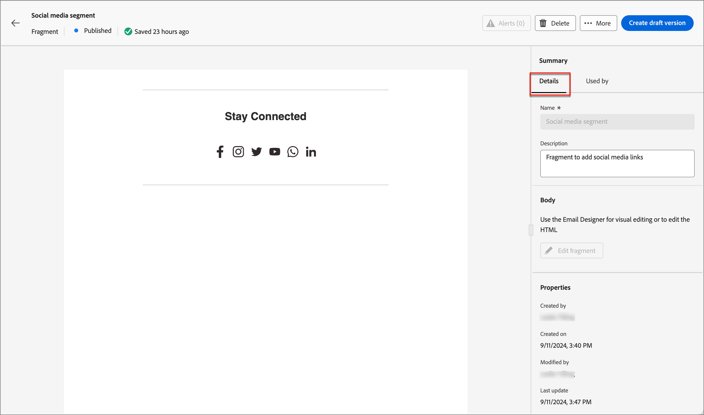
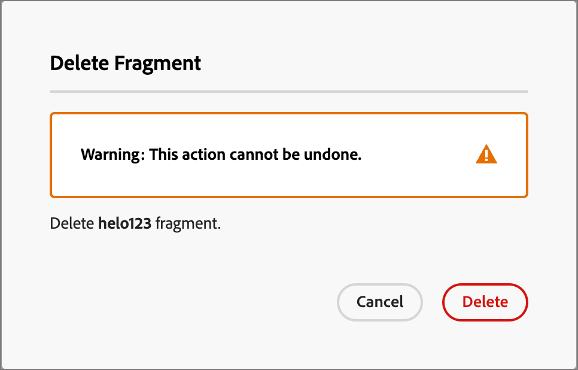
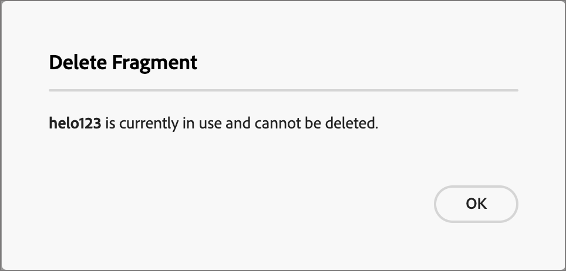

# フラグメント

フラグメントは、Adobe Journey Optimizer B2B edition全体の 1 つ以上のメールおよびメールテンプレートで参照できる再利用可能なコンポーネントです。 通常は、事前に作成してすばやくメールまたはメールテンプレートに挿入できるコンテンツのブロック（テキスト、画像、またはその両方）です。 この機能を使用すると、マーケティングチームメンバーがメールコンテンツを組み合わせて設計プロセスを改善するために使用する、複数のカスタムコンテンツブロックを事前に作成できます。 一般的なユース ケースには、メールのヘッダー/フッター内容ブロック、イベント招待バナー、季節のあいさつ文などがあります。

>[!BEGINSHADEBOX]

**視覚的なフラグメント**

ビジュアルフラグメントは、ビジュアルコンテンツデザイナーを使用して作成され、複数のメールまたはメールテンプレートで再利用できる、事前定義されたビジュアルブロックです。 Journey Optimizer B2B editionの現在の範囲と、このドキュメントはビジュアルフラグメントのみです。 式ベースのフラグメントは、Journey Optimizer B2B editionではまだサポートされていません。

>[!ENDSHADEBOX]

ワークフローでフラグメントを最大限に活用するには：

* _独自のフラグメントを作成_ - ビジュアルコンテンツエディターからゼロから、またはコンテンツをフラグメントとして保存することで、ビジュアルフラグメントを作成します。
* _フラグメントを再利用_ - コンテンツで必要な回数だけ使用します。

## フラグメントへのアクセスと管理

Adobe Journey Optimizer B2B editionでビジュアルフラグメントにアクセスするには、左側のナビゲーションに移動して、**[!UICONTROL コンテンツ管理]**/**[!UICONTROL フラグメント]** をクリックします。 このアクションを実行すると、インスタンスで作成されたすべてのフラグメントを含むリストページがテーブルに表示されます。

{width="700" zoomable="yes"}

テーブルは _[!UICONTROL 変更済み]_ 列で並べ替えられ、デフォルトでは最近更新されたフラグメントが先頭に表示されます。 列タイトルをクリックして、昇順と降順を切り替えます。

### フラグメントのステータスとライフサイクル

フラグメントステータスは、メールまたはメールテンプレートで使用できるフラグメントの有無と、フラグメントに加えられる変更を決定します。

| ステータス | 説明 |
| -------------------- | ----------- |
| 下書き | フラグメントを作成すると、そのステータスはドラフトになります。 ビジュアルコンテンツを定義または編集したあと、メールまたはメールテンプレートで使用するために公開するまで、このステータスのままになります。 使用可能なアクション： <ul><li>すべての詳細を編集<li>ビジュアルデザイナーで編集<li>公開<li>複製<li>削除 |
| 公開日 | フラグメントを公開すると、メールまたはメールテンプレートで使用できるようになります。 公開されたフラグメントコンテンツは、ビジュアルデザイナーでは変更できません。 使用可能なアクション： <ul><li>説明を編集<li>メールまたはテンプレートへの追加<li>ドラフトバージョンを作成<li>複製<li>削除(使用されていない場合) |
| 公開済み下書きあり | 公開済みのフラグメントから下書きを作成しても、公開されたバージョンは電子メールまたは電子メールテンプレートで引き続き使用でき、下書き内容ビジュアルデザイナーで変更できます。 下書きバージョン公開すると、現在公開されているバージョンが置き換えられ、使用中の電子メールおよび電子メールテンプレートで内容が更新されます。 使用可能なアクション: <ul><li>説明を編集<li>メールまたはテンプレートへの追加<li>Visual Designer のドラフトバージョン編集<li>Publish ドラフト版<li>複製<li>削除(使用されていない場合) |

{zoomable="yes"}

>[!IMPORTANT]
>
>フラグメントのステータスは、Journey Optimizer B2B Edition の 8 月リリースで導入されました。 このリリースより前に作成されたフラグメントすべてを選択、 _ドラフト_ ステータスは、電子メールまたはテンプレートで使用されているかどうか均等。 これらのフラグメントに変更を加える場合は、フラグメント公開するして変更を反映する必要があります。

### フラグメントリストフィルター

フラグメントを名前で検索するには、一致と見なされるテキスト文字列を検索バーに入力します。 _フィルター_&#x200B;アイコン()をクリックして使用可能なフィルターオプションを表示し、設定を変更して、指定した条件に従って表示されるアイテムをフィルタリングします。

{width="700" zoomable="yes"}

### 列表示のカスタマイズ

右上の _テーブルのカスタマイズ_ アイコン(  をクリックして、テーブルに表示する列をカスタマイズします。

ダイアログで、表示する列を選択し、「 **[!UICONTROL 適用]**」をクリックします。

{width="300"}

## フラグメントを作成

Journey Optimizer B2B Edition で新しいビジュアルフラグメントを作成するには、右上の **[!UICONTROL 作成フラグメント]** をクリックします。

1. _[!UICONTROL フラグメント作成]_&#x200B;ダイアログで、便利な **[!UICONTROL 名前]** と **[!UICONTROL 説明]** を入力します(オプション)。

   フラグメントの要件:

   * 名前 – 最大 100 文字。一意である必要があります。大文字と小文字は区別されません

   * 説明 – 最大 300 文字

   * Alpha、数字、特殊文字を使用できます

   * 予約文字は使用できません **_使用できません_**: `\ / : * ? " < > |`

   {width="400"}

1. 「**[!UICONTROL 作成]**」をクリックします。

   ビジュアルデザイナーが開き、空のキャンバスが表示されます。

1. コンテンツデザインツールを使用して、ビジュアルフラグメントコンテンツを作成します。

   * [構造とコンテンツの追加](./fragment-authoring.md#add-structure-and-content)
   * [Assetsを追加](./fragment-authoring.md#add-assets)
   * [レイヤー、設定、スタイルの移動](./fragment-authoring.md#navigate-the-layers-settings-and-styles)
   * [コンテンツのパーソナライズ](./fragment-authoring.md#personalize-content)
   * [カスタムフィールドの有効化](./fragment-authoring.md#enable-fragment-customization)
   * [リンクされた URL トラッキングを編集](./fragment-authoring.md#edit-linked-url-tracking)

1. **[!UICONTROL 保存]** をクリックすれば、いつでもドラフトフラグメントを保存できます。

1. フラグメントをメールまたはメールテンプレートで使用できるようにする準備が整ったら、「**[!UICONTROL 公開]**」をクリックします。

## フラグメントの詳細を表示

リストページで任意のフラグメントの名前をクリックして、フラグメントの詳細ページを開きます。 フラグメントの編集、名前の変更、フラグメントの説明の更新を選択できます。 更新を行い、「名前」フィールドまたは「説明」フィールドの外側をクリックして、変更を自動保存します。

>[!NOTE]
>
>公開されたフラグメントがメールまたはメールテンプレートで使用されている場合、名前を変更したり、コンテンツを編集したりすることはできません。 フラグメントに変更を加える場合は、ドラフトバージョンを作成できます。

{width="600" zoomable="yes"}

**[!UICONTROL フラグメントを編集]** をクリックして、フラグメントをビジュアルコンテンツエディターで開きます。

左上の _戻る_ 矢印をクリックして、いつでもビューを終了できます。この矢印をクリックすると、_フラグメント_ リストページに戻ります。

## 参照別に使用されているフラグメントを表示

フラグメントの詳細ページで「**[!UICONTROL 使用者]**」タブをクリックすると、Journey Optimizer B2B edition内、メール、メールテンプレート、フラグメント全体で、フラグメントが現在使用されている場所の詳細が表示されます。

>[!IMPORTANT]
>
>メールまたはメールテンプレートで現在使用しているフラグメントは、削除できません。

参照は、「 _電子メール_ または _電子メールテンプレート_&#x200B;カテゴリに従って表示されます。 Journey Optimizer B2B editionのメールは、アカウントジャーニー内に埋め込まれて作成されるので、フラグメントを使用するメールの親ジャーニーは参照に表示されます。

{width="600" zoomable="yes"}

リンクをクリックして、フラグメントが使用されている対応するメールまたはメールテンプレートを開きます。

## フラグメントの削除

メールまたはメールテンプレートで現在使用されているフラグメントは削除できないので、フラグメントの削除を開始する前に _使用_ 参照を確認してください。 また、削除を取り消すことはできないので、削除操作を開始する前に確認します。

フラグメントを削除するには、次のいずれかの方法を使用します。

* 右側のフラグメントの詳細で、 **[!UICONTROL 削除]**&#x200B;をクリックします。
* 「 _[!UICONTROL フラグメント]_ リストページで、フラグメントの横にある省略記号をクリックし、「 **[!UICONTROL 削除]**」を選択します。

これにより、確認ダイアログが開きます。 このプロセスを中止するには、「 **[!UICONTROL キャンセル]**」をクリックするか、「 **[!UICONTROL 削除]** 」をクリックして削除を確認します。

{width="400"}

フラグメントが現在使用中の場合、アクションによって情報ダイアログが開き、削除できないことを警告します。 「 **[!UICONTROL OK]**」をクリックすると、削除アクションが中止されます。

{width="400"}

## フラグメントの編集

フラグメントの編集は、その現在のステータスによって異なります。

* フラグメントが _ドラフト_ ステータスの場合、フラグメントの詳細およびビジュアル内容を編集できます。
* フラグメントが _公開済み_ ステータスの場合、フラグメントの説明は編集できますが、名前は編集できません。 ビジュアルコンテンツは編集できません。
* フラグメントが _ドラフトで公開済み_ ステータスの場合、詳細の編集は説明に限定されます。 ドラフト バージョンのビジュアル 内容を編集することもできます。

>[!BEGINTABS]

>[!TAB ドラフト]

1. _[!UICONTROL フラグメント]_&#x200B;のリストページで、フラグメント名をクリックして開きます。

   ビジュアル内容のプレビューが表示され、右側にフラグメントの詳細が表示されます。

1. 名前や説明などの詳細を変更します。

   {width="600" zoomable="yes"}

1. ビジュアルデザイナーで内容を変更するには、「 **[!UICONTROL フラグメント編集]**」をクリックします。

   必要に応じてビジュアルデザイナーのツールを使用します。

   * [構造とコンテンツの追加](./fragment-authoring.md#add-structure-and-content)
   * [追加Assets](./fragment-authoring.md#add-assets)
   * [レイヤー、設定、スタイルの移動](./fragment-authoring.md#navigate-the-layers-settings-and-styles)
   * [内容のパーソナライズ](./fragment-authoring.md#personalize-content)
   * [カスタムフィールドを有効にする](./fragment-authoring.md#enable-fragment-customization)
   * [リンクされたURLトラッキング編集](./fragment-authoring.md#edit-linked-url-tracking)

   「 **[!UICONTROL 保存]** または **[!UICONTROL 保存 &amp; 閉じる]** をクリックしてフラグメントの詳細に戻ります。

1. フラグメントが条件を満たしており、メールまたはメールテンプレートで使用できるようにする場合は、「**[!UICONTROL 公開]**」をクリックします。

>[!TAB パブリッシュ済み]

1. _[!UICONTROL フラグメント]_ リストページで、フラグメント名をクリックして開きます。

   ビジュアルコンテンツのプレビューが表示され、フラグメントの詳細が右側に表示されます。

1. 必要に応じて、説明を変更します。

   公開済みフラグメントについては、その他すべての詳細を変更することはできません。

1. 内容を更新する場合は、右上の **[!UICONTROL 作成下書きバージョン]** をクリックします。

   ダイアログで **[!UICONTROL OK]** をクリックして、ドラフトバージョンをビジュアルデザイナーで開きます。

   {width="300"}

   必要に応じて、ビジュアルデザイナーのツールを使用します。

   * [構造とコンテンツの追加](./fragment-authoring.md#add-structure-and-content)
   * [Assetsを追加](./fragment-authoring.md#add-assets)
   * [レイヤー、設定、スタイルの移動](./fragment-authoring.md#navigate-the-layers-settings-and-styles)
   * [コンテンツのパーソナライズ](./fragment-authoring.md#personalize-content)
   * [カスタムフィールドの有効化](./fragment-authoring.md#enable-fragment-customization)
   * [リンクされた URL トラッキングを編集](./fragment-authoring.md#edit-linked-url-tracking)

   **[!UICONTROL 保存]** または **[!UICONTROL 保存して閉じる]** をクリックして、フラグメントの詳細に戻ります。

1. ドラフトフラグメントが条件を満たしており、変更をメールまたはメールテンプレートで使用できるようにする場合は、「**[!UICONTROL 公開]**」をクリックします。

   ドラフトバージョンを公開すると、現在の公開バージョンが置き換えられ、既に使用されているメールおよびメールテンプレートのコンテンツが更新されます。

>[!TAB  ドラフトで公開済み ]

_[!UICONTROL フラグメント]_ リストページからドラフトバージョンを開いて編集する方法は 2 つあります。

* フラグメント名の横にある _詳細_ アイコン（**...**）をクリックし、「**[!UICONTROL ドラフトバージョンを開く]**」を選択します。

  {width="300"}

* フラグメント名をクリックして開きます。 次に、右上の **[!UICONTROL ドラフトバージョンを開く]** をクリックします。

  ドラフトバージョンのビジュアルコンテンツのプレビューが表示され、フラグメントの詳細が右側に表示されます。

コンテンツを更新するには：

1. 右上の「 **[!UICONTROL フラグメント編集]** をクリックします。 必要に応じて、ビジュアルデザイナーのツールを使用します。

   * [構造とコンテンツの追加](./fragment-authoring.md#add-structure-and-content)
   * [Assetsを追加](./fragment-authoring.md#add-assets)
   * [レイヤー、設定、スタイルの移動](./fragment-authoring.md#navigate-the-layers-settings-and-styles)
   * [コンテンツのパーソナライズ](./fragment-authoring.md#personalize-content)
   * [カスタムフィールドの有効化](./fragment-authoring.md#enable-fragment-customization)
   * [リンクされた URL トラッキングを編集](./fragment-authoring.md#edit-linked-url-tracking)

   「 **[!UICONTROL 保存]** または **[!UICONTROL 保存 &amp; 閉じる]** をクリックしてフラグメントの詳細に戻ります。

1. ドラフトフラグメントが条件を満たしているときに、その変更を電子メールまたは電子メールテンプレートで使用できるようにするには、「 **[!UICONTROL Publish]**」をクリックします。

   下書きバージョン公開すると、現在公開されているバージョンが置き換えられ、内容が既に使用されている電子メールおよび電子メールテンプレートで更新されます。

>[!ENDTABS]

## フラグメントを複製

次のいずれかの方法を使用して、フラグメントを複製できます。

* _[!UICONTROL フラグメント]_&#x200B;リストページで、フラグメント名の横にある&#x200B;_詳細_&#x200B;アイコン(**...**)をクリックし、「**[!UICONTROL 複製]**」を選択します。
* フラグメント詳細ページの右上で、「**[!UICONTROL ...詳細]****[!UICONTROL 複製]**&#x200B;を選択します。

{width="600" zoomable="yes"}

ダイアログで、わかりやすい名前(一意)と説明を入力します。 「 **[!UICONTROL 複製]** をクリックして操作を完了します。

{width="400"}

複製された（新しい）フラグメントが _フラグメント_ リストに表示されます。

## 電子メールまたはテンプレート内容からの新しいフラグメント保存

ビジュアル内容編集者で電子メールまたは電子メールテンプレートを作成/編集するときに、内容のすべてまたは一部をフラグメントとして保存して、再利用できるようにすることを選択できます。

1. フラグメントとして保存する内容がある場合は、「 **[!UICONTROL 詳細]** をクリックし、「 **[!UICONTROL 保存フラグメントとして]**」を選択します。

1. フラグメントに含めるさまざまな要素を選択します。

   Shift キーまたは Control ボタンを押したままにして、複数の構造を選択します。

   互いに隣接する構造のみを選択でき、インタフェースでは隣接していない要素を選択することはできません。

1. 内容を選択した状態で、右上の「 **[!UICONTROL 作成]** をクリックします。

1. ダイアログで、フラグメントのわかりやすい名前と説明を入力します。 「**[!UICONTROL 作成]**」をクリックします。

   新しいフラグメントは _フラグメント_ リストページに表示され、電子メールおよび電子メールテンプレート内でも使用できます。

## 視覚的な断片を電子メールまたはテンプレート内容に追加

フラグメントは再利用できるように設計されており、電子メールや電子メールテンプレート作成用に挿入できます。 E メールまたはテンプレートには、最大 30 個のフラグメントを追加できます。 フラグメントは、1 レベルまでネストできるだけです。

>[!BEGINTABS]

>[!TAB 電子メールへのフラグメント追加]

1. **[!UICONTROL 取引先ジャーニー]** に移動し、既存のジャーニーを開くか、新しいジャーニーを作成します。

1. [_[!UICONTROL  メールを送信 ]_ノード ](./email-authoring.md#add-an-email-action-in-an-account-journey) を作成します。

1. [ ノードのメールコンテンツ ](./email-authoring.md#create-the-email-content) を作成または編集します。

1. **[!UICONTROL コンポーネント]** メニューから項目をドラッグ&amp;ドロップして、フラグメントの _構造_ を指定します。

1. 公開済みのフラグメントのリストを開くには、「_フラグメント_」アイコンをクリックします。

   次の操作が可能です。
   * リストを並べ替えます。
   * リスト参照、検索、フィルターします。
   * カード(サムネール)表示とリスト表示を切り替えます。
   * 最近作成したフラグメントが反映されるように、リストを更新します。

   {width="600"}

1. 任意のフラグメントを構造コンポーネントプレースホルダーにドラッグ&amp;ドロップします。

   エディターは、メール構造のセクション/要素内でフラグメントをレンダリングします。

フラグメントのコンテンツは、構造内で動的に更新され、コンテンツがメールにどのように表示されるかが視覚的に表示されます。

>[!TIP]
>
>フラグメントをメール内の水平レイアウト全体に配置する場合は、[!UICONTROL 1:1 列 ] 構造を追加して、フラグメントをメールにドラッグ&amp;ドロップします。

メールを保存した後、「使用 _[!UICONTROL タブが選択されると、フラグメントの詳細ページに表示され]_ す。 メールに追加されたフラグメントは、メールまたはテンプレート内では編集できません。公開されたソースフラグメントがコンテンツを定義します。

>[!TAB  メールテンプレートへのフラグメントの追加 ]

1. 左側のナビゲーションから、**[!UICONTROL コンテンツ管理]**/**[!UICONTROL テンプレート]** をクリックします。

1. 新しいテンプレートを作成するか、既存のメールテンプレートを開いて、「**[!UICONTROL メールテンプレートを編集]**」をクリックします。

1. **[!UICONTROL コンポーネント]**&#x200B;メニューから項目をドラッグ&amp;ドロップして、フラグメントの&#x200B;_構造_&#x200B;を指定します。

1. フラグメントリストを開くには、 _フラグメント_ アイコンをクリックします。

   次の操作が可能です。
   * リストを並べ替えます。
   * リスト参照、検索、フィルターします。
   * カード(サムネール)表示とリスト表示を切り替えます。
   * 最近作成したフラグメントのいずれかを反映するようにリスト更新します。

   {width="600"}

1. フラグメントのいずれかを構造コンポーネントのプレースホルダーにドラッグ&amp;ドロップします。

   編集者は、E メールテンプレート構造のセクション/要素内のフラグメントをレンダリングします。

1. 任意のフラグメントを構造コンポーネントプレースホルダーにドラッグ&amp;ドロップします。

   エディターは、メールテンプレート構造のセクション/要素内でフラグメントをレンダリングします。

>[!TIP]
>
>フラグメントをメールテンプレート内の水平レイアウト全体に配置する場合は、_[!UICONTROL 1:1 列]_ 構造を追加してから、フラグメントをドラッグ&amp;ドロップします。

メールテンプレートを保存した後、「使用 _[!UICONTROL タブを選択すると、フラグメントの詳細ページに表示され]_ す。 メールテンプレートに追加されたフラグメントは、テンプレート内では編集できません。公開されたソースフラグメントがコンテンツを定義します。

>[!ENDTABS]

## メールおよびテンプレートのオーサリング中のフラグメントアクション

フラグメントを電子メールまたは電子メールテンプレートに追加した場合、電子メールまたはテンプレート内でフラグメント内容を編集することはできません。 ただし、次のアクションを適用することができます。

* **[!UICONTROL 削除]** - このアクションは、現在の電子メールまたは電子メールテンプレート内容からフラグメントを削除します(フラグメントソースは影響を受けません)。
* **[!UICONTROL 更新]** – このアクションは、現在のメールまたはメールテンプレート内のフラグメントのコンテンツを更新します。 更新は、メールまたはメールテンプレートに追加した後に、フラグメントに対して最近の編集を反映する場合に便利です。
* **[!UICONTROL 複製]** – このアクションでは、エディター内の同じメールまたはメールテンプレート内のフラグメントを同じディメンションで複製し、その下に追加します。
* **[!UICONTROL フラグメント開く]** - このアクションにより、フラグメント編集者ページと詳細を含む新しいブラウザータブが開きます。
* **[!UICONTROL 継承を解除]** - このアクションは、ソースからのフラグメント (およびその変更) の継承を解除します。 このアクションを使用して、フラグメント 内容 を電子メールまたは電子メールテンプレート内で独立した編集可能な内容として使用できるようにします。 また、元のフラグメントの _使用者_ 参照から電子メールまたは電子メールテンプレートが削除されます。

編集者ページでフラグメントを選択すると、これらのアクションはコンテキストツールバーと右側のプロパティパネルから使用できます。

{width="600" zoomable="yes"}
