# フラグメント

フラグメントは、Adobe Journey Optimizer B2B edition全体で1つ以上の電子メールや電子メールテンプレートで参照できる、再利用可能なコンポーネントです。 通常は、コンテンツのブロック（テキスト、画像、またはその両方）を作成し、メールやメールテンプレートにすばやく挿入できます。 この機能を利用すれば、マーケティング部門のメンバーが使用する複数のカスタムコンテンツブロックを事前に構築し、デザインプロセスを向上させるためにメールコンテンツを作成できます。 一般的なユースケースには、電子メールのヘッダー/フッターコンテンツブロック、イベント招待バナー、季節ごとの挨拶などがあります。

>[!BEGINSHADEBOX]

**ビジュアルフラグメント**

ビジュアルフラグメントは、ビジュアルデザインツールを使用して作成された事前定義済みのビジュアルブロックです。複数のメールやメールテンプレートで再利用できます。 Journey Optimizer B2B editionの現在の範囲とこのドキュメントには、ビジュアルフラグメントのみが含まれています。

>[!NOTE]
>
>式ベースのフラグメントは、[!DNL Journey Optimizer B2B Edition]ではまだサポートされていません。

>[!ENDSHADEBOX]

ワークフローでフラグメントを最大限に活用するには：

* _独自のフラグメントを作成_ - ビジュアルコンテンツエディターからコンテンツをフラグメントとして保存するか、ゼロからビジュアルフラグメントを作成します。
* _フラグメントを再利用_ - コンテンツ内で必要な回数だけフラグメントを使用します。

## フラグメントへのアクセスと管理

Adobe Journey Optimizer B2B editionでビジュアルフラグメントにアクセスするには、左側のナビゲーションで「**[!UICONTROL コンテンツ管理]**」/「**[!UICONTROL フラグメント]**」をクリックします。 このアクションを実行すると、インスタンスで作成されたすべてのフラグメントがテーブルに一覧表示されたリストページが開きます。

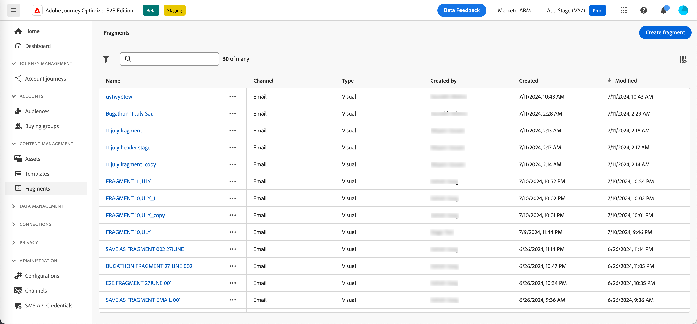{width="700" zoomable="yes"}

テーブルは&#x200B;_[!UICONTROL Modified]_&#x200B;列で並べ替えられ、デフォルトでは最も最近更新されたフラグメントが先頭に表示されます。 列のタイトルをクリックして、昇順と降順を変更します。

### フラグメントのステータスとライフサイクル

フラグメントのステータスによって、メールまたはメールテンプレートでの使用の可用性と、フラグメントに行われる変更が決定されます。

| ステータス | 説明 |
| -------------------- | ----------- |
| 下書き | フラグメントを作成する場合、フラグメントはドラフトステータスになります。 ビジュアルデザインスペースを定義または編集しても、電子メールまたは電子メールテンプレートで使用するために公開するまでは、このステータスのままになります。 使用可能なアクション： <ul><li>すべての詳細を編集<li>ビジュアルデザイン空間での編集<li>公開<li>複製<li>削除 |
| 公開日 | フラグメントを公開すると、フラグメントはメールまたはメールテンプレートで使用できるようになります。 公開されたフラグメントコンテンツは、ビジュアルデザイン空間で変更できません。 使用可能なアクション： <ul><li>説明を編集<li>メールまたはテンプレートに追加<li>ドラフトバージョンを作成<li>複製<li>削除（使用中でない場合） |
| 公開済み下書きあり | 公開されたフラグメントからドラフトを作成しても、公開されたバージョンは電子メールまたは電子メールテンプレートで使用でき、ドラフトコンテンツはビジュアルデザイン空間で変更できます。 ドラフトバージョンを公開すると、現在の公開済みバージョンに置き換わり、コンテンツが使用されている電子メールや電子メールテンプレートで更新されます。 使用可能なアクション： <ul><li>説明を編集<li>メールまたはテンプレートに追加<li>ビジュアルデザインスペースでのドラフトバージョンの編集<li>ドラフトバージョンを公開<li>複製<li>削除（使用中でない場合） |

{zoomable="yes"}

>[!IMPORTANT]
>
>フラグメントのステータスは、Journey Optimizer B2B editionの8月リリースで導入されました。 このリリースの前に作成されたすべてのフラグメントは、電子メールまたはテンプレートで使用される場合でも、_ドラフト_&#x200B;のステータスを持ちます。 これらのフラグメントに変更を加えた場合は、変更を反映するためにフラグメントを公開する必要があります。

### フラグメントリストのフィルタリング

名前でフラグメントを検索するには、検索バーにテキスト文字列を入力して一致を検索します。 _フィルター_ アイコン （）をクリックして、使用可能なフィルターオプションを表示し、設定を変更して、指定した条件に従って表示される項目をフィルタリングします。

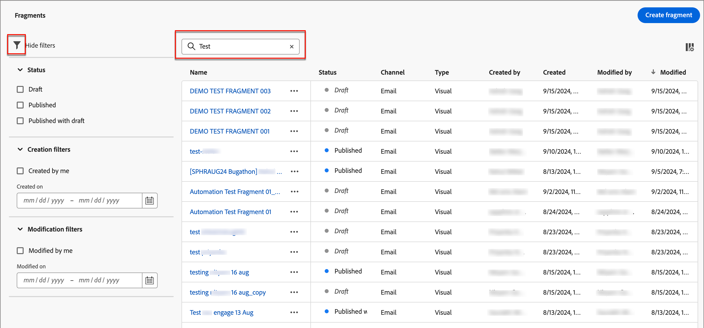{width="700" zoomable="yes"}

### 列表示のカスタマイズ

右上の&#x200B;_テーブルをカスタマイズ_ アイコン （）をクリックして、テーブルに表示する列をカスタマイズします。

ダイアログで、表示する列を選択し、**[!UICONTROL 適用]**&#x200B;をクリックします。

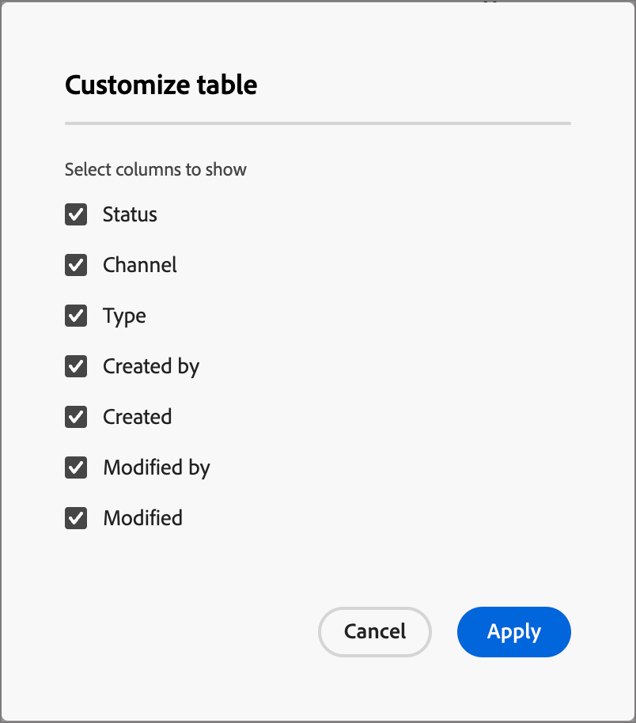{width="300"}

## フラグメントを作成

Journey Optimizer B2B editionで新しいビジュアルフラグメントを作成するには、右上の「**[!UICONTROL フラグメントを作成]**」をクリックします。

1. _[!UICONTROL フラグメントを作成]_ ダイアログで、便利な&#x200B;**[!UICONTROL 名前]**&#x200B;と&#x200B;**[!UICONTROL 説明]** （オプション）を入力します。

   フラグメントの要件：

   * 名前 – 最大100文字、一意にする必要があり、大文字と小文字を区別しない

   * 説明 – 最大300文字

   * Alpha、数値、特殊文字は使用できます

   * 予約済みの文字は&#x200B;**_許可されていません_**: `\ / : * ? " < > |`

   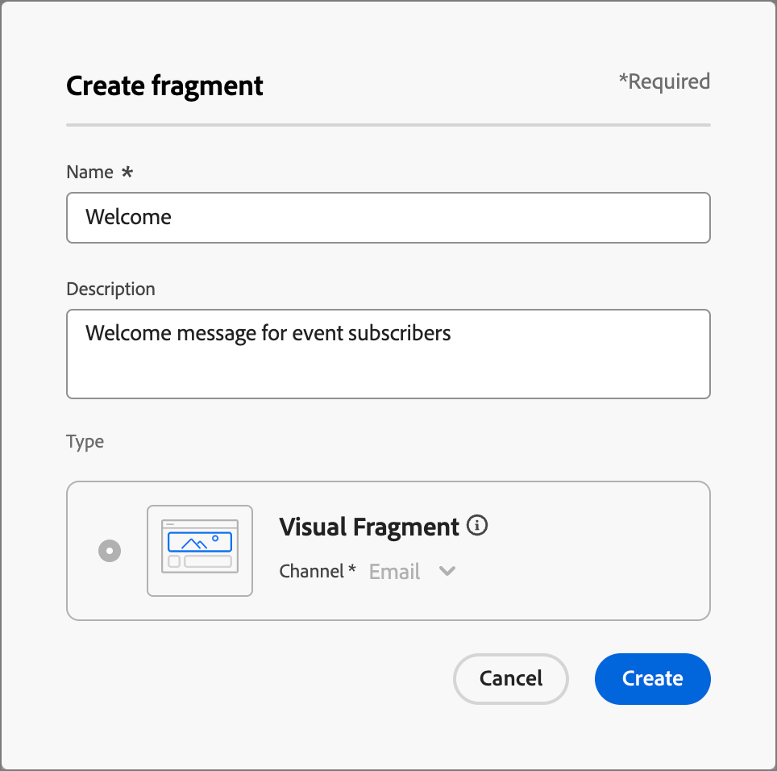{width="400"}

1. 「**[!UICONTROL 作成]**」をクリックします。

   ビジュアルデザインスペースが開き、空のキャンバスが表示されます。

1. コンテンツデザインツールを使用して、ビジュアルフラグメントコンテンツを作成します。

   * [構造とコンテンツの追加](./fragment-authoring.md#add-structure-and-content)
   * [Assetsを追加](./fragment-authoring.md#add-assets)
   * [レイヤー、設定、スタイルの移動](./fragment-authoring.md#navigate-the-layers-settings-and-styles)
   * [コンテンツのパーソナライズ](./fragment-authoring.md#personalize-content)
   * [カスタムフィールドを有効にする](./fragment-authoring.md#enable-fragment-customization)
   * [リンクされたURL トラッキングを編集](./fragment-authoring.md#edit-linked-url-tracking)

1. （オプション）フラグメントコンテンツに[&#x200B; ブランドテーマ &#x200B;](./brand-themes.md)を適用して、フラグメントのオーサリングプロセスを合理化し、デザインが定義された標準に準拠していることを確認します。

   >[!NOTE]
   >
   >テーマを適用する場合、フラグメントの互換性は、_テーマモード_&#x200B;で作成されたメールとメールテンプレートに限定されます。

   右側の&#x200B;_テーマ_ （）アイコンをクリックします。

   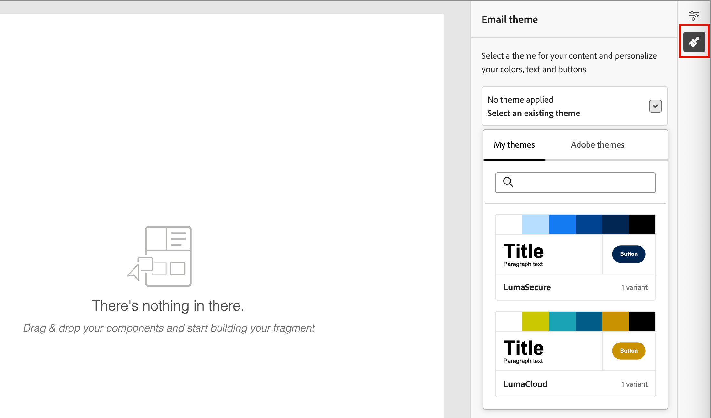{width="600" zoomable="yes"}

   「**[!UICONTROL マイテーマ]**」タブに表示されているカスタムテーマのいずれかを選択するか、**[!UICONTROL Adobe テーマ]**&#x200B;を選択して組み込みテーマを使用できます。 リストの外側をクリックすると、選択したテーマによって、カンバス内のすべてのコンポーネントにスタイルが適用されます。 必要に応じて、カラーバリエーションを切り替えることができます。

1. いつでも&#x200B;**[!UICONTROL 保存]**&#x200B;をクリックして、ドラフトフラグメントを保存します。

1. フラグメントを電子メールまたは電子メールテンプレートで使用できるようにする準備ができたら、「**[!UICONTROL 公開]**」をクリックします。

## フラグメントの詳細を表示

リストページで任意のフラグメントの名前をクリックして、フラグメントの詳細ページを開きます。 フラグメントの編集、フラグメントの名前の変更、フラグメントの説明の更新を選択できます。 変更を加え、「名前」フィールドまたは「説明」フィールドの外側をクリックして、変更を自動保存します。

>[!NOTE]
>
>公開されたフラグメントが電子メールまたは電子メールテンプレートで使用されている場合、名前を変更したり、コンテンツを編集したりすることはできません。 フラグメントを変更する場合は、ドラフトバージョンを作成できます。

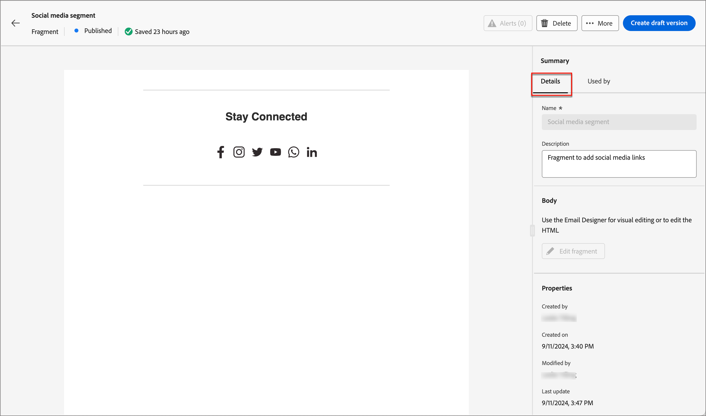{width="600" zoomable="yes"}

「**[!UICONTROL フラグメントを編集]**」をクリックして、ビジュアルコンテンツエディターでフラグメントを開きます。

左上の&#x200B;_戻る_&#x200B;矢印をクリックして、いつでもビューを終了すると、_フラグメント_&#x200B;のリストページに戻ります。

## 使用済み参照のフラグメントを表示

フラグメントの詳細ページで、「**[!UICONTROL 使用者]**」タブをクリックして、電子メール、メールテンプレート、フラグメントをまたいで、Journey Optimizer B2B edition内でフラグメントが現在使用されている場所の詳細を表示します。

>[!IMPORTANT]
>
>メールまたはメールテンプレートで現在使用されているフラグメントは削除できません。

参照は、カテゴリ _電子メール_&#x200B;または&#x200B;_電子メールテンプレート_&#x200B;に従って表示されます。 Journey Optimizer B2B editionの電子メールは、アカウントジャーニー内に埋め込まれて作成されるため、フラグメントを使用する電子メールの親ジャーニーが参照として表示されます。

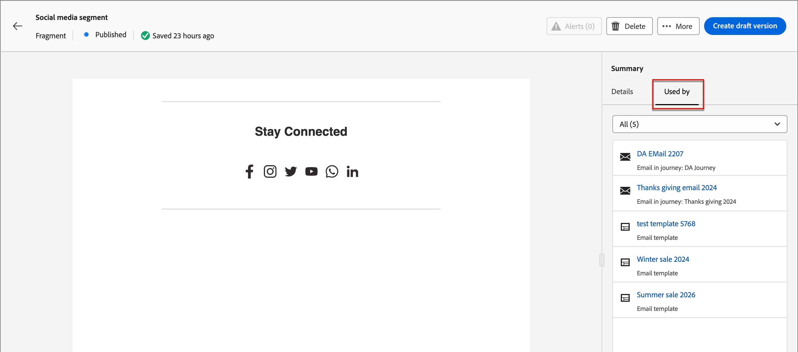{width="600" zoomable="yes"}

リンクをクリックして、フラグメントが使用されている対応する電子メールまたは電子メールテンプレートを開きます。

## フラグメントの削除

メールまたはメールテンプレートで現在使用されているフラグメントは削除できません。フラグメントの削除を開始する前に、_used-by_&#x200B;の参照を確認してください。 また、削除を元に戻すことはできませんので、削除アクションを開始する前に確認してください。

フラグメントは、次のいずれかの方法を使用して削除できます。

* 右側のフラグメントの詳細から、**[!UICONTROL 削除]**&#x200B;をクリックします。
* _[!UICONTROL フラグメント]_&#x200B;のリスト ページで、フラグメントの横にある省略記号をクリックし、**[!UICONTROL 削除]**&#x200B;を選択します。

このアクションを実行すると、確認ダイアログが開きます。 「**[!UICONTROL キャンセル]**」をクリックするか、「**[!UICONTROL 削除]**」をクリックして削除を確認することで、プロセスを中止できます。

{width="400"}

フラグメントが現在使用中の場合、アクションは情報ダイアログを開き、削除できないことを警告します。 削除アクションを中止する&#x200B;**[!UICONTROL OK]**&#x200B;をクリックします。

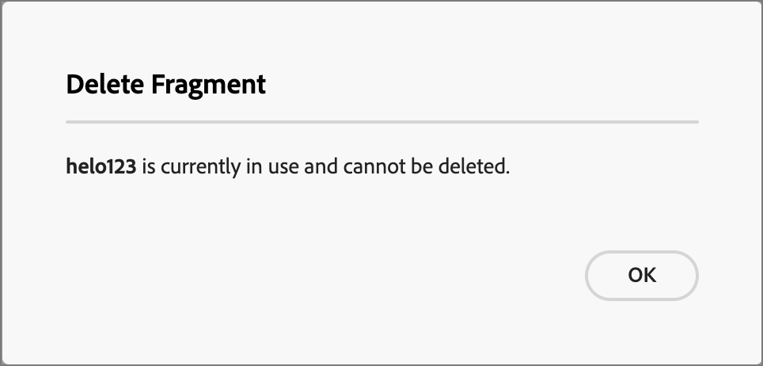{width="400"}

## フラグメントの編集

フラグメントの編集は、現在のステータスに応じて異なります。

* フラグメントのステータスが&#x200B;_ドラフト_&#x200B;の場合、その詳細とビジュアルコンテンツを編集できます。
* フラグメントのステータスが&#x200B;_公開済み_&#x200B;の場合、フラグメントの説明は編集できますが、名前は編集できません。 ビジュアルコンテンツは編集できません。
* フラグメントが&#x200B;_下書き_&#x200B;の状態で公開されている場合、詳細の編集は説明に限定されます。 ドラフトバージョンのビジュアルコンテンツを編集することもできます。

>[!BEGINTABS]

>[!TAB ドラフト]

1. _[!UICONTROL フラグメント]_&#x200B;のリストページで、フラグメント名をクリックして開きます。

   ビジュアルコンテンツのプレビューが表示され、右側にフラグメントの詳細が表示されます。

1. 名前や説明などの詳細を変更します。

   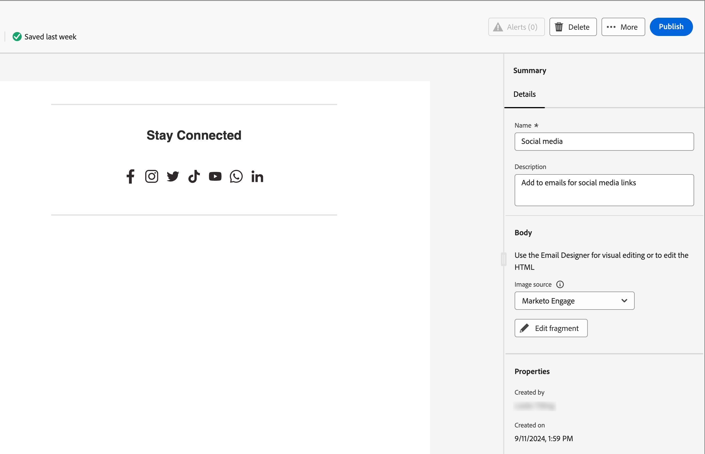{width="600" zoomable="yes"}

1. ビジュアルデザインスペースのコンテンツを変更するには、**[!UICONTROL フラグメントを編集]**&#x200B;をクリックします。

   必要に応じて、ビジュアルデザインツールを使用します。

   * [構造とコンテンツの追加](./fragment-authoring.md#add-structure-and-content)
   * [Assetsを追加](./fragment-authoring.md#add-assets)
   * [レイヤー、設定、スタイルの移動](./fragment-authoring.md#navigate-the-layers-settings-and-styles)
   * [コンテンツのパーソナライズ](./fragment-authoring.md#personalize-content)
   * [カスタムフィールドを有効にする](./fragment-authoring.md#enable-fragment-customization)
   * [リンクされたURL トラッキングを編集](./fragment-authoring.md#edit-linked-url-tracking)

   「**[!UICONTROL 保存]**」または「**[!UICONTROL 保存して閉じる]**」をクリックすると、フラグメントの詳細に戻ります。

1. フラグメントが条件を満たし、電子メールまたは電子メールテンプレートで使用できるようにするには、**[!UICONTROL 公開]**&#x200B;をクリックします。

>[!TAB パブリッシュ済み]

1. _[!UICONTROL フラグメント]_&#x200B;のリストページで、フラグメント名をクリックして開きます。

   ビジュアルコンテンツのプレビューが表示され、右側にフラグメントの詳細が表示されます。

1. 必要に応じて、説明を変更します。

   公開されたフラグメントの場合、他のすべての詳細を変更することはできません。

1. コンテンツを更新する場合は、右上の「**[!UICONTROL ドラフトバージョンを作成]**」をクリックします。

   ダイアログで「**[!UICONTROL OK]**」をクリックして、ビジュアルデザインスペースでドラフトバージョンを開きます。

   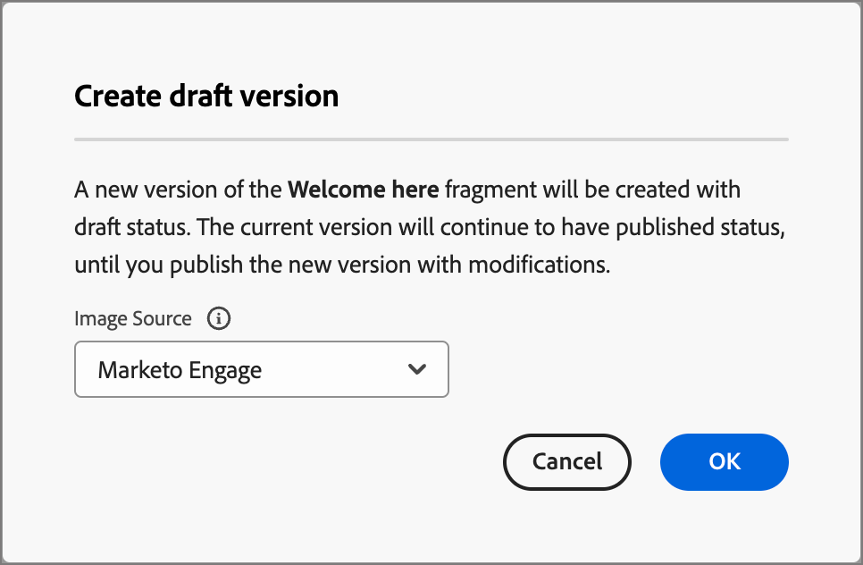{width="300"}

   必要に応じて、ビジュアルデザインツールを使用します。

   * [構造とコンテンツの追加](./fragment-authoring.md#add-structure-and-content)
   * [Assetsを追加](./fragment-authoring.md#add-assets)
   * [レイヤー、設定、スタイルの移動](./fragment-authoring.md#navigate-the-layers-settings-and-styles)
   * [コンテンツのパーソナライズ](./fragment-authoring.md#personalize-content)
   * [カスタムフィールドを有効にする](./fragment-authoring.md#enable-fragment-customization)
   * [リンクされたURL トラッキングを編集](./fragment-authoring.md#edit-linked-url-tracking)

   「**[!UICONTROL 保存]**」または「**[!UICONTROL 保存して閉じる]**」をクリックすると、フラグメントの詳細に戻ります。

1. ドラフトフラグメントが条件を満たし、変更を電子メールまたは電子メールテンプレートで使用できるようにするには、**[!UICONTROL 公開]**&#x200B;をクリックします。

   ドラフトバージョンを公開すると、現在の公開済みバージョンに置き換わり、コンテンツは既に使用されているメールとメールテンプレートで更新されます。

>[!TAB 下書きで公開]

_[!UICONTROL フラグメント]_&#x200B;のリスト ページから編集用のドラフトバージョンを開くには、次の2つの方法があります。

* _詳細_ アイコン （**...**）をクリックします フラグメント名の横にある「**[!UICONTROL ドラフトバージョンを開く]**」を選択します。

  {width="300"}

* フラグメント名をクリックして開きます。 次に、右上の「**[!UICONTROL ドラフトバージョンを開く]**」をクリックします。

  下書きバージョンのビジュアルコンテンツのプレビューが表示され、右側にフラグメントの詳細が表示されます。

コンテンツを更新するには：

1. 右上の「**[!UICONTROL フラグメントを編集]**」をクリックします。 必要に応じて、ビジュアルデザインツールを使用します。

   * [構造とコンテンツの追加](./fragment-authoring.md#add-structure-and-content)
   * [Assetsを追加](./fragment-authoring.md#add-assets)
   * [レイヤー、設定、スタイルの移動](./fragment-authoring.md#navigate-the-layers-settings-and-styles)
   * [コンテンツのパーソナライズ](./fragment-authoring.md#personalize-content)
   * [カスタムフィールドを有効にする](./fragment-authoring.md#enable-fragment-customization)
   * [リンクされたURL トラッキングを編集](./fragment-authoring.md#edit-linked-url-tracking)

   「**[!UICONTROL 保存]**」または「**[!UICONTROL 保存して閉じる]**」をクリックすると、フラグメントの詳細に戻ります。

1. ドラフトフラグメントが条件を満たし、変更を電子メールまたは電子メールテンプレートで使用できるようにするには、**[!UICONTROL 公開]**&#x200B;をクリックします。

   ドラフトバージョンを公開すると、現在の公開済みバージョンに置き換わり、コンテンツは既に使用されているメールとメールテンプレートで更新されます。

>[!ENDTABS]

## フラグメントの複製

次のいずれかの方法を使用して、フラグメントを複製できます。

* _[!UICONTROL フラグメント]_&#x200B;のリスト ページで、_詳細_ アイコン （**...**）をクリックします フラグメント名の横にある「**[!UICONTROL 複製]**」を選択します。
* フラグメントの詳細ページの右上にある「**[!UICONTROL ...」をクリックします。詳細]**&#x200B;を選択し、**[!UICONTROL 複製]**&#x200B;を選択します。

{width="600" zoomable="yes"}

ダイアログで、便利な名前（一意）と説明を入力します。 「**[!UICONTROL 複製]**」をクリックして、アクションを完了します。

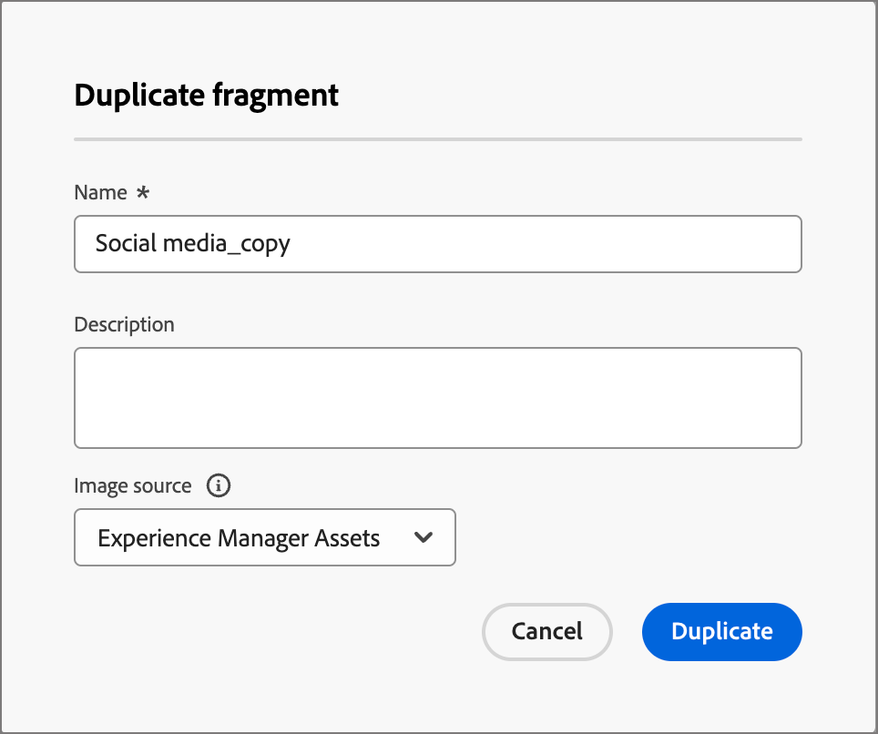{width="400"}

複製された（新しい）フラグメントは、_フラグメント_&#x200B;のリストに表示されます。

## メールまたはテンプレートコンテンツから新しいフラグメントを保存する

ビジュアルコンテンツエディターで電子メールまたは電子メールテンプレートを作成または編集する際に、コンテンツのすべてまたは一部をフラグメントとして保存して、再利用できるようにすることができます。

1. 一部のコンテンツをフラグメントとして保存する場合は、**[!UICONTROL 詳細]**&#x200B;をクリックし、**[!UICONTROL フラグメントとして保存]**&#x200B;を選択します。

1. フラグメントに含めるさまざまな要素を選択します。

   Shift ボタンまたはControl ボタンを押しながら、複数の構造を選択します。

   隣接する構造のみを選択でき、インターフェイスでは隣接しない要素を選択できません。

1. コンテンツを選択した状態で、右上の「**[!UICONTROL 作成]**」をクリックします。

1. ダイアログで、フラグメントの便利な名前と説明を入力します。 「**[!UICONTROL 作成]**」をクリックします。

   その後、新しいフラグメントは&#x200B;_フラグメント_ リストページに表示され、メールやメールテンプレート内でも使用できます。

## 電子メールやテンプレートコンテンツへのビジュアルフラグメントの追加

フラグメントは再利用を考慮して設計されており、電子メールや電子メールテンプレートのオーサリング用に挿入できます。 電子メールまたはテンプレートには、最大30個のフラグメントを追加できます。 フラグメントは、1つのレベルでのみネストできます。

>[!BEGINTABS]

>[!TAB 電子メールにフラグメントを追加]

1. **[!UICONTROL アカウントジャーニー]**&#x200B;に移動し、既存のジャーニーを開くか、新しいジャーニーを作成します。

1. [_[!UICONTROL &#x200B; メール送信&#x200B;]_&#x200B;ノード &#x200B;](./add-email.md#add-an-email-action-node-in-a-journey)を作成します。

1. ノード [&#128279;](./email-authoring.md)の電子メールコンテンツを作成または編集します。

1. **[!UICONTROL コンポーネント]** メニューから項目をドラッグ&amp;ドロップして、フラグメントに&#x200B;_構造_&#x200B;を指定します。

1. 公開されたフラグメントのリストを開くには、_フラグメント_ アイコンをクリックします。

   次の操作が可能です。
   * リストの並べ替え。
   * リストを参照、検索、フィルタリングします。
   * カード（サムネール）とリストビューを切り替えます。
   * 最近作成したフラグメントを反映するには、リストを更新します。

   {width="600"}

1. 任意のフラグメントを構造コンポーネントのプレースホルダーにドラッグ&amp;ドロップします。

   エディターは、メール構造のセクション/エレメント内でフラグメントをレンダリングします。

フラグメントのコンテンツは、構造内で動的に更新され、コンテンツがメールにどのように表示されるかを視覚的に表示します。

>[!TIP]
>
>フラグメントをメール内の水平レイアウト全体に配置する場合は、[!UICONTROL 1:1列]構造を追加し、フラグメントをドラッグ&amp;ドロップします。

電子メールを保存すると、「_[!UICONTROL 使用者]_」タブが選択されている場合に、フラグメントの詳細ページに表示されます。 メールに追加されたフラグメントは、メールまたはテンプレート内では編集できません。公開されたソースフラグメントがコンテンツを定義します。

>[!TAB  メールテンプレートにフラグメントを追加]

1. 左側のナビゲーションで、**[!UICONTROL コンテンツ管理]**/**[!UICONTROL テンプレート]**&#x200B;をクリックします。

1. 新しいテンプレートを作成するか、既存の電子メールテンプレートを開いて、**[!UICONTROL 電子メールテンプレートを編集]**&#x200B;をクリックします。

1. **[!UICONTROL コンポーネント]** メニューから項目をドラッグ&amp;ドロップして、フラグメントに&#x200B;_構造_&#x200B;を指定します。

1. フラグメントのリストを開くには、_フラグメント_ アイコンをクリックします。

   次の操作が可能です。
   * リストの並べ替え。
   * リストを参照、検索、フィルタリングします。
   * カード（サムネール）とリストビューを切り替えます。
   * 最近作成したフラグメントを反映するには、リストを更新します。

   {width="600"}

1. 任意のフラグメントを構造コンポーネントのプレースホルダーにドラッグ&amp;ドロップします。

   エディターは、メールテンプレート構造のセクション/エレメント内でフラグメントをレンダリングします。

1. 任意のフラグメントを構造コンポーネントのプレースホルダーにドラッグ&amp;ドロップします。

   エディターは、メールテンプレート構造のセクション/エレメント内でフラグメントをレンダリングします。

>[!TIP]
>
>フラグメントをメールテンプレート内の水平レイアウト全体に配置する場合は、_[!UICONTROL 1:1列]_&#x200B;構造を追加し、フラグメントをドラッグ&amp;ドロップします。

メールテンプレートを保存すると、「_[!UICONTROL 使用者]_」タブが選択されると、フラグメントの詳細ページに表示されます。 メールテンプレートに追加されたフラグメントは、テンプレート内で編集できません。公開されたソースフラグメントがコンテンツを定義します。

>[!ENDTABS]

## メールおよびテンプレートのオーサリング中にフラグメントがアクションを実行

フラグメントをメールまたはメールテンプレートに追加すると、フラグメントのコンテンツをメールまたはテンプレート内で編集できません。 ただし、次のアクションを適用できます。

* **[!UICONTROL 削除]** – このアクションは、現在の電子メールまたは電子メールテンプレートコンテンツからフラグメントを削除します（フラグメントソースは影響を受けません）。
* **[!UICONTROL 更新]** – このアクションは、現在の電子メールまたは電子メールテンプレートのフラグメントのコンテンツを更新します。 更新は、電子メールまたは電子メールテンプレートに追加した後で、フラグメントに最近編集した内容を反映する場合に便利です。
* **[!UICONTROL 複製]** – このアクションは、エディター内の同じ電子メールまたは電子メールテンプレート内のフラグメントを、同じディメンションで複製し、その下に追加します。
* **[!UICONTROL フラグメントを開く]** – このアクションは、フラグメントエディターページと詳細を含む新しいブラウザータブを開きます。
* **[!UICONTROL 継承を解除]** – このアクションは、ソースからのフラグメント（およびその変更）の継承を解除します。 このアクションを使用すると、フラグメントコンテンツを電子メールまたは電子メールテンプレート内で独立した編集可能なコンテンツとして利用できます。 このアクションは、元のフラグメントの&#x200B;_Used By_&#x200B;参照から電子メールまたは電子メールテンプレートも削除します。

エディターページでフラグメントを選択すると、これらのアクションはコンテキストツールバーと右側のプロパティパネルから使用できます。

{width="600" zoomable="yes"}
