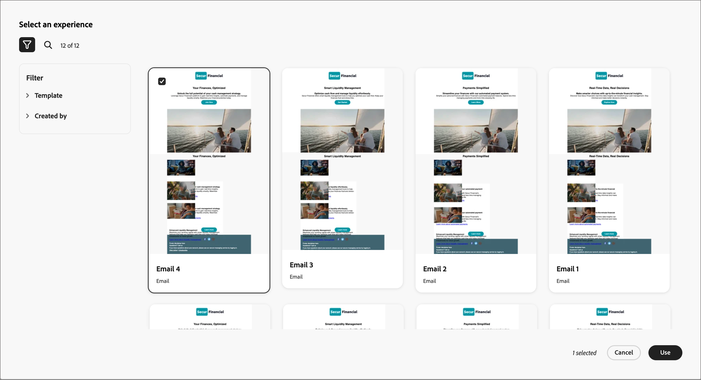

# GenStudio for Performance Marketing を使用したメールコンテンツの作成 {#genstudio-workflow}

>[!CONTEXTUALHELP]
>id="ajo-b2b_genstudio_button"
>title="GenStudio で作成したテンプレートの使用"
>abstract="Adobe GenStudio for Performance Marketing との統合を使用して、Adobe AI テクノロジーで強化された GenStudio テンプレートを読み込みます。"

>[!AVAILABILITY]
>
>[!DNL Adobe Journey Optimizer B2B Edition] での GenStudio 統合は、現在、**Healthcare Shield** または **Privacy and Security Shield** アドオン製品では使用できません。
>
>この統合は、メールチャネルでのみ使用できます。

ワークフローの効率を高め、ブランドの一貫性を維持するために、GenStudio for Performance MarketingのエクスペリエンスとAdobe Journey Optimizer B2B editionのメールオーケストレーションを組み合わせることができます。 この拡張されたワークフローを使用すると、GenStudioの AI 機能を活用したコンテンツ作成ツールを活用して、アカウントジャーニーを通じてメール通信を拡張および最大化できます。

例えば、Journey Optimizer B2B editionを使用して主要アカウントへのメール通信を開発および自動化するテクニカルマーケターは、GenStudioを使用してコンテンツを作成するパフォーマンスマーケターと共同作業できます。 このワークフローを使用すると、両方の組織が連携して、GenStudioのオンブランドコンテンツをJourney Optimizer B2B editionのアカウントベースのマーケティング自動処理に組み合わせ、特定の購買グループをターゲットにして売上を伸ばす魅力的なメールを配信できます。

>[!BEGINSHADEBOX]

## GenStudioのコンテンツ生成機能

[Adobe GenStudio for Performance Marketing](https://business.adobe.com/jp/products/genstudio-for-performance-marketing.html){target="_blank"} は、マーケティングチームが、ブランド標準に準拠し、エンタープライズポリシーに準拠した、インパクトのあるパーソナライズされた広告やメールを作成できるようにする、ジェネレーティブ AI ファーストのアプリケーションです。 アドビの AI テクノロジーを活用することで、コンテンツの作成と管理の複雑さを軽減し、クリエイターが革新性に焦点を当てることができるようにする包括的なツールスイートを提供します。

{width="30"}[ オンブランドのマーケティングメールの作成 ](https://experienceleague.adobe.com/ja/docs/genstudio-for-performance-marketing-learn/tutorials/creating-experiences/creating-on-brand-emails){target="_blank"}

GenStudio for Performance Marketing機能について詳しくは、[ ドキュメント ](https://experienceleague.adobe.com/ja/docs/genstudio-for-performance-marketing/user-guide/home){target="_blank"} を参照してください。

>[!ENDSHADEBOX]

## Journey Optimizer B2B editionからのHTMLの書き出し

まず、Journey Optimizer B2B editionで、ブランドのガイドラインが記載されたメールからHTMLを書き出します。

1. Journey Optimizer B2B editionのビジュアルデザイン領域で、メールのコンテンツにアクセスします。

1. メールデザインスペースの上部にある _[!UICONTROL その他…]_ メニューから、「**[!UICONTROL HTMLを書き出し]**」を選択します。

   {width="600"}。

   この操作により、HTMLと画像ファイルを含むダウンロード済みの.zip ファイルが生成されます。

## 書き出したHTMLをGenStudio for Performance Marketingで使用

読み込まれたメールHTML内の特定のエレメントが、認識されたフィールド名で識別された場合、GenStudio for Performance Marketingでそのエレメントが認識されます。 GenStudio for Performance Marketingで特定のタイプのコンテンツを生成する必要がある場合、Handlebars 構文を使用して、書き出されたHTMLにフィールド名を追加します。

| フィールド | コンテンツタイプ |
| ----------------- | ------------------------- |
| `{{pre_header}}` | プレヘッダー |
| `{{headline}}` | ヘッドライン |
| `{{sub_headline}}` | サブ見出し |
| `{{body}}` | 本文 |
| `{{cta}}` | Call to action（ボタン） |
| `{{image}}` | Image |
| `{{link}}` | 画像上のCall to action |

### テンプレートの作成

HTML ファイルを使用して、GenStudio for Performance Marketingにテンプレートを作成します。

Adobe GenStudio for Performance MarketingでHTML テンプレートをGenStudioにアップロードする方法について詳しくは、GenStudio for Performance Marketing ドキュメントの [ テンプレートの追加 ](https://experienceleague.adobe.com/ja/docs/genstudio-for-performance-marketing/user-guide/content/templates/use-templates#add-a-template) を参照してください。

書き出したHTMLをテンプレートとしてアップロードすると、GenStudio for Performance MarketingはHTML ファイルをスキャンして、認識されたフィールドを探します。 プレビューを使用してテンプレート要素を確認し、認識されたフィールド名で正しく識別されたことを確認します。

### メールエクスペリエンスを生成

GenStudio for Performance Marketingでは、テンプレートを使用して複数のメールエクスペリエンスのバリエーションを作成し、保存します。

ブランドメール体験を生成する方法について詳しくは、GenStudio for Performance Marketing ドキュメントの [ メールエクスペリエンスの作成 ](https://experienceleague.adobe.com/ja/docs/genstudio-for-performance-marketing/user-guide/create/create-email-experience) を参照してください。

## 生成されたメールエクスペリエンスのJourney Optimizer B2B editionへの追加

>[!NOTE]
>
>GenStudio for Performance Marketing統合は、メールの作成にのみ使用でき、メールテンプレートの作成には使用できません。

書き出したGenStudio B2B edition メール HTML ファイルから作成したJourney Optimizer メールのバリエーションを使用するには、次の手順に従います。

1. Journey Optimizer B2B editionで、「[ アクションを実行 ](./add-email.md) ノードを使用して、アカウントジャーニーに _[!UICONTROL メールを追加]_ します。

   * _[!UICONTROL アクションオン]_ ターゲットで、「**[!UICONTROL ユーザー]**」を選択します。

   * _[!UICONTROL ユーザーに対するアクション]_ については、「**[!UICONTROL メールを送信]**」を選択します。

     {width="700" zoomable="yes"}

   * _[!UICONTROL メールソース]_ については、「**[!UICONTROL 新しいメールを作成]**」を選択し、Journey Optimizer B2B editionでネイティブにメールを作成します。

1. _メールを作成_ ページで、「**[!UICONTROL HTMLを読み込む]**」を選択します。

1. _[!UICONTROL メールの読み込み]_ ダイアログで、「**[!UICONTROL Adobe GenStudio for Performance Marketing]**」をクリックします。

   {width="500" zoomable="yes"}

1. 公開されたエクスペリエンスを参照します。

   _テンプレート_ や _作成者_ など、複数の条件でエクスペリエンスをフィルタリングできます。

   {width="600" zoomable="yes"}

1. エクスペリエンスを選択し、「**[!UICONTROL 使用]** をクリックして、メールコンテンツの作成を開始します。

   >[!NOTE]
   >
   >Journey Optimizer B2B editionまたはMarketo Engage テンプレートから作成されたGenStudio エクスペリエンスは、メールデザインスペースに直接読み込まれます。 Journey Optimizer B2B edition テンプレートを使用せずに作成されたエクスペリエンスは、互換モードに読み込まれます。

1. [ メールコンテンツおよびパーソナライゼーションツール ](./email-authoring.md) を使用して、必要に応じてメールを編集して保存します。

   {width="800" zoomable="yes"}
