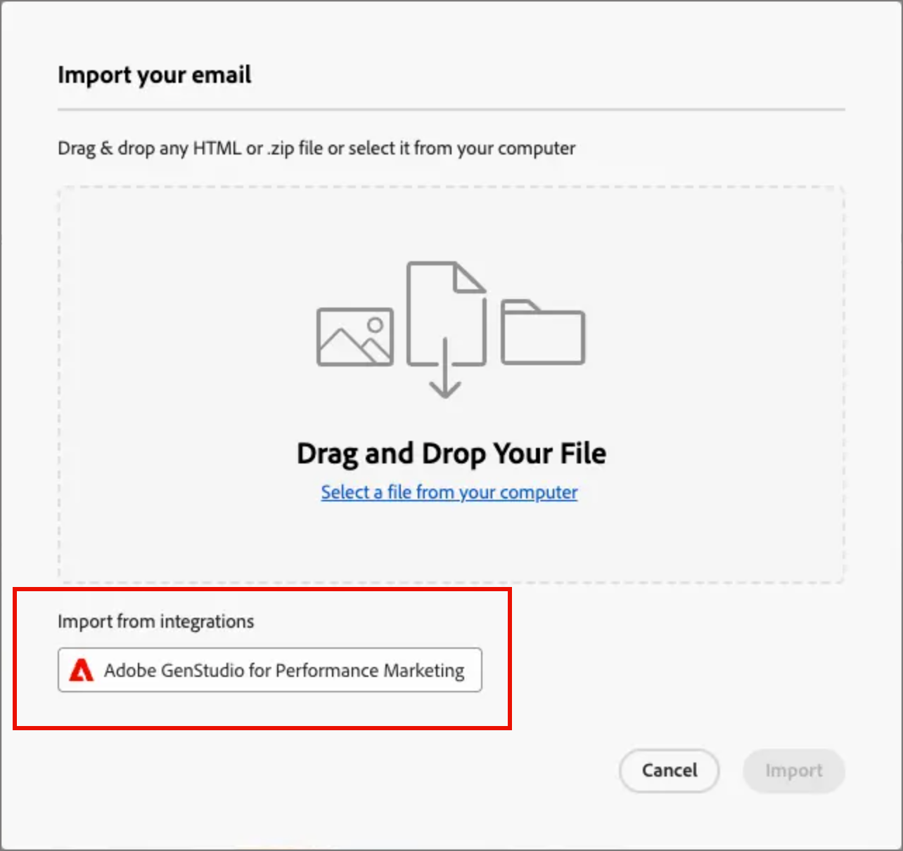
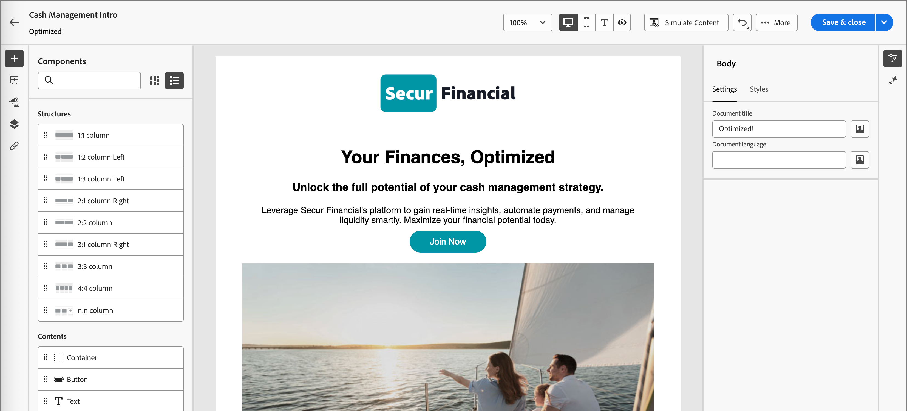

# GenStudio for Performance Marketing を使用したメールコンテンツの作成 {#genstudio-workflow}

>[!CONTEXTUALHELP]
>id="ajo-b2b_genstudio_button"
>title="GenStudio で作成したテンプレートの使用"
>abstract="Adobe GenStudio for Performance Marketingとの統合を使用して、Adobe AI テクノロジーで強化されたGenStudio テンプレートを読み込みます。"

>[!AVAILABILITY]
>
>[!DNL Adobe Journey Optimizer B2B Edition] での GenStudio 統合は、現在、**Healthcare Shield** または **Privacy and Security Shield** アドオン製品では使用できません。
>
>この統合は、メールチャネルでのみ使用できます。

ワークフローの効率性を高め、ブランドの一貫性を維持するには、GenStudio for Performance MarketingのエクスペリエンスとAdobe Journey Optimizer B2B editionのメールオーケストレーションを組み合わせることができます。 この拡張されたワークフローにより、GenStudioのAIを活用したコンテンツ制作ツールを活用して、アカウントジャーニーを通じてメールコミュニケーションを拡大し、最大化することができます。

たとえば、テクニカルマーケターが、Journey Optimizer B2B editionを使用して主要なアカウントへのメール配信を開発および自動化すれば、GenStudioを使用してコンテンツを制作するパフォーマンスマーケターと協力して作業することができます。 このワークフローを利用することで、両社は協力して、GenStudioのブランドに即したコンテンツをJourney Optimizer B2B editionのアカウントベースドマーケティングオートメーションに統合し、特定の購買グループをターゲットにして売上を促進する魅力的なメールを配信することができます。

>[!BEGINSHADEBOX]

## GenStudioのコンテンツ作成機能

[Adobe GenStudio for Performance Marketing](https://business.adobe.com/products/genstudio/performance-marketing.html){target="_blank"}は、マーケティング部門がブランド基準を遵守し、エンタープライズポリシーに準拠した、インパクトのあるパーソナライズされた広告やメールを作成できるようにする、生成AIを活用したアプリケーションです。 Adobe AIのテクノロジーを活用することで、コンテンツ制作と管理の複雑さを簡素化する包括的なツール群を提供し、コンテンツ制作者がイノベーションに集中できるようにします。

{width="30"} [ ブランドに即したマーケティングメールの作成](https://experienceleague.adobe.com/ja/docs/genstudio-for-performance-marketing-learn/tutorials/creating-experiences/creating-on-brand-emails){target="_blank"}

GenStudio for Performance Marketing機能について詳しくは、[ ドキュメント ](https://experienceleague.adobe.com/ja/docs/genstudio-for-performance-marketing/user-guide/home){target="_blank"}を参照してください

>[!ENDSHADEBOX]

## Journey Optimizer B2B editionからのHTMLの書き出し

まず、Journey Optimizer B2B editionで、ブランドのガイドラインを含むメールからHTMLを書き出します。

1. Journey Optimizer B2B editionで、ビジュアルデザイン画面でメールのコンテンツにアクセスします。

1. 電子メールデザインスペースの上部にある「_[!UICONTROL その他…]_」メニューから、「**[!UICONTROL HTMLを書き出し]**」を選択します。

   {width="600"}」を選択します

   この操作を実行すると、HTML ファイルと画像ファイルを含むダウンロード済みの.zip ファイルが生成されます。

## GenStudio for Performance Marketingで書き出したHTMLの使用

GenStudio for Performance Marketingは、読み込まれた電子メール HTML内の特定の要素が、認識されたフィールド名で識別されたときに識別します。 特定の種類のコンテンツを生成するためにHTMLが必要な場合は、Handlebars構文を使用して、書き出したGenStudio for Performance Marketingにフィールド名を追加します。

| フィールド | コンテンツタイプ |
| ----------------- | ------------------------- |
| `{{pre_header}}` | プレヘッダー |
| `{{headline}}` | ヘッドライン |
| `{{sub_headline}}` | Sub-Headline |
| `{{body}}` | 本文 |
| `{{cta}}` | Call to action （ボタン） |
| `{{image}}` | Image |
| `{{link}}` | Call to actionの画像 |

### テンプレートの作成

HTML ファイルを使用して、GenStudio for Performance Marketingでテンプレートを作成します。

HTML テンプレートのAdobe GenStudio for Performance Marketingへのアップロードについて詳しくは、GenStudio for Performance Marketing ドキュメントの[ テンプレートの追加](https://experienceleague.adobe.com/en/docs/genstudio-for-performance-marketing/user-guide/templates/use-templates#add-a-template)を参照してください。

書き出されたHTMLをテンプレートとしてアップロードすると、GenStudio for Performance MarketingはHTML ファイルをスキャンして、認識されたフィールドを探します。 プレビューを使用してテンプレート要素を確認し、認識されたフィールド名で正しく識別されていることを確認します。

### メール体験の生成

GenStudio for Performance Marketingでは、テンプレートを使用して、複数のメールエクスペリエンスのバリエーションを作成し、保存します。

ブランドのメールエクスペリエンスの作成について詳しくは、GenStudio for Performance Marketing ドキュメントの[ メールエクスペリエンスの作成](https://experienceleague.adobe.com/ja/docs/genstudio-for-performance-marketing/user-guide/create/create-email-experience)を参照してください。

## Journey Optimizer B2B editionへの生成メールエクスペリエンスの追加

>[!NOTE]
>
>GenStudio for Performance Marketingの統合は、メール作成にのみ使用でき、メールテンプレートの作成には使用できません。

書き出されたJourney Optimizer B2B edition電子メールHTML ファイルから作成されたGenStudio電子メールのバリエーションを使用するには、次の手順に従います。

1. Journey Optimizer B2B editionでは、_[!UICONTROL アクションを実行]_ ノードを使用して、[電子メール ](./add-email.md)をアカウントジャーニーに追加します。

   * ターゲット ]_の_[!UICONTROL  アクションで、**[!UICONTROL 人物]**&#x200B;を選択します。

   * ユーザー&#x200B;]_に対する_[!UICONTROL  アクションの場合は、**[!UICONTROL メールを送信]**&#x200B;を選択します。

     {width="700" zoomable="yes"}

   * _[!UICONTROL メールソース]_&#x200B;で、**[!UICONTROL 新しいメールを作成]**&#x200B;を選択して、Journey Optimizer B2B editionで電子メールをネイティブに作成します。

1. _メールの作成_ ページで、**[!UICONTROL HTMLの読み込み]**&#x200B;を選択します。

1. _[!UICONTROL メールを読み込む]_ ダイアログで、**[!UICONTROL Adobe GenStudio for Performance Marketing]**&#x200B;をクリックします。

   {width="500" zoomable="yes"}

1. 公開されたエクスペリエンスを参照します。

   _テンプレート_&#x200B;や&#x200B;_作成者_&#x200B;など、複数の条件でエクスペリエンスをフィルタリングできます。

   {width="600" zoomable="yes"}

1. エクスペリエンスを選択し、**[!UICONTROL 使用]**&#x200B;をクリックして、メールコンテンツの作成を開始します。

   >[!NOTE]
   >
   >Journey Optimizer B2B editionまたはMarketo Engage テンプレートから作成されたGenStudio エクスペリエンスは、電子メールデザイン空間に直接読み込まれます。 Journey Optimizer B2B edition テンプレートを使用せずに作成されたエクスペリエンスは、互換モードに読み込まれます。

1. [電子メールコンテンツとパーソナライゼーションツール ](./email-authoring.md)を使用して、必要に応じて電子メールを編集し、保存します。

   {width="800" zoomable="yes"}
