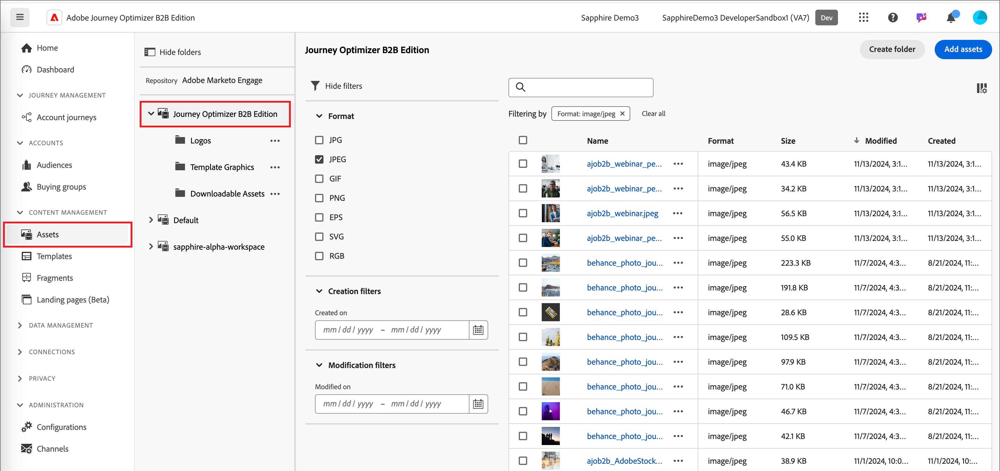
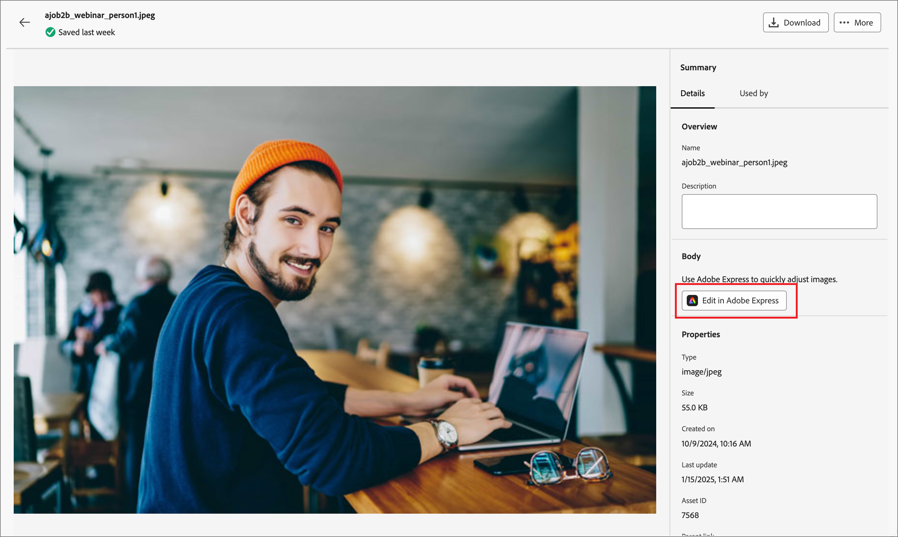
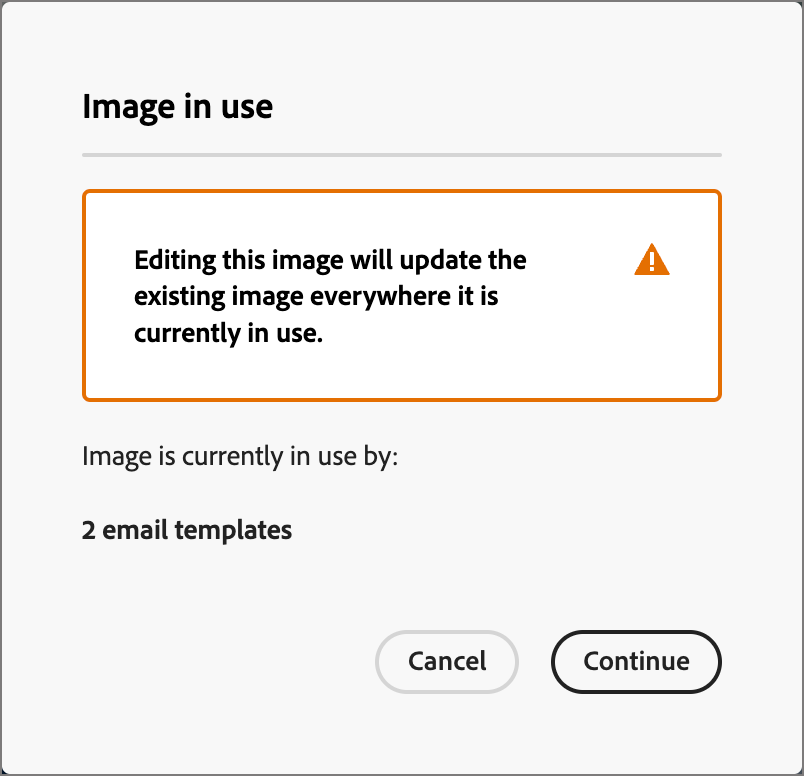
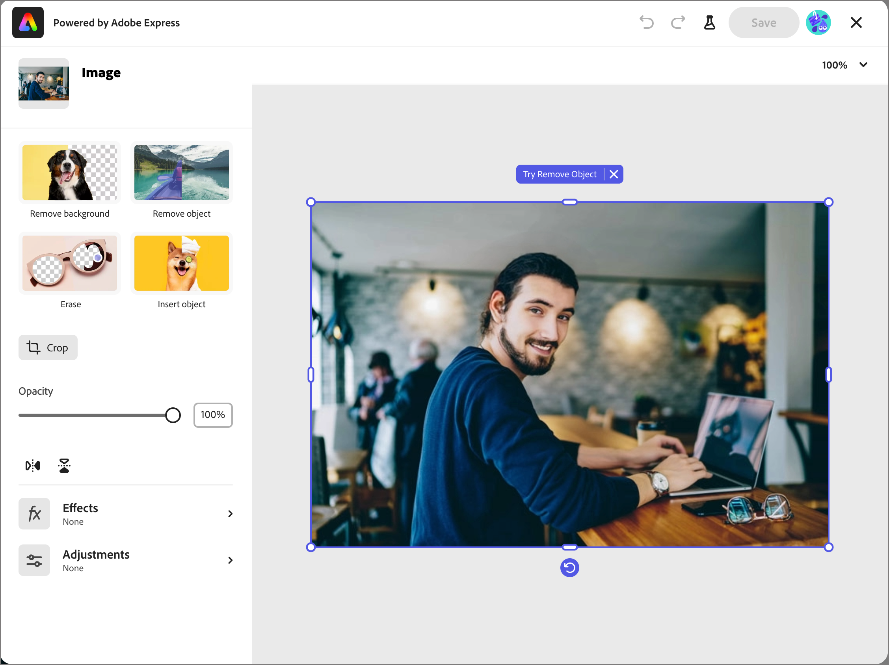
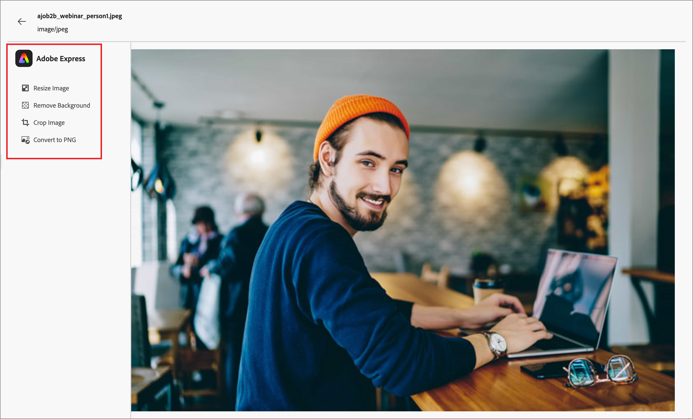
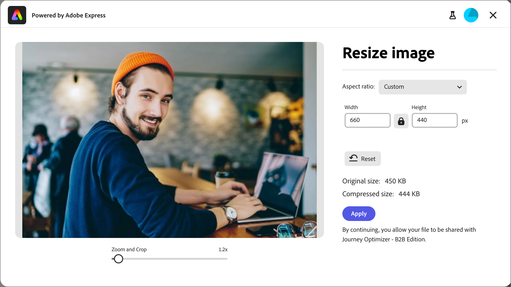
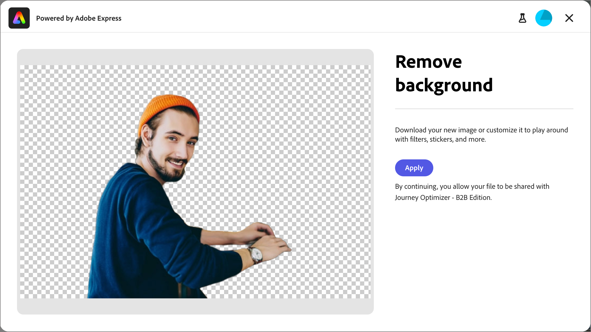
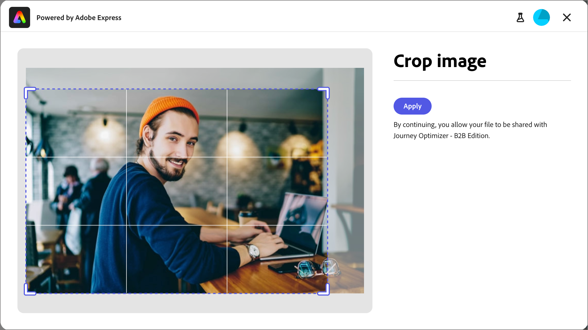
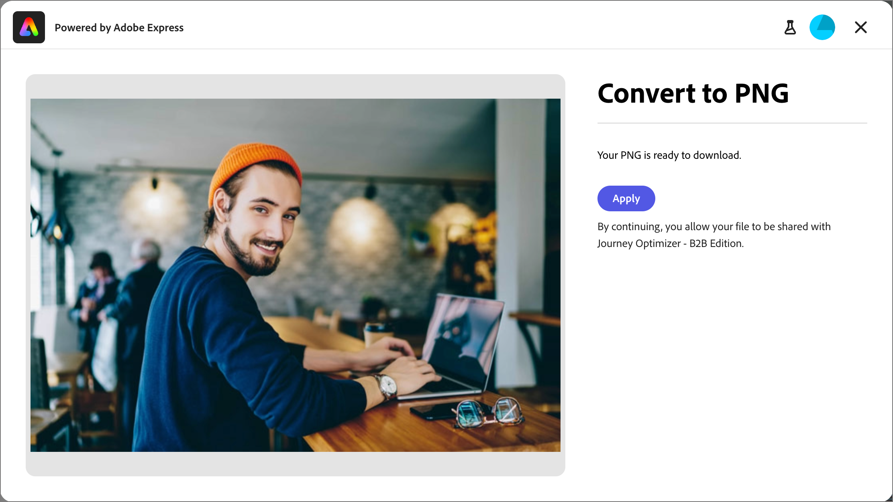

# Adobe Express を使用した画像の編集 {#edit-images-adobe-express}

>[!CONTEXTUALHELP]
>id="ajo-b2b_assets_edit_adobe_express"
>title="Adobe Express での画像の編集"
>abstract="Adobe Express を活用した簡単で直感的な画像編集ツールは、Adobe Journey Optimizer B2B エディション内で直接使用できるので、コンテンツの速度が向上します。"

[!DNL Adobe Journey Optimizer B2B Edition]はAdobe Expressとネイティブに統合され、一連の[!DNL Adobe Express]画像編集ツールにアクセスできます。 これらのツールを使用して、[!DNL Journey Optimizer B2B Edition] アセットリポジトリに保存されている画像を変更できます。 この統合には、次の主な利点があります。

* Journey Optimizer B2B editionで新しい画像アセットを編集および保存することで、コンテンツの再利用を促進。

* 画像アセットの更新や、既存の画像アセットの新しいバージョンの作成にかかる時間と労力を削減。

>[!NOTE]
>
>Adobe Expressの編集機能の使用権限は、すべてのJourney Optimizer B2B edition サブスクリプションに含まれています。

[!DNL Adobe Express]関数は、PNGおよびJPEGの画像ファイル形式をサポートしています。

_画像を変更するには&#x200B;:_

1. 左側のナビゲーションに移動し、**[!UICONTROL Content Management]**/**[!UICONTROL Assets]**&#x200B;をクリックします。

このアクションを実行すると、すべてのアセットが一覧表示されたリストページが開きます。

1. 変更する画像を見つけるか、元の画像として使用して新しいアセットを作成します。

   * フォルダー別にアセットを表示するには、左上の「_フォルダーを表示_」アイコンをクリックして構造を開きます。

   * 任意の列で表を並べ替えるには、列タイトルをクリックします。 タイトル行の矢印は、現在の並べ替え列と順序を示します。

   * 選択したフォルダー内の画像アセットを検索するには、検索バーにテキスト文字列を入力します。

   {width="800" zoomable="yes"}

1. 画像アセットの名前をクリックして開き、その詳細を表示します。

   >[!TIP]
   >
   >画像の詳細で「_[!UICONTROL 使用ユーザー]_」タブ ](./internal-image-assets.md#view-asset-used-by-references)を選択し、画像ファイルの編集を続行する前に、画像が現在使用されているコンテンツを確認することをお勧めします。[

1. 右側の画像&#x200B;_[!UICONTROL Details]_&#x200B;で、**[!UICONTROL Adobe Expressで編集]**&#x200B;をクリックします。

   {width="600" zoomable="yes"}

   画像が使用中の場合は、変更がそのコンテンツに影響を与えることを通知する警告ダイアログが表示されます。 「**[!UICONTROL 続行]**」をクリックして、Adobe Express エディターに進みます。

   {width="300"}

## Adobe Express エンタープライズ版ライセンス

Adobe Expressのエンタープライズライセンスをお持ちの場合は、Express エディターにアクセスして使用できます。 これらの編集機能には、カラー、明るさ、シャープネス、コントラスト、切り抜きなどの画像調整の操作が含まれます。 また、背景の削除、オブジェクトの挿入と削除、画像の一部の消去など、_AI magic_&#x200B;の操作も含まれます。

>[!NOTE]
>
>Journey Optimizer B2B editionのエディター機能をすべて利用するには、同じIMS組織でAdobe Express Enterprise ライセンスを購入する必要があります。 IMS組織の個々のメンバーとして、Adobe Express インスタンスで割り当てられたライセンスが必要です。 それ以外の場合、Adobe Expressへのアクセスは、Journey Optimizer B2B editionからAdobe Express](#quick-actions-in-adobe-express)の[ クイックアクションに制限されます。

{width="600" zoomable="yes"}

使用可能な編集機能について詳しくは、[Adobe Express ユーザーガイド ](https://helpx.adobe.com/jp/express/web.html){target="_blank"}を参照してください。

## Adobe Expressのクイックアクション

Adobe Express Enterprise ライセンスをお持ちでない場合は、Adobe Express クイックアクションエディターにアクセスできます。

1. Adobe Expressのクイックアクションエディターで、画像修飾機能のいずれかを選択して画像を変更します。

   * [**[!UICONTROL 画像のサイズ変更]**](#resize-image)
   * [**[!UICONTROL 背景を削除]**](#remove-background)
   * [**[!UICONTROL 画像を切り抜く]**](#crop-image)
   * [**[!UICONTROL PNGに変換]**](#convert-file-format) （JPEG イメージが読み込まれた場合）
   * [**[!UICONTROL JPEGに変換]**](#convert-file-format) （PNG画像が読み込まれた場合）

   {width="600" zoomable="yes"}

1. メインのAdobe Express クイックアクションエディターに戻ったら、**[!UICONTROL 保存]**&#x200B;をクリックして、変更した画像ファイルを同じファイル名を使用してJourney Optimizer B2B edition アセットリポジトリに保存します。

### 画像のサイズ変更

1. サイズ変更設定を使用して、画像を縮小または拡大します。

   * 「**[!UICONTROL 縦横比]**」オプションを選択します。 デジタルコンテンツに標準サイズを使用するか、**[!UICONTROL 幅]**&#x200B;と&#x200B;**[!UICONTROL 高さ]**&#x200B;の値を入力してニーズに合わせたい場合は、**[!UICONTROL カスタム]**&#x200B;を選択します。

   * 表示される&#x200B;_[!UICONTROL 元のサイズ]_&#x200B;と&#x200B;_[!UICONTROL 圧縮サイズ]_&#x200B;には、変更を適用した場合に生じるサイズの変更が表示されます。 **[!UICONTROL ズームと切り抜き]** ツールを使用すると、表示される画像の一部をより詳しく調べることができます。

   * 画像を元の状態に戻す場合は、**[!UICONTROL リセット]**&#x200B;をクリックします。

   {width="600" zoomable="yes"}

1. 結果に満足したら、**[!UICONTROL 適用]**&#x200B;をクリックします。

### 背景を削除

{width="600" zoomable="yes"}

Adobe Expressは、画像内のプライマリオブジェクトを分離するために、背景の自動削除を実行します。 結果に満足している場合は、**[!UICONTROL 適用]**&#x200B;をクリックします。

### 画像を切り抜く

1. 画像の角にあるハンドルをドラッグして、画像アセットに含めたくない外側の領域を削除します。

   {width="600" zoomable="yes"}

1. 結果に満足したら、**[!UICONTROL 適用]**&#x200B;をクリックします。

### ファイル形式を変換

* **[!UICONTROL JPEGに変換]** - PNG画像の場合、その画像をJPEG画像ファイルに変換し、新しいアセットとして保存できます。
* **[!UICONTROL PNGに変換]** - JPEG画像の場合、画像をPNG画像ファイルに変換し、新しいアセットとして保存できます。

{width="600" zoomable="yes"}

1. 「**[!UICONTROL 適用]**」をクリックします。
