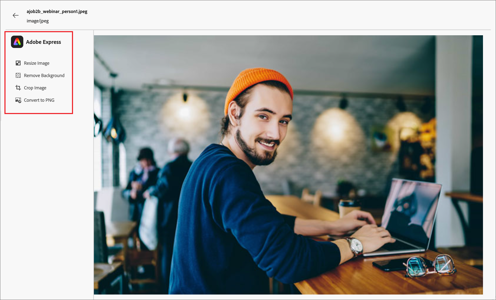

# Adobe Express を使用した画像の編集 {#edit-images-adobe-express}

>[!CONTEXTUALHELP]
>id="ajo-b2b_assets_edit_adobe_express"
>title="Adobe Express での画像の編集"
>abstract="Adobe Express を活用した簡単で直感的な画像編集ツールは、Adobe Journey Optimizer B2B エディション内で直接使用できるので、コンテンツの速度が向上します。"

Adobe Journey Optimizer B2B editionは、Adobe Expressとネイティブに統合されており、一連のAdobe Express画像編集ツールにアクセスできます。 これらのツールを使用すると、接続されたMarketo Engage アセットリポジトリのJourney Optimizer B2B edition Workspace に保存された画像を変更できます。 この統合には、次のような主なメリットがあります。

* Journey Optimizer B2B editionで新しい画像アセットを編集および保存することで、コンテンツの再利用が促進されました。

* 画像アセットの更新や、既存の画像アセットの新しいバージョンの作成にかかる時間と労力を削減します。

>[!NOTE]
>
>Adobe Express編集機能の使用権限は、すべてのJourney Optimizer B2B edition サブスクリプションに含まれています。

Adobe Express関数は、PNG およびJPEGの画像ファイル形式をサポートします。

_画像を変更するには：_

1. 左側のナビゲーションに移動し、**[!UICONTROL コンテンツ管理]**/**[!UICONTROL Assets]** をクリックします。

このアクションを実行すると、すべてのアセットが一覧表示されるリストページが開きます。 _[!UICONTROL Journey Optimizer B2B edition]_ ワークスペースはデフォルトで選択されています。

1. 変更する画像またはオリジナルとして使用する画像を見つけて、新しいアセットを作成します。

   * アセットをワークスペースとフォルダー別に表示するには、左上の _フォルダーを表示_ アイコンをクリックして構造を開きます。

   * 任意の列でテーブルを並べ替えるには、列タイトルをクリックします。 タイトル行の矢印は、現在の並べ替え列と並べ替え順序を示します。

   * 選択したワークスペースまたはフォルダー内で画像アセットを検索するには、検索バーにテキスト文字列を入力します。

   {width="800" zoomable="yes"}

1. 画像アセットの名前をクリックして開き、その詳細を表示します。

   >[!TIP]
   >
   >画像ファイルの編集に進む前に、画像の詳細で [ 「_[!UICONTROL 使用者]_ タブ ](./marketo-engage-design-studio.md#view-asset-used-by-references) を選択し、画像が現在使用されているコンテンツを確認することをお勧めします。

1. 右側の画像 _[!UICONTROL 詳細]_ で、**[!UICONTROL Adobe Expressで編集]** をクリックします。

   {width="600" zoomable="yes"}

   画像が使用中の場合は、加えた変更がそのコンテンツに影響を与えることを知らせる警告ダイアログが表示されます。 **[!UICONTROL 続行]** をクリックして、Adobe Express エディターに進みます。

   {width="300"}

## Adobe Express Enterprise ライセンス

Adobe Expressの Enterprise ライセンスをお持ちの場合は、Express Editor にアクセスして使用できます。 これらの編集機能には、カラー、明るさ、シャープネス、コントラスト、切り抜きなどの画像の調整操作が含まれます。 また、背景の削除、オブジェクトの挿入と削除、画像の一部の消去などの _AI マジック_ 操作も含まれます。

>[!NOTE]
>
>Journey Optimizer B2B editionのこれらの完全な編集機能にアクセスするには、同じ IMS 組織の下でAdobe Express Enterprise ライセンスを購入する必要があります。 IMS 組織の個々のメンバーには、Adobe Express インスタンスで割り当てられたライセンスが必要です。 それ以外の場合、Adobe Expressへのアクセスは、Journey Optimizer B2B editionからの [Adobe Expressに対するクイックアクション ](#quick-actions-in-adobe-express) に制限されます。

{width="600" zoomable="yes"}

使用可能な編集機能の詳細については、[Adobe Express ユーザーガイド ](https://helpx.adobe.com/jp/express/user-guide.html){target="_blank"} を参照してください。

## Adobe Expressのクイックアクション

Adobe Express Enterprise ライセンスがない場合は、Adobe Express クイックアクションエディターにアクセスできます。

1. Adobe Express クイックアクションエディターで、画像編集機能のいずれかを選択して画像を変更します。

   * [**[!UICONTROL  画像のサイズ変更 ]**](#resize-image)
   * [**[!UICONTROL  背景を削除 ]**](#remove-background)
   * [**[!UICONTROL  画像を切り抜く ]**](#crop-image)
   * [**[!UICONTROL PNG に変換 ]**](#convert-file-format) （JPEG画像が読み込まれた場合）
   * [**[!UICONTROL JPEGに変換 ]**](#convert-file-format) （PNG 画像が読み込まれた場合）

   {width="600" zoomable="yes"}

1. Adobe Expressのメインのクイックアクションエディターに戻ったら、「**[!UICONTROL 保存]**」をクリックして、変更した画像ファイルを同じファイル名でJourney Optimizer B2B edition アセットワークスペースに保存します。

## 画像のサイズ変更

1. サイズ変更設定を使用して画像を縮小または拡大します。

   * 「**[!UICONTROL 縦横比]**」オプションを選択します。 デジタルコンテンツには標準サイズを使用し、必要に応じて **[!UICONTROL 幅]** と **[!UICONTROL 高さ]** の値を入力する場合は「**[!UICONTROL カスタム]**」を選択します。

   * 表示される _[!UICONTROL 元のサイズ]_ および _[!UICONTROL 圧縮サイズ]_ には、変更を適用した場合に生じるサイズの変更が表示されます。 **[!UICONTROL ズームと切り抜き]** ツールを使用すると、表示された画像の一部をより詳細に検査できます。

   * 画像を元の状態に戻すには、「**[!UICONTROL リセット]**」をクリックします。

   {width="600" zoomable="yes"}

1. 結果に満足したら、「**[!UICONTROL 適用]**」をクリックします。

## 背景を削除

{width="600" zoomable="yes"}

Adobe Expressは、バックグラウンドの自動削除を実行して、イメージ内のプライマリオブジェクトを分離します。 結果に満足したら、「**[!UICONTROL 適用]**」をクリックします。

## 画像を切り抜く

1. 画像の隅にあるハンドルをドラッグして、画像アセットに含めない外側の領域を削除します。

   {width="600" zoomable="yes"}

1. 結果に満足したら、「**[!UICONTROL 適用]**」をクリックします。

## ファイル形式を変換

* **[!UICONTROL JPEGに変換]** - PNG 画像の場合、画像をJPEG画像ファイルに変換し、ワークスペースに新しいアセットとして保存できます。
* **[!UICONTROL PNG に変換]** - JPEG画像の場合、画像を PNG 画像ファイルに変換し、ワークスペースに新しいアセットとして保存できます。

{width="600" zoomable="yes"}

1. 「**[!UICONTROL 適用]**」をクリックします。
