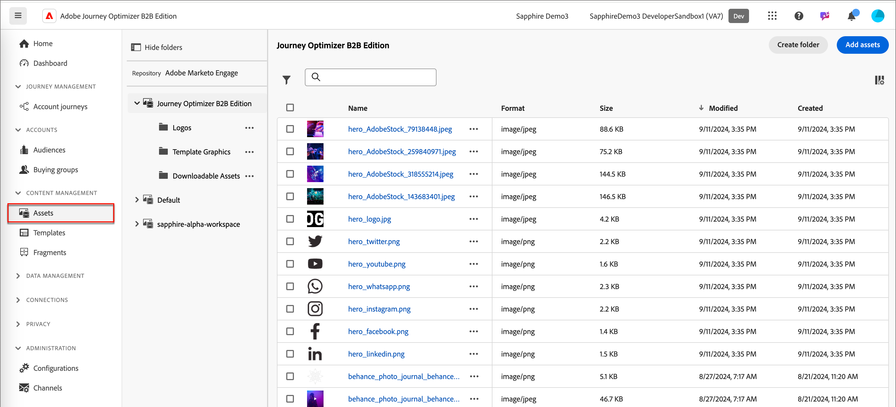
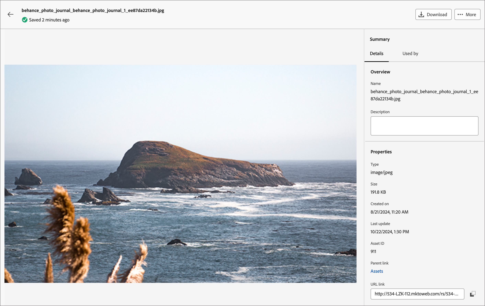
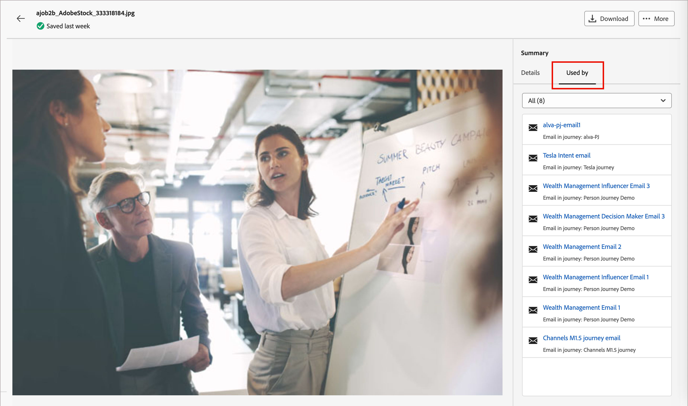
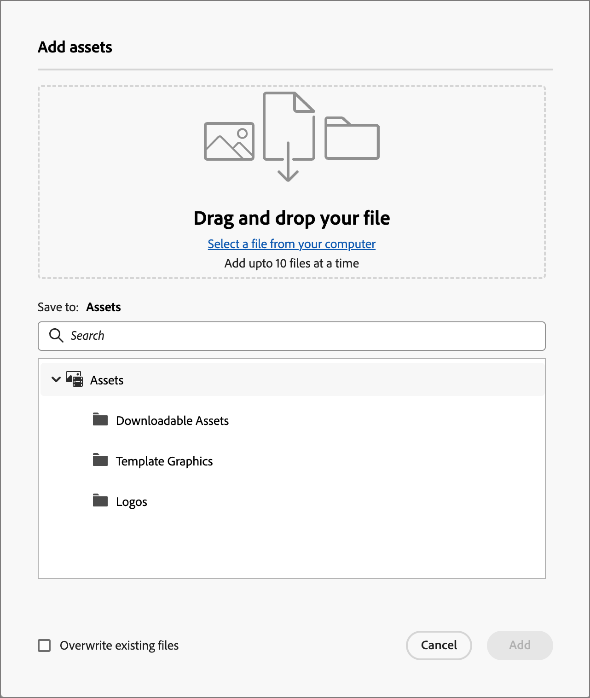
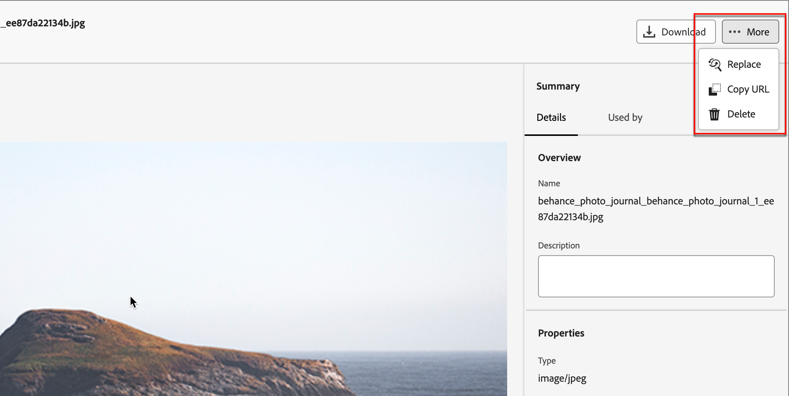
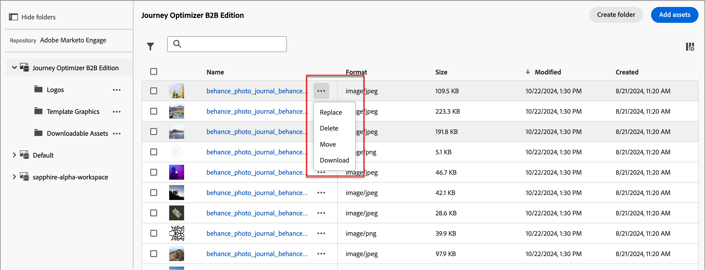
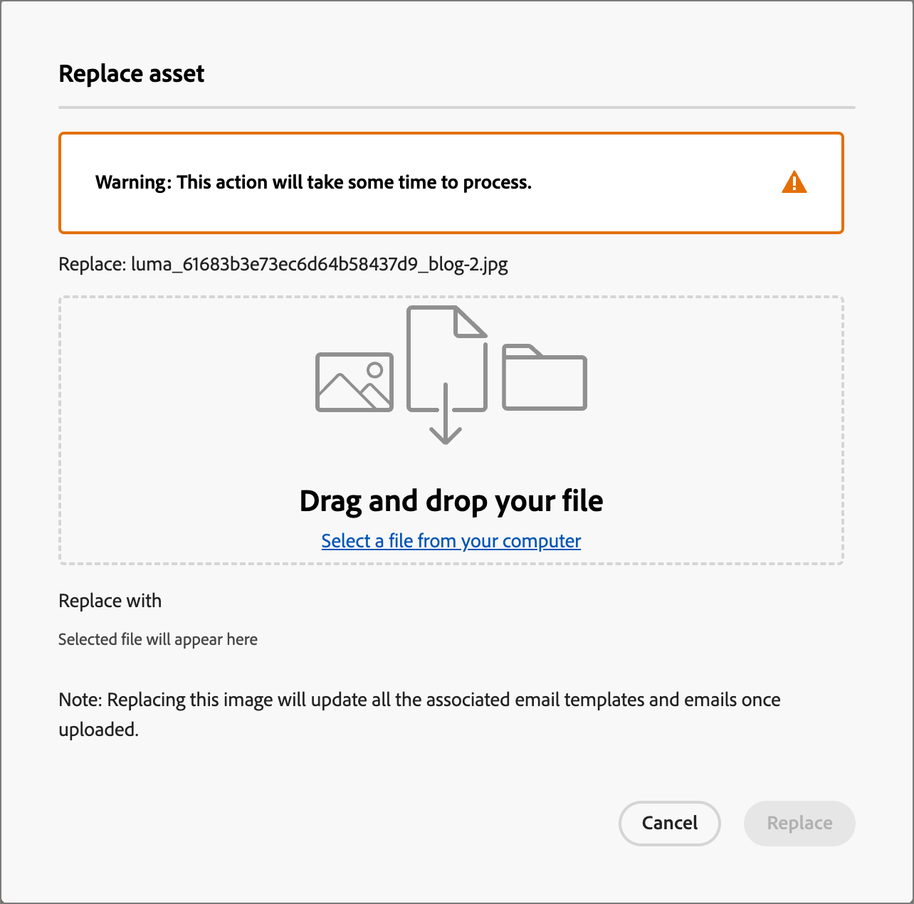
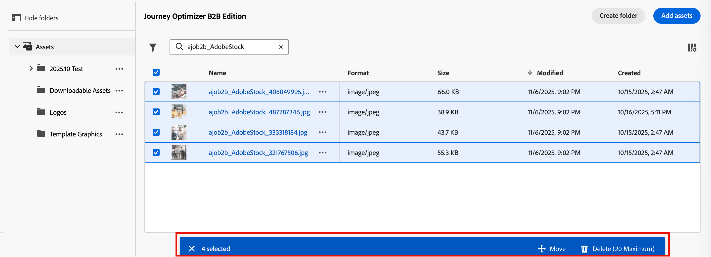
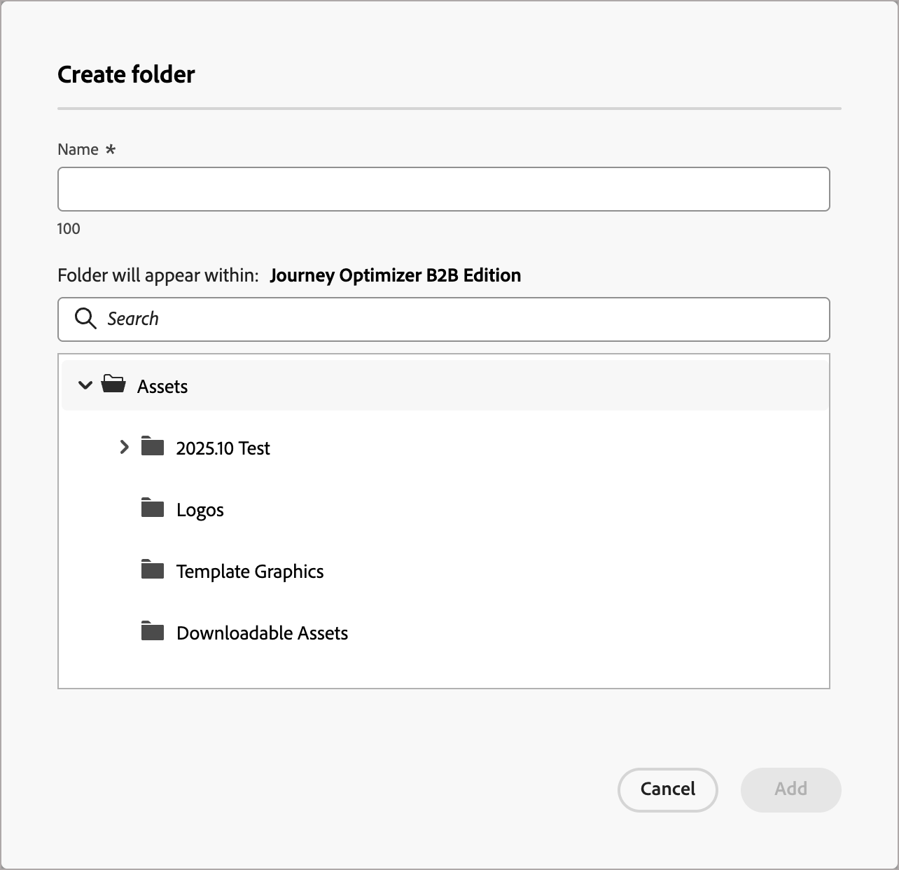
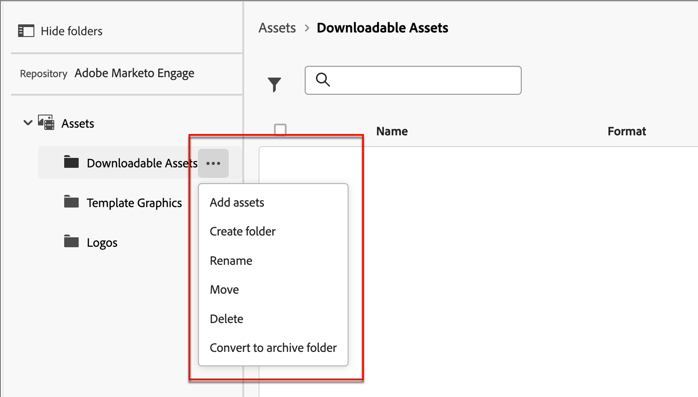

# 内部画像アセットの操作

デフォルトの画像アセットソースは内部画像アセットリポジトリであり、利用可能なアセットを簡単に管理および使用して、アカウントジャーニーをサポートするコンテンツをデザインできます。

Journey Optimizer B2B editionには、あらゆるアセット管理機能が揃っています。 これらの関数には、次のものが含まれます。

* [置換](#replace-assets)
* [削除](#delete-assets)
* [移動](#create-a-folder)
* [Adobe Expressを使用した編集](./image-edit-adobe-express.md)

## アセットの参照とアクセス

Journey Optimizer B2B editionの内部アセットにアクセスするには、左側のナビゲーションに移動し、**[!UICONTROL Content Management]**/**[!UICONTROL Assets]**&#x200B;をクリックします。 このアクションを実行すると、すべてのアセットが一覧表示されたリストページが開きます。

{width="800" zoomable="yes"}

* フォルダー別にアセットを表示するには、左上の&#x200B;_フォルダーを表示_ アイコンをクリックして構造を開きます。

* 任意の列で表を並べ替えるには、列タイトルをクリックします。 タイトル行の矢印は、現在の並べ替え列と順序を示します。

* 選択したフォルダー内の画像アセットを検索するには、検索バーにテキスト文字列を入力します。

* テーブルに表示される列をカスタマイズするには、右上の「_テーブルをカスタマイズ_」アイコン（）をクリックします。

  リストに表示する列を選択し、**[!UICONTROL 適用]**&#x200B;をクリックします。

## アセットの詳細を表示

任意のアセットの名前をクリックして、アセットの詳細ページを開きます。

{width="700" zoomable="yes"}

## 使用済みアセットの参照を表示

アセットの詳細ページで「**[!UICONTROL 使用者]**」タブをクリックして、電子メール、メールテンプレート、フラグメントをまたいで、Journey Optimizer B2B edition内でアセットが現在使用されている場所の詳細を表示します。

>[!IMPORTANT]
>
>電子メール、電子メールテンプレート、またはフラグメント **のいずれかで現在&#x200B;_IN USE_のアセットを削除することはできません**。

パネルには、カテゴリ別の参照が表示されます。_電子メール_、_電子メールテンプレート_、または&#x200B;_フラグメント_。 Journey Optimizer B2B editionの電子メールは、ジャーニー内に埋め込まれて作成されるため、アセットを使用する電子メールの親ジャーニーが参照として表示されます。

リンクをクリックすると、アセットが使用されている対応する電子メール、メールテンプレート、またはフラグメントに移動します。

{width="700" zoomable="yes"}

## アセットの追加

_Assets_ リストページから、Journey Optimizer B2B edition アセットリポジトリに画像アセットを追加できます。

1. 右上の「**[!UICONTROL Assetsを追加]**」をクリックします。

1. _[!UICONTROL アセットを追加]_ ダイアログで、システムから1つ以上のファイルをファイル ボックスにドラッグ&amp;ドロップします。

   {width="500"}

   「_[!UICONTROL コンピューターからファイルを選択]_」リンクをクリックして、ローカルファイルシステムを使用してファイルを検索および選択することもできます。

   一度に最大10個のファイルをローカルシステムからアップロードできます。 最大ファイルサイズは100 MBです。

   選択した画像のファイル名がダイアログに表示されます。 アセットファイル名は（フォルダー間で）一意である必要があり、名前のファイルが既に存在する場合は、メッセージが表示されます。 名前の最大文字数は100文字です。特殊文字（`;`、`:`、`\`、`|`など）を含めることはできません。

1. アセットを保存する保存先フォルダーを選択します。

1. 既存のファイル名で1つ以上のファイルをアップロードするときにファイルを上書き（置換）するには、「**[!UICONTROL 既存のファイルを上書き]**」チェックボックスを選択します。

1. 「**[!UICONTROL 追加]**」をクリックします。

## アセットの削除

メール、メールテンプレート、フラグメントのいずれかで現在使用されているアセットは削除できません。 アセットの削除を開始する前に、使用済みの参照を確認してください。 また、削除アクションは元に戻すことができないので、削除アクションを開始する前に確認してください。

アセットを削除するには、次のいずれかの方法を使用します。

* アセットの詳細に移動し、**[!UICONTROL をクリックします…右上に]**&#x200B;個を追加し、オプションから&#x200B;**[!UICONTROL 削除]**&#x200B;を選択します。

  アセットの{width="450" zoomable="yes"}

* _[!UICONTROL Assets]_ リストページで、_詳細_ アイコン （**[!UICONTROL ...]**）をクリックします アセットアイテムの横にあるオプションから&#x200B;**[!UICONTROL 削除]**&#x200B;を選択します。

  アセットの{width="600" zoomable="yes"}

このアクションを実行すると、確認ダイアログが開きます。 「**[!UICONTROL キャンセル]**」をクリックするか、「**[!UICONTROL 削除]**」をクリックして削除を確認することで、プロセスを中止できます。

アセットが現在使用中の場合、アクションは情報ダイアログを開き、削除できないことを警告します。 削除を中止する&#x200B;**[!UICONTROL OK]**&#x200B;をクリックします。

## アセットの置き換え

次のいずれかの方法を使用して、_[!UICONTROL Journey Optimizer B2B edition]_ アセットリポジトリにあるアセットを置き換えます。

* アセットの詳細に移動し、**[!UICONTROL をクリックします…右上に]**&#x200B;個を追加し、オプションから&#x200B;**[!UICONTROL 置換]**&#x200B;を選択します。

* _[!UICONTROL Assets]_ リストページで、_詳細_ アイコン （**[!UICONTROL ...]**）をクリックします アセットアイテムの横にあるオプションから「**[!UICONTROL 置換]**」を選択します。

_[!UICONTROL アセットの置換]_ ダイアログで、置換ファイルをシステムからファイルボックスにドラッグ&amp;ドロップします。 「_[!UICONTROL コンピューターからファイルを選択]_」リンクをクリックして、ローカルファイルシステムを使用してファイルを選択することもできます。 （ローカルシステムで複数のファイルを選択した場合、最初に選択したファイルが置換に使用されます）。

{width="500"}

続行するには、**[!UICONTROL 置換]**&#x200B;をクリックします。 **[!UICONTROL キャンセル]**&#x200B;をクリックすると、プロセスを中止できます。

置き換えるファイルが使用中の場合、新しい画像ファイルが使用されている画像（メール、メールテンプレート、フラグメント）に置き換わることを警告するダイアログが表示されます。

## アセットのダウンロード

次のいずれかの方法でアセットをダウンロードできます。

* アセットの詳細に移動し、右上の「**[!UICONTROL ダウンロード]**」をクリックします。

* _[!UICONTROL Assets]_ リストページで、_省略記号_ （**[!UICONTROL ...]**）をクリックします アセットアイテムの横にあるオプションから「**[!UICONTROL ダウンロード]**」を選択します。

確認ダイアログで、**[!UICONTROL ダウンロード]**&#x200B;をクリックして、アセットのローカルシステムへのダウンロードを開始します。 **[!UICONTROL キャンセル]**&#x200B;をクリックすると、プロセスを中止できます。

## 選択したアセットに一括アクションを適用

リスト ページ（_[!UICONTROL Content Management]_ > _[!UICONTROL Assets]_）から、左側の各チェックボックスを選択して、一度に複数のアセットを選択します。 複数のアセットを選択すると、下部にメッセージバナーが表示されます。

{width="700" zoomable="yes"}

_[!UICONTROL Journey Optimizer B2B edition]_ アセットリポジトリにある選択したアセットに対して、次の一括アクションを実行できます。

+++アセットの移動

1. 選択バナーで、**[!UICONTROL 移動]**&#x200B;をクリックします。

   この操作を行うと、_[!UICONTROL Assets]_&#x200B;を移動ダイアログが開き、選択したアセットの名前が一覧表示されます。このダイアログでは、これらのアセットを移動する&#x200B;_target_ フォルダーを選択できます。

1. フォルダーを選択します。

   _[!UICONTROL 選択したアセットの横のパス：]_&#x200B;に変更が反映されます。

1. 「**[!UICONTROL 移動]**」をクリックします。

+++

+++アセットの削除

>[!NOTE]
>
>選択したアセットは最大20個まで一括削除できます。

1. 選択バナーで、**[!UICONTROL 削除]**&#x200B;をクリックします。

1. 確認ダイアログで、「**[!UICONTROL 削除]**」をクリックします。

   選択したアセットのいずれかが現在使用中の場合、そのアセットの削除は中止され、アラートメッセージが表示されます。

+++

## フォルダーを作成

1. _[!UICONTROL Assets]_&#x200B;のリスト ページで、右上の&#x200B;**[!UICONTROL フォルダーを作成]**&#x200B;をクリックします。

1. ダイアログで、フォルダー名を入力し、新しいフォルダーの宛先（親）フォルダーを選択します。

   フォルダー名は、最大100文字で一意である必要があり、`;`、`:`、`\`、`|`などの特殊文字を含めることはできません。

   {width="500"}

1. 「**[!UICONTROL 追加]**」をクリックします。

## フォルダーレベルのアクションの適用

アクションは、フォルダーまたはフォルダー内のアセットに適用できます。 _詳細_ アイコン （**...**）をクリックします フォルダーの横に、そのフォルダーに適用できるアクションが表示されます。

{width="700" zoomable="yes"}

フォルダーレベルでは、次のアクションを実行できます。

+++アセットの追加

1. **[!UICONTROL アセットを追加]**&#x200B;を選択して、画像ファイルをフォルダーにアップロードします。

1. _[!UICONTROL アセットを追加]_ ダイアログで、システムからファイルをドラッグ&amp;ドロップします。 リンクをクリックして、ファイルシステムを使用してファイルを選択することもできます。

   一度に最大10個のファイルをローカルシステムから追加できます。 既存のファイル名で1つ以上のファイルをアップロードする場合は、ファイルを上書きするオプションがあります。

   選択した画像のファイル名がダイアログに表示されます。 アセットファイル名は（フォルダー間で）一意である必要があり、名前のファイルが既に存在する場合は、エラーメッセージが表示されます。 名前の最大文字数は100文字です。特殊文字（`;`、`:`、`\`、`|`など）を含めることはできません。

1. 「**[!UICONTROL 追加]**」をクリックします。

+++

+++サブフォルダーの作成

1. **[!UICONTROL フォルダーを作成]**&#x200B;を選択します。

1. ダイアログで、フォルダー名を入力します。

   フォルダー名は、最大100文字で一意である必要があり、`;`、`:`、`\`、`|`などの特殊文字を含めることはできません。

1. 「**[!UICONTROL 追加]**」をクリックします。

+++

+++フォルダーの名前を変更

1. **[!UICONTROL 名前変更]**&#x200B;を選択します。

1. ダイアログで、新しいフォルダー名を入力します。

   フォルダー名は、最大100文字で一意である必要があり、`;`、`:`、`\`、`|`などの特殊文字を含めることはできません。

1. 「**[!UICONTROL 保存]**」をクリックします。

+++

+++フォルダーを移動

1. フォルダーを別の親フォルダーに移動するには、**[!UICONTROL 移動]**&#x200B;を選択します。

1. ダイアログで、サブフォルダーの新しい親としてターゲットフォルダーを選択します。

1. 「**[!UICONTROL 移動]**」をクリックします。

   フォルダーを（選択したフォルダーの構造内の）独自のサブフォルダーのいずれかに移動しようとすると、エラーメッセージが表示され、移動はキャンセルされます。

+++

+++フォルダーを削除

1. **[!UICONTROL 削除]**&#x200B;を選択します。

1. 確認ダイアログで、「**[!UICONTROL 削除]**」をクリックします。

フォルダー内のいずれかのアセットが現在使用中の場合、アクションは警告ダイアログを開き、削除できないことを通知します。 削除を中止する&#x200B;**[!UICONTROL OK]**&#x200B;をクリックします。

+++

+++アーカイブフォルダーに変換

フォルダーをアーカイブすると、そのフォルダー内のファイルが検索できなくなります。 古いイベントプロモーションバッジや季節的なコンテンツなど、チームメンバーが今後使用したくないアセットファイルのアーカイブ機能を使用します。 後で、コンテンツを再び利用できるようにするには、フォルダーのアーカイブを解除します。

* **[!UICONTROL アーカイブフォルダーに変換]**&#x200B;を選択します。 確認バナーが表示され、フォルダーのステータスが「アーカイブ済み」に変更されたことを確認します。

* **[!UICONTROL アーカイブ解除フォルダー]**&#x200B;を選択します。 フォルダーのステータスがアーカイブ解除に変更されたことを確認する確認バナーが表示されます。

+++

## コンテンツでアセットを使用すると

Assetsは、ビジュアルコンテンツエディターから、チームのメール、メールテンプレート、ビジュアルフラグメントのオーサリングで使用できます。

ビジュアルデザインスペースから、左側のサイドバーにある&#x200B;_Assets_ アイコン（）を選択します。

このアクションは、使用可能なアセットのリストを表示するツールパネルを変更します。 ビジュアルキャンバスに画像アセットを追加するには、複数の方法があります。

* 左側のナビゲーションから画像のサムネールをドラッグ&amp;ドロップします。

* 画像コンポーネントをキャンバスに追加し、コンポーネントの&#x200B;**[!UICONTROL アセットを選択]**&#x200B;をクリックして、_[!UICONTROL アセットを選択]_ ダイアログを開きます。

  {width="700" zoomable="yes"}

  ダイアログから、選択したリポジトリから画像を選択できます。 「**[!UICONTROL 選択]**」をクリックして、アセットを追加します。

  必要なアセットを見つけるのに役立つツールがあります。

   * 左上の&#x200B;_フィルター_ アイコンをクリックして、条件に従って表示される項目をフィルタリングします。

   * 「_検索_」フィールドにテキストを入力して、アセット名に一致する表示アイテムをフィルタリングします。

  {width="700" zoomable="yes"}
