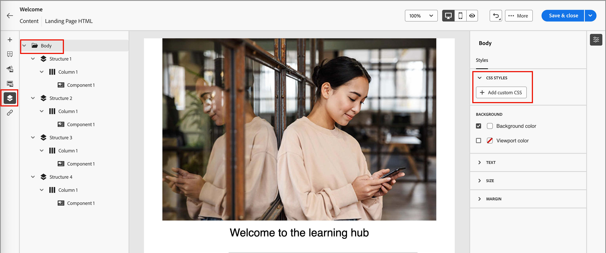
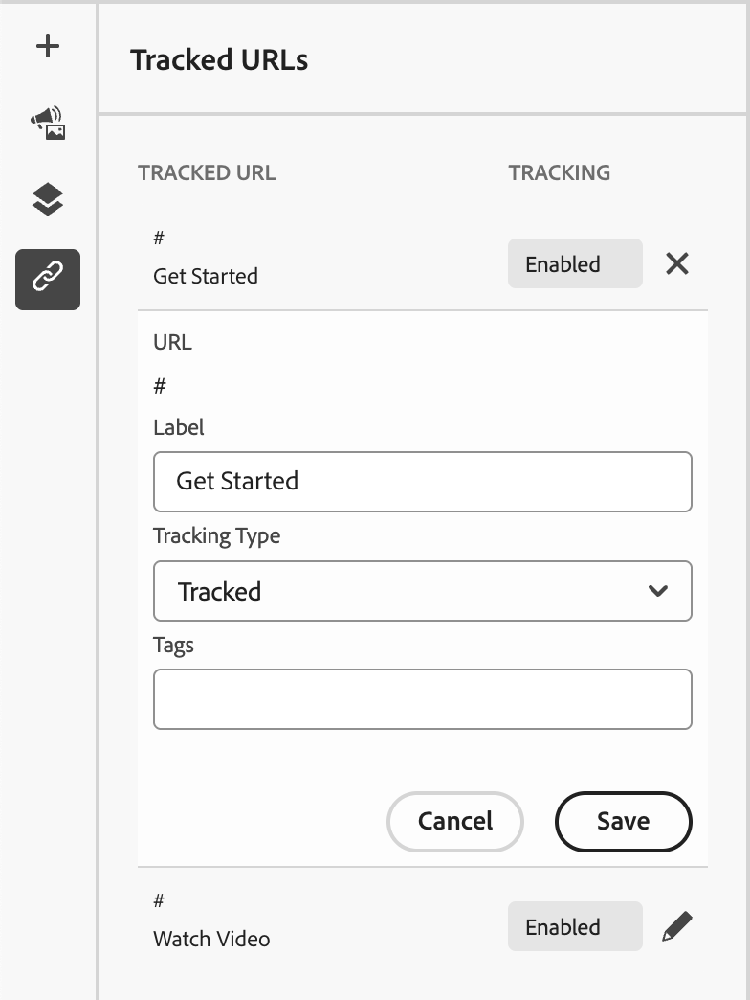
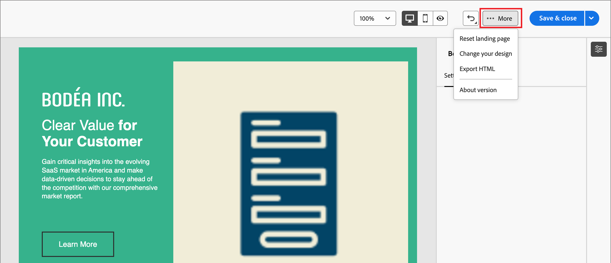

# ランディングページのデザイン

[&#x200B; ランディングページを作成した後](./landing-pages-create-publish.md#create-landing-page)、ビジュアルデザインスペースを使用して、ページ内の構造コンポーネントとコンテンツコンポーネントをオーサリングします。

## 構造とコンテンツの追加 {#structure-content-landing-page}

{{$include /help/_includes/content-design-components.md}}

### カスタム CSS を追加

ランディングページのデザインスペース内で、独自のカスタム CSSを直接追加できます。 カスタム CSSを使用して、高度で特定のスタイルを適用し、コンテンツの外観をより柔軟に制御できます。 画像、ボタン、テキストなどのコンポーネントを含める前に、この最高レベルのスタイル設定を追加することをお勧めします。

キャンバス内に少なくとも1つのコンテンツコンポーネントがある場合は、左側のナビゲーションツリーで&#x200B;**[!UICONTROL Body]** コンポーネントを選択して、カスタム CSS エディターにアクセスします。

{width="800" zoomable="yes"}

{{$include /help/_includes/content-design-custom-css.md}}

### アセットの追加

{{$include /help/_includes/content-design-assets.md}}

### フォームを追加

{{$include /help/_includes/content-design-add-forms.md}}

### レイヤー、設定、スタイルの移動

{{$include /help/_includes/content-design-navigation.md}}

### コンテンツのパーソナライズ

{{$include /help/_includes/content-design-personalization.md}}

### リンクされたURL トラッキングを編集

{{$include /help/_includes/content-design-links.md}}

{width="400"}

**[!UICONTROL トラッキングタイプ]**&#x200B;を使用して、リンクのトラッキングを制御します。

* **[!UICONTROL トラッキング済み]** - リンク URLでトラッキングをアクティブ化します。
<!-- 
* External Opt-out - Considers the link URL as an opt-out or unsubscription URL.

* Mirror page - Considers the link URL as a mirror page URL.
-->
* **[!UICONTROL なし]** - リンク URLのトラッキングをアクティブ化しません。

### 作品を保存

いつでも&#x200B;**[!UICONTROL 保存]**&#x200B;をクリックして、ドラフト ランディングページを保存します。

引き続きドラフトページを編集できます。 ページを表示し、電子メールまたはSMS メッセージでリンクできるようにする準備ができたら、ページを公開できます。

### 表示オプション

ビジュアルデザイン分野で利用可能な表示およびコンテンツ検証オプションを活用します。

* プリセットのズームオプション全体でコンテンツをズームイン/ズームアウトします。

* デスクトップ、モバイル、またはテキストのみ/プレーンテキストのコンテンツ表示を切り替えます。
  * デバイス間でコンテンツをプレビューするには、_表示_ アイコンをクリックします。
  * すぐに使えるデバイスのいずれかを選択するか、カスタムディメンションを入力してコンテンツをプレビューします。

### 詳細オプション

ビジュアルデザインスペースの上部にある「_[!UICONTROL その他…]_」メニューから、次の操作を実行できます。

{width="500"}

* **[!UICONTROL ランディングページをリセット]** – このオプションをクリックすると、ビジュアルデザインキャンバスが空白のスレートに消去され、ページコンテンツの作成が再開されます。
* **[!UICONTROL デザインを変更]** - _[!UICONTROL メインのランディングページの作成]_&#x200B;のホームページに戻ります。 そこから、別のテンプレートを選択してデザインプロセスを再開するか、空白のキャンバスでページをゼロからデザインするかを選択できます。
<!-- * **[!UICONTROL Save as content template]** - Save the page body as a landing page template to be reused across multiple landing pages. You provide a name and description for the template and save it to the list of saved  landing page templates. -->
* **[!UICONTROL HTMLを書き出し]** - ビジュアルキャンバスのコンテンツを、zip ファイルとしてパッケージ化されたHTML形式でローカルシステムにダウンロードします。
