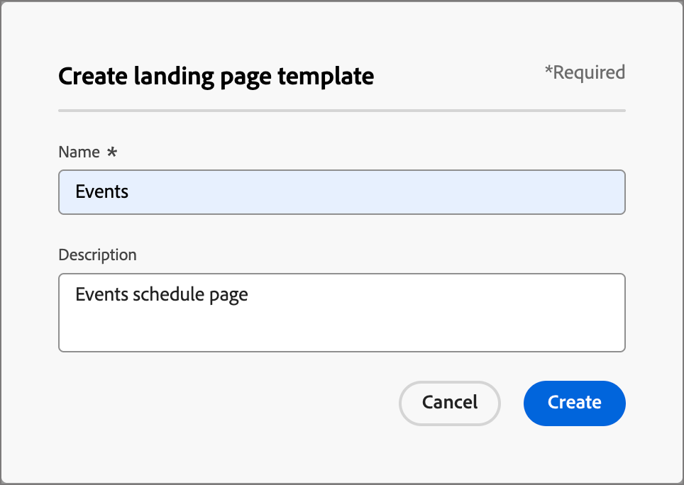

# ランディングページテンプレート

デザインプロセスを高速化および改善するには、スタンドアロンのランディングページテンプレートを作成して、ページのデザインとコンテンツを標準化します。 マーケターは、ページを再利用し、キャンペーンやジャーニーでの使用に合わせて適応させることができます。

## ランディングページテンプレートへのアクセスと管理

Adobe Journey Optimizer B2B Editionのランディングページテンプレートにアクセスするには、**[!UICONTROL Content Management]** > **[!UICONTROL Templates]**&#x200B;に移動します。 ナビゲーションパネルの&#x200B;_[!UICONTROL WEB]_&#x200B;で、**[!UICONTROL ランディングページテンプレート]**&#x200B;を選択します。

表示されるリストページには、表形式でリストされたインスタンスで作成されたすべてのランディングページテンプレートが含まれます。 テーブルは、デフォルトで&#x200B;_[!UICONTROL Modified]_&#x200B;列でソートされ、最も新しく更新されたテンプレートが上部に表示されます。 列のタイトルをクリックして、昇順と降順を変更します。

テンプレートを名前で検索するには、検索バーにテキスト文字列を入力します。

{width="700" zoomable="yes"}する

左上の&#x200B;_フィルター_ アイコン（）をクリックして、作成または変更した日付、およびテンプレートに従ってリストをフィルタリングします。

右上の&#x200B;_テーブルをカスタマイズ_ アイコン （）をクリックして、テーブルに表示する列をカスタマイズします。 表示する列を選択し、**[!UICONTROL 適用]**&#x200B;をクリックします。

表示されたテンプレートのリストから、次の節で説明するアクションを実行できます。

## ランディングページテンプレートの作成

ランディングページテンプレートのリストページから、右上の「**[!UICONTROL テンプレートを作成]**」をクリックしてランディングページテンプレートを作成できます。

1. ダイアログで、一意の&#x200B;**[!UICONTROL 名前]** （必須）と便利な&#x200B;**[!UICONTROL 説明]** （オプション）を入力します。

   {width="400"}

1. 「**[!UICONTROL 作成]**」をクリックします。

_[!UICONTROL プライマリランディングページを作成]_ ページが開き、テンプレートを作成するためのオプションが表示されます：_[!UICONTROL ゼロからデザイン]_、_[!UICONTROL HTMLをインポート]_、または&#x200B;_[!UICONTROL 保存されたテンプレート]_&#x200B;のいずれかを選択します。

{width="800" zoomable="yes"}

テンプレートデザインを開始するために使用する方法を選択したら、ビジュアルデザインスペースを使用して[&#x200B; ランディングページテンプレートコンテンツをデザイン &#x200B;](./landing-page-design.md)します。

### ゼロからデザイン

ビジュアルデザインスペースを使用して、ランディングページコンテンツの構造を定義します。 シンプルなドラッグ&amp;ドロップ操作で構造コンポーネントを追加、移動することで、再利用可能なページコンテンツの形状を数秒でデザインできます。

>[!NOTE]
>
>使用可能なデザインツールは、ランディングページデザインに使用するツールと同等です。 ただし、このコンテンツは、複数のランディングページをまたいで再利用できるテンプレートとして保存されます。

1. _[!UICONTROL テンプレートのデザイン]_ ホームページから、**[!UICONTROL 最初からデザイン]** オプションを選択します。

1. [構造とコンテンツ &#x200B;](./landing-page-design.md#add-structure-and-content)をテンプレートに追加します。

### HTML の読み込み

Adobe Journey Optimizer B2B Editionでは、既存のHTML コンテンツを読み込んで、ランディングページテンプレートをデザインできます。

{{$include /help/_includes/content-design-import.md}}

{width="500"}

>[!NOTE]
>
>`<table>` タグを HTML ファイルの最初のレイヤーとして使用すると、上部レイヤータグの背景や幅の設定などのスタイルが失われる可能性があります。

ビジュアルデザイン機能を利用して、インポートしたコンテンツを必要に応じてパーソナライズできます。

### デザインテンプレートの選択

{{$include /help/_includes/content-design-select-template.md}}

## ページテンプレートの詳細の表示

_ランディングページテンプレート_&#x200B;のリストページで、ランディングページテンプレートの名前をクリックして詳細ページを開きます。 ここから、ランディングページテンプレートの基本的なプロパティを表示したり、ビジュアルデザインスペースにアクセスしてテンプレートコンテンツに変更を加えたりできます。

{width="700" zoomable="yes"}

* 名前や説明など、テンプレートの詳細を表示します。 これらの設定は編集可能です。 説明ボックスの外側をクリックすると、変更が自動的に保存されます。

* 作成者、作成日時、最終更新日時、変更日時などのテンプレートプロパティを表示します。

* 右上の&#x200B;**[!UICONTROL 詳細]**&#x200B;をクリックして、ランディングページテンプレートで&#x200B;_重複_&#x200B;や&#x200B;_削除_&#x200B;などのクイックアクションを実行します。

* アクティブなアラート（ランディングページテンプレートのエラーと警告）がある場合は、右上の「**[!UICONTROL アラート]**」をクリックして情報を表示します。

  これらのアラートは、ランディングページの作成にランディングページテンプレートを使用することを禁止するものではありません。 この情報により、マーケターは、何が機能しないか、配信に使用する前に必要な更新について可視化することができます。

## 使用したテンプレートを表示

テンプレートの詳細ページ内で、「**[!UICONTROL 使用者]**」タブをクリックして、このテンプレートがランディングページで使用されている場所の詳細を表示します。

{width="400"}

* リンクをクリックすると、テンプレートが使用されている対応するランディングページに移動します。

* 戻る矢印をクリックして、いつでもビューを終了し、リストページに戻ります。

## ランディングページテンプレートの編集

このアクションは、次から実行できます。

* 詳細ページ - **[!UICONTROL ランディングページテンプレートを編集]**&#x200B;をクリックします。
* リスト ページ – 省略記号（**...**）をクリックします。 テンプレートの横にある「**[!UICONTROL 編集]**」を選択します。

このアクションを実行すると、_テンプレートのデザイン_ ページまたはビジュアルコンテンツエディターページ（ランディングページテンプレートの最後に保存されたステータスに基づく）に移動します。 ここから、必要に応じてランディングページテンプレートのコンテンツを編集できます。 編集オプションについて詳しくは、[&#x200B; ランディングページテンプレートの作成](#create-a-landing-page-template)を参照してください。

## 重複するランディングページテンプレート

次のいずれかの方法を使用して、ランディングページテンプレートを複製できます。

* 右側のテンプレートの詳細から、**[!UICONTROL 詳細]**&#x200B;を展開し、**[!UICONTROL 複製]**&#x200B;をクリックします。

  {width="400"}

* _[!UICONTROL ランディングページテンプレート]_ リストページで、省略記号（。..）をクリックします。 テンプレートの横にある「**[!UICONTROL 複製]**」を選択します。

ダイアログで、便利な名前（一意）と説明を入力します。 「**[!UICONTROL 複製]**」をクリックして、アクションを完了します。

複製された（新しい）ランディングページテンプレートは、_ランディングページテンプレート_&#x200B;のリストに表示されます。

## ランディングページテンプレートの削除

ランディングページテンプレートの削除は元に戻すことができません。削除アクションを開始する前に確認してください。 ランディングページテンプレートは、次のいずれかの方法を使用して削除できます。

* 右側のテンプレートの詳細から、**[!UICONTROL 詳細]**&#x200B;を展開し、**[!UICONTROL 削除]**&#x200B;をクリックします。
* _ランディングページテンプレート_ リストページで、省略記号（。..）をクリックします。 テンプレートの横にある「**[!UICONTROL 削除]**」を選択します。

  {width="500"}

このアクションを実行すると、確認ダイアログが開きます。 「**[!UICONTROL キャンセル]**」をクリックするか、「**[!UICONTROL 削除]**」をクリックして削除を確認することで、プロセスを中止できます。

## 一括操作

ランディングページテンプレートのリストページで、左側のチェックボックスを選択して、一度に複数のテンプレートを選択します。 複数のテンプレートを選択すると、下部にバナーが表示されます。

{width="600"}がバナーに表示されます

**[!UICONTROL 削除]** – 一度に最大20個のテンプレートを削除できます。 確認ダイアログでは、アクションを中止したり、テンプレートの削除を確認したりできます。

## 保存したテンプレートからランディングページを作成する

_[!UICONTROL ランディングページの作成]_ ページから、_デザインテンプレートの選択_ セクションを使用して、テンプレートからコンテンツの作成を開始します。

作成したランディングページテンプレートのいずれかを使用してコンテンツの作成を開始するには、次の手順に従います。

1. ビジュアルデザインスペースに&#x200B;_コンテンツを編集_ ページからアクセスします。

   _[!UICONTROL ランディングページを作成]_ ページで、_サンプルテンプレート_ タブがデフォルトで選択されています。

1. カスタムランディングページテンプレートを使用するには、「**[!UICONTROL 保存したテンプレート]**」タブを選択します。

   このタブには、サンドボックスで作成されたすべてのランディングページテンプレートのリストが表示されます。 _名前別_、_最終変更日_、_最終作成日_&#x200B;に並べ替えることができます。

1. リストから目的のテンプレートを選択します。

   選択後、テンプレートのプレビューが表示されます。 プレビューモードでは、右向き矢印と左向き矢印を使用して、1つのカテゴリのすべてのテンプレート（選択内容に応じてサンプルまたは保存済み）間を移動できます。

1. 右上の「**[!UICONTROL このテンプレートを使用]**」をクリックします。

1. ビジュアルコンテンツデザインから、必要に応じてコンテンツを編集します。
