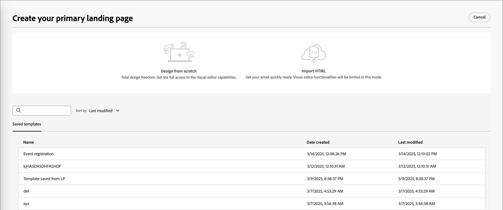

# ランディングページテンプレート

高速で改善されたデザインプロセスを実現するために、スタンドアロンランディングページテンプレートを作成して、ページデザインとコンテンツを標準化できます。 マーケティングストラテジストは、ページを再利用し、キャンペーンやジャーニーでの使用に合わせて調整することができます。

## ランディングページテンプレートへのアクセスと管理

Adobe Journey Optimizer B2B editionでランディングページテンプレートにアクセスするには、**[!UICONTROL コンテンツ管理]**/**[!UICONTROL テンプレート]** に移動します。 ナビゲーションパネルの _[!UICONTROL WEB]_ の下にある **[!UICONTROL ランディングページテンプレート]** を選択します。

表示されるリストページには、インスタンスで作成されたすべてのランディングページテンプレートがテーブル形式で表示されます。 テーブルはデフォルトで _[!UICONTROL 変更済み]_ 列で並べ替えられ、最新の更新されたテンプレートが先頭に表示されます。 列タイトルをクリックして、昇順と降順を切り替えます。

名前でテンプレートを検索するには、検索バーにテキスト文字列を入力します。

{width="700" zoomable="yes"}

左上の _フィルター_ アイコン（）をクリックし、作成日または変更日、および作成または変更したテンプレートに従って、リストをフィルタリングします。

右上の _テーブルをカスタマイズ_ アイコン（）をクリックして、テーブルに表示する列をカスタマイズします。 表示する列を選択し、「**[!UICONTROL 適用]**」をクリックします。

表示されたテンプレートのリストから、次の節で説明するアクションを実行できます。

## ランディングページテンプレートの作成

ランディングページテンプレートは、ランディングページテンプレートリストページから作成できます。それには、右上の **[!UICONTROL テンプレートを作成]** をクリックします。

1. ダイアログで、一意の **[!UICONTROL 名前]** （必須）と便利な **[!UICONTROL 説明]** （オプション）を入力します。

   {width="400"}

1. 「**[!UICONTROL 作成]**」をクリックします。

_[!UICONTROL プライマリランディングページを作成]_ ページが開き、テンプレートを作成するためのオプションが表示されます。_[!UICONTROL ゼロからデザイン]_、_[!UICONTROL HTMLを読み込み]_、または _[!UICONTROL 保存済みのテンプレート]_ のいずれかを選択します。

{width="800" zoomable="yes"}

テンプレートデザインの開始に使用する方法を選択したら、ビジュアルデザインスペースを使用して [ ランディングページテンプレートコンテンツのデザイン ](./landing-page-design.md) を行います。

### ゼロからデザイン

ビジュアルデザインスペースを使用して、ランディングページコンテンツの構造を定義します。 簡単なドラッグ&amp;ドロップ操作で構造コンポーネントを追加して移動することで、再利用可能なページコンテンツの形状を数秒でデザインできます。

>[!NOTE]
>
>使用可能なデザインツールは、ランディングページデザインに使用されるツールと同等です。 違いは、このコンテンツはテンプレートとして保存され、複数のランディングページで再利用できることです。

1. _[!UICONTROL テンプレートをデザイン]_ ホームページで「**[!UICONTROL ゼロからデザイン]**」オプションを選択します。

1. テンプレートに [ 構造とコンテンツを追加 ](./landing-page-design.md#add-structure-and-content) します。

### HTML の読み込み

Adobe Journey Optimizer B2B editionでは、既存のHTML コンテンツを読み込んで、ランディングページテンプレートをデザインできます。

{{$include /help/_includes/content-design-import.md}}

{width="500"}

>[!NOTE]
>
>`<table>` タグを HTML ファイルの最初のレイヤーとして使用すると、上部レイヤータグの背景や幅の設定などのスタイルが失われる可能性があります。

読み込んだコンテンツは、必要に応じてビジュアルデザインスペースでパーソナライズできます。

### デザインテンプレートを選択

{{$include /help/_includes/content-design-select-template.md}}

## ページテンプレートの詳細の表示

_Landinhg ページテンプレート_ リストページで、ランディングページテンプレートの名前をクリックして詳細ページを開きます。 ここから、ランディングページテンプレートの基本プロパティを表示し、ビジュアルデザインスペースにアクセスしてテンプレートコンテンツを変更できます。

{width="700" zoomable="yes"}

* 名前や説明など、テンプレートの詳細を表示します。 これらの設定は編集できます。 説明ボックスの外側をクリックすると、変更が自動的に保存されます。

* 作成者、作成日、最終更新日、変更者などのテンプレートプロパティを表示します。

* 右上の **[!UICONTROL その他]** をクリックすると、ランディングページテンプレートに対してクイックアクション（_複製_ や _削除_ が表示されます。

* アクティブなアラート（ランディングページテンプレートのエラーと警告）がある場合は、右上の **[!UICONTROL アラート]** をクリックして情報を表示します。

  これらのアラートでは、ランディングページの作成にランディングページテンプレートの使用は禁止されません。 この情報は、マーケターに対して、機能しない可能性のある内容や、配信に使用する前に必要な更新に関する表示を提供します。

## 参照別に使用されるテンプレートの表示

テンプレートの詳細ページ内で、「**[!UICONTROL 使用者]**」タブをクリックして、ランディングページ内でこのテンプレートが使用される場所の詳細を表示します。

{width="400"}

* リンクをクリックすると、テンプレートが使用されている、対応するランディングページが表示されます。

* 左向き矢印をクリックしてビューを終了すると、リストページに戻ります。

## ランディングページテンプレートを編集

このアクションは、次の場所から実行できます。

* 詳細ページ – 「**[!UICONTROL ランディングページテンプレートを編集]**」をクリックします。
* リストページ – テンプレートの横にある省略記号（**...**）をクリックし、「**[!UICONTROL 編集]**」を選択します。

このアクションにより、（ランディングページテンプレートの最後に保存されたステータスに基づいて __ テンプレートのデザイン」ページまたはビジュアルコンテンツエディターページが表示されます。 ここから、必要に応じてランディングページテンプレートのコンテンツを編集できます。 編集オプションについて詳しくは、[ ランディングページテンプレートの作成 ](#create-a-landing-page-template) を参照してください。

## ランディングページテンプレートを複製

次のいずれかの方法を使用して、ランディングページテンプレートを複製できます。

* 右側のテンプレートの詳細で、「詳細 **[!UICONTROL を展開し、「**[!UICONTROL  複製 ]**をクリックし]** す。

  {width="400"}

* _[!UICONTROL ランディングページテンプレート]_ リストページで、テンプレートの横の省略記号（...）をクリックし、「**[!UICONTROL 複製]**」を選択します。

ダイアログで、便利な名前（一意の）と説明を入力します。 「**[!UICONTROL 複製]**」をクリックして、アクションを完了します。

複製された（新しい）ランディングページテンプレートが _ランディングページテンプレート_ リストに表示されます。

## ランディングページテンプレートを削除

ランディングページテンプレートの削除は取り消すことができないので、削除アクションを開始する前に確認します。 ランディングページテンプレートは、次のいずれかの方法で削除できます。

* 右側のテンプレートの詳細で、「**[!UICONTROL 詳細]**」を展開し、「**[!UICONTROL 削除]**」をクリックします。
* _ランディングページテンプレート_ リストページで、テンプレートの横の省略記号（...）をクリックし、「**[!UICONTROL 削除]**」を選択します。

  {width="500"}

この操作を実行すると、確認ダイアログが開きます。 このプロセスを中止するには、「**[!UICONTROL キャンセル]**」をクリックします。削除を確定するには、「**[!UICONTROL 削除]**」をクリックします。

## 一括アクションの実行

ランディングページテンプレートのリストページで、左側のチェックボックスをオンにして、一度に複数のテンプレートを選択します。 複数のテンプレートを選択すると、バナーが下部に表示されます。

{width="600"}

**[!UICONTROL 削除]** – 一度に最大 20 個のテンプレートを削除できます。 確認ダイアログでは、アクションを中止したり、テンプレートの削除を確定したりできます。

## 保存済みテンプレートからのランディングページの作成

_ランディングページを作成_ ページから、「_デザインテンプレートを選択_ セクションを使用して、テンプレートからコンテンツの作成を開始します。

ランディングページテンプレートを作成してコンテンツの作成を開始するには、次の手順に従います。

1. _コンテンツを編集_ ページからビジュアルデザインスペースにアクセスします。

   _ランディングページを作成_ ページでは、「_サンプルテンプレート_」タブがデフォルトで選択されています。

1. カスタムランディングページテンプレートを使用するには、「**[!UICONTROL 保存済みのテンプレート]**」タブを選択します。

   このタブには、サンドボックスで作成されたすべてのランディングページテンプレートのリストが表示されます。 _名前別_、_最終変更日_ および _最終作成日_ で並べ替えることができます。

1. リストから目的のテンプレートを選択します。

   選択後、テンプレートのプレビューが表示されます。 プレビューモードでは、左右の矢印を使用して、1 つのカテゴリのすべてのテンプレート（選択に応じて、サンプルまたは保存済みのテンプレート）間を移動できます。

1. 右上で **[!UICONTROL このテンプレートを使用]** をクリックします。

1. 必要に応じて、ビジュアルコンテンツデザイナーからコンテンツを編集します。
