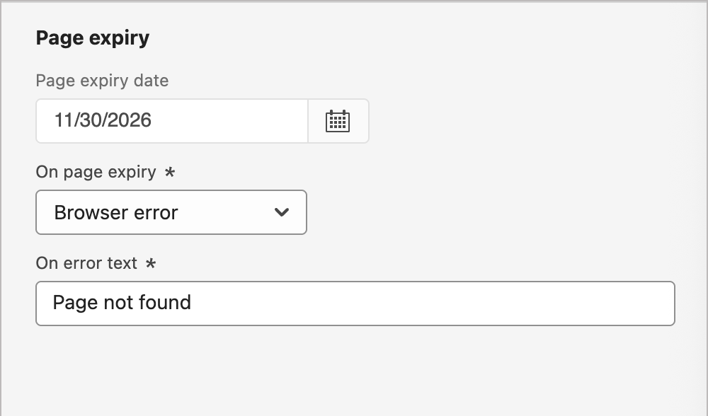
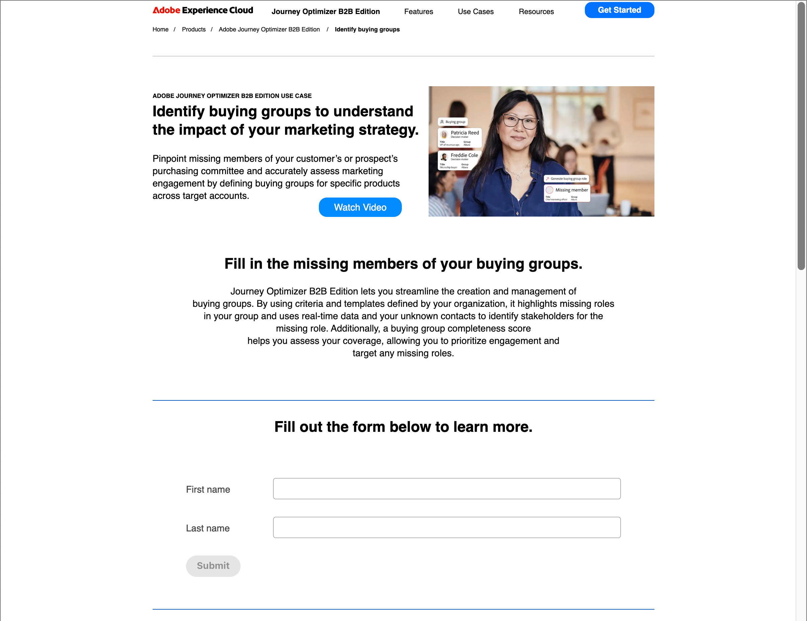

# ランディングページの作成と公開

マーケターは、アカウントおよび個人のジャーニーに組み込むページを定義して公開できます。 新しいランディングページを追加する場合、プライマリページとサブページを設定し、コンテンツをデザインしてテストし、公開します。

>[!BEGINSHADEBOX]

## ランディングページの前提条件 {#landing-page-prerequisites}

マーケターがジャーニーやキャンペーンをサポートするランディングページを作成する前に、次の設定とアセットを実施する必要があります。

* [&#x200B; ランディングページサブドメイン &#x200B;](../admin/configure-channels-landing-pages.md#lp-subdomains) - ランディングページのホスティング専用のサブドメインを設定します。
* [&#x200B; ランディングページプリセット &#x200B;](../admin/configure-channels-landing-pages.md#lp-presets) - プリセットは、ランディングページに適用されるサブドメインおよびその他の設定を定義します。
* [Form](./forms.md) （データキャプチャのユースケースの場合） – ランディングページにフォームを埋め込み、Experience Platformにデータを送信する場合に必要です。
  <!-- * Subscription list (for subscription use cases) - Required if you want customers to subscribe to or unsubscribe from a specific service. This is in AJO B2C-->

>[!ENDSHADEBOX]

## ランディングページの作成 {#create-landing-page}

>[!CONTEXTUALHELP]
>id="ajo-b2b_lp_create"
>title="ランディングページの定義と設定"
>abstract="ランディングページを作成するには、プリセットを選択し、プライマリページとサブページを設定してから、公開する前にページをテストする必要があります。"

1. 左側のナビゲーションに移動し、**[!UICONTROL コンテンツ管理]**/**[!UICONTROL ランディングページ]**&#x200B;を選択します。

1. 右上の「**[!UICONTROL ランディングページを作成]**」をクリックします。

1. ページに、便利な&#x200B;**[!UICONTROL タイトル]** （必須）と&#x200B;**[!UICONTROL 説明]** （オプション）を入力します。

   タイトルと説明基準：

   * タイトル – 最大100文字、一意にする必要があり、大文字と小文字を区別しない

   * 説明 – 最大300文字

   * Alpha、数値、特殊文字は使用できます

   * 予約済みの文字は&#x200B;**_許可されていません_**: `\ / : * ? " < > |`

   {width="600"}

1. **[!UICONTROL プリセット]**&#x200B;を選択します。

   製品管理者[は、ランディングページに使用するサブドメインおよびその他の設定を定義するようにプリセット &#x200B;](../admin/configure-channels-landing-pages.md#lp-presets)を設定します。 プリセットを選択し、**[!UICONTROL プリセットを表示]**&#x200B;をクリックしてプリセットの詳細を開き、設定を確認して、ランディングページの要件に一致していることを確認します。

1. 「**[!UICONTROL 作成]**」をクリックします。

   プライマリページとそのプロパティが表示されます。

   {width="700" zoomable="yes"}

## プライマリページの設定 {#configure-primary-page}

>[!CONTEXTUALHELP]
>id="ajo-b2b_lp_primary_page"
>title="プライマリページ設定の定義"
>abstract="電子メールやweb サイトなどのランディングページのリンクを受信者がクリックするとすぐに表示されるプライマリページを定義します。"

>[!CONTEXTUALHELP]
>id="ajo-b2b_lp_access_settings"
>title="ランディングページ URL の定義"
>abstract="このセクションでは、一意のランディングページ URL を定義します。 URLの最初の部分では、選択したプリセットの一部として、ランディングページサブドメインを以前に設定している必要があります。"

1. ニーズに応じて&#x200B;**[!UICONTROL ページ名]**&#x200B;を変更します。デフォルトでは&#x200B;_プライマリページ_&#x200B;です。

1. ページ URLの終了部分を定義します。

   選択したプリセットによって、URLの最初の部分が決まります。

   >[!CAUTION]
   >
   >ランディングページの URL は一意にする必要があります。
   >
   >公開済みの場合でも、この URL を web ブラウザーにコピー＆ペーストするだけでランディングページにアクセスすることはできません。 プレビュー機能を使用してテストします。

1. 匿名のランディングページが必要な場合は、**[!UICONTROL 特定のユーザーを要求]** オプションを無効にします。

   <!-- The option 'Require identified users' would be visible in both AJO & AJOB2B when the Landing page is of type 'Data capture' -->

1. _カレンダー_ （）アイコンをクリックして、**[!UICONTROL ページの有効期限]**&#x200B;を設定します。

   有効期限を選択したら、ページの有効期限に応じてアクションを選択します。

   * **[!UICONTROL リダイレクト URL]** - リダイレクトとして使用するページのURLを入力します。

     {width="400"}

     <!-- * **[!UICONTROL Custom page]** - Configure a subpage and select it from the list. -->
   * **[!UICONTROL ブラウザーエラー]** - ページの代わりに表示するエラーテキストを入力します。

     {width="400"}

## コンテンツデザインの種類を選択 {#choose-design-type}

ページの&#x200B;_[!UICONTROL Content]_&#x200B;を追加するには、**[!UICONTROL Designerを開く]**&#x200B;をクリックします。 _[!UICONTROL プライマリランディングページを作成]_&#x200B;するホームページが読み込まれ、デザインプロセスは、デザインの開始方法を選択することから始まります。

* [[!UICONTROL &#x200B; ゼロからデザイン &#x200B;]](#design-from-scratch)
* [[!UICONTROL 独自のコードを作成]](#code-your-own)
* [[!UICONTROL HTMLの読み込み]](#import-html)
* [ランディングページテンプレートの使用](#select-template)

{width="800" zoomable="yes"}

ランディングページのデザインを開始するための好みの方法を選択したら、ビジュアルデザインツールを使用して[&#x200B; ページコンテンツを完成させます](./landing-page-design.md)。

### ゼロからデザイン {#design-from-scratch}

ビジュアルコンテンツエディターを使用して、ランディングページコンテンツの構造を定義します。 シンプルなドラッグ&amp;ドロップ操作で構造コンポーネントを追加、移動することで、数秒でページコンテンツの形状をデザインできます。

1. _[!UICONTROL メインのランディングページを作成]_ ホームページから、**[!UICONTROL ゼロからデザイン]** オプションを選択します。

1. ページコンテンツのスタイルを管理する方法を選択します。

   * **[!UICONTROL テーマを使用]** – このオプションを選択すると、_テーマモード_&#x200B;でページコンテンツを作成できます。 このモードでは、定義された[&#x200B; ブランドテーマ &#x200B;](./brand-themes.md)を使用して、コンテンツのオーサリングプロセスを合理化し、デザインが定義された標準に準拠していることを確認できます。

   * **[!UICONTROL 手動スタイル設定]** – このオプションを選択すると、_手動モード_&#x200B;でページコンテンツが作成されます。 このモードでは、空白のカンバスに追加するすべての構造およびコンテンツコンポーネントのスタイル設定を手動で設定します。

1. 「**[!UICONTROL 確認]**」をクリックします。

1. [構造とコンテンツ &#x200B;](./landing-page-design.md#structure-content-landing-page)をページに追加します。

### 独自のコーディング {#code-your-own}

_独自のコードを作成_&#x200B;すると、生のHTMLを書き込んだり貼り付けたりして、デザインスペースで直接ページコンテンツを作成できます。 このモードは、マークアップを完全に制御する必要がある場合に使用します。 このモードを使用するには、HTMLのスキルが必要です。

このモードを選択した後は、コードエディターに留まります。ビジュアルエディターに切り替えることはできません。

1. _[!UICONTROL プライマリランディングページの作成]_ ホームページから、**[!UICONTROL 独自のコード]** オプションを選択します。

1. Raw HTML コードを入力または貼り付けます。

ページコンテンツを消去して新しいデザインから開始する場合は、オプションメニューから「**[!UICONTROL デザインを変更]**」を選択します。

### HTML の読み込み {#import-html}

Adobe Journey Optimizer B2B editionでは、既存のHTML コンテンツを読み込んで、ランディングページをデザインできます。

{{$include /help/_includes/content-design-import.md}}

{width="500"}

>[!NOTE]
>
>`<table>` タグを HTML ファイルの最初のレイヤーとして使用すると、上部レイヤータグの背景や幅の設定などのスタイルが失われる可能性があります。

ビジュアルデザイン機能を利用して、インポートしたコンテンツを必要に応じてパーソナライズできます。

### テンプレートを選択 {#select-template}

[!BADGE Beta]{type=Informative tooltip="Betaの機能"}

ランディングページテンプレートを使用する場合は、次の中から選択できます。

* **サンプルテンプレート**. Journey Optimizer B2B editionのインターフェイスには、ランディングページデザインのベースとして使用できる、すぐに使用できるランディングページテンプレートのコレクションが用意されています。

* **保存済みテンプレート**. _[!UICONTROL テンプレート]_ メニュー<!-- or the _[!UICONTROL Save as content template]_ option when designing a landing page. -->を使用して、組織のメンバーが作成した保存済みのカスタムテンプレートを使用します

「_[!UICONTROL デザインテンプレートを選択]_」セクションを使用して、テンプレートからコンテンツの作成を開始します。 サンプルテンプレートまたはJourney Optimizer B2B edition インスタンスから保存したカスタムランディングページテンプレートを使用できます。

>[!BEGINTABS]

>[!TAB 保存されたテンプレート ]

_プライマリランディングページの作成_ ホームページには、デフォルトで「_サンプルテンプレート_」タブが表示されます。 カスタムテンプレートを使用するには、「**[!UICONTROL 保存したテンプレート]**」タブを選択します。

保存されたすべてのランディングページテンプレートのリストが表示されます。 _[!UICONTROL 名前]_、_[!UICONTROL 最終変更日]_、_[!UICONTROL 最終作成日]_&#x200B;で並べ替えることができます。

{width="700" zoomable="yes"}

テンプレートのサムネールを選択してプレビューを表示します。 プレビューモードでは、右向き矢印と左向き矢印を使用して、1つのカテゴリのすべてのテンプレート（選択内容に応じてサンプルまたは保存済み）間を移動できます。

{width="800" zoomable="yes"}

表示が使用する内容と一致したら、プレビューウィンドウの右上にある「**[!UICONTROL このテンプレートを使用]**」をクリックします。

このアクションにより、コンテンツがビジュアルデザイン空間にコピーされ、必要に応じてコンテンツを編集できます。

<!-- 
>[!NOTE]
>
>Saved templates may have governance (content locking) settings applied to one or more components. The design tools provide guidelines about locked components when you [author content from a governed template](./email-authoring-governance.md). 
-->

>[!TAB  サンプルテンプレート ]

Adobe Journey Optimizer B2B editionには、_すぐに使える_&#x200B;個のランディングページテンプレートが用意されており、独自のランディングページやランディングページテンプレートの作成に使用できます。

<!-- {width="800" zoomable="yes"} -->

>[!ENDTABS]

## アラートの確認 {#check-alerts}

ランディングページのコンテンツをデザインする際に、重要な設定が欠落している場合に右上にアラートが表示されます。

{width="250"}

このボタンが表示されない場合、検出された問題はありません。

アラートには、次の2種類があります。

* 推奨事項とベストプラクティスに関する&#x200B;**_警告_**&#x200B;は、次のとおりです。

   * `Placeholder links are present in the landing page body`: プレースホルダーを有効なリンクに置き換えることを忘れないでください。

   * `Text version of HTML is empty`: HTML コンテンツを表示できない場合に使用する、ページ本文のテキスト版を定義することを忘れないでください。

   * `Empty link is present in page body`: ページ内のすべてのリンクが正しいことを確認してください。

* 解決されない限り、ジャーニー/キャンペーンのテストまたはアクティブ化を妨げる&#x200B;**_エラー_**&#x200B;が発生します。例えば、次のようになります。

   * `The landing page content is empty`: ページコンテンツは必須です。

## ランディングページのテスト {#test-landing-page}

>[!CONTEXTUALHELP]
>id="ajo-b2b_preview_lp_profiles"
>title="ランディングページのプレビューとテスト"
>abstract="ランディングページの設定とコンテンツを定義したら、テストプロファイルを使用してページをプレビューします。"

ランディングページの設定とコンテンツが定義されている場合は、テストプロファイルを使用してページをプレビューできます。 [&#x200B; パーソナライズされたコンテンツ &#x200B;](./personalization.md)を挿入した場合、テストプロファイルデータを使用して、このコンテンツがランディングページにどのように表示されるかを確認できます。

>[!PREREQUISITES]
>
>ランディングページをプレビューしてテストするには、**[!UICONTROL メッセージを公開]**&#x200B;権限と、[&#x200B; テストプロファイル &#x200B;](../audiences/test-profiles.md)を含む定義済みデータセットが必要です。

1. 「**[!UICONTROL プレビューとテスト]**」をクリックして、テストプロファイルの選択を開きます。

   >[!NOTE]
   >
   >ビジュアルデザイン空間にいる場合は、**[!UICONTROL コンテンツをシミュレート]**&#x200B;することもできます。

1. _[!UICONTROL Simulate]_&#x200B;画面から、テストプロファイルを選択します。

   {width="700" zoomable="yes"}

   必要なプロファイルがリストにない場合は、**[!UICONTROL テストプロファイルの管理]**&#x200B;をクリックして、既知の[&#x200B; テストプロファイル &#x200B;](../audiences/test-profiles.md)のメールアドレスを使用し、リストに追加します。

   +++テストプロファイルの追加

   **[!UICONTROL ID名前空間]**&#x200B;の場合、_選択_ （）アイコンをクリックし、プロファイルのテストに使用する`Email`名前空間を選択します。

   {width="700" zoomable="yes"}

   「**[!UICONTROL ID値]**」フィールドに、テストプロファイルを識別する電子メールアドレスを入力し、**[!UICONTROL プロファイルを追加]**&#x200B;をクリックします。 これを繰り返して複数のプロファイルを追加できます。

   {width="700" zoomable="yes"}

   左上の後向き矢印をクリックして、_[!UICONTROL シミュレーション]_ ページに戻ります。

   +++

1. 「**[!UICONTROL プレビューを開く]**」を選択してランディングページをテストします。

   ランディングページのプレビューが新しいタブで開きます。 選択したテストプロファイルデータは、パーソナライズされた要素に置き換わります。

   {width="600"}

1. ランディングページの各バリエーションに対してレンダリングをプレビューするには、別のテストプロファイルを選択します。

## ページを公開 {#publish-landing-page}

>[!PREREQUISITES]
>
>ランディングページを公開するには、**[!UICONTROL メッセージを公開]**&#x200B;権限が必要です。  公開前に、[すべてのアラートを確認して解決](#check-alerts)。

ドラフトページが条件を満たしており、ジャーニーメッセージからページをリンクできるようにするには、右上の「**[!UICONTROL 公開]**」をクリックします。 確認ダイアログで、**[!UICONTROL 公開]**&#x200B;をクリックします。

{width="250"}

ランディングページが公開されると、ランディングページリストに&#x200B;**_[!UICONTROL 公開済み]_** ステータスで表示されます。 つまり、Adobe Marketo Engageがライブで動作し、ジャーニーを通じて送信される電子メール、SMS、WhatsApp メッセージで使用する準備ができていることを意味します。

公開されたランディングページにアクセスするには、URLをweb ブラウザーにコピー&amp;ペーストする必要があります。 [&#x200B; プレビュー関数](#test-landing-page)を使用して、いつでもテストできます。

特定のレポートを通じて、ランディングページの影響を監視できます。
