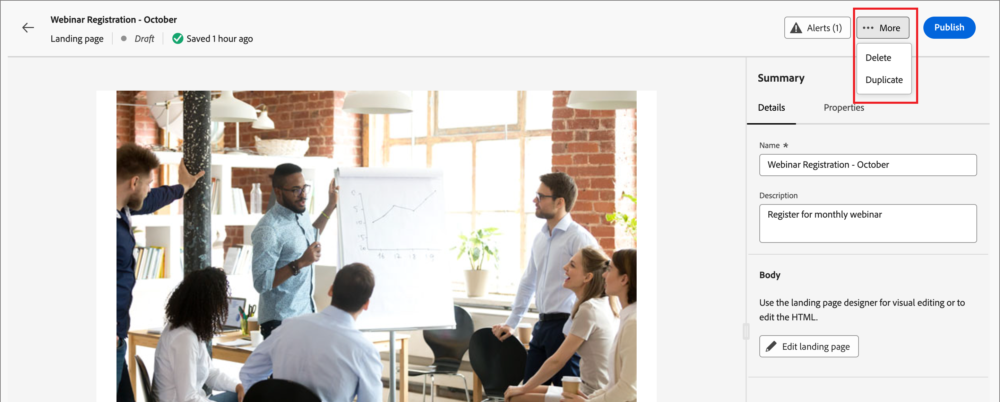

# ランディングページ

ランディングページは、メール、SMS メッセージ、またはその他のデジタル化された場所でリンクされた項目をクリックした後、連絡先や顧客に直接アクセスできるスタンドアロン web ページです。 これらのページをアカウントジャーニーに組み込むと、見込み客や顧客が web 上でメッセージを表示し、アカウントジャーニーの進行状況を確認できます。 ランディングページのビジュアルデザインスペースで、ランディングページの作成、パーソナライズおよびプレビューを行うことができます。

顧客が特定のリンクをクリックしたときに定義済みの web ページに誘導するには、Journey Optimizer B2B editionでランディングページを作成します。

* ページを作成
* ランディングページのデザインとコンテンツの作成
* ページのテスト
* ページを公開します
* ジャーニーコンテンツからページへのリンク

例えば、ランディングページを作成およびデザインして、ユーザーにオンライン情報を提供することができます。 このページには、お客様からのお知らせの受信をオプトインまたはオプトアウトできるフォームを含めることができます。 または、ニュースレターなどの定期的なコミュニケーションを購読する機会ともなります。

ビジュアルデザインスペースで、ランディングページの作成、パーソナライズおよびプレビューを行うことができます。
<!-- 
For the Beta phase, you can only design landing pages from scratch and publish your landing pages. The landing pages will be served on adobe hosted domain for the Beta phase. The capability to define your branded domains for hosting will be delivered in a future release. -->

## ランディングページへのアクセスと管理

Adobe Journey Optimizer B2B editionのランディングページにアクセスするには、左側のナビゲーションに移動して、**[!UICONTROL コンテンツ管理]**/**[!UICONTROL ランディングページ]** をクリックします。 このアクションを実行するとリストページが開き、インスタンスで作成されたすべてのランディングページがテーブルに表示されます。

{width="800" zoomable="yes"}

テーブルは「_[!UICONTROL 変更済み]_ 列で並べ替えられ、デフォルトでは最近更新された項目が先頭に表示されます。 列タイトルをクリックして、昇順と降順を切り替えます。

### ランディングページリストのフィルタリング

名前でランディングページを検索するには、検索バーに一致するテキスト文字列を入力します。 _フィルター_ アイコン（）をクリックして、使用可能なフィルターオプションを表示し、表示される項目を指定した条件に従ってフィルタリングするための設定を変更します。

{width="700" zoomable="yes"}

### 列表示のカスタマイズ

右上の _テーブルをカスタマイズ_ アイコン（）をクリックして、テーブルに表示する列をカスタマイズします。

ダイアログで、表示する列を選択し、「**[!UICONTROL 適用]**」をクリックします。

{width="300"}

### ランディングページのステータスとライフサイクル

ランディングページのステータスによって、メールや SMS コンテンツにリンクするための可用性と、リンクに加えられる変更が決まります。

| ステータス | 説明 |
| -------------------- | ----------- |
| 下書き | ランディングページを作成した場合、そのページはドラフトステータスになります。 ビジュアルコンテンツを定義または編集するとき、およびホストされたページとして公開するまで、このステータスのままになります。 使用可能なアクション： <ul><li>名前または説明を編集<li>リンク URL を編集<li>ビジュアルデザインスペースで編集<li>公開<li>複製<li>削除 |
| 公開日 | ランディングページを公開すると、そのページはJourney Optimizer B2B edition インスタンスでホストされ、メールまたは SMS メッセージコンテンツでリンクできるようになります。 使用可能なアクション： <ul><li>名前または説明を編集<li>リンク URL を編集<li>メールまたは SMS メッセージコンテンツへのリンクの追加<li>ドラフトバージョンを作成<li>複製<li>削除 |
| 公開済み下書きあり | 公開済みランディングページからドラフトを作成した場合、公開されたバージョンは残り、ドラフトコンテンツはビジュアルデザイン領域で変更できます。 ドラフトバージョンを公開すると、現在の公開バージョンが置き換えられ、ホストされているページのコンテンツが更新されます。 使用可能なアクション： <ul><li>名前または説明を編集<li>リンク URL を編集<li>メールまたは SMS メッセージコンテンツへのリンクの追加<li>ビジュアルデザイン領域でのドラフトバージョンの編集<li>ドラフトバージョンを公開<li>複製<li>削除（両方のバージョンを削除）<li>ドラフトを破棄（公開済みステータスに戻る） |

{zoomable="yes"}

## ランディングページの作成

右上の **[!UICONTROL ランディングページを作成]** をクリックすると、Journey Optimizer B2B editionに新しいランディングページを作成できます。

1. _[!UICONTROL ランディングページを作成]_ ダイアログで、便利な **[!UICONTROL 名前]** と **[!UICONTROL 説明]** （オプション）を入力します。

   ランディングページの要件：

   * 名前 – 最大 100 文字。一意である必要があります。大文字と小文字は区別されません

   * 説明 – 最大 300 文字

   * Alpha、数字、特殊文字を使用できます

   * 予約文字は使用できません **_使用できません_**: `\ / : * ? " < > |`

   {width="400"}

1. 必要に応じて、複数のサブドメインが設定されている場合は、**[!UICONTROL サブドメイン]** をランディングページに使用するように変更します。

1. 「**[!UICONTROL 作成]**」をクリックします。

   _[!UICONTROL プライマリランディングページを作成]_ ホームページが開き、ページを作成するための複数のオプション（_[!UICONTROL ゼロからデザイン]_、_[!UICONTROL HTMLを読み込み]_、保存済みのテンプレートを使用など）が表示されます。

   {width="800" zoomable="yes"}

   ランディングページデザインの開始に使用する方法を選択したら、ビジュアルデザインスペースを使用して [ ページのデザイン ](./landing-page-design.md) を行います。

### ゼロからデザイン

ランディングページコンテンツの構造を定義するには、ビジュアルコンテンツエディターを使用します。 簡単なドラッグ&amp;ドロップ操作で構造コンポーネントを追加して移動することで、ページコンテンツの形状を数秒でデザインできます。

1. _[!UICONTROL プライマリランディングページを作成]_ ホームページで、「**[!UICONTROL ゼロからデザイン]**」オプションを選択します。

1. ページに [ 構造とコンテンツを追加 ](./landing-page-design.md#add-structure-and-content) します。

### HTML の読み込み

Adobe Journey Optimizer B2B editionでは、既存のHTML コンテンツを読み込んでランディングページをデザインできます。

{{$include /help/_includes/content-design-import.md}}

{width="500"}

>[!NOTE]
>
>`<table>` タグを HTML ファイルの最初のレイヤーとして使用すると、上部レイヤータグの背景や幅の設定などのスタイルが失われる可能性があります。

読み込んだコンテンツは、必要に応じてビジュアルデザインスペースでパーソナライズできます。

### 保存済みテンプレートを選択

次の中から選択できます。

* **サンプルテンプレート**. Journey Optimizer インターフェイスには、すぐに使用できるランディングページテンプレートのコレクションが用意されており、このコレクションから選択できます。

* **保存済みテンプレート**._[!UICONTROL テンプレート]_ メニュー <!-- or the _[!UICONTROL Save as content template]_ option when designing a landing page. --> ージを使用して、組織のメンバーが作成した保存済みのカスタムテンプレートを使用します

「_[!UICONTROL デザインテンプレートを選択]_」セクションを使用して、テンプレートからコンテンツの作成を開始します。 Journey Optimizer B2B edition インスタンスからサンプルテンプレートまたは保存済みのカスタムランディングページテンプレートを使用できます。

>[!BEGINTABS]

>[!TAB  保存済みテンプレート ]

_プライマリランディングページを作成_ ホームページでは、「_サンプルテンプレート_」タブがデフォルトで選択されています。 カスタムテンプレートを使用するには、「**[!UICONTROL 保存済みのテンプレート]**」タブを選択します。

すべての保存済みランディングページテンプレートのリストが表示されます。 _[!UICONTROL 名前]_、_[!UICONTROL 最終変更日]_ および _[!UICONTROL 最終作成日]_ で並べ替えることができます。

{width="700" zoomable="yes"}

リストから目的のテンプレートを選択します。

選択後、テンプレートのプレビューが表示されます。 プレビューモードでは、左右の矢印を使用して、1 つのカテゴリのすべてのテンプレート（選択に応じて、サンプルまたは保存済みのテンプレート）間を移動できます。

{width="800" zoomable="yes"}

表示が使用する内容と一致したら、プレビューウィンドウの右上にある **[!UICONTROL このテンプレートを使用]** をクリックします。

このアクションにより、コンテンツがビジュアルデザインスペースにコピーされ、必要に応じてコンテンツを編集できます。

>[!TAB  サンプルテンプレート ]

Adobe Journey Optimizer B2B editionには、独自のランディングページおよびランディングページテンプレートの作成に使用できる _標準_ ランディングページテンプレートが用意されています。

<!-- {width="800" zoomable="yes"} -->

>[!ENDTABS]

<!-- 
>[!NOTE]
>
> Saved templates may have governance (content locking) settings applied to one or more components. The visual designer provides guidelines about locked components when you [author an email from a governed template](./email-authoring-governance.md). -->

## ランディングページの編集

ランディングページの編集は、現在のステータスに応じて異なります。

* ランディングページが **_ドラフト_** ステータスの場合は、その詳細、URL およびビジュアルコンテンツを編集できます。
* ランディングページのステータスが **_公開済み_** の場合、説明は編集できますが、名前は編集できません。 ビジュアルコンテンツを変更するには、ページのドラフトバージョンを作成する必要があります。
* ランディングページが **_ドラフトで公開済み_** ステータスの場合、詳細の編集は説明に限定されます。 ドラフトバージョンの視覚的なコンテンツを編集することもできます。

>[!BEGINTABS]

>[!TAB ドラフト]

1. _[!UICONTROL ランディングページ]_ リストページで、ランディングページの名前をクリックして開きます。

   ビジュアルコンテンツのプレビューが表示され、ランディングページの詳細が右側に表示されます。

1. 名前や説明など、詳細を変更します。

   {width="700" zoomable="yes"}

1. ビジュアルデザインスペースのコンテンツを変更するには、「**[!UICONTROL ランディングページを編集]**」をクリックします。

   必要に応じて、ビジュアルデザインツールを使用します。

   * [構造とコンテンツの追加](./landing-page-design.md#add-structure-and-content)
   * [Assetsを追加](./landing-page-design.md#add-assets)
   * [レイヤー、設定、スタイルの移動](./landing-page-design.md#navigate-the-layers-settings-and-styles)
   * [コンテンツのパーソナライズ](./landing-page-design.md#personalize-content)
   * [リンクされた URL トラッキングを編集](./landing-page-design.md#edit-linked-url-tracking)

1. **[!UICONTROL 保存]** または **[!UICONTROL 保存して閉じる]** をクリックして、ランディングページの詳細に戻ります。

1. ページが条件を満たしていて、表示できるようにする場合は、「**[!UICONTROL 公開]**」をクリックします。

>[!TAB パブリッシュ済み]

1. _[!UICONTROL ランディングページ]_ リストページで、ページ名をクリックして開きます。

   ビジュアルコンテンツのプレビューが表示され、ランディングページの詳細が右側に表示されます。

1. 必要に応じて、説明を変更します。

   公開済みのランディングページの場合、他の詳細はすべて変更できません。

1. コンテンツを更新する場合は、右側の **[!UICONTROL ランディングページを編集]** をクリックします。

   ダイアログで **[!UICONTROL ドラフトバージョンを作成]** をクリックして、ビジュアルデザイン領域でドラフトバージョンを開きます。

   {width="300"}

   必要に応じて、ビジュアルデザインツールを使用します。

   * [構造とコンテンツの追加](./landing-page-design.md#add-structure-and-content)
   * [Assetsを追加](./landing-page-design.md#add-assets)
   * [レイヤー、設定、スタイルの移動](./landing-page-design.md#navigate-the-layers-settings-and-styles)
   * [コンテンツのパーソナライズ](./landing-page-design.md#personalize-content)
   * [リンクされた URL トラッキングを編集](./landing-page-design.md#edit-linked-url-tracking)

1. **[!UICONTROL 保存]** または **[!UICONTROL 保存して閉じる]** をクリックして、ランディングページの詳細に戻ります。

1. ドラフトランディングページが条件を満たしており、公開済みページで変更を使用できるようにするには、「**[!UICONTROL 公開]**」をクリックします。

   ドラフトバージョンを公開すると、現在の公開バージョンが置き換えられ、ページ URL のコンテンツが更新されます。

>[!TAB  ドラフトで公開済み ]

ランディングページを開くと、デフォルトではドラフトバージョンが表示されます。 プレビュースペースの上部にあるタブを使用すると、公開済みバージョンとドラフトバージョンの表示を切り替えることができます。 ドラフトアクションと詳細が右側に表示されます。

{width="700" zoomable="yes"}

コンテンツを更新するには：

1. 右上の **[!UICONTROL ランディングページを編集]** をクリックします。 必要に応じて、ビジュアルデザインツールを使用します。

   * [構造とコンテンツの追加](./landing-page-design.md#add-structure-and-content)
   * [Assetsを追加](./landing-page-design.md#add-assets)
   * [レイヤー、設定、スタイルの移動](./landing-page-design.md#navigate-the-layers-settings-and-styles)
   * [コンテンツのパーソナライズ](./landing-page-design.md#personalize-content)
   * [リンクされた URL トラッキングを編集](./landing-page-design.md#edit-linked-url-tracking)

1. **[!UICONTROL 保存]** または **[!UICONTROL 保存して閉じる]** をクリックして、ランディングページの詳細に戻ります。

1. ドラフトページが基準を満たしていて、変更を使用可能にする場合は、「**[!UICONTROL 公開]**」をクリックします。

   ドラフトバージョンを公開すると、現在の公開バージョンが置き換えられ、ホストされているページのコンテンツが更新されます。

>[!ENDTABS]

### アラートの確認

ランディングページのコンテンツを設計する際、重要な設定が見つからない場合は、インターフェイス（右上）にアラートが表示されます。

{width="250"}

このボタンが表示されない場合は、検出された問題はありません。

次の 2 種類のアラートを検出できます。

* 推奨事項やベストプラクティスを参照する **_警告_**。例えば、次のようなものがあります。

   * `Placeholder links are present in the landing page body`: プレースホルダーを有効なリンクに置き換えることを忘れないでください。

   * `Text version of HTML is empty`：ページ本文のテキストバージョンを必ず定義してください。このバージョンは、HTML コンテンツを表示できない場合に使用されます。

   * `Empty link is present in page body`: ページ内のすべてのリンクが正しいことを確認してください。

* **_エラー_** 解決されない限り、ジャーニー/キャンペーンのテストやアクティブ化はできません。例えば、次のエラーなどです。

   * `The landing page content is empty`：ページコンテンツは必須です。

## ランディングページの複製

次のいずれかの方法を使用して、ランディングページを複製できます。

* _[!UICONTROL ランディングページ]_ リストページで、ランディングページ名の横にある _詳細_ アイコン（**...**）をクリックし、「**[!UICONTROL 複製]**」を選択します。
* ランディングページの詳細ページの右上にある「**[!UICONTROL ..」をクリックします。詳細を表示して]** 「複製 **[!UICONTROL を選択]** ます。

{width="600" zoomable="yes"}

ダイアログで、便利な名前（一意の名前）と説明（オプション）を入力します。 「**[!UICONTROL 複製]**」をクリックして、アクションを完了します。

{width="350"}

複製された（新規）ページが「_ランディングページ_ リストに表示されます。

## ランディングページの削除

ランディングページを削除するには、次のいずれかの方法を使用します。

* _[!UICONTROL ランディングページ]_ リストページで、ランディングページ名の横にある _詳細_ アイコン（**...**）をクリックし、「**[!UICONTROL 削除]**」を選択します。
* ランディングページの詳細ページの右上にある「**[!UICONTROL ..」をクリックします。その他]** 「削除 **[!UICONTROL 」を選択し]** す。

この操作を実行すると、確認ダイアログが開きます。 **[!UICONTROL キャンセル]** をクリックするか、「**[!UICONTROL 削除]**」をクリックして削除を確定すると、プロセスを中止できます。

{width="400"}

## ランディングページへのリンク

メール、フラグメントおよびページコンテンツを作成するマーケターまたはDesignerは、Journey Optimizer B2B edition インスタンスで作成された公開済み（ライブ）ランディングページへのリンクを埋め込むことができます。

1. フラグメント、メール、ランディングページまたはテンプレートのビジュアルデザイン領域で作業する際に、リンクの抜粋、ボタンコンポーネントまたは画像コンポーネントを選択します。

   **[!UICONTROL リンク]** オプションが右側のパネルに表示されます。

1. 「**[!UICONTROL タイプ]**」オプションで「**[!UICONTROL ランディングページ]**」を選択します。

   {width="700" zoomable="yes"}

1. **[!UICONTROL ランディングページ]** オプションについては、_ページを選択_ アイコン（）をクリックします。

1. ランディングページを選択ダイアログで、**[!UICONTROL ランディングページのソース]** を **[!UICONTROL Journey Optimizer B2B edition]** に設定し、公開済みのページのリストからランディングページのチェックボックスを選択して、**[!UICONTROL 選択]** をクリックします。

   {width="600" zoomable="yes"}

1. 「**[!UICONTROL ターゲット]**」オプションで、リンクターゲットの動作を選択します。

   * **[!UICONTROL なし]** - ブラウザーのデフォルトの動作を使用してリンクを開きます。
   * **[!UICONTROL 空白]** - リンクを新しいウィンドウまたは新しいタブで開きます。
   * **[!UICONTROL セルフ]** – 同じフレームでリンクを開きます。
   * **[!UICONTROL 親]** – 親フレームでリンクを開きます。
   * **[!UICONTROL 上]** - ウィンドウの全体でリンクを開きます。

1. （テキストリンクのみ）リンクされたテキストに下線を引く場合は、「**[!UICONTROL 下線リンク]**」チェックボックスを選択します。

   右側のパネルの「**[!UICONTROL スタイル]**」タブを選択すると、リンクの色など、リンクテキストの追加のスタイル設定を行うことができます。
