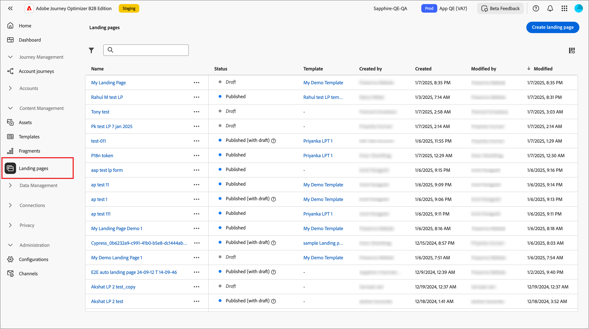
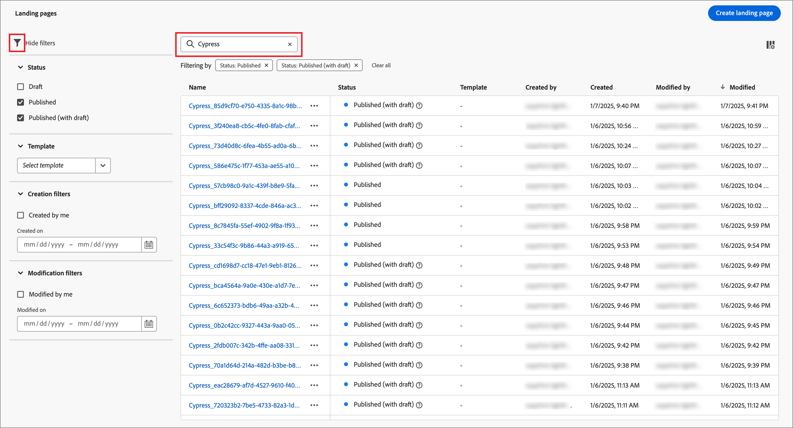
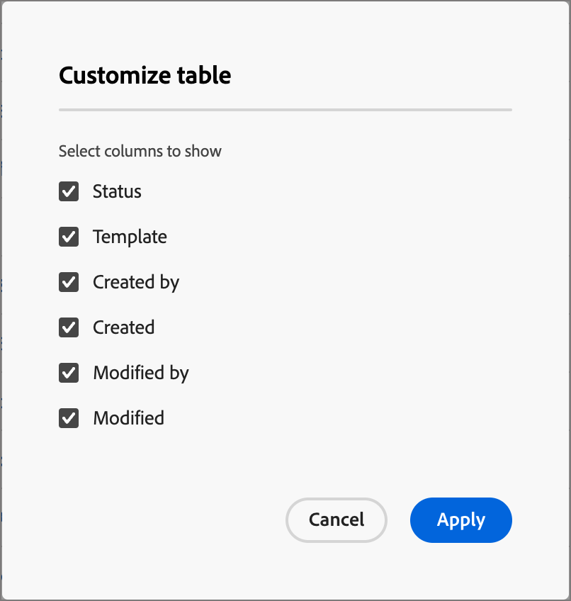
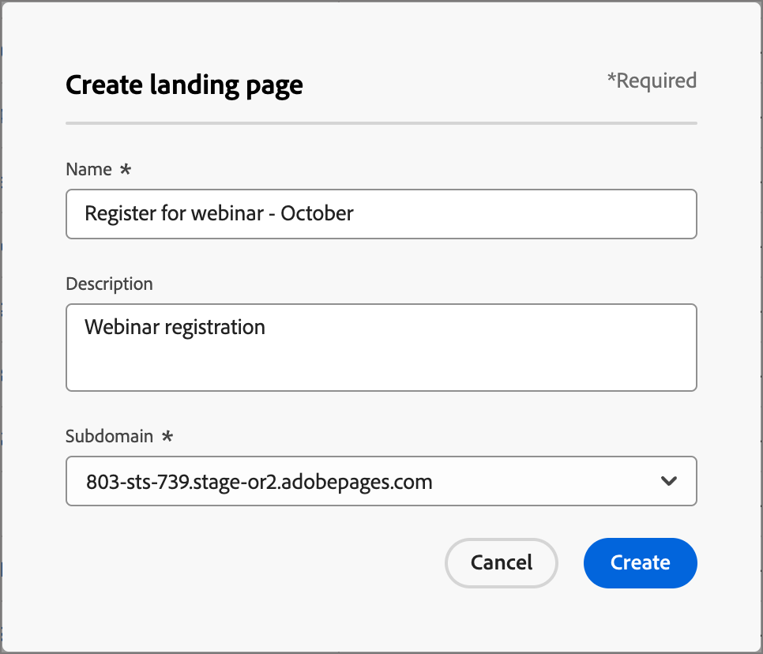
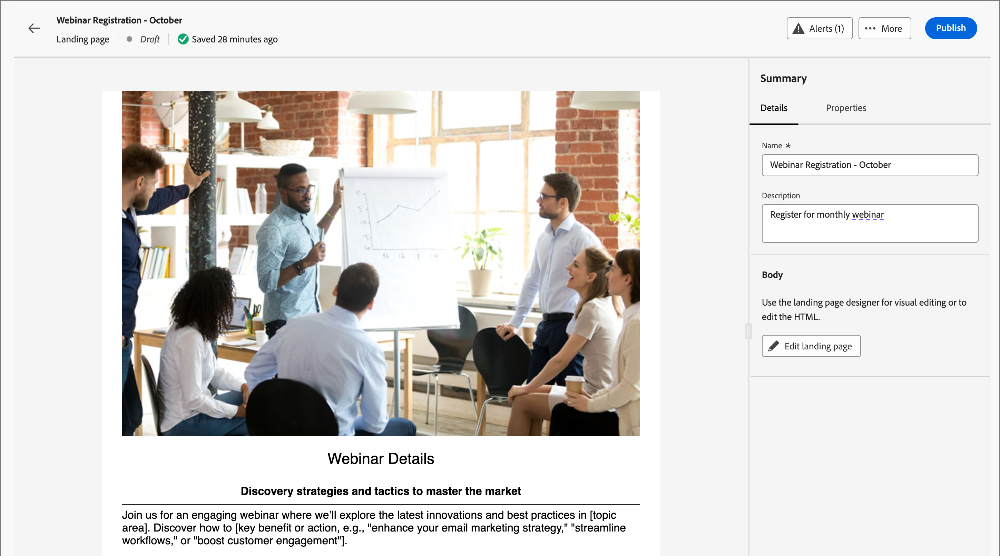
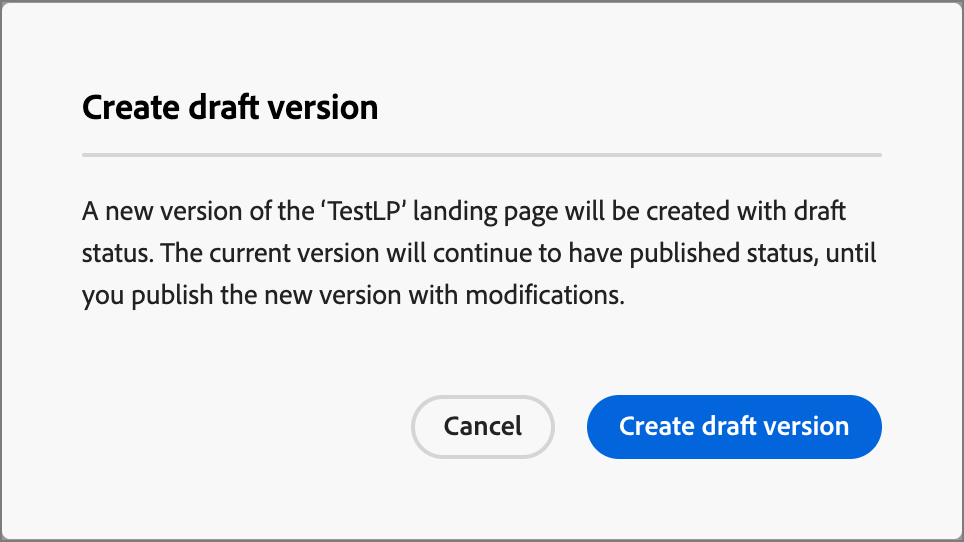

# ランディングページ

ランディングページとは、電子メール、SMS メッセージ、デジタル位置情報でリンクされたアイテムをクリックした後、連絡先や顧客を誘導できるスタンドアロンのweb ページです。 これらのページをアカウントジャーニーに組み込むことで、見込客や顧客にweb上でメッセージを表示させ、アカウントジャーニーを先に進んでもらうことができます。 ランディングページのビジュアルデザイン機能では、ランディングページを作成、パーソナライズ、プレビューできます。

特定のリンクをクリックしたときに、定義されたweb ページに誘導するには、Journey Optimizer B2B editionでランディングページを作成します。

* ページの作成
* ランディングページのデザインとコンテンツの制作
* ページをテスト
* ページを公開
* ジャーニーコンテンツからページへのリンク

例えば、ランディングページを作成およびデザインして、オーディエンスをオンライン情報に誘導できます。 このページには、コミュニケーションの受信をオプトインまたはオプトアウトできるフォームが含まれます。 また、ニュースレターなどの定期的なコミュニケーションに登録することもできます。

ビジュアルデザイン空間でランディングページを作成、パーソナライズ、プレビューできます。
<!--
For the Beta phase, you can only design landing pages from scratch and publish your landing pages. The landing pages will be served on adobe hosted domain for the Beta phase. The capability to define your branded domains for hosting will be delivered in a future release. 
-->

## ランディングページへのアクセスと管理

Adobe Journey Optimizer B2B editionのランディングページにアクセスするには、左側のナビゲーションに移動し、**[!UICONTROL コンテンツ管理]**/**[!UICONTROL ランディングページ]**&#x200B;をクリックします。 このアクションを実行すると、インスタンスで作成されたすべてのランディングページが表に一覧表示されたリストページが開きます。

{width="800" zoomable="yes"}

テーブルは&#x200B;_[!UICONTROL Modified]_&#x200B;列で並べ替えられ、デフォルトでは最も最近更新された項目が先頭に表示されます。 列のタイトルをクリックして、昇順と降順を変更します。

### ランディングページリストのフィルター

ランディングページを名前で検索するには、検索バーにテキスト文字列を入力して一致を検索します。 _フィルター_ アイコン （）をクリックして、使用可能なフィルターオプションを表示し、設定を変更して、指定した条件に従って表示される項目をフィルタリングします。

{width="700" zoomable="yes"}

### 列表示のカスタマイズ

右上の&#x200B;_テーブルをカスタマイズ_ アイコン （）をクリックして、テーブルに表示する列をカスタマイズします。

ダイアログで、表示する列を選択し、**[!UICONTROL 適用]**&#x200B;をクリックします。

{width="300"}

### ランディングページのステータスとライフサイクル

ランディングページのステータスによって、電子メールおよびSMS コンテンツ内でのリンクの可用性と、それに対して実行できる変更が決まります。

| ステータス | 説明 |
| -------------------- | ----------- |
| 下書き | ランディングページを作成する場合、そのランディングページはドラフトステータスになります。 ビジュアルコンテンツを定義または編集し、ホストされたページとして公開するまで、このステータスのままになります。 使用可能なアクション： <ul><li>名前または説明を編集<li>リンク URLを編集<li>ビジュアルデザイン空間での編集<li>公開<li>複製<li>削除 |
| 公開日 | ランディングページを公開すると、ランディングページはJourney Optimizer B2B edition インスタンスでホストされ、メールまたはSMS メッセージのコンテンツでリンクできるようになります。 使用可能なアクション： <ul><li>名前または説明を編集<li>リンク URLを編集<li>メールまたはSMS メッセージのコンテンツにリンクを追加する<li>ドラフトバージョンを作成<li>複製<li>削除 |
| 公開済み下書きあり | 公開されたランディングページからドラフトを作成すると、公開されたバージョンは残り、ドラフトコンテンツはビジュアルデザイン空間で変更できます。 ドラフトバージョンを公開すると、現在の公開済みバージョンが置き換えられ、コンテンツはホストされているページで更新されます。 使用可能なアクション： <ul><li>名前または説明を編集<li>リンク URLを編集<li>メールまたはSMS メッセージのコンテンツにリンクを追加する<li>ビジュアルデザインスペースでのドラフトバージョンの編集<li>ドラフトバージョンを公開<li>複製<li>削除（両方のバージョンを削除）<li>ドラフトを破棄（公開済みステータスに戻る） |

{zoomable="yes"}

## ランディングページの作成

Journey Optimizer B2B editionで新しいランディングページを追加するには、右上の「**[!UICONTROL ランディングページを作成]**」をクリックします。

1. _[!UICONTROL ランディングページを作成]_ ダイアログで、便利な&#x200B;**[!UICONTROL 名前]**&#x200B;と&#x200B;**[!UICONTROL 説明]** （オプション）を入力します。

   ランディングページの要件：

   * 名前 – 最大100文字、一意にする必要があり、大文字と小文字を区別しない

   * 説明 – 最大300文字

   * Alpha、数値、特殊文字は使用できます

   * 予約済みの文字は&#x200B;**_許可されていません_**: `\ / : * ? " < > |`

   {width="400"}

1. 必要に応じて、複数のサブドメインが設定されている場合は、ランディングページに使用するように&#x200B;**[!UICONTROL サブドメイン]**&#x200B;を変更します。

1. 「**[!UICONTROL 作成]**」をクリックします。

   _[!UICONTROL メインのランディングページを作成]_ ホームページが開き、ページを作成するための複数のオプションが用意されています：_[!UICONTROL ゼロからデザイン]_、_[!UICONTROL HTMLを読み込むか、保存したテンプレートを使用します。]_

   {width="800" zoomable="yes"}

   ランディングページのデザインを開始するために使用する方法を選択したら、ビジュアルデザインスペースを使用して[ ページをデザイン ](./landing-page-design.md)します。

### ゼロからデザイン

ビジュアルコンテンツエディターを使用して、ランディングページコンテンツの構造を定義します。 シンプルなドラッグ&amp;ドロップ操作で構造コンポーネントを追加、移動することで、数秒でページコンテンツの形状をデザインできます。

1. _[!UICONTROL メインのランディングページを作成]_ ホームページから、**[!UICONTROL ゼロからデザイン]** オプションを選択します。

1. [構造とコンテンツ ](./landing-page-design.md#add-structure-and-content)をページに追加します。

### HTML の読み込み

Adobe Journey Optimizer B2B editionでは、既存のHTML コンテンツを読み込んで、ランディングページをデザインできます。

{{$include /help/_includes/content-design-import.md}}

{width="500"}

>[!NOTE]
>
>`<table>` タグを HTML ファイルの最初のレイヤーとして使用すると、上部レイヤータグの背景や幅の設定などのスタイルが失われる可能性があります。

ビジュアルデザイン機能を利用して、インポートしたコンテンツを必要に応じてパーソナライズできます。

### 保存またはサンプルテンプレートの選択

次の中から選択できます。

* **サンプルテンプレート**. Journey Optimizer B2B editionのインターフェイスには、ランディングページデザインのベースとして使用できる、すぐに使用できるランディングページテンプレートのコレクションが用意されています。

* **保存済みテンプレート**. _[!UICONTROL テンプレート]_ メニュー<!-- or the _[!UICONTROL Save as content template]_ option when designing a landing page. -->を使用して、組織のメンバーが作成した保存済みのカスタムテンプレートを使用します

「_[!UICONTROL デザインテンプレートを選択]_」セクションを使用して、テンプレートからコンテンツの作成を開始します。 サンプルテンプレートまたはJourney Optimizer B2B edition インスタンスから保存したカスタムランディングページテンプレートを使用できます。

>[!BEGINTABS]

>[!TAB 保存されたテンプレート ]

_プライマリランディングページを作成_ ホームページでは、_サンプルテンプレート_ タブがデフォルトで選択されています。 カスタムテンプレートを使用するには、「**[!UICONTROL 保存したテンプレート]**」タブを選択します。

保存されたすべてのランディングページテンプレートのリストが表示されます。 _[!UICONTROL 名前]_、_[!UICONTROL 最終変更日]_、_[!UICONTROL 最終作成日]_&#x200B;で並べ替えることができます。

{width="700" zoomable="yes"}

リストから必要なテンプレートを選択します。

選択後、テンプレートのプレビューが表示されます。 プレビューモードでは、右向き矢印と左向き矢印を使用して、1つのカテゴリのすべてのテンプレート（選択内容に応じてサンプルまたは保存済み）間を移動できます。

{width="800" zoomable="yes"}

表示が使用する内容と一致したら、プレビューウィンドウの右上にある「**[!UICONTROL このテンプレートを使用]**」をクリックします。

このアクションにより、コンテンツがビジュアルデザイン空間にコピーされ、必要に応じてコンテンツを編集できます。

>[!TAB  サンプルテンプレート ]

Adobe Journey Optimizer B2B editionには、_すぐに使える_&#x200B;個のランディングページテンプレートが用意されており、独自のランディングページやランディングページテンプレートの作成に使用できます。

<!-- {width="800" zoomable="yes"} -->

>[!ENDTABS]

<!--
>[!NOTE]
>
> Saved templates may have governance (content locking) settings applied to one or more components. The visual designer provides guidelines about locked components when you [author an email from a governed template](./email-authoring-governance.md). 
-->

## ランディングページの編集

ランディングページの編集は、現在のステータスに応じて異なります。

* ランディングページのステータスが&#x200B;**_ドラフト_**&#x200B;の場合、その詳細、URL、ビジュアルコンテンツのいずれかを編集できます。
* ランディングページのステータスが&#x200B;**_公開済み_**&#x200B;の場合、説明は編集できますが、名前は編集できません。 ビジュアルコンテンツを変更するには、ページのドラフトバージョンを作成する必要があります。
* ランディングページが&#x200B;**_下書き_**&#x200B;状態で公開済みの場合、詳細の編集は説明に限定されます。 ドラフトバージョンのビジュアルコンテンツを編集することもできます。

>[!BEGINTABS]

>[!TAB ドラフト]

1. _[!UICONTROL ランディングページ]_&#x200B;のリストページで、ランディングページ名をクリックして開きます。

   ビジュアルコンテンツのプレビューが表示され、ランディングページの詳細が右側に表示されます。

1. 名前や説明などの詳細を変更します。

   {width="700" zoomable="yes"}

1. ビジュアルデザインスペースのコンテンツを変更するには、**[!UICONTROL ランディングページを編集]**&#x200B;をクリックします。

   必要に応じて、ビジュアルデザインツールを使用します。

   * [構造とコンテンツの追加](./landing-page-design.md#add-structure-and-content)
   * [Assetsを追加](./landing-page-design.md#add-assets)
   * [レイヤー、設定、スタイルの移動](./landing-page-design.md#navigate-the-layers-settings-and-styles)
   * [コンテンツのパーソナライズ](./landing-page-design.md#personalize-content)
   * [リンクされたURL トラッキングを編集](./landing-page-design.md#edit-linked-url-tracking)

1. 「**[!UICONTROL 保存]**」または「**[!UICONTROL 保存して閉じる]**」をクリックすると、ランディングページの詳細に戻ります。

1. ページが条件を満たしており、表示できるようにするには、**[!UICONTROL 公開]**&#x200B;をクリックします。

>[!TAB パブリッシュ済み]

1. _[!UICONTROL ランディングページ]_&#x200B;のリストページで、ページ名をクリックして開きます。

   ビジュアルコンテンツのプレビューが表示され、ランディングページの詳細が右側に表示されます。

1. 必要に応じて、説明を変更します。

   公開したランディングページの場合、他のすべての詳細を変更することはできません。

1. コンテンツを更新する場合は、右側の「**[!UICONTROL ランディングページを編集]**」をクリックします。

   ダイアログで「**[!UICONTROL ドラフトバージョンを作成]**」をクリックして、ビジュアルデザインスペースでドラフトバージョンを開きます。

   {width="300"}

   必要に応じて、ビジュアルデザインツールを使用します。

   * [構造とコンテンツの追加](./landing-page-design.md#add-structure-and-content)
   * [Assetsを追加](./landing-page-design.md#add-assets)
   * [レイヤー、設定、スタイルの移動](./landing-page-design.md#navigate-the-layers-settings-and-styles)
   * [コンテンツのパーソナライズ](./landing-page-design.md#personalize-content)
   * [リンクされたURL トラッキングを編集](./landing-page-design.md#edit-linked-url-tracking)

1. 「**[!UICONTROL 保存]**」または「**[!UICONTROL 保存して閉じる]**」をクリックすると、ランディングページの詳細に戻ります。

1. ドラフトのランディングページが条件を満たしており、公開ページで変更を利用できるようにするには、**[!UICONTROL 公開]**&#x200B;をクリックします。

   ドラフトバージョンを公開すると、現在の公開済みバージョンが置き換えられ、コンテンツがページ URLに更新されます。

>[!TAB 下書きで公開]

ランディングページを開くと、ドラフトバージョンがデフォルトで表示されます。 プレビュースペースの上部にあるタブを使用すると、公開バージョンとドラフトバージョンの表示を切り替えることができます。 下書きのアクションと詳細が右側に表示されます。

{width="700" zoomable="yes"}

コンテンツを更新するには：

1. 右上の「**[!UICONTROL ランディングページを編集]**」をクリックします。 必要に応じて、ビジュアルデザインツールを使用します。

   * [構造とコンテンツの追加](./landing-page-design.md#add-structure-and-content)
   * [Assetsを追加](./landing-page-design.md#add-assets)
   * [レイヤー、設定、スタイルの移動](./landing-page-design.md#navigate-the-layers-settings-and-styles)
   * [コンテンツのパーソナライズ](./landing-page-design.md#personalize-content)
   * [リンクされたURL トラッキングを編集](./landing-page-design.md#edit-linked-url-tracking)

1. 「**[!UICONTROL 保存]**」または「**[!UICONTROL 保存して閉じる]**」をクリックすると、ランディングページの詳細に戻ります。

1. ドラフトページが条件を満たしており、変更を使用可能にするには、**[!UICONTROL 公開]**&#x200B;をクリックします。

   ドラフトバージョンを公開すると、現在の公開済みバージョンが置き換えられ、コンテンツはホストされているページで更新されます。

>[!ENDTABS]

### アラートの確認

ランディングページのコンテンツをデザインする際に、キー設定が見つからない場合にアラートがインターフェイス（右上）に表示されます。

{width="250"}

このボタンが表示されない場合、検出された問題はありません。

2種類のアラートを検出できます。

* 推奨事項とベストプラクティスに関する&#x200B;**_警告_**&#x200B;は、次のとおりです。

   * `Placeholder links are present in the landing page body`: プレースホルダーを有効なリンクに置き換えることを忘れないでください。

   * `Text version of HTML is empty`: HTML コンテンツを表示できない場合に使用する、ページ本文のテキスト版を定義することを忘れないでください。

   * `Empty link is present in page body`: ページ内のすべてのリンクが正しいことを確認してください。

* 解決されない限り、ジャーニー/キャンペーンのテストまたはアクティブ化を妨げる&#x200B;**_エラー_**&#x200B;が発生します。例えば、次のようになります。

   * `The landing page content is empty`: ページコンテンツは必須です。

## ランディングページの複製

次のいずれかの方法を使用して、ランディングページを複製できます。

* _[!UICONTROL ランディングページ]_&#x200B;のリスト ページで、_詳細_ アイコン （**...**）をクリックします ランディングページ名の横にある「**[!UICONTROL 複製]**」を選択します。
* ランディングページの詳細ページの右上にある「**[!UICONTROL 」をクリックします…詳細]**&#x200B;を選択し、**[!UICONTROL 複製]**&#x200B;を選択します。

{width="600" zoomable="yes"}

ダイアログで、便利な名前（一意）と説明（オプション）を入力します。 「**[!UICONTROL 複製]**」をクリックして、アクションを完了します。

{width="350"}

複製された（新しい）ページは、_ランディングページ_&#x200B;のリストに表示されます。

## ランディングページの削除

ランディングページを削除するには、次のいずれかの方法を使用します。

* _[!UICONTROL ランディングページ]_&#x200B;のリスト ページで、_詳細_ アイコン （**...**）をクリックします ランディングページ名の横にある「**[!UICONTROL 削除]**」を選択します。
* ランディングページの詳細ページの右上にある「**[!UICONTROL 」をクリックします…詳細]**&#x200B;を選択し、**[!UICONTROL 削除]**&#x200B;を選択します。

このアクションを実行すると、確認ダイアログが開きます。 「**[!UICONTROL キャンセル]**」をクリックするか、「**[!UICONTROL 削除]**」をクリックして削除を確認することで、プロセスを中止できます。

{width="400"}

## ランディングページへのリンク

電子メール、フラグメント、ページコンテンツを作成するマーケターまたはDesignerは、Journey Optimizer B2B edition インスタンスで作成された公開（ライブ）ランディングページへのリンクを埋め込むことができます。

1. フラグメント、電子メール、ランディングページ、またはテンプレートのビジュアルデザインスペースで作業する際に、リンクのテキストの抜粋、ボタンコンポーネント、または画像コンポーネントを選択します。

   右側のパネルには、**[!UICONTROL リンク]**&#x200B;のオプションが表示されます。

1. **[!UICONTROL Type]** オプションで、**[!UICONTROL ランディングページ]**&#x200B;を選択します。

   {width="700" zoomable="yes"}

1. **[!UICONTROL ランディングページ]** オプションで、_ページを選択_ アイコン （）をクリックします。

1. ランディングページを選択ダイアログで、**[!UICONTROL ランディングページソース]**&#x200B;を&#x200B;**[!UICONTROL Journey Optimizer B2B edition]**&#x200B;として設定し、公開されたページのリストからランディングページのチェックボックスをオンにして、**[!UICONTROL 選択]**&#x200B;をクリックします。

   {width="600" zoomable="yes"}

1. 「**[!UICONTROL ターゲット]**」オプションで、リンクターゲットの動作を選択します。

   * **[!UICONTROL なし]** - ブラウザーの既定の動作を使用してリンクを開きます。
   * **[!UICONTROL 空白]** – 新しいウィンドウまたはタブでリンクを開きます。
   * **[!UICONTROL 自分]** – 同じフレームでリンクを開きます。
   * **[!UICONTROL 親]** – 親フレームでリンクを開きます。
   * **[!UICONTROL トップ]** - ウィンドウの本文のリンクを開きます。

1. （テキストリンクのみ）リンクされたテキストに下線を引く場合は、「**[!UICONTROL 下線リンク]**」チェックボックスを選択します。

   右側のパネルで「**[!UICONTROL スタイル]**」タブを選択すると、リンクカラーを含むリンクテキストに追加のスタイルを設定できます。
