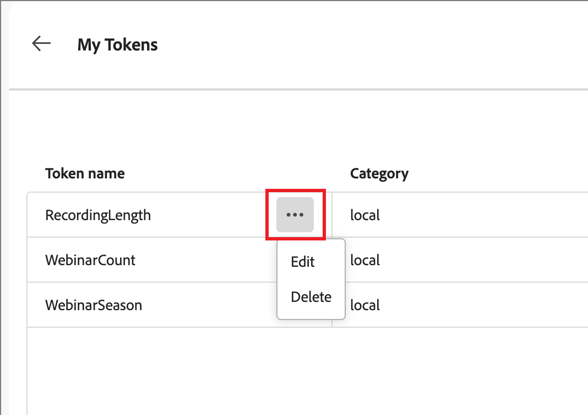

# E メールパーソナライゼーションのカスタムトークン

コンテンツのパーソナライゼーションでは、コンテンツアーティファクトの生成時に入力されるプレースホルダーまたは変数としてトークンを使用します。 標準のパーソナライゼーショントークンは、メール、ランディングページ、フラグメントおよびテンプレートで使用できます。 また、アカウントジャーニーに固有の値を持つカスタムトークンのセットを定義することもできます。 このカスタムトークンのセットは _マイトークン_ と呼ばれ、これらのカスタムトークンはすべて、[ ジャーニーメールのオーサリング ](./email-authoring.md#content-authoring---personalization) 時にパーソナライゼーション用に使用されます。

アカウントジャーニーに固有の _マイトークン_ に加えて、メールのパーソナライゼーションには標準（組み込み）トークンのいずれかを使用できます。

## マイトークンの管理 {#my-tokens}

_マイトークン_ は、ドラフトステータスのアカウントジャーニー用に作成または変更するカスタム変数です。 このカスタムトークンセットでは、現在、テキストおよび数値トークンの定義をサポートしています。

カスタムトークンをメールに追加すると、`{{my.TokenName}}` のように表示されます。 例えば、今後のウェビナーに関連するメールコンテンツを管理するために、`{{my.EventDate}}` または `{{my.WebinarSpeaker}}` のトークンを作成できます。

アカウントジャーニーのカスタムトークンにアクセスするには（_T） :_

1. ドラフトアカウントジャーニーを開きます。

1. 右上の **[!UICONTROL その他…]** メニューをクリックし、**[!UICONTROL マイトークン]** を選択します。

   {width="450"}

   _マイトークン_ ページには、ジャーニー用に定義されたすべてのカスタムトークンが一覧表示されます。

   {width="700" zoomable="yes"}

### トークンの作成

1. _[!UICONTROL マイトークン]_ ページで **[!UICONTROL 作成]** をクリックし、定義するトークンタイプを選択します。

   * **[!UICONTROL テキスト]** – このタイプを使用して、基本的なテキスト文字列値を持つトークンを定義します。

   * **[!UICONTROL 数値]** – このタイプを使用して、数値を持つトークンを定義します。

1. ダイアログで、トークンの **[!UICONTROL 名前]** と **[!UICONTROL 値]** を入力します。

   {width="400"}

   トークン名にはスペースや特殊文字を使用できません。 _などの_ キャメルケース `EventType` を使用して、簡単に識別できる複数単語の名前を使用できます。

   _数値_ トークンを定義する場合、値には数字のみを含めることができます。 小数値を使用できます。

   {width="400"}

1. 「**[!UICONTROL 追加]**」をクリックします。

### トークンの編集

アカウントジャーニーはドラフトステータスのままですが、定義済みの任意のマイトークンを編集できます。

1. _[!UICONTROL マイトークン]_ ページで、トークン名の横にある _その他のアクション_ アイコン（**...**）をクリックし、「**[!UICONTROL 編集]**」を選択します。

   {width="430"}

1. ダイアログで、ジャーニーの必要に応じて **[!UICONTROL 名前]** と **[!UICONTROL 値]** を変更します。

   {width="400"}

1. 「**[!UICONTROL 編集]**」をクリックします。

### トークンの削除

_マイトークン_ リストからカスタムトークンを削除できますが、ジャーニーのメールコンテンツで現在使用されていないことを確認する必要があります。

1. _[!UICONTROL マイトークン]_ ページで、トークン名の横にある _その他のアクション_ アイコン（**...**）をクリックし、「**[!UICONTROL 削除]**」を選択します。

1. 確認ダイアログで、「**[!UICONTROL 削除]**」をクリックします。

## コンテンツでのカスタムトークンの使用

アカウントジャーニーのメールコンテンツをオーサリングする際、ビジュアルデザイン領域でパーソナライゼーションツールを使用すると、_マイトークン_ リストから任意のトークンを使用できます。

1. テキストコンポーネントを選択し、ツールバーの _パーソナライゼーションを追加_ （）アイコンをクリックします。

   {width="600"}

   これにより、「_Personalizationを編集_ ダイアログが開きます。 アカウントジャーニーに対して定義されたカスタムトークンがある場合、ダイアログには _[!UICONTROL Personalizationトークン]_ ライブラリに _[!UICONTROL マイトークン]_ フォルダーが含まれます。

1. **[!UICONTROL マイトークン]** フォルダーを展開し、「**+**」または「**...**」をクリックして、空のスペースにカスタムトークンの 1 つを追加します。

   必要に応じて、静的テキストを追加できます。

   {width="700" zoomable="yes"}

1. 「**[!UICONTROL 保存]**」をクリックします。
