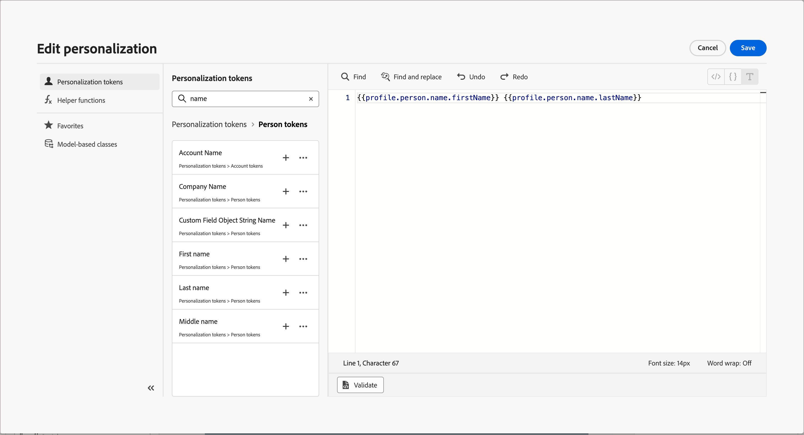
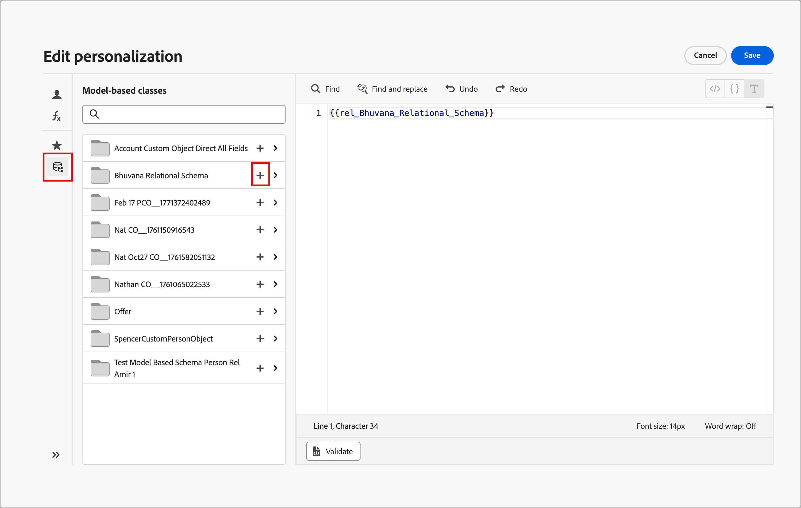

# コンテンツのパーソナライゼーション {#add-personalization}

>[!CONTEXTUALHELP]
>id="aj-b2b_personalization"
>title="コンテンツエクスペリエンスのパーソナライズ"
>abstract="**Adobe Journey Optimizer B2B Edition** では、受信者に関するデータや情報（名前、業界、役職など）を活用することにより、 特定の受信者に合わせてメッセージを作成できます。"

[!DNL Adobe Journey Optimizer B2B Edition]のパーソナライゼーション機能を使用すると、電子メール メッセージを特定の受信者ごとに、自分が持っているデータと情報を活用して調整できます。 特定の受信者に合わせてメッセージを作成できます。

_パーソナライゼーションエディター_&#x200B;を使用すると、すべてのデータを選択、配置、カスタマイズ、検証して、コンテンツ用にカスタマイズされたパーソナライゼーションを作成できます。 ヘルパー関数など、さまざまなツールを使用してメッセージを調整します。 エディターは、_Handlebars_&#x200B;に基づくインラインパーソナライゼーション構文を使用します。この構文では、式はコンテンツを二重中括弧`{{}}`で囲んで構築されます。

メッセージを処理する場合、Journey Optimizer B2B editionは、式をAdobe Experience Platform データセットおよびローカルシステムの値に含まれるデータに置き換えます。 例えば、`Hello {{profile.person.name.firstName}} {{profile.person.name.lastName}}` は動的に `Hello John Doe` になります。

この構文を使用すると、電子メールの件名、メッセージ本文、送信者情報など、複数のフィールドをまたいでメッセージをパーソナライズできます。

## Personalization トークン

[!DNL Journey Optimizer B2B Edition]では、パーソナライゼーショントークンを使用して動的なメールコンテンツを作成できます。

* **アカウントトークン** – これらのトークンは、_アカウント名_、_業界_、_従業員数_&#x200B;などのアカウント属性に基づいています。 これらのトークンを使用して、Adobe Experience Platformで定義されている&#x200B;**_XDM Business Account Details_** スキーマで管理されている属性データを入力します。

* **人物トークン** – これらのトークンは、_名_、_役職_、_会社名_&#x200B;などのビジネス人物の属性に基づいています。 これらのトークンを使用して、Adobe Experience Platformで定義されている&#x200B;**_XDM Business Person Details_** スキーマで管理されている属性データを入力します。

* **システムトークン** – これらのトークンは、_日付_、_時間_、_配信停止リンク_&#x200B;などのシステムフィールド値に基づいています。

* **マイトークン** （ジャーニー用に定義されている場合） – メールが存在するジャーニー](./personalization-my-tokens.md)に対して定義された[ カスタムトークン。

>[!NOTE]
>
>XDM スキーマについて詳しくは、[Adobe Experience Platform Data Model （XDM） ドキュメント ](https://experienceleague.adobe.com/ja/docs/experience-platform/xdm/home){target="_blank"}を参照してください。

## パーソナライゼーションエディター

パーソナライゼーションエディターは、メールコンテンツでパーソナライゼーションを定義する必要があるあらゆるコンテキストで利用できます。 エディターでは、すべてのデータを選択、配置、カスタマイズ、検証して、コンテンツ用にカスタマイズされたパーソナライゼーションを作成できます。

_パーソナライゼーションを追加_ （）アイコンをクリックして、任意のフィールドまたはコンテンツコンポーネントにパーソナライゼーションを追加します。

{width="800" zoomable="yes"}

### トークンとヘルパー関数

パーソナライゼーショントークンまたはヘルパー関数を使用するには、左側のナビゲーションペインでトークンを見つけ、**+**&#x200B;をクリックして式に追加します。

_詳細メニュー_ （**...**）アイコン（_追加_ （**+**）の横）をクリックして、各属性の詳細を表示し、最も頻繁に使用する属性を&#x200B;_のお気に入り_&#x200B;に追加します。 お気に入りに追加された属性は、エディターの左側のナビゲーションの&#x200B;**[!UICONTROL お気に入り]** メニューからアクセスできます。

{width="800" zoomable="yes"}

<!--
>[!NOTE]
>
>By default, the attributes list shows only populated attributes. To display all attributes, click the _Settings_ icon above the search field and toggle off the **[!UICONTROL Show only populated attributes]** option.
-->

また、文字列タイプのプロファイル属性が空の場合に表示されるデフォルトのフォールバックテキスト文字列を定義することもできます。 属性の&#x200B;_詳細メニュー_ （**...**）アイコンをクリックし、**[!UICONTROL 代替テキストを含む挿入]**&#x200B;を選択します。 プロファイルの属性の値が空の場合に表示するテキストを入力し、**[!UICONTROL 追加]**&#x200B;をクリックします。

式をコンテンツに挿入する前に、式を検証することをお勧めします。 エディターの下部にある&#x200B;**[!UICONTROL 検証]**&#x200B;をクリックして、構文を確認し、エラーがないことを確認します。

{width="500"}

式が完了し、エラーがない場合は、**[!UICONTROL 保存]**&#x200B;をクリックします。

### カスタムデータセット

[!BADGE Beta]{type=Informative tooltip="Betaの機能"}

リレーショナルスキーマを使用して、メールをパーソナライズできます。 カスタムオブジェクトは&#x200B;_リレーショナルスキーマ_&#x200B;内で定義されており、製品管理者は[ リレーショナルスキーマフィールド ](../admin/xdm-field-management.md#relational-schemas)を[!DNL Journey Optimizer B2B Edition]で設定できます。 これらのフィールドには、パーソナライゼーションエディターでアクセスできます。 人物またはアカウントと1対多（1:M）の関係を持つカスタムオブジェクトのみが使用できます。

>[!IMPORTANT]
>
>スクリプトによるパーソナライゼーションにカスタムオブジェクトを使用する前に、[Handlebars テンプレート言語](https://handlebarsjs.com/guide/)、[ パーソナライゼーション構文](./personalization-syntax.md)、および組み込みの[ ヘルパー関数](./personalization-helper-functions.md)を確認し、理解していることを確認してください。

カスタムオブジェクトを使用してパーソナライゼーションを定義すると、**[!UICONTROL Personalization トークン]** （個人/リード、アカウント、システム、およびマイトークン）と&#x200B;**[!UICONTROL カスタムオブジェクト]** （リレーショナルスキーマ）のスクリプトでアクセス可能なすべてのオブジェクトの変数にアクセスできます。 カスタムオブジェクトを選択した場合は、カスタムオブジェクトフォルダーをクリックしてフィールドを表示できます。 式に追加する各フィールドの&#x200B;**+**&#x200B;をクリックします。

{width="700" zoomable="yes"}
