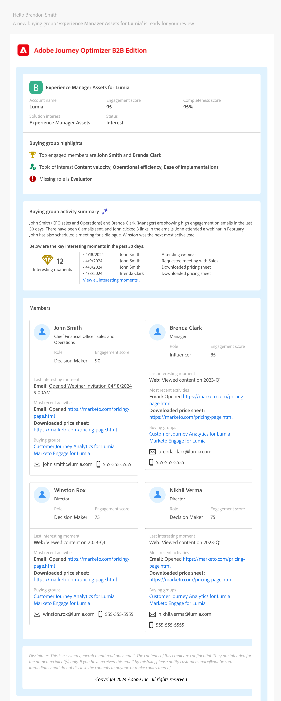
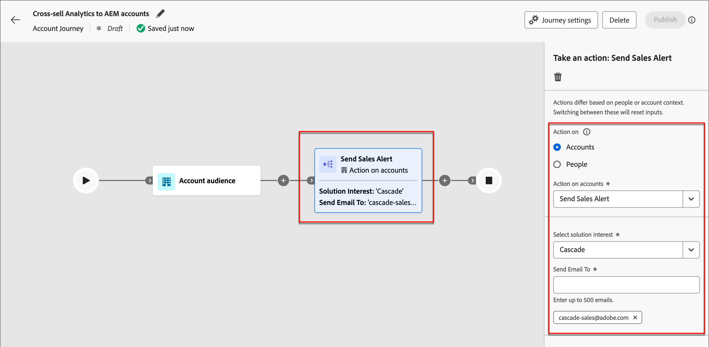

# 販売アラートメール

_セールスアラートメール_&#x200B;は、購買グループのセールスへの引き継ぎを示します。 このメールには、購買グループの概要と、購買グループのメンバーとその活動に関する情報が含まれています。

マーケターは、アカウントジャーニーにセールスアラートメールノードを設定し、特定の購買グループに対するジャーニーの完了を営業部門に通知できます。 ノード内では、営業部門のメールアドレスや、一連のアカウントにリーチする配信エイリアスを指定できます。

>[!IMPORTANT]
>
>営業通知メールを配信できるように、組織の許可リストが更新されていることを確認します。 詳しくは、[ トラッキングとメール配信のプロトコル ](../start/email-protocols.md)を参照してください。

## メールコンテンツ

+++販売アラートメールのサンプル
{width="500" zoomable="yes"}

+++

| セクション | 名前 | 説明 |
| - | ---- | ----------- |
| 購買グループ情報 | 購買グループ名 | 購買グループの表示名。 |
|   | アカウント名 | アカウントの名前。 |
|   | エンゲージメントスコア | 過去30日間のアクティブなエンゲージメント活動に基づく、購買グループのエンゲージメントスコア。 |
|   | 完全性スコア | 購買グループの完全性スコア： |
|   | ソリューションに対する関心 | 購買グループにリンクされたソリューションへの関心&#39; |
|   | ステータス | 購買グループのステータス： |
| 購買グループのハイライト | 最もエンゲージメントの高いメンバー | 購買グループの最もエンゲージメントの高いメンバー（購買グループメンバーのエンゲージメントスコアと役割による）。 |
|   | 関心のあるトピック | 電子メール、ダウンロード、チャット、PDFレビュー、アクティビティの概要、ウェビナーの質問にもとづいて、コンテンツエンゲージメントで最も頻繁に使用されるキーワード。 |
|   | 環境にない役割 | テンプレート内の必須の役割ですが、購買グループにはありません。 |
| 購買グループの要約 | アクティビティの概要（生成AIを活用） | メンバーの活動に基づいてAIが生成した購買グループの概要。 過去30日間の活動が考慮されます。 |
|   | 重要な興味深い瞬間 | 購買グループのメンバーに関連する最近の興味深い瞬間。 |
| メンバー | 購買メンバー4名のリスト | エンゲージメントスコアと役割別の上位4つの購買グループメンバーの詳細。 |
| 各購買グループメンバー | メンバー名 | 購買グループメンバーの名前。 |
|   | 職位 | 購買グループメンバーのタイトル。 |
|   | 役割 | メンバーの購買グループの役割。 |
|   | エンゲージメントスコア | 購買グループメンバーのエンゲージメントスコア： スコアは、過去30日間のアクティブなエンゲージメント活動にもとづいて算出されます。 |
|   | 最新の注目のアクション | メンバーに関連する最近の最も興味深い瞬間。 |
|   | 最新のアクティビティ | 購買グループメンバーに関連する最新の2つのアクティビティ。 |
|   | メール ID | 購買グループメンバーのメール ID。 |
|   | 電話番号 | 購買グループメンバーの電話番号。 |

## アカウントジャーニーにセールスアラートメールアクションを追加する

_[!UICONTROL アクションを実行]_ ノードを追加し、次の操作を行うと、アカウントジャーニーにセールスアラートのメール配信を設定できます。

1. ]_ターゲットの_[!UICONTROL  アクションで、**[!UICONTROL アカウント]**&#x200B;を選択します。

1. アカウント ]_に対する_[!UICONTROL  アクションの場合は、**[!UICONTROL セールスアラートを送信]**&#x200B;を選択します。

1. **[!UICONTROL ソリューションの関心を選択]**&#x200B;するには、生成されるメールコンテンツに使用するソリューションの関心を選択します。

1. 「**[!UICONTROL メール送信先]**」に、配信に含める各メールアドレスまたはエイリアスを入力します。

   {width="600" zoomable="yes"}

   アカウントジャーニーが開始されると、これらのパラメーターに従ってセールスアラートが配信されます。
