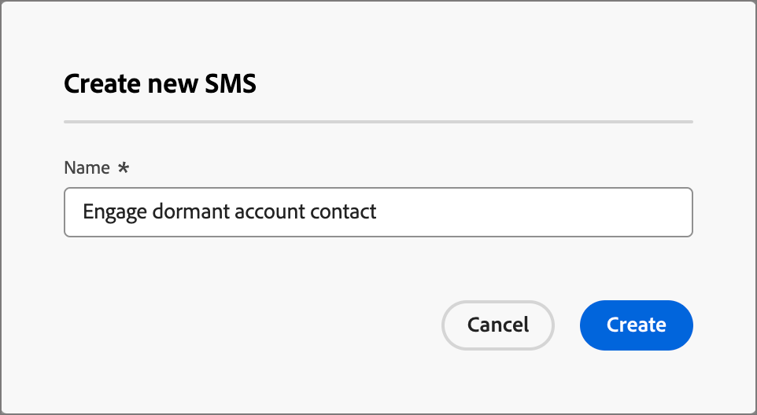
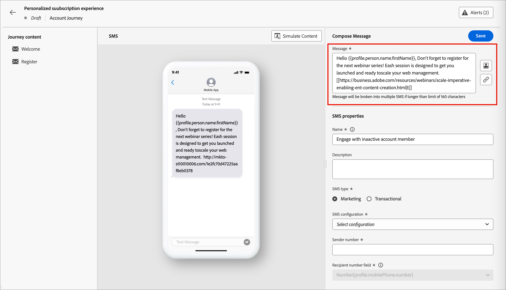
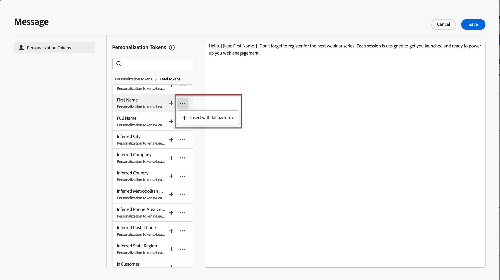
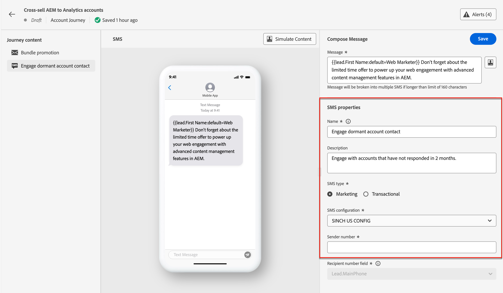

# SMS オーサリング

Adobe Journey Optimizer B2B editionを使用すると、モバイルデバイスを使用しているお客様にテキストメッセージ（SMS）を送信できます。 SMS エディターで、テキスト形式のメッセージの作成、パーソナライズおよびプレビューを行うことができます。

アカウントジャーニーのSMS メッセージを作成する前に、_[!UICONTROL 管理者]_&#x200B;設定から[SMS サービスプロバイダー](../admin/configure-channels-sms.md)が設定されていることを確認してください。

## アカウントジャーニーでのSMS アクションの追加

_[!UICONTROL アクションを実行]_ ノードを追加し、次の操作を行うと、アカウントジャーニーでテキストメッセージ配信を設定できます。

1. ターゲット _の_ アクションで、**[!UICONTROL 人物]**&#x200B;を選択します。

1. _[!UICONTROL 人物に対するアクション]_&#x200B;で、**[!UICONTROL SMSを送信]**&#x200B;を選択します。

   {width="800" zoomable="yes"}

1. _[!UICONTROL アクションを実行]_ パネルの下部にある「**[!UICONTROL SMSを作成]**」をクリックします。

1. ダイアログで、SMS メッセージの一意の&#x200B;**[!UICONTROL 名前]**&#x200B;を入力します。

   {width="400"}

1. 「**[!UICONTROL 作成]**」をクリックします。

   _ジャーニーマップ_&#x200B;が開き、メッセージを作成し、メッセージを送信するためのSMS プロパティを設定できます。

### SMS メッセージの作成

>[!IMPORTANT]
>
>**SMS同意管理** 
>
>業界標準や規制に従って、すべてのSMS マーケティングメッセージには、受信者が簡単に購読を解除できる方法が含まれている必要があります。 SMS 受信者は、オプトインおよびオプトアウトのキーワードで返信ですることでこれを実行できます。 あらゆる標準的なオプトインキーワードとオプトアウトキーワードに対応しています。 さらに、SMS サービスプロバイダーアカウントに設定されたカスタムキーワードは、サポートされ、尊重されます。

**[!UICONTROL メッセージ]** フィールドに送信するテキストを入力します。

最大1600文字のメッセージを作成でき、160文字ごとに1つのSMS メッセージと見なされます。

{width="800" zoomable="yes"}

#### テキストメッセージのパーソナライズ

1. パーソナライゼーショントークンを追加するメッセージ内の場所にカーソルを置きます。

1. テキストメッセージボックスの右側にある「_パーソナライズ_」アイコン（）をクリックします。

   このダイアログでは、アカウントトークン、人物トークン、システムトークンにアクセスできます。 標準トークンとカスタムトークンの両方が含まれています。 _検索_ バーを使用して必要なトークンを検索するか、フォルダーツリー内を移動してトークンのいずれかを検索して選択できます。

1. トークンの横にあるプラス（**+**）記号をクリックして、トークンを追加します。

   フォールバックを含むトークンを追加する場合（このフィールドがリードに使用できない場合に表示されるデフォルト）、_詳細_ アイコン （**...**）をクリックし、**[!UICONTROL フォールバックテキストを含む挿入]**&#x200B;を選択します。

   {width="700" zoomable="yes"}

1. _[!UICONTROL フォールバック値を入力]_ ダイアログで、フォールバックとして表示されるテキストを入力し、**[!UICONTROL 追加]**&#x200B;をクリックします。

   {width="450"}

1. パーソナライゼーショントークンを配置したら、**[!UICONTROL 保存]**&#x200B;をクリックして変更を保存し、メインのSMS オーサリングワークスペースに戻ります。

   必要に応じて、トークンを使用してメッセージを引き続き編集できます。

#### テキストメッセージへのリンク（URL）の追加

1. メッセージテキストを入力したら、テキストメッセージボックスの右側にある&#x200B;_リンク_ アイコン（）をクリックします。

1. リンクの&#x200B;**[!UICONTROL URL]**&#x200B;を入力してください。

<!-- 1. In the dialog, choose the type of URLs to link:

   * **[!UICONTROL Landing Page]** - Choose this option to select any of the approved Adobe Marketo Engage landing pages from your Marketo Engage instance. Select the workspace, and then select the landing page.

   * **[!UICONTROL External URL]** - This type is any external URL that you enter in the text box. -->

1. Marketo Engageのランディングページを使用する場合は、トラッキングオプションを設定します。

   * **[!UICONTROL トラッキングを有効にする]** – このチェックボックスを選択してトラッキングを有効にします。これには、_URLの短縮_&#x200B;が必要です。 ランディングページの場合は、短縮URLにMarketo Engage サブドメインを使用します。 短縮URL形式のサンプルが表示されます。 実際のURLは、SMSが受信者に送信されたときに作成されます。

   * **[!UICONTROL mkt_tok]**&#x200B;を含める – ユーザーに対するアクティビティを追跡するには、このチェックボックスを選択します。 

     >[!NOTE]
     >
     >トラッキングを許可し、_[!UICONTROL Include mkt_tok]_&#x200B;を無効にすると、リダイレクト後に宛先URLに`mkt_tok` クエリ文字列パラメーターが含まれなくなります。 このパラメーターは、Marketo EngageのランディングページおよびMunchkinで使用され、人物のアクティビティ（メールの購読解除など）を追跡するために使用されます。 パラメーターがweb サイトで問題を引き起こす場合を除き、このオプションを無効にしないでください。 
     >Web サイトでのMunchkin トラッキングコードの使用について詳しくは、[Marketo Engage ドキュメント &#x200B;](https://experienceleague.adobe.com/en/docs/marketo/using/product-docs/administration/additional-integrations/add-munchkin-tracking-code-to-your-website){target="_blank"}を参照してください。

   {width="470"}

1. リンクオプションが完了したら、**[!UICONTROL 追加]**&#x200B;をクリックして変更を保存し、SMS メッセージにURL リンクを追加します。

### SMS プロパティの設定

1. 「_[!UICONTROL SMS プロパティ]_」セクションに、メッセージの&#x200B;**[!UICONTROL 名前]** （必須、100文字の最大値）と&#x200B;**[!UICONTROL 説明]** （オプション、300文字の最大値）を入力します。

   これらのフィールドには、Alpha、数値、特殊文字を使用できます。 次の予約済み文字は&#x200B;**許可されていません**: `\`、`/`、`:`、`*`、`?`、`"`、`<`、`>`および`|`。

1. **[!UICONTROL SMSの種類]**&#x200B;を選択してください：

   * プロモーションテキストメッセージには`Marketing`を使用します。これにはユーザーの同意が必要です。
   * 注文確認、パスワードリセット通知、配信情報など、非商用メッセージには`Transactional`を使用します。

1. **[!UICONTROL SMS設定]**&#x200B;の場合は、事前定義済みの[SMS API設定](../admin/configure-channels-sms.md#create-new-api-credentials-for-an-sms-service-provider)のいずれかを選択します。

   この設定は、メッセージの配信に使用するSMS ゲートウェイサービスプロバイダーとアカウントを決定します。

1. 通信に使用する&#x200B;**[!UICONTROL 送信者番号]**&#x200B;を入力します。

   {width="500" zoomable="yes"}

   受信者番号は、常にExperience Platformの`profile.mobilePhone.number` フィールドにマッピングされます。

### テキストメッセージのコンテンツをシミュレート {#preview-test}

>[!CONTEXTUALHELP]
>id="ajo-b2b_sms_preview_simulate"
>title="コンテンツのレンダリング方法の確認"
>abstract="コンテンツを定義したら、プレビューして、使用しているチャネルのレンダリングを確認できます。"

メッセージコンテンツを定義したら、テストプロファイルを使用して、そのコンテンツをシミュレート（プレビュー）できます。 パーソナライズされたコンテンツを挿入した場合は、テストプロファイルデータを使用して、このコンテンツがメッセージにどのように表示されるかを確認できます。

>[!IMPORTANT]
>
>テキストメッセージのシミュレーションを実行する前に、SMS メッセージを必ず保存してください。

1. SMS オーサリングワークスペースの上部にある「**[!UICONTROL コンテンツをシミュレート]**」をクリックします。

1. _[!UICONTROL コンテンツをシミュレート]_ ページで、**[!UICONTROL ユーザーを追加]**&#x200B;をクリックします。

1. _コンテンツをシミュレート_ ページを使用して、テストプロファイルに使用するリードを管理します。

   表示されたリストでは、Marketo Engage リードデータベースから任意のリード（一度に最大10件）を検索して追加できます。

   検索するには、電子メールアドレス全体を入力し、_Enter_&#x200B;を押します。 対応するリードプロファイルが選択用に表示されます。

   プレビューは、選択したプロファイルのパーソナライゼーションフィールドに更新されます。

   追加されたリードはすべて左側に表示されます。

   このリストを管理するには、さらにユーザーを追加し、プロファイルリストから個々のリードを削除します（データベースから削除されません）。

1. 選択したリードのコンテンツをシミュレート

   左側にリストされているリードのいずれかを選択します。 ページ上のSMS プレビューが、選択したリードを更新します。

   プレビュースペースの上にあるセレクターからリードを選択して、対応するリードのページ上のSMS プレビューを更新することもできます。

1. _[!UICONTROL コンテンツのシミュレート]_ ページを終了してSMS オーサリングワークスペースに戻るには、右上の&#x200B;**[!UICONTROL 閉じる]**&#x200B;をクリックします。

## SMS同意管理

受信者に、ブランドからのコミュニケーションの受信を登録解除する機能を提供し、この選択を尊重することが法的要件です。 これらの規制を遵守しないと、企業に法的リスクが生じます。 この機能はまた、受信者に未承諾のコミュニケーションを送信することを避けるのに役立ちます。これにより、受信者はメッセージをスパムとしてマークし、レピュテーションを損なう可能性があります。

このオプションを指定すると、SMS受信者はオプトインキーワードとオプトアウトキーワードで返信できます。 標準のオプトインキーワードとオプトアウトキーワードはすべてサポートされ、尊重されます。また、SMS サービスプロバイダーで設定されているすべてのカスタムキーワードもサポートされます。 購読解除すると、プロファイルは今後のマーケティングメッセージのオーディエンスから自動的に削除されます。

Journey Optimizer B2B editionでは、次のロジックを使用してSMS メッセージのオプトアウトを管理できます。

* デフォルトでは、リードが自社からのコミュニケーションの受信をオプトアウトした場合、対応するプロファイルは後続のSMS配信から除外されます

* このリード同意は、様々なソース（AEPやSMS サービスプロバイダーなど）から取得され、Journey Optimizer B2B editionに同期されます。 現在、インスタンスレベルでは、リードごとに1つの同意状態のみがサポートされています（リード「John Doe」は、インスタンス内のすべてのプロモーション SMSに購読または購読解除されています）。 現在、ブランドレベル/個人サブスクリプションリストレベルの同意に対するダブルオプトインはサポートしていません。
