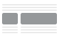
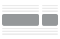
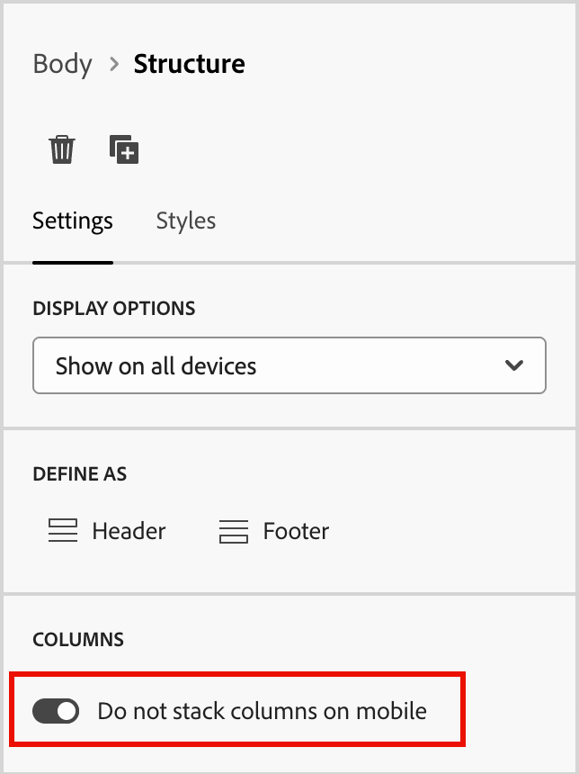

# 構造コンポーネント {#structure-components}

>[!CONTEXTUALHELP]
>id="ajo-b2b_structure_components_email"
>title="構造コンポーネントについて"
>abstract="コンテンツコンポーネントは、メールの構造のデザイン作成に使用できる空のコンテンツプレースホルダーです。"

>[!CONTEXTUALHELP]
>id="ajo-b2b_structure_components_landing_page"
>title="構造コンポーネントについて"
>abstract="構造コンポーネントは、ページの構造のデザイン作成に使用できるレイアウト要素です。"

>[!CONTEXTUALHELP]
>id="ajo-b2b_structure_components_fragment"
>title="構造コンポーネントについて"
>abstract="構造コンポーネントは、フラグメントの構造のデザイン作成に使用できるレイアウト要素です。"

>[!CONTEXTUALHELP]
>id="ajo-b2b_structure_components_template"
>title="構造コンポーネントについて"
>abstract="構造コンポーネントは、テンプレートの構造のデザイン作成に使用できるレイアウト要素です。"

ビジュアルデザインスペースで _構造コンポーネント_ を使用して、コンテンツの構造を定義します。 単純なドラッグ&amp;ドロップ操作で構造要素を追加したり移動したりして、コンテンツレイアウトの形状をすばやく定義することができます。 各構造コンポーネントは水平スペースに広がっており、それらを積み重ねてレイアウトを垂直に構築できます。 各コンポーネントを列に分割して、必要な各コンテンツブロックを形成します。

## 構造ライブラリ

_[!UICONTROL コンポーネント]_ ライブラリの上部にある **[!UICONTROL 構造]** セクションには、使用可能な構造コンポーネントが表示されます。

| アイコン | コンポーネント。 | 説明 |
| ----- | ----------- | ----------- |
|  | [!UICONTROL 1:1 列 &#x200B;] | スペースの幅を埋める 1 列のコンテナ。 |
|  | [!UICONTROL 1:2 列左 &#x200B;] | スペースの幅を埋めるために 1:2 の比率を使用する 2 列のコンテナ。 最初（左）の列は幅の 3 分の 1 を占め、2 番目（右）の列は残りの 3 分の 2 を占めます。 |
|  | [!UICONTROL 1:3 列左 &#x200B;] | スペースの幅を埋めるために 1:3 の比率を使用する 2 列のコンテナ。 最初の列（左）は幅の 4 分の 1 を占め、2 番目の列（右）は残りの 4 分の 3 を占めます。 |
|  | [!UICONTROL 2:1 列右 &#x200B;] | スペースの幅を埋めるために 2:1 の比率を使用する 2 列のコンテナ。 最初の列（左）は幅の 3 分の 2 を占め、2 番目の列（右）は残りの 3 分の 1 を占めます。 |
|  | [!UICONTROL 2:2 列 &#x200B;] | スペースの幅を埋めるために 2:2 の比率を使用する 2 列のコンテナ。 左右の列の幅は同じです。 |
|  | [!UICONTROL 3:1 列右 &#x200B;] | スペースの幅を埋めるために 3:1 の比率を使用する 2 列のコンテナ。 最初の列（左）は幅の 4 分の 3 （75%）を占め、2 番目の列（右）は残りの 4 分の 1 （25%）を占めます。 |
|  | [!UICONTROL 3:3 列 &#x200B;] | スペースの幅を埋めるために 3:3 の比率を使用する 3 列のコンテナ。 3 つの列の幅はすべて等しくなります。 |
|  | [!UICONTROL 4:4 列 &#x200B;] | スペースの幅を埋めるために 4:4 の比率を使用する 4 列のコンテナ。 4 つの列の幅はすべて等しくなります。 |
|  | [!UICONTROL n:n 列 &#x200B;] | 定義した列に従ってスペースを埋める、カスタマイズ可能な列構造。 列数（2～10 個）を設定し、各列の幅を個別に設定します。 [詳細情報](#change-nn-columns) |

## 構造コンポーネントの追加

メール、ランディングページまたはフラグメントのコンテンツをデザインする際には、各構造コンポーネントを追加してレイアウトを構築します。 左側の **[!UICONTROL 構造]** セクションから項目をドラッグして、キャンバスにドロップします。 ツールバーを使用して列を選択し、右側のパネルの _設定_ タブと _スタイル_ タブを使用して、選択したコンポーネントまたは列のパラメーターを定義できます。

{width="800" zoomable="yes"}

### コンポーネントツールバー

ツールバーは、キャンバスで選択すると、キャンバスに表示されます。 使用可能なツールを使用すると、列を簡単に選択し、コンポーネント関数を適用できます。

{width="150"}

| ツール | 名前 | 使用方法 |
| ---- | ---- | ----- |
| {width="40"} | 条件付きコンテンツを有効にする | コンポーネントの条件付きバリアントを有効にします。 [詳細情報](./conditional-content.md) |
| {width="100"} | 列を選択 | 数値で列を選択します。 列を選択すると、列の設定とスタイルを適用できます。 |
| {width="40"} | 複製 | コンポーネントのコピーを作成して、の直下に追加します。 |
| {width="40"} | 削除 | コンポーネントを削除します。 |

### コンポーネント設定

追加したコンポーネントは、ビジュアルデザインスペースで選択され、右側のパネルにそのプロパティが表示されます。 「_[!UICONTROL 設定]_」タブがデフォルトで表示されます。 また、いつでも構造コンポーネントを選択して、設定を変更できます。

#### 表示オプション

このコンポーネントをデスクトップまたはモバイルデバイスの表示から除外する場合は、「**[!UICONTROL 表示オプション]**」設定を変更します。 デフォルトの _[!UICONTROL すべてのデバイスで表示]_ では、すべてのデバイスで表示が有効になります。

{width="400" zoomable="yes"}

別の設定を選択して、デバイスタイプ別にコンポーネントを排他的にします。

* _[!UICONTROL デスクトップデバイスでのみ表示]_ - デスクトップデバイスにコンポーネントを表示し、モバイルデバイスに対して除外する場合、この設定を選択します。
* _[!UICONTROL モバイルデバイスにのみ表示]_ – 電話やタブレットなどのモバイルデバイスにコンポーネントを表示し、デスクトップデバイスには除外する場合、この設定を選択します。

#### ヘッダーとフッター

構造コンポーネントを、メールメッセージまたはランディングページのHTML ヘッダーまたはフッターとして指定できます。 キャンバスで構造コンポーネントを選択した状態で、「**[!UICONTROL ヘッダー]**」または **[!UICONTROL フッター]** オプションをクリックします。 ヘッダーまたはフッターは 1 つのみ使用でき、別のコンポーネントが割り当てられている場合は、このオプションを使用できません。

{width="600" zoomable="yes"}

ヘッダーまたはフッターの指定を削除するには、コンポーネントを選択し、削除するオプションをクリックします。

### 積み重ね列

画面が小さい場合や表示ウィンドウが小さい場合、デフォルト設定を変更しない限り、構造コンポーネント内の列は積み重ねて表示されます。 複数列構造コンポーネントを選択した状態で、切り替えスライダーを右に移動して、「**[!UICONTROL モバイルで列を積み重ねない]** 設定を変更します。

{width="250"} で列を積み重ねない

## コンポーネントスタイル

追加したコンポーネントは、ビジュアルデザインスペースで選択され、右側のパネルにそのプロパティが表示されます。 また、いつでもコンポーネントを選択して、設定やスタイルを変更できます。

### 背景

右側のパネルで「_[!UICONTROL スタイル]_」タブを選択した状態で、「**[!UICONTROL 背景]**」セクションを使用して、構造コンポーネントの背景として使用する色とオプションの画像を定義します。

#### [!UICONTROL &#x200B; 背景色 &#x200B;]

チェックボックスを選択してカラーの四角形をクリックし、ピッカーからカラーを選択します。 色を選択するには、RGB、HSL、HSB、または 16 進数値を入力します。 または、カラースライダーとカラーフィールドを使用して、カラーを選択します。

{width="300"}

#### [!UICONTROL &#x200B; 背景画像 &#x200B;]

切り替えセレクターを移動して、背景画像設定を有効にします。

{width="250"}

[ アセットソースタイプ ](./assets-overview.md) を選択し、画像ファイルを選択します。

+++[!UICONTROL Marketo Engage アセット]

{{me-dam}}

+++

+++[!UICONTROL Experience Manager Assets]

{{aem-assets-dam}}

+++

+++[!UICONTROL メディアを読み込み]

{{image-upload}}

+++

**[!UICONTROL 画像の配置]** オプションを使用して、画像が構造コンポーネントにどのように入力されるかを選択します。 プレースメントの設定は、標準の [HTMLの背景画像の塗りつぶしと整列の属性 ](https://www.w3schools.com/html/html_images_background.asp){target="_blank"} に従います。

{width="250"}

### その他のスタイル

他の構造コンポーネントスタイルを適用して、メールメッセージまたはランディングページでの表示を調整できます。

+++境界

{{styles-border}}

+++

+++余白

{{styles-margin}}

+++

+++アドバンス

{{styles-advanced}}

+++

## 列

コンポーネントツールバーの _列を選択_ ツールを使用して、列を選択します。 その後、列ツールバーを使用して、列の選択を変更したり、列を削除したり、列の条件付きコンテンツバリエーションを適用したりできます。 列のパラメーターは、右側の _[!UICONTROL 設定]_ タブと _[!UICONTROL スタイル]_ タブに表示されます。

{width="500"}

| ツール | 名前 | 使用方法 |
| ---- | ---- | ----- |
| {width="40"} | 列をクリア | 列の内容をクリアします。 |
| {width="40"} | 条件付きコンテンツを有効にする | 列の条件付きバリアントを有効にします。 [詳細情報](./conditional-content.md) |
| {width="100"} | 列を選択 | 数値で列を選択します。 列を選択すると、設定とスタイルを適用できます。 |

### n:n 列の変更

列の幅は、ほとんどの構造コンポーネントで静的です。 _[!UICONTROL n:n 列]_ コンポーネントを追加すると、列数と列のサイズを変更できます。 n:n 列コンポーネントは、幅が等しい（20%） 5 列で始まります。

>[!NOTE]
>
>各列のサイズを構造コンポーネントの全幅の 10% 未満にすることはできません。 削除できるのは空の列のみです。

キャンバスでコンポーネントを選択した状態で、右側のパネルの **[!UICONTROL 列数]** オプションを使用して列数を変更します。 上向き矢印アイコンと下向き矢印アイコンをクリックして列数を増減するか、フィールドに数値を入力します。

{width="650" zoomable="yes"}

キャンバスで、列サイジングアイコンを移動して、選択した列の幅を調整します。 幅を増減すると、隣接する列も調整され、すべての列がコンポーネントの幅の 100% を占めるようになります。

{width="500" zoomable="yes"}

### 列のスタイル

キャンバスで列を選択した状態で、その列に適用するスタイルを設定できます。

+++背景

* **[!UICONTROL 背景色]** - チェックボックスを選択してカラーの四角形をクリックし、ピッカーから色を選択します。 色を選択するには、RGB、HSL、HSB、または 16 進数値を入力します。 または、カラースライダーとカラーフィールドを使用して、カラーを選択できます。

  {width="300"}

* **[!UICONTROL 背景画像]** – 切り替えセレクターを移動して、背景画像設定を有効にします。

  {width="250"}

  アセットソースタイプを選択し [ 画像ファイルを選択 ](#background-image) ます。

+++

+++境界

{{styles-border}}

+++

+++配置

{{styles-alignment-v}}

+++

+++余白

{{styles-margin}}

+++

+++アドバンス

{{styles-advanced}}

+++

## ナビゲーションツリー

ビジュアルデザインスペースでは、ナビゲーションツリーを使用して、列やコンテンツなどの構造コンポーネントにアクセスできます。 左側の _[!UICONTROL ナビゲーションツリー]_ アイコン（）をクリックしてツリーを表示します。

{width="800" zoomable="yes"}

_[!UICONTROL Body]_ 要素は、ツリー構造のルートです。 ツリー内のコンポーネントまたは列の子要素をクリックして、キャンバス上で選択します。 右側の _[!UICONTROL 設定]_ タブと _[!UICONTROL スタイル]_ タブには、そのコンポーネントまたは列のパラメーターが表示されます。

{width="800" zoomable="yes"}
