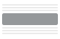
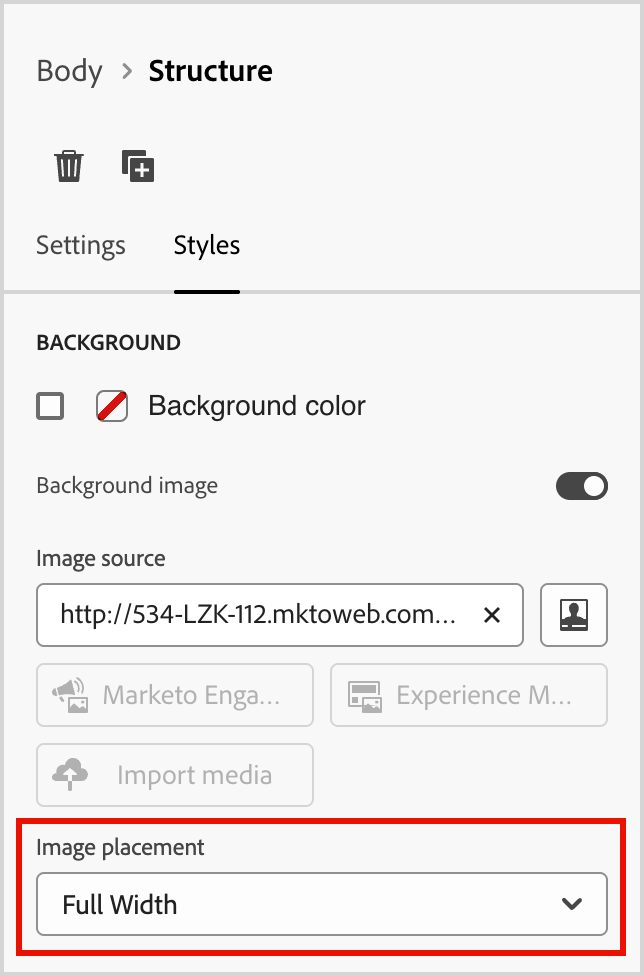

# 構造コンポーネント {#structure-components}

>[!CONTEXTUALHELP]
>id="ajo-b2b_structure_components_email"
>title="構造コンポーネントについて"
>abstract="コンテンツコンポーネントは、メールの構造のデザイン作成に使用できる空のコンテンツプレースホルダーです。"

>[!CONTEXTUALHELP]
>id="ajo-b2b_structure_components_landing_page"
>title="構造コンポーネントについて"
>abstract="構造コンポーネントは、ページの構造のデザイン作成に使用できるレイアウト要素です。"

>[!CONTEXTUALHELP]
>id="ajo-b2b_structure_components_fragment"
>title="構造コンポーネントについて"
>abstract="構造コンポーネントは、フラグメントの構造のデザイン作成に使用できるレイアウト要素です。"

>[!CONTEXTUALHELP]
>id="ajo-b2b_structure_components_template"
>title="構造コンポーネントについて"
>abstract="構造コンポーネントは、テンプレートの構造のデザイン作成に使用できるレイアウト要素です。"

ビジュアルデザイン空間で&#x200B;_構造コンポーネント_&#x200B;を使用して、コンテンツの構造を定義します。 シンプルなドラッグ&amp;ドロップ操作で構造要素を追加、移動することで、コンテンツレイアウトの形状をすばやく定義できます。 それぞれの構造コンポーネントは水平方向のスペースにまたがり、それらを積み重ねて垂直方向にレイアウトを構築できます。 各コンポーネントを列に分けて、必要な各コンテンツブロックを作成します。

## 構造ライブラリ

_[!UICONTROL コンポーネント]_ ライブラリの上部にある&#x200B;**[!UICONTROL 構造]** セクションには、使用可能な構造コンポーネントが表示されます。

| アイコン | コンポーネント： | 説明 |
| ----- | ----------- | ----------- |
|  | [!UICONTROL 1:1列] | スペースの幅を埋める1列のコンテナ。 |
|  | [!UICONTROL 1:2列左] | 1:2の比率を使用してスペースの幅を埋める2列のコンテナ。 最初の（左）列は幅の3分の1を占め、2番目の（右）列は残りの3分の2を占めます。 |
|  | [!UICONTROL 1:3列左] | 1:3の比率を使用してスペースの幅を埋める2列のコンテナ。 第1の（左）列は幅の4分の1を占め、第2の（右）列は残りの3分の4を占める。 |
|  | [!UICONTROL 2:1列右] | 2:1の比率を使用してスペースの幅を埋める2列のコンテナ。 最初の（左）列は幅の3分の2を占め、2番目の（右）列は残りの3分の1を占めます。 |
|  | [!UICONTROL 2:2列] | 2:2の比率を使用してスペースの幅を埋める2列のコンテナ。 左右の列の幅は同じです。 |
|  | [!UICONTROL 3:1列右] | スペースの幅を埋めるために3:1の比率を使用する2列のコンテナ。 最初の（左）列は幅の4分の3 （75%）を占め、2番目の（右）列は残りの4分の1 （25%）を占めます。 |
|  | [!UICONTROL 3:3列] | 3:3の比率を使用してスペースの幅を埋める3列のコンテナ。 3つの列はすべて幅が同じです。 |
|  | [!UICONTROL 4:4列] | 4:4の比率を使用してスペースの幅を埋める4列のコンテナ。 4つの列はすべて幅が同じです。 |
|  | [!UICONTROL n:n列] | 定義した列に従ってスペースを埋める、カスタマイズ可能な列構造。 列数（2から10の間）を設定し、各列の幅を個別に設定します。 [詳細情報](#change-nn-columns) |

## 構造コンポーネントを追加

メール、ランディングページ、フラグメントのコンテンツをデザインする際には、それぞれの構造コンポーネントを追加してレイアウトを作成します。 左側の&#x200B;**[!UICONTROL 構造]** セクションから項目をドラッグし、キャンバスにドロップします。 ツールバーを使用して列を選択し、右側のパネルの「_設定_」タブと「_スタイル_」タブを使用して、選択したコンポーネントまたは列のパラメーターを定義できます。

{width="800" zoomable="yes"}

### コンポーネントツールバー

ツールバーは、カンバスで選択したときにカンバスに表示されます。 使用可能なツールを使用すると、列を選択してコンポーネント関数を適用する簡単な方法を提供できます。

{width="150"}

| ツール | 名前 | 使用方法 |
| ---- | ---- | ----- |
| {width="40"} | 条件付きコンテンツの有効化 | コンポーネントの条件付きバリアントを有効にします。 [詳細情報](./conditional-content.md) |
| {width="100"} | 列を選択 | 番号で列を選択します。 列を選択すると、列の設定とスタイルを適用できます。 |
| {width="40"} | 複製 | コンポーネントのコピーを作成し、以下に直接追加します。 |
| {width="40"} | 削除 | コンポーネントを削除します。 |

### コンポーネント設定

コンポーネントを追加すると、ビジュアルデザインスペースでコンポーネントが選択され、右側のパネルにそのプロパティが表示されます。 デフォルトでは、_[!UICONTROL 設定]_ タブが表示されます。 また、いつでも構造コンポーネントを選択して、設定を変更することもできます。

#### 表示オプション

デスクトップまたはモバイルデバイスの表示からコンポーネントを除外する場合は、**[!UICONTROL 表示オプション]**&#x200B;設定を変更します。 デフォルトの&#x200B;_[!UICONTROL すべてのデバイスに表示]_&#x200B;では、すべてのデバイスで表示が有効になります。

{width="400" zoomable="yes"}

別の設定を選択して、デバイスタイプ別にコンポーネントを排他的にします。

* _[!UICONTROL デスクトップデバイスでのみ表示]_ - コンポーネントをデスクトップデバイスに表示し、モバイルデバイスに対して除外する場合は、この設定を選択します。
* _[!UICONTROL モバイルデバイスでのみ表示]_ – この設定は、スマートフォンやタブレットなどのモバイルデバイスにコンポーネントを表示し、デスクトップデバイスに対しては除外する場合に選択します。

#### ヘッダーとフッター

構造コンポーネントは、メールメッセージまたはランディングページのHTML ヘッダーまたはフッターとして指定できます。 キャンバスで構造コンポーネントを選択した状態で、**[!UICONTROL ヘッダー]**&#x200B;または&#x200B;**[!UICONTROL フッター]** オプションをクリックします。 ヘッダーまたはフッターは1つだけ指定でき、別のコンポーネントが割り当てられている場合、このオプションは使用できません。

{width="600" zoomable="yes"}

ヘッダーまたはフッターの指定を削除するには、コンポーネントを選択し、オプションをクリックして削除します。

### 積み重ね列

小さい画面または表示ウィンドウの場合、デフォルト設定を変更しない限り、構造コンポーネントの列は積み重ねとして表示されます。 複数列構造コンポーネントを選択した状態で、切り替えスライダーを右に移動して、**[!UICONTROL モバイルで列をスタックしない]**&#x200B;設定を変更します。

{width="250"}で列をスタックしない

## コンポーネントスタイル

コンポーネントを追加すると、ビジュアルデザインスペースでコンポーネントが選択され、右側のパネルにそのプロパティが表示されます。 また、いつでもコンポーネントを選択して、設定やスタイルを変更することもできます。

### 背景

右側のパネルで「_[!UICONTROL スタイル]_」タブを選択した状態で、**[!UICONTROL 背景]** セクションを使用して、構造コンポーネントの背景として使用するカラーとオプションの画像を定義します。

#### [!UICONTROL 背景色]

チェックボックスを選択し、カラーの正方形をクリックして、ピッカーからカラーを選択します。 RGB、HSL、HSB、または16進数値を入力すると、カラーを選択できます。 または、カラースライダーとカラーフィールドを使用してカラーを選択します。

{width="300"}

#### [!UICONTROL 背景画像]

切り替えセレクターを移動して、背景画像の設定を有効にします。

{width="250"}

[ アセットソースタイプ ](./assets-overview.md)を選択し、画像ファイルを選択します。

+++[!UICONTROL Marketo Engage アセット]

{{me-dam}}

+++

+++[!UICONTROL Experience Manager Assets]

{{aem-assets-dam}}

+++

+++[!UICONTROL メディアを読み込み]

{{image-upload}}

+++

**[!UICONTROL 画像の配置]** オプションを使用して、画像が構造コンポーネントをどのように塗りつぶすかを選択します。 プレースメント設定は、標準の[HTML背景画像塗りつぶしと整列属性](https://www.w3schools.com/html/html_images_background.asp){target="_blank"}に従います。

{width="250"}

### その他のスタイル

その他の構造コンポーネントスタイルを適用して、メールメッセージまたはランディングページでの表示を調整できます。

+++境界

{{styles-border}}

+++

+++マージン

{{styles-margin}}

+++

+++アドバンス

{{styles-advanced}}

+++

## 列

コンポーネントツールバーの「_列を選択_」ツールを使用して、列を選択します。 次に、列ツールバーを使用して、列の選択を変更したり、列を削除したり、列に条件付きコンテンツのバリエーションを適用したりできます。 列のパラメーターは、右側の&#x200B;_[!UICONTROL 設定]_ タブと&#x200B;_[!UICONTROL スタイル]_ タブに表示されます。

{width="500"}

| ツール | 名前 | 使用方法 |
| ---- | ---- | ----- |
| {width="40"} | 列をクリア | 列のコンテンツをクリアします。 |
| {width="40"} | 条件付きコンテンツの有効化 | 列の条件付きバリアントを有効にします。 [詳細情報](./conditional-content.md) |
| {width="100"} | 列を選択 | 番号で列を選択します。 列を選択すると、設定とスタイルを適用できます。 |

### n:n列を変更

列の幅は、ほとんどの構造コンポーネントで静的です。 _[!UICONTROL n:n列]_ コンポーネントを追加すると、列数と列サイズを変更できます。 n:n列コンポーネントは、幅が同じ5列（20%）で始まります。

>[!NOTE]
>
>各列のサイズは、構造コンポーネントの全幅の10%未満にすることはできません。 削除できるのは空の列のみです。

カンバスでコンポーネントを選択した状態で、右側のパネルの「**[!UICONTROL 列数]**」オプションを使用して、列数を変更します。 上下の矢印アイコンをクリックして、列数を増減するか、フィールドに数値を入力します。

{width="650" zoomable="yes"}

カンバスで、列サイズ アイコンを移動して、選択した列の幅を調整します。 幅を増減すると、隣接する列も調整され、すべての列がコンポーネント幅の100%を占めるようになります。

{width="500" zoomable="yes"}

### 列スタイル

カンバスで列を選択した状態で、その列に適用するスタイルを設定できます。

+++背景

* **[!UICONTROL 背景色]** - チェックボックスを選択し、色の正方形をクリックして、ピッカーから色を選択します。 RGB、HSL、HSB、または16進数値を入力すると、カラーを選択できます。 または、カラースライダーとカラーフィールドを使用してカラーを選択することもできます。

  {width="300"}

* **[!UICONTROL 背景画像]** - トグルセレクターを移動して、背景画像設定を有効にします。

  {width="250"}

  アセットソースタイプを選択し、[画像ファイルを選択](#background-image)。

+++

+++境界

{{styles-border}}

+++

+++配置

{{styles-alignment-v}}

+++

+++マージン

{{styles-margin}}

+++

+++アドバンス

{{styles-advanced}}

+++

## ナビゲーションツリー

ビジュアルデザイン空間では、ナビゲーションツリーを使用して、列やコンテンツなどの構造コンポーネントにアクセスできます。 左側の&#x200B;_[!UICONTROL ナビゲーションツリー]_ アイコン（）をクリックすると、ツリーが表示されます。

{width="800" zoomable="yes"}

_[!UICONTROL Body]_&#x200B;要素は、ツリー構造のルートです。 ツリー内のコンポーネントまたは列の子要素のいずれかをクリックして、キャンバス上で選択します。 右側の&#x200B;_[!UICONTROL 設定]_ タブと&#x200B;_[!UICONTROL スタイル]_ タブには、そのコンポーネントまたは列のパラメーターが表示されます。

{width="800" zoomable="yes"}
