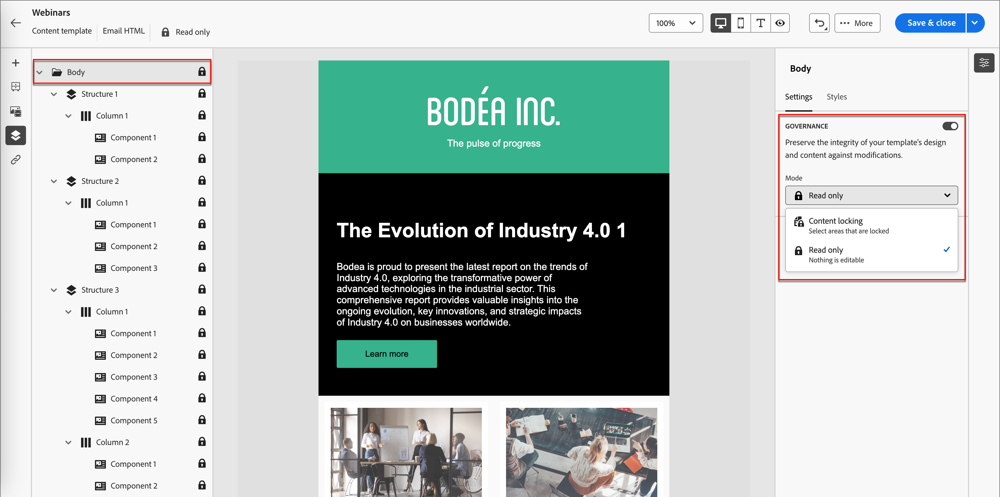
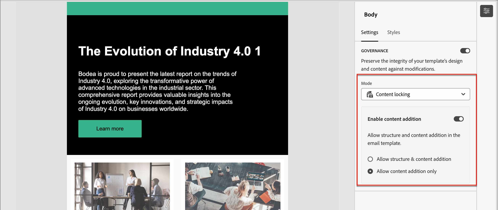
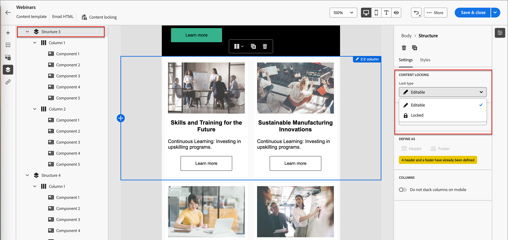
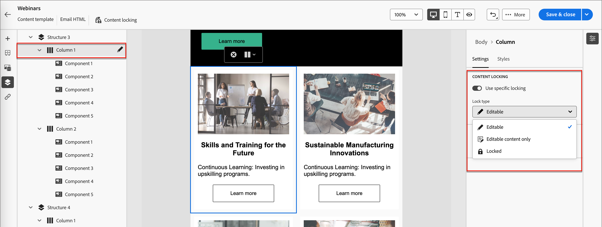

# テンプレートコンテンツガバナンス

多くのマーケティング部門には、メール施策をデザインするコンテンツの専門家がいます。 特定のデザインは、組織全体のカスタムアカウントジャーニーの基盤として使用できます。 承認済みのコンテンツデザインを確実に遵守するために、コンテンツガバナンス機能を使用してテンプレートコンポーネントをロックできます。 メールテンプレートでコンテンツロックを有効にすると、マーケターは許可された要素のみを変更して、コンテンツ戦略との整合性を維持できます。

例えば、ブランドコミュニケーションの継続性のために設計されたヘッダーとフッターをロックできます。 また、本文セクションを含む列をロックすることもできますが、作成者はアカウントジャーニーデザイン内の目的を満たすようにテキストを変更できます。

## テンプレートのコンテンツガバナンスを有効にする

ビジュアルデザインスペースを使用して、メールテンプレートの構造およびコンテンツコンポーネント ](./email-template-authoring.md)を[ オーサリングしたら、ガバナンスを有効にし、必要に応じて特定のコンテンツロックを適用します。

1. ビジュアルデザイン空間で、_ナビゲーションツリー_&#x200B;を使用して、レイヤー/コンテナおよび要素にアクセスします。

   キャンバスの左側にある&#x200B;_ナビゲーションツリー_ アイコン（）をクリックして、ツリーを表示します。

1. ツリーで、ルート **[!UICONTROL Body]** コンポーネントを選択します。

   キャンバスの右側にあるプロパティパネルには、デフォルトで「_[!UICONTROL 設定]_」タブが表示されます。

1. **[!UICONTROL ガバナンス]** オプションを有効にします。

   {width="800" zoomable="yes"}

   このオプションを有効にすると、デフォルトの&#x200B;_[!UICONTROL モード]_&#x200B;は&#x200B;**[!UICONTROL 読み取り専用]**&#x200B;になります。 このモードをルートレベルで設定すると、テンプレート内のすべての要素がロックされます。 左側のツリー構造には、ルートとすべての子要素の横に&#x200B;_読み取り専用_ アイコン（）が表示されます。

1. テンプレート内で特定のコンテンツロックを有効にするには、**[!UICONTROL モード]**&#x200B;を&#x200B;**[!UICONTROL コンテンツロック]**&#x200B;に変更します。

   このモードをルートレベルで設定すると、テンプレート内のすべての要素のロックが解除されます。 左側のツリー構造には、ルート要素の横に&#x200B;_コンテンツロッキング_ アイコン（）が表示されます。 必要に応じて、コンテンツのロックを含む（構造）および個々のコンテンツコンポーネントに適用します。

   ジャーニーメール作成者が構造要素またはコンテンツ要素を追加できるようにするには、**[!UICONTROL コンテンツの追加を有効にする]**&#x200B;をオンにします。 許可する追加のタイプを選択します。

   * **[!UICONTROL 構造とコンテンツの追加を許可]** – 作成者が構造要素とコンテンツ要素の両方を追加できるようにするには、このオプションを選択します。

   * **[!UICONTROL コンテンツの追加のみを許可]** – 作成者がコンテンツ要素のみを追加できるようにする場合は、このオプションを選択します。

   {width="600" zoomable="yes"}

   このモードをルートレベルで設定すると、テンプレート内のすべての要素がロックされます。 左側のツリー構造には、ルートとすべての子要素の横に&#x200B;_読み取り専用_ アイコン（）が表示されます。
<!--

   
- 
- 
- 
- 
-  
-->

## 構造にロックを適用する

構造的継承モデルを利用して、適用するガバナンスに従ってメールテンプレートのレイアウトと構造を計画します。 構造コンポーネントをコンテナとして使用すると、アイテムをロックまたは編集可能として簡単に指定できる方法でグループ化できます。 メールテンプレートのデザインが整ったら、構造を確認し、計画に従ってロック機能を適用します。

構造レベルでロックタイプを適用すると、その子コンポーネントのデフォルト設定が提供されます。 その後、必要に応じて、列レベルまたはコンテンツ要素レベルで特定のロック設定を適用できます。

1. キャンバスの左側にある&#x200B;_ナビゲーションツリー_ アイコン（）をクリックして、ツリーを表示します。

1. ツリー内の構造を選択します。

   キャンバスの右側にあるプロパティパネルには、デフォルトで「_[!UICONTROL 設定]_」タブが表示されます。

1. **[!UICONTROL ロックタイプ]**&#x200B;を設定します。

   * **[!UICONTROL ロック]** – この設定では、すべての子コンポーネントがデフォルトでロックされます。 左側のツリー構造には、すべての子コンポーネントの横に&#x200B;_読み取り専用_ アイコン （）が表示されます。

   * **[!UICONTROL 編集可能]** – この設定では、すべての子コンポーネントがデフォルトで編集可能です。 左側のツリー構造には、子コンポーネントの横にアイコンが表示されません。

   {width="800" zoomable="yes"}

## 子コンポーネントのロックの設定

1. ツリーでコンポーネントを選択します。

   キャンバスの右側にあるプロパティパネルには、デフォルトで「_[!UICONTROL 設定]_」タブが表示されます。

1. **[!UICONTROL 特定のロックを使用]** オプションを有効にします。

1. 適用するガバナンスのタイプを選択：

   * **[!UICONTROL 編集可能]** - メールオーサリング中にコンポーネントの完全な編集制御を許可します。
   * **[!UICONTROL 編集可能なコンテンツのみ]** – 電子メール作成者はコンテンツを変更できますが、コンポーネント自体は変更できません。
   * **[!UICONTROL ロック済み]** - メールオーサリング中にコンポーネントに変更が加えられるのを防ぎます。

     ロックされたコンポーネントの場合、**[!UICONTROL 削除を許可]** オプションをオンにすることで、電子メールのオーサリング中にコンポーネントの削除を許可できます。

   {width="800" zoomable="yes"}
