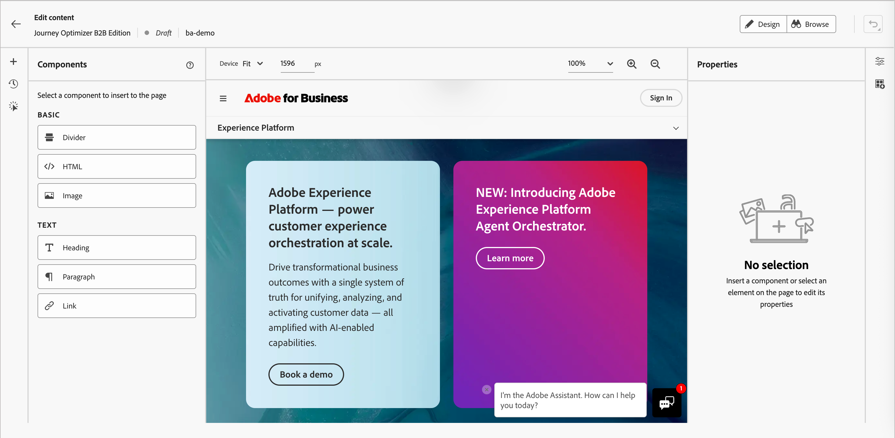
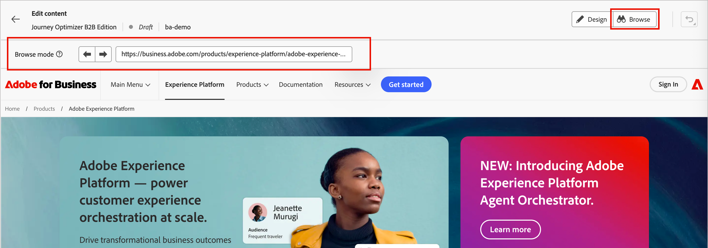
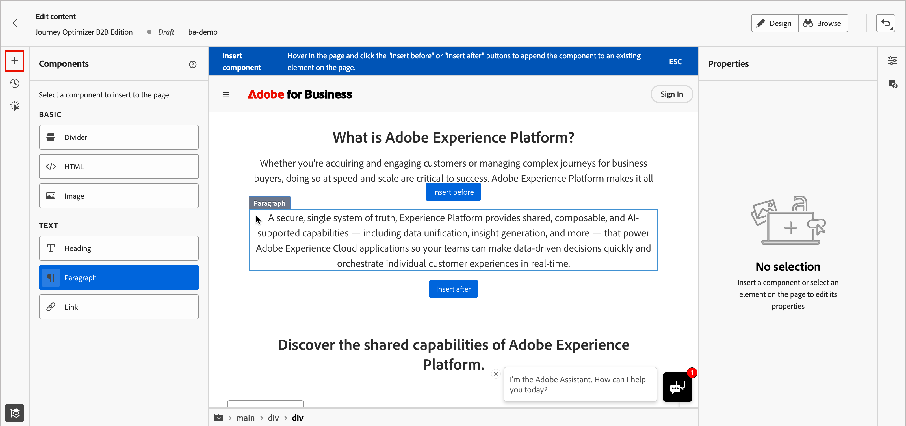
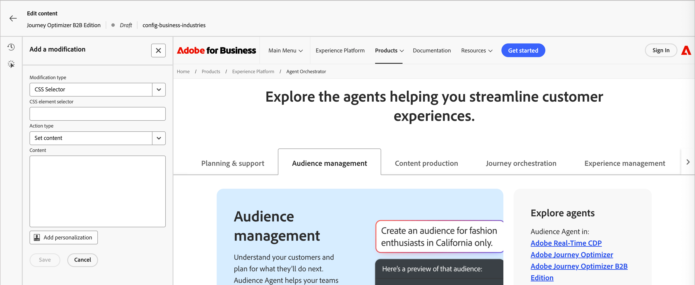
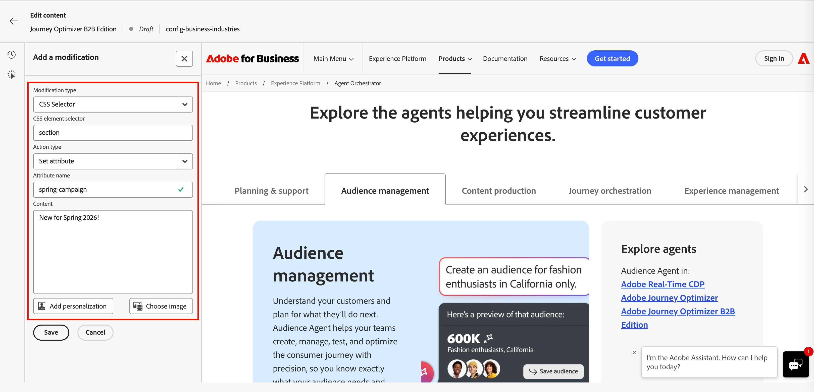
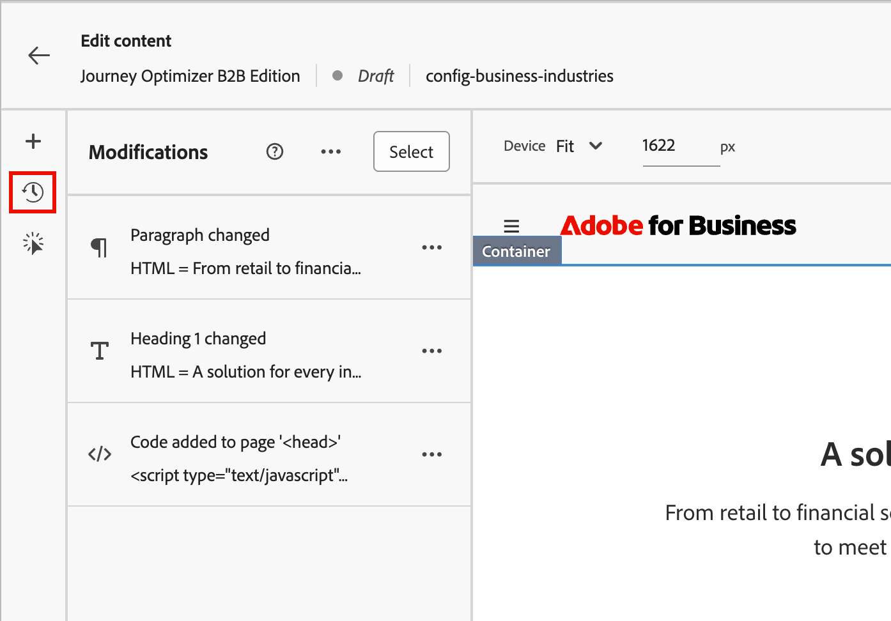
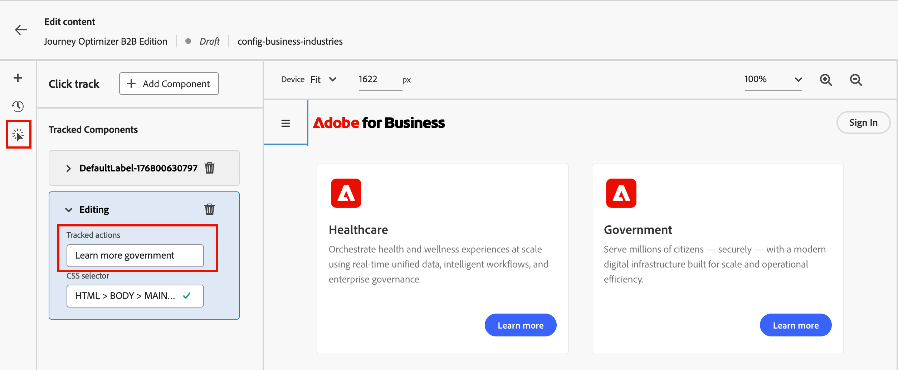

# Web エクスペリエンスデザイン

Web エクスペリエンスを[作成](./web-experiences.md#create-a-web-experience)した後、コンテンツデザインスペースを使用して、web ページに適用する変更を定義します。

>[!BEGINSHADEBOX]

**前提条件**

web エクスペリエンスをデザインする前に、次の要件を満たしていることを確認してください。

* 製品管理者は、web エクスペリエンスに含めるURL （ページ）を定義するために1つ以上のweb チャネルを設定しています。 詳しくは、[Web チャネル設定](../admin/configure-channels-web.md)を参照してください。

* Web サイトには、訪問者の特定とコンテンツ配信のために[Adobe Experience Platform Web SDK](https://experienceleague.adobe.com/en/docs/experience-platform/collection/js/js-overview) （`alloy.js`）が実装されています。 Adobe Experience Platform Web SDK バージョン 2.16以降が必要です。

* ジャーニーでweb エクスペリエンスを作成および管理するために必要な[権限](../admin/user-management.md#b2b-product-permissions)があります。
   * _[!UICONTROL キャンペーン]_ > _[!UICONTROL キャンペーンを管理]_ - web パーソナライゼーションアクションノードを追加または更新するために必要です。
   * _[!UICONTROL キャンペーン]_ > _[!UICONTROL キャンペーンを表示]_ - Web パーソナライゼーションアクションノードの詳細を表示するには必須です。

>[!ENDSHADEBOX]

>[!IMPORTANT]
>
>Web エクスペリエンスをデザインする前に、Web ブラウザー用のAdobe Experience Cloud Visual Editing Helper ブラウザー拡張機能がインストールされていることを確認します。 この拡張機能は、web ページを開き、作成し、Journey Optimizer B2B edition web エクスペリエンスデザイン空間で確実にプレビューするために必要です。 
>
>Google ChromeとMicrosoft Edgeは、現在、Journey Optimizer B2B editionの拡張機能とweb エクスペリエンスのオーサリングをサポートする唯一のブラウザーです。 詳しくは、[Visual Editing Helper拡張機能のインストール &#x200B;](./web-experiences.md#install-the-visual-editing-helper-extension)を参照してください。

## web エクスペリエンスエディター

Journey Optimizer B2B editionには、web修正をデザインするための2種類のエディターが用意されています。

| エディタ | 説明 | 最適な用途 |
| ------ | ----------- | -------- |
| [&#x200B; ビジュアルエディター](#visual-editor) | Web サイトを表示し、要素を直接選択および変更できるWYSIWYG （_What You See Is What You Get_） エディター。 Google ChromeまたはMicrosoft Edge web ブラウザーの[Visual Editing Helper拡張機能](./web-experiences.md#install-the-visual-editing-helper-extension)が必要です。 | テキスト、画像、ボタン、バナーなど、表示されているページ要素を視覚的に変更する。 |
| [非ビジュアルエディター](#non-visual-editor) | ビジュアルエディターでは実行できない修正を適用するためのコードベースのエディター。 | 視覚的に選択しにくい要素をターゲットにしたり、高度なCSSの変更を適用したり、非表示の要素を変更したりすることができます。 |

Web エクスペリエンスプロパティで、**[!UICONTROL ビジュアルエディター]** オプションを使用して、エディターのタイプを決定します。 ビジュアルエディターを使用するオプションを有効にするか、非ビジュアルエディターを使用するオプションを無効にします。

{width="400"}

## ビジュアルエディター {#visual-editor}

>[!CONTEXTUALHELP]
>id="ajo-b2b_web_experience_browse"
>title="参照モードの使用"
>abstract="参照モードでは、選択した web チャネル設定用にパーソナライズするページに移動できます。"

ビジュアルエディターはiframe内のweb ページを読み込み、そこで要素を選択し、ページプレビューで直接変更を適用することができます。 web エクスペリエンスのデザインにビジュアルエディターを使用するには、次の手順を実行します。

1. web エクスペリエンスの詳細ページに「_[!UICONTROL コンテンツ]_」タブが表示されたら、右側のパネルで「**[!UICONTROL web エクスペリエンスを編集]**」をクリックします。

   ビジュアルエディターは、web チャネル設定に基づいてweb サイトを読み込みます。

   {width="800" zoomable="yes"}

1. 必要に応じて、右上の&#x200B;**[!UICONTROL 参照]**&#x200B;をクリックし、サイトナビゲーションバーを使用して、変更する特定のページを読み込みます。

   上部のフィールドにページ URLを入力することもできます。

   >[!NOTE]
   >
   >読み込まれたページが、web チャネル設定で定義されたURL パターンと一致していることを確認します。 右上の&#x200B;**[!UICONTROL 設定の詳細を表示]**&#x200B;をクリックして、選択したweb チャネル設定のURLまたはページ一致ルールを表示します。

   {width="700" zoomable="yes"}

   <!-- If the web channel configuration is defined using page matching rules, use the left and right arrows to sequence through the matched pages -- right now these buttons don't do anything -->

   右上の&#x200B;**[!UICONTROL デザイン]**&#x200B;をクリックして、デザインスペースにページを読み込みます。

1. 表示されるページをWeb エクスペリエンスに合わせて変更する方法を定義するには、次の操作を行います。

   * [新しいコンポーネント &#x200B;](#insert-new-components) （区切り記号、HTML、画像、見出し、段落またはリンク）をweb エクスペリエンスのページに挿入します。

   * 画像、ボタン、段落、テキスト、コンテナ、見出し、リンクなど、ページから既存の要素を選択し、[web エクスペリエンス用に変更](#modify-elements)します。

   * [&#x200B; クリックトラッキング &#x200B;](#click-tracking-for-web-experiences)を要素に追加して、エンゲージメントを測定し、インサイトを収集します。

1. 手順2を繰り返して、web エクスペリエンスに含める他のページを読み込み、手順3を繰り返してページの変更を定義します。

1. [変更を確認](#manage-modifications)し、必要な調整を行います。

1. 変更が完了したら、エディターの上にある左矢印をクリックして、web エクスペリエンスのプロパティに戻ります。

### 要素を修正

表示されたページの要素をクリックして選択します。 青色の境界線は選択した要素を示し、コンテキストツールバーは修正オプションとともに表示されます。

{width="700" zoomable="yes"}

ツールバーのオプションは、選択したコンポーネントタイプによって異なります。

| アクション | 説明 |
| ------ | ----------- |
| **[!UICONTROL テキストオプション]** | 選択したエレメントのテキストエレメントクラスまたはテキストスタイルを変更します。 |
| **[!UICONTROL 画像を選択]** | 画像ソースを置き換えるか、要素に画像を追加します。 |
| **[!UICONTROL リンクを編集/ リンクを追加]** | リンク URLを変更または追加します。 |
| **[!UICONTROL 配置]** | 選択したエレメントをディスプレイ内で前後に移動します。 |
| **[!UICONTROL パーソナライゼーションの追加]** | パーソナライゼーションの挿入： |
| **[!UICONTROL トラック要素をクリック]** | 要素にクリックトラッキングを追加します。 |
| **[!UICONTROL 削除]** | 選択した要素をページから削除します。 |

選択した要素の場合、右側のパネルのプロパティが変更され、使用可能なスタイルとアクションが反映されます。 パネルの上部にあるアクションアイコンをクリックして、選択した要素を複製、クリックトラック、削除または非表示にします。

{width="300"}

+++テキスト要素

1. ページ上のテキスト要素を選択します。

1. 新しいテキストコンテンツを入力するか、テキスト文字列を選択して置換テキストを入力します。

1. （オプション）太字、斜体、整列など、[&#x200B; テキスト書式設定オプション &#x200B;](./content-components.md#text)を使用します。

1. 変更を適用するには、テキスト要素の外側をクリックします。

テキストコンポーネントのテキストスタイル設定オプションについて詳しくは、[&#x200B; コンテンツコンポーネント &#x200B;](./content-components.md#text)を参照してください。

+++

+++画像エレメント

1. ページ上の画像要素を選択します。

1. コンテキストツールバーまたは右側のパネルの&#x200B;_[!UICONTROL 画像を選択]_ アイコンをクリックします。

1. アセットライブラリから画像を参照して選択します。

1. 必要に応じて、右側のパネルの[画像のスタイル設定オプション &#x200B;](./content-components.md#image)を使用します。

+++

+++ボタン要素

1. ページ上のボタン要素を選択します。

1. （オプション）ボタンに新しいテキストを入力するか、テキスト文字列を選択して置換テキストを入力します。

   パーソナライゼーション機能を使用すれば、アカウントプロファイルや個人プロファイルのデータを使用して、ボタンテキストを変更できます。

1. 必要に応じて、右側のパネルの[&#x200B; ボタンのスタイル設定オプション &#x200B;](./content-components.md#button)を使用します。

+++

+++ コンテナ要素

1. ページ上のコンテナ要素を選択します。

1. 必要に応じて、右側のパネルの[&#x200B; コンテナのスタイル設定オプション &#x200B;](./content-components.md#container)を使用します。

+++

### 新しいコンポーネントの挿入

ビジュアルエディターのデザイン左側のナビゲーションで&#x200B;**+** アイコンを選択すると、web エクスペリエンスの変更として、次のコンポーネントタイプをページに追加できます。

* **[!UICONTROL Divider]** – このコンポーネントを使用して、分割線を挿入し、メールのレイアウトとコンテンツを整理します。 右側のパネルのプロパティから、線の色、スタイル、高さなどのスタイル属性を調整できます。 詳しくは、_コンテンツコンポーネント_&#x200B;の[Divider](./content-components.md#divider)を参照してください。
* **[!UICONTROL HTML]** – このコンポーネントを使用して、既存の構造にHTML コードをコピー&amp;ペーストします。 これにより、無料のモジュラー形式のHTML コンポーネントを作成して、一部の外部コンテンツを再利用できます。 詳しくは、_コンテンツコンポーネント_&#x200B;の[HTML](./content-components.md#html)を参照してください。
* **[!UICONTROL 画像]** – このコンポーネントを使用して、画像ファイルをページに挿入します。 右側のパネルのプロパティから、幅や高さなどのスタイル属性を調整できます。 詳しくは、_コンテンツコンポーネント_&#x200B;の[画像](./content-components.md#image)を参照してください。
* **[!UICONTROL 見出し]** – このコンポーネントを使用して、見出しクラスのテキストを挿入します。 右側のパネルのプロパティから、テキストカラー、スタイル、フォント、サイズなどのスタイル属性を調整できます。 詳しくは、_コンテンツコンポーネント_&#x200B;の[&#x200B; テキスト &#x200B;](./content-components.md#text)を参照してください。
* **[!UICONTROL 段落]** – 標準のテキスト要素を挿入するには、このコンポーネントを使用します。 右側のパネルのプロパティから、テキストカラー、スタイル、フォント、サイズなどのスタイル属性を調整できます。 詳しくは、_コンテンツコンポーネント_&#x200B;の[&#x200B; テキスト &#x200B;](./content-components.md#text)を参照してください。
* **[!UICONTROL リンク]** – このコンポーネントを使用して、独立したテキストリンクを指定されたURLに挿入します。 右側のパネルのプロパティから、テキストの色、スタイル、配置、サイズなどのスタイル属性を調整できます。

左側のコンポーネントタイプを選択し、追加する場所に隣接する要素にカーソルを合わせます。

{width="800" zoomable="yes"}

表示されているボタンのいずれかをクリックして、コンポーネントを配置します。

* ***[!UICONTROL 前に挿入]** – 選択した要素の前にコンポーネントを挿入します。
* ***[!UICONTROL 後に挿入]** – 選択した要素の後にコンポーネントを挿入します。

挿入するコンポーネントタイプの選択を解除するには、ページの上部に表示されているコンテキストブルーのバナーの&#x200B;**[!UICONTROL ESC]**&#x200B;をクリックします。

## 非ビジュアルエディター {#non-visual-editor}

ビジュアルエディターでは容易に実行できない変更を行う必要がある場合は、非ビジュアルエディターを使用します。 このコードベースのアプローチにより、要素のターゲティングと修正を正確に制御できます。 Web エクスペリエンスのデザインに非ビジュアルエディターを使用するには、次の手順を実行します。

1. Web エクスペリエンスの詳細ページに「_[!UICONTROL コンテンツ]_」タブが表示されたら、右側のパネルで「**[!UICONTROL 変更を追加]**」をクリックします。

   非ビジュアルエディターは、web チャネル設定に基づいてページを読み込みます。

   {width="800" zoomable="yes"}

1. 最初に行う変更を定義します。

   左側のパネルには、既存の変更のリストが表示されます（ある場合）。 「**[!UICONTROL 追加]**」をクリックして、新しい変更を定義します。 変更が定義されていない場合、パネルはデフォルトで&#x200B;_[!UICONTROL 変更を追加]_ オプションになります。

   * **[!UICONTROL 変更タイプ]**&#x200B;を選択します。

     | タイプ | 説明 |
     | ---- | ----------- |
     | [**[!UICONTROL CSS セレクター]**](#css-selector-modifications) | CSS セレクター文字列を使用して要素をターゲット化します。 |
     | [**[!UICONTROL &#x200B; ページ &#x200B;]**](#page-modifications) | カスタム HTML、CSS、またはJavaScriptを`<head>`や`<body>`などのページレベルのエレメントに挿入します。 |

   * タイプに応じて変更パラメーターを設定します。

      * **[!UICONTROL CSS セレクター]** – 特定の要素をターゲットにする有効なCSS セレクターを入力します。
      * **[!UICONTROL アクションの種類]** – 実行するアクション （編集、非表示、削除、挿入、置換）を選択します。
      * **[!UICONTROL コンテンツ]** – 適用するコンテンツまたはスタイルを指定します。

1. **[!UICONTROL 保存]**&#x200B;をクリックして、変更を適用します。

### CSS セレクターの変更

CSS セレクターの変更を使用すると、標準のCSS セレクター構文を使用して要素を正確にターゲティングできます。

1. 変更タイプとして&#x200B;**[!UICONTROL CSS セレクター]**&#x200B;を選択します。

1. 「**[!UICONTROL CSS エレメントセレクター]**」フィールドにセレクターを入力します。

   <!-- This field helps you find and select the HTML elements (or nodes in the DOM tree). -->

   **セレクターの例：**

   | セレクター | 目標 |
   | -------- | ------- |
   | `#hero-banner` | ID `hero-banner`の要素 |
   | `.cta-button` | クラス `cta-button`のすべての要素 |
   | `header nav a` | ナビゲーション内のヘッダー内のリンク |
   | `[data-offer="premium"]` | 特定のデータ属性を持つ要素 |

1. **[!UICONTROL アクションタイプ]**&#x200B;を選択し、必要な情報/コンテンツを指定します。

   * **[!UICONTROL コンテンツを設定]** - _[!UICONTROL CSS エレメントセレクター]_&#x200B;値で識別される要素の&#x200B;**[!UICONTROL コンテンツ]** フィールドにテキストを入力します。

   * **[!UICONTROL 属性を設定]** – 現在のCSS セレクターに関連付ける属性を指定して、この属性で要素を識別できるようにします。 **[!UICONTROL 属性名]** フィールドに名前を入力し、**[!UICONTROL コンテンツ]** フィールドに値を入力します。 属性が既に存在する場合は、値が更新されます。それ以外の場合は、指定した名前と値で新しい属性が追加されます。

   {width="800" zoomable="yes"}

1. （オプション）「**[!UICONTROL パーソナライゼーションを追加]**」をクリックし、[&#x200B; パーソナライゼーションエディター](./personalization.md#personalization-editor)を使用して、コンテンツ用にカスタマイズされたパーソナライゼーションを作成します。

### ページ修正

ページ `<head>`の修正タイプを使用してカスタムコードを追加できます。 `<head>` 要素は、メタデータ（データに関するデータ）のコンテナで、`<html>` タグと `<body>` タグの間に配置されます。 この場合、コードは本文やページの読み込みイベントを待たずに、ページの読み込みの開始時に実行されます。

`<head>` 要素は、通常、ページの上部に JavaScript または CSS コードを追加するために使用されます。 後続のビジュアルアクションのセレクターは、このタブに追加される HTML 要素に応じて異なります。

>[!NOTE]
>
>カスタムコードは、訪問者のブラウザーで実行されます。 コードが安全でテストされており、ページパフォーマンスやユーザーエクスペリエンスに悪影響を与えないようにします。

1. 変更タイプとして&#x200B;**[!UICONTROL ページ`<head>`]**&#x200B;を選択します。

1. **[!UICONTROL コンテンツ]**&#x200B;ボックスでカスタムコードを追加します。

   >[!CAUTION]
   >
   >`<head>` セクションに `<script>` 要素および `<style>` 要素のみを追加できます。 `
`個のタグやその他の要素を追加すると、残りの`<head>`個の要素が`<body>`内に入力される可能性があります。

   {width="800" zoomable="yes"}

1. （オプション）「**[!UICONTROL パーソナライゼーションを追加]**」をクリックし、[&#x200B; パーソナライゼーションエディター](./personalization.md#personalization-editor)を使用して、コンテンツ用にカスタマイズされたパーソナライゼーションを作成します。

## 変更の管理 {#manage-modifications}

>[!CONTEXTUALHELP]
>id="ajo-b2b_web_experience_modifications"
>title="すべての変更を簡単に管理"
>abstract="このパネルを使用すると、web ページに定義したすべての調整とスタイルを確認および管理できます。"

作成したすべての変更は追跡され、ビジュアルエディターと非ビジュアルエディターの両方の&#x200B;**[!UICONTROL 変更]** パネルから管理できます。 左側のツールバーの&#x200B;_[!UICONTROL 変更]_ <!-- (  ) --> アイコンをクリックして、すべての変更を表示します。

各修正レコードには、次のものが含まれます。

* ターゲット要素またはセレクター
* 変更タイプ（編集、非表示、挿入など）
* 変更のプレビュー

{width="500" zoomable="yes"}

### 修正の編集

1. _[!UICONTROL 変更]_ リストで、編集する変更を見つけます。

1. _詳細メニュー_ （**...**）アイコンをクリックし、**[!UICONTROL 編集]**&#x200B;を選択します。

1. 必要に応じて変更プロパティを更新します。

1. **[!UICONTROL 保存]**&#x200B;をクリックして変更を保存します。

### 修正の削除

1. _[!UICONTROL 変更]_ リストで、削除する変更を見つけます。

1. _詳細メニュー_ （**...**）アイコンをクリックし、**[!UICONTROL 変更を削除]**&#x200B;を選択します。

1. プロンプトが表示されたら、削除を確認します。

<!--
 ### Reorder modifications

Modifications are applied in the order that they appear in the list. If you have multiple modifications that affect the same element, the order may impact the final result.

Drag and drop modifications in the list to change the order. The preview updates to reflect the new modification order. 
-->

## 修正をプレビュー

公開する前に、変更が訪問者にどのように表示されるかをプレビューします。

ビジュアルエディターの上部にあるデバイスプレビューオプションを使用して、次の点に関する変更を表示します。

* Desktop
* タブレット
* モバイル

{width="550" zoomable="yes"}

プレビューが更新され、各デバイスサイズでの変更のレンダリング方法が表示されます。

URL バーを使用して、web チャネル設定内の様々なページに移動します。 次に、URL マッチングルールに基づいて、変更がターゲットページに正しく適用されていることを確認します。

## クリック数の追跡 {#web-click-tracking}

要素によるユーザーのインタラクションを追跡して、エンゲージメントを測定し、インサイトを収集します。 クリックトラッキングデータはエンゲージメントレポートで利用でき、web エクスペリエンスの変更効果の測定に使用できます。

web エクスペリエンスがアクティブ化された場合（ライブ状態）、Adobe Customer Journey Analyticsを使用してレポートを作成することもできます（これには製品サブスクリプションが必要です）。 web エクスペリエンスのモニタリングを改善するには、web サイトの特定の要素のクリック数を追跡することもできます。 トラッキングを使用すると、web レポートでその要素のクリック数を表示できます。

Customer Journey Analyticsとweb レポートの作成について詳しくは、[Customer Journey Analytics ドキュメント &#x200B;](https://experienceleague.adobe.com/ja/docs/analytics-platform/using/cja-landing)を参照してください。

1. Web エクスペリエンスエディターで、画像やリンクなどの要素を選択します。

1. 要素のプロパティまたはコンテキストツールバーで、_[!UICONTROL 要素を追跡]_ アイコンをクリックします。

   {width="600" zoomable="yes"}

1. 左側のパネルでクリックトラックリストを開き、**[!UICONTROL トラッキング済みアクション]**&#x200B;の値を変更して、レポートでこのインタラクションを特定します。

   {width="600" zoomable="yes"}
