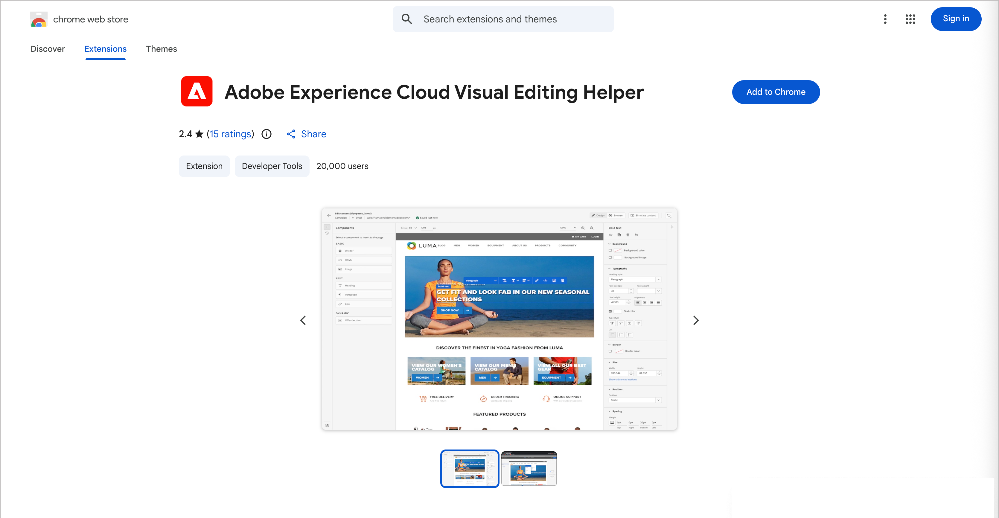
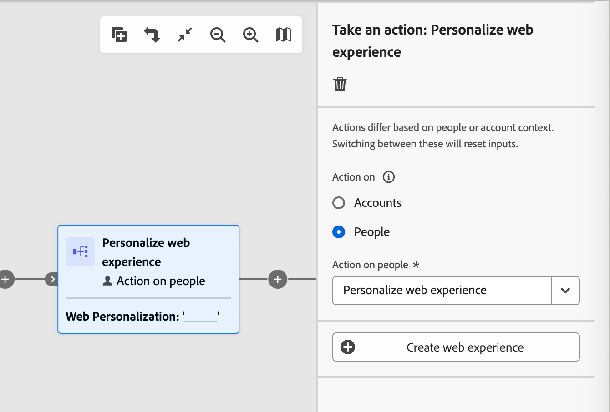
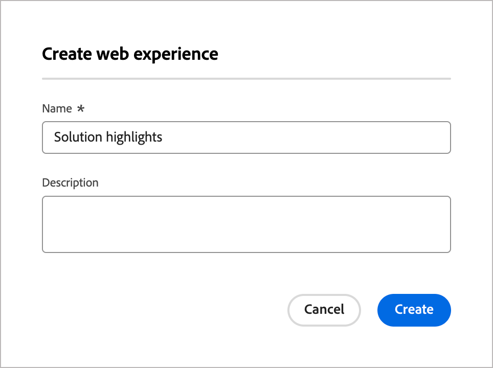
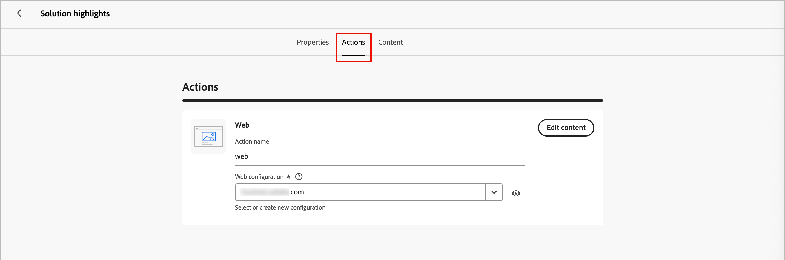
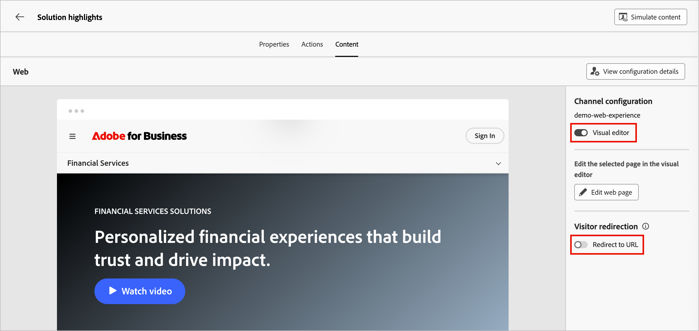

# web エクスペリエンス

Adobe Journey Optimizer B2B editionのweb チャネルなら、web サイト上でパーソナライズされたエクスペリエンスを直接構築し、有意義な方法で顧客とつながることができます。 この機能では、パーソナライズされたコンテンツによるエンゲージメントを強化し、メールやSMSなどの他のチャネルとシームレスに統合するために使用できる、柔軟なツールキットを提供します。

web エクスペリエンスでは、次のことが可能になります。

* ターゲットを絞ったweb サイト訪問者に、パーソナライズされたコンテンツ修正を提供したい
* アカウントの属性にもとづいて、バナー、テキスト、画像、ボタンなどのweb サイト要素をカスタマイズします
* URL マッチングルールを使用して、特定のページをターゲティングしたり、複数のページに変更を適用したりできます
* エンゲージメントを追跡し、web パーソナライゼーションの効果を監視できます

>[!BEGINSHADEBOX]

## 前提条件

web エクスペリエンスを作成する前に、次の要件を満たしていることを確認してください。

* 製品管理者は、web エクスペリエンスに含めるURL （ページ）を定義するために1つ以上のweb チャネルを設定しています。 詳しくは、[Web チャネル設定](../admin/configure-channels-web.md)を参照してください。

* Web サイトには、訪問者の特定とコンテンツ配信のために[Adobe Experience Platform Web SDK](https://experienceleague.adobe.com/en/docs/experience-platform/collection/js/js-overview) （`alloy.js`）が実装されています。 Adobe Experience Platform Web SDKのバージョンが2.16以降であることを確認します。

* ジャーニーでweb エクスペリエンスを作成および管理するために必要な[権限](../admin/user-management.md#b2b-product-permissions)があります。
   * _[!UICONTROL キャンペーン]_ > _[!UICONTROL キャンペーンを管理]_ - web パーソナライゼーションアクションノードを追加または更新するために必要です。
   * _[!UICONTROL キャンペーン]_ > _[!UICONTROL キャンペーンを表示]_ - Web パーソナライゼーションアクションノードの詳細を表示するには必須です。
   * _[!UICONTROL キャンペーン]_ > _[!UICONTROL キャンペーンの承認と公開]_ - 1つ以上のWeb パーソナライゼーションアクションノードを持つジャーニーを公開するために必要です。

* Web ブラウザー用にAdobe Experience Cloud [Visual Editing Helper ブラウザー拡張機能](#install-the-visual-editing-helper-extension)がインストールされています。 この拡張機能は、web ページを開き、オーサリングし、Journey Optimizer B2B edition コンテンツデザイン空間で確実にプレビューするために必要です。

  >[!NOTE]
  >
  >Google ChromeとMicrosoft Edgeは、現在、Journey Optimizer B2B editionでのweb ページのオーサリングをサポートする唯一のブラウザーです。

>[!ENDSHADEBOX]

## Visual Editing Helper 拡張機能のインストール

1. ブラウザー（[!DNL Google Chrome]または[!DNL Microsoft Edge]）で新しいタブを開きます。

1. [Google Chrome web ストア](https://chromewebstore.google.com/category/extensions)に移動します。

   [!DNL Microsoft Edge]を使用している場合は、上部バナーの他のストアから&#x200B;_拡張機能_&#x200B;を許可を選択します。 このオプションを有効にすると、拡張機能を[!DNL Chrome Web Store]から[!DNL Microsoft Edge]に追加できます。

1. 検索して、_[!DNL Adobe Experience Cloud Visual Editing Helper]_ブラウザー拡張機能に移動します。

   {width="800" zoomable="yes"}

1. 「**[!UICONTROL Chromeに追加]**」をクリックし、確認ダイアログで「**[!UICONTROL 拡張機能を追加]**」をクリックします。

   [!DNL Microsoft Edge]を使用している場合、このアクションによって拡張機能が[!DNL Edge]に追加されます。

1. ブラウザーのツールバーで[!DNL Visual Editing Helper] ブラウザー拡張機能が正しく有効になっていることを確認してください。

   {width="450"}

Web エクスペリエンス用Journey Optimizer B2B edition ビジュアルエディターでweb サイトを開くと、[!DNL Adobe Experience Cloud Visual Editing Helper]が自動的に有効になります。 この拡張機能には条件付きの設定はなく、SameSite Cookie の設定を含むすべての設定を自動処理します。

>[!NOTE]
>
>次のいずれかの理由により、一部のweb サイトがJourney Optimizer B2B edition web エディターで確実に開かない場合があります。
>
>* Web サイトに厳格なセキュリティポリシーがある。
>* Web サイトが iframe 内にある。
>* 顧客QAまたはステージサイトは外部で利用できません（サイトは内部です）。

## web エクスペリエンスの作成

ジャーニーでweb エクスペリエンスを設定するには、_[!UICONTROL アクションを実行]_ ノード ](../journeys/action-nodes.md)を[追加し、次の操作を行います。

1. ターゲット ]_の_[!UICONTROL  アクションで、**[!UICONTROL 人物]**&#x200B;を選択します。

1. _[!UICONTROL 人物に対するアクション]_&#x200B;で、**[!UICONTROL Web エクスペリエンスのパーソナライズ]**&#x200B;を選択します。

   {width="500"}

1. 「**[!UICONTROL Web エクスペリエンスを作成]**」をクリックします。

1. _[!UICONTROL Web エクスペリエンスを作成]_ ダイアログで、便利な&#x200B;**[!UICONTROL 名前]**&#x200B;と&#x200B;**[!UICONTROL 説明]** （オプション）を入力します。

   * 名前 – 最大100文字、一意にする必要があり、大文字と小文字を区別しない

   * 説明 – 最大300文字

   >[!NOTE]
   >
   >名前フィールドと説明フィールドでは、英数字と特殊文字をサポートしています。 予約済みの文字（`\ / : * ? " < > |`）は&#x200B;**_許可されていません_**。

   {width="400"}

<!-- What is this for? 1. Properties? -->

1. 「**[!UICONTROL プロパティ]**」タブで、web エクスペリエンスの説明を入力します。

1. 「**[!UICONTROL アクション]**」タブをクリックし、Web エクスペリエンスに使用する&#x200B;**[!UICONTROL Web チャネル]**&#x200B;を選択します。

   Web チャネル設定は、設定されたページ一致ルールに基づいて、コンテンツ変更の適用先を決定します。 詳しくは、[Web チャネル設定](../admin/configure-channels-web.md)を参照してください。

   {width="700" zoomable="yes"}

1. Webの変更を定義するには、**[!UICONTROL コンテンツを編集]**&#x200B;をクリックします。

   エディターが「_[!UICONTROL コンテンツ]_」タブで開き、web エクスペリエンスの変更を定義できます。 デザインツールを使用してweb エクスペリエンスコンテンツの変更を追加する方法について詳しくは、[Web エクスペリエンスデザイン ](./web-experience-design.md)を参照してください。

1. 右側のパネルで、web エクスペリエンスの定義および管理方法に応じてweb エクスペリエンスのプロパティを設定します。

   * **[!UICONTROL ビジュアルエディター]** - web エクスペリエンスの変更デザインの[ ビジュアルエディターと非ビジュアルエディター](./web-experience-design.md#web-design-tools)を切り替えます。
   * **[!UICONTROL 訪問者のリダイレクト]** – このオプションを有効にすると、「コンテンツ」タブで新しいバリエーションをオーサリングするのではなく、[訪問者を別の既存のURL](#redirect-to-url)にリダイレクトできます。

   {width="700" zoomable="yes"}

1. 「**[!UICONTROL Web ページを編集]**」をクリックして、[web修正をデザイン ](./web-experience-design.md)します。

1. 変更が完了したら、エディターの上にある左矢印をクリックして、「コンテンツ」タブとパーソナライズされたweb エクスペリエンスノードのプロパティに戻ります。

   一番上の左向き矢印をクリックすると、ジャーニーキャンバスに戻ります。

## Web エクスペリエンスの編集

1. ジャーニーを開き、**[!UICONTROL Web エクスペリエンスのパーソナライズ]** アクションノードを選択します。

1. Web チャネルの設定またはコンテンツを変更するには、**[!UICONTROL Web エクスペリエンスの編集]**&#x200B;をクリックします。

1. 「**[!UICONTROL アクション]**」タブを選択し、必要に応じてweb設定を変更します。

1. 「**[!UICONTROL コンテンツ]**」タブを選択し、必要に応じてビジュアルデザインツールを使用します。

   * _ビジュアルエディター_ – 「**[!UICONTROL コンテンツを編集]**」をクリックします。
   * _非ビジュアルエディター_ - **[!UICONTROL 変更を追加]**&#x200B;をクリックします。

   詳しくは、[Web エクスペリエンスデザイン ](./web-experience-design.md)を参照してください。

1. 変更定義が完了したら、エディターの上にある左矢印をクリックして、「コンテンツ」タブとweb エクスペリエンスのプロパティに戻ります。

   一番上の左向き矢印をクリックすると、ジャーニーキャンバスに戻ります。

## URL にリダイレクト

web エクスペリエンスを作成する場合、コンテンツエディターで新しいバリエーションを作成するのではなく、訪問者を別の既存のURLにリダイレクトできます。 このオプションは、ページ内のいくつかの要素を変更するだけでなく、2つの異なるエクスペリエンスを比較するコンテンツ実験を実行する場合に便利です。

例えば、次の 2 つの処理を含む web キャンペーンを作成します。

「処理A」では、ターゲット母集団の半分に対してコンテンツエディターを使用してweb エクスペリエンスを作成します。

「処理B」で、ターゲット母集団の残りの半分の「_[!UICONTROL URLにリダイレクト]_」オプションを選択します。 Journey Optimizer B2B edition以外で作成した代替デザインを含むページのURLを入力します。

{width="500" zoomable="yes"}

>[!NOTE]
>
>このオプションを選択すると、web サイトのプレビューが表示されず、_[!UICONTROL ビジュアルエディター]_&#x200B;の切り替えが無効になります。

web キャンペーンが開始されたら、Journey Optimizer B2B editionで定義したweb エクスペリエンスのパフォーマンスを、別のページへのリダイレクトを使用したweb エクスペリエンスに対して追跡できます。

## Web エクスペリエンスのテスト

Web エクスペリエンスのコンテンツデザインが完了したら、_コンテンツをシミュレート_&#x200B;機能を使用して、web ページの変更をプレビューできます。 パーソナライズされたコンテンツを挿入した場合は、テストプロファイルデータを使用して、コンテンツのレンダリング方法を確認できます。 シミュレーションツールは、web エクスペリエンスの「_[!UICONTROL コンテンツ]_」タブまたはコンテンツビジュアルデザインエディターから使用できます。

1. 右上の「**[!UICONTROL コンテンツをシミュレート]**」をクリックします。

1. テストプロファイルを選択します。

1. テストプロファイルを追加して、テストプロファイルデータを使用してweb ページを確認します。

<!-- This works differently than emails (rely on Marketo data), currently. Will expand when we figure it out -->

## web エクスペリエンスのアクティベーション

ジャーニーを[公開](../journeys/create-publish-journey.md#publish-a-journey)すると、Web エクスペリエンスがアクティブ化され、オーディエンスに表示されます。 ジャーニーを通じてweb エクスペリエンスをアクティベートする前に、次の点を考慮してください。

* 既に公開されている別のジャーニーと同じページに影響を与えるweb エクスペリエンスを含むジャーニーを公開すると、すべての変更がweb ページに適用されます。

* 複数のジャーニーで同じweb サイト要素を更新する場合は、最も最近適用された変更が優先されます。

### 配信要件

Web エクスペリエンス配信を有効にするには、次の設定を定義する必要があります。

* Adobe Experience Platform Data Collectionで、Adobe Experience Platform サービスでAdobe Journey Optimizer B2B edition オプションを有効にしてデータストリームを定義していることを確認します。

  この設定により、Adobe Experience Platform Edgeがインバウンドイベントを正しく処理できるようになります。 [詳細情報](https://experienceleague.adobe.com/ja/docs/experience-platform/datastreams/configure)

* Adobe Experience Platformで、_[!UICONTROL Active-On-Edge結合ポリシー]_ オプションが有効になっている結合ポリシーが1つあることを確認します。

  お客様/プロファイル/結合ポリシーExperience Platform メニューでポリシーを選択します。 [詳細情報](https://experienceleague.adobe.com/en/docs/experience-platform/profile/merge-policies/ui-guide#configure)

  この結合ポリシーは、Journey Optimizer B2B editionのインバウンドチャネルが、エッジ上のインバウンド web エクスペリエンスを正しくアクティブ化して公開するために使用します。 [詳細情報](https://experienceleague.adobe.com/en/docs/experience-platform/profile/merge-policies/ui-guide)

### トラブルシューティング

Adobe Experience Platform Assurance内のEdge Delivery ビューを使用して、Journey Optimizer B2B edition Web エクスペリエンスの配信のトラブルシューティングを行うことができます。 このプラグインを使用すると、リクエスト呼び出しを詳細に調べ、期待されるエッジコールを検証し、プロファイルデータを調べることができます。 このプロファイルデータには、ID マップ、セグメントメンバーシップ、同意設定が含まれます。 また、リクエストの適格アクティビティと非適格アクティビティを確認することもできます。

AssuranceのEdge Delivery ビューについて詳しくは、[Experience Platform ドキュメント ](https://experienceleague.adobe.com/ja/docs/experience-platform/assurance/view/edge-delivery)を参照してください。
