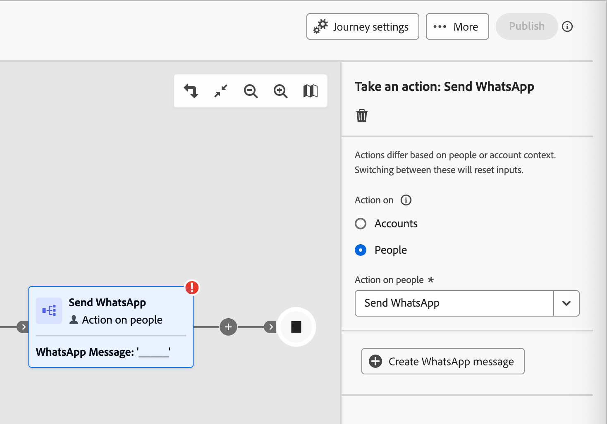

# WhatsApp オーサリング

Adobe Journey Optimizer B2B editionを使用して、モバイルデバイスのアカウントメンバーにWhatsApp メッセージを送信します。 WhatsApp エディターで承認済みのMetaメッセージテンプレートを使用して、メッセージを作成、パーソナライズ、プレビューできます。<!-- Test your WhatsApp messages before publishing the account journey to ensure your intended rendering, accurate personalization, and proper configuration of all settings. -->

アカウントジャーニー用のWhatsApp メッセージを作成する前に、_[!UICONTROL 管理者]_&#x200B;設定で必要な[WhatsApp チャネルが設定](../admin/configure-channels-whatsapp.md)されていることを確認してください。

>[!NOTE]
>
>Journey Optimizer B2B editionでは、_アウトバウンド_&#x200B;のWhatsApp メッセージ要素のみがサポートされています。

+++ サポートされているメッセージ要素と行動喚起オプション

WhatsApp では、次のメッセージタイプがサポートされています。

| メッセージ要素 | 説明 |
| - | - |
| ヘッダー | メッセージの本文の上に表示されるオプションのテキスト。 |
| テキスト | パラメーターを通じて動的コンテンツをサポートします。 |
| 画像（JPEG、PNG） | 8 ビット RGB または RGBA 形式で、サイズが 5 MB 未満である必要があります。 |
| ビデオ | 3GPPまたはMP4で、16 MB未満で、URLでホストされている必要があります。 |
| オーディオ | 応答メッセージにのみ使用できます。 AAC、AMR、MP3、MP4 オーディオまたは OGG 形式で、URL でホストされ、16 MB 未満である必要があります。 |
| ドキュメント | 100 MB未満で、URLにホストされ、次のいずれかの形式である必要があります：`.txt`、`.xls`/`.xlsx`、`.doc`/`.docx`、`.ppt`/`.pptx`、または`.pdf`。 |
| 本文 | パラメーターを通じて動的コンテンツをサポートします。 |
| フッターテキスト | パラメーターを通じて動的コンテンツをサポートします。 |

WhatsApp メッセージでは、次のcall-to-action オプションを使用できます。

| Call to action | 説明 |
| - | - |
| Web サイトに訪問 | 変数パラメーターを含むボタンは、1 つのみ許可されます。 |
| WhatsApp で通話 | メッセージから直接、指定された電話番号との WhatsApp チャットを開くボタンを提供します。 |
| 電話番号に通話 | ユーザーがタップすると、指定された番号への通話を開始するボタンを提供します。 |

+++

## アカウントジャーニーでのWhatsApp アクションの追加

>[!IMPORTANT]
>
>**WhatsApp同意管理**: Metaのポリシーと適用可能な規制に従って、すべてのWhatsApp マーケティングメッセージは、メッセージの受信をオプトインした受信者にのみ送信する必要があります。 WhatsAppの受信者は、オプトアウトキーワードを使用して返信することで、いつでもオプトアウトできます。 オプトアウトした応答は自動的に尊重され、対応するプロファイルは今後のマーケティングメッセージのオーディエンスから削除されます。 WhatsAppの同意設定が配信時にどのように評価されるかについて詳しくは、[同意設定](./channels-consent-preferences.md)を参照してください。

[ アクションを実行&#x200B;]_ノード (../journeys/action-nodes.md)を追加し、次の操作を行うと、アカウントジャーニーでWhatsApp メッセージ配信を設定できます。_

1. ターゲット _の_ アクションで、**[!UICONTROL 人物]**&#x200B;を選択します。

1. _[!UICONTROL 人に対するアクション]_&#x200B;で、**[!UICONTROL WhatsAppを送信]**&#x200B;を選択します。

   {width="500" zoomable="yes"}

## WhatsApp メッセージの作成

1. _[!UICONTROL アクションを実行]_ パネルの下部にある「**[!UICONTROL WhatsAppを作成]**」をクリックします。

1. ダイアログで、WhatsApp メッセージに一意の&#x200B;**[!UICONTROL 名前]** （必須）と&#x200B;**[!UICONTROL 説明]** （オプション）を入力します。

   {width="400"}

1. 「**[!UICONTROL 作成]**」をクリックします。

   _WhatsApp デザインスペース_&#x200B;が開き、WhatsApp アクションを定義し、メッセージを送信するためのコンテンツを作成できます。

### アクション設定を選択します

1. _WhatsApp デザインスペース_&#x200B;で、「**[!UICONTROL アクション]**」タブを選択します。

1. **[!UICONTROL WhatsApp設定]**&#x200B;で、ニーズに合わせてマーケティングアクションとメッセージ配信設定をサポートする[設定](../admin/configure-channels-whatsapp.md#create-channel-configuration)を選択します。

   {width="700" zoomable="yes"}

1. 「**[!UICONTROL コンテンツを編集]**」をクリックして、メッセージパラメーターとテキストに進みます。

### メッセージテンプレートの選択

WhatsApp メッセージは、Meta WhatsApp Business アカウントの事前承認済みメッセージテンプレートを使用して送信されます。 Journey Optimizer B2B editionでテンプレートを使用するには、**Meta**&#x200B;によるレビューと承認が必要です。 テンプレートを管理して承認のために送信するには、[!DNL Meta Business Manager] アカウント管理者と協力してください。

1. **[!UICONTROL テンプレート カテゴリを選択]**&#x200B;するには、次のいずれかを選択します。

   * マーケティング
   * ユーティリティ
   * 認証

1. **[!UICONTROL WhatsApp テンプレートを選択]**&#x200B;するには、設定ビジネスアカウントの承認済みテンプレートを選択します。

   テンプレートコンテンツがメッセージエディターに読み込まれ、テンプレート構造とパーソナライゼーションに使用できる変数フィールドが表示されます。

   {width="700" zoomable="yes"}

   このシステムは、カテゴリ （_マーケティング_、_ユーティリティ_、_認証_）およびステータス別にテンプレートを整理します。 選択可能なテンプレートは、**_承認済み_**&#x200B;件のみです。 WhatsApp テンプレートの作成について詳しくは、Meta ドキュメントの「[_WhatsApp Business アカウントのメッセージテンプレートを作成_](https://www.facebook.com/business/help/2055875911147364?id=2129163877102343)」を参照してください。

### 画像URL

テンプレートに画像が含まれている場合は、**[!UICONTROL 画像URL]** フィールドを使用してメディア URLを追加し、テンプレート内のプレースホルダーを置き換えます。 Meta のテンプレートメディアは、プレースホルダーのみです。 画像、オーディオ、ビデオを正しく表示するには、Adobe Experience Manager またはその他のソースからの外部 URL を使用する必要があります。

### メッセージコンテンツのパーソナライズ

承認済みのWhatsApp テンプレートには、プロファイルデータまたは動的な値を使用して定義した変数プレースホルダーを含めることができます。

テンプレートに表示されている各変数フィールドについて、フィールドの横にある&#x200B;_パーソナライズ_ アイコン （）をクリックします。

{width="700" zoomable="yes"}

このダイアログでは、アカウントトークン、人物トークン、システムトークンにアクセスできます。 標準トークンとカスタムトークンの両方が含まれています。 _検索_ バーを使用して必要なトークンを検索するか、フォルダーツリー内を移動してトークンのいずれかを検索して選択できます。

パーソナライゼーションにトークンを使用する方法について詳しくは、[&#x200B; コンテンツのパーソナライゼーション &#x200B;](./personalization.md)を参照してください。

パーソナライゼーショントークンが定義されたら、**[!UICONTROL 保存]**&#x200B;をクリックして変更を保存し、メインのWhatsApp メッセージワークスペースに戻ります。
