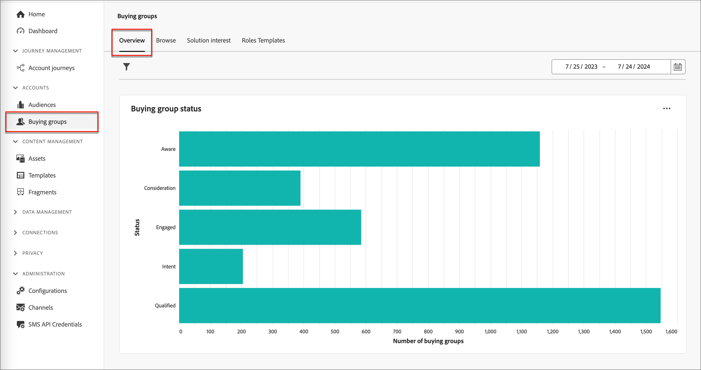
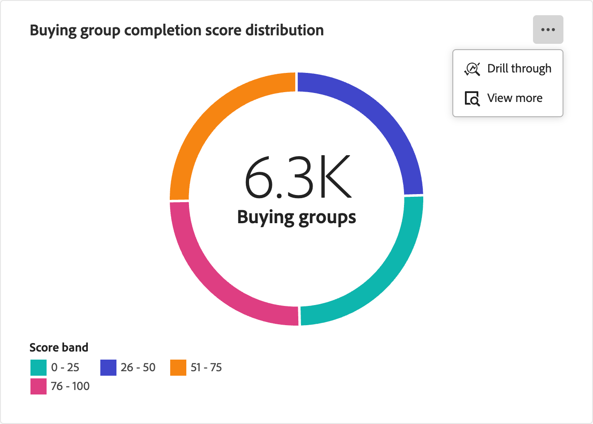
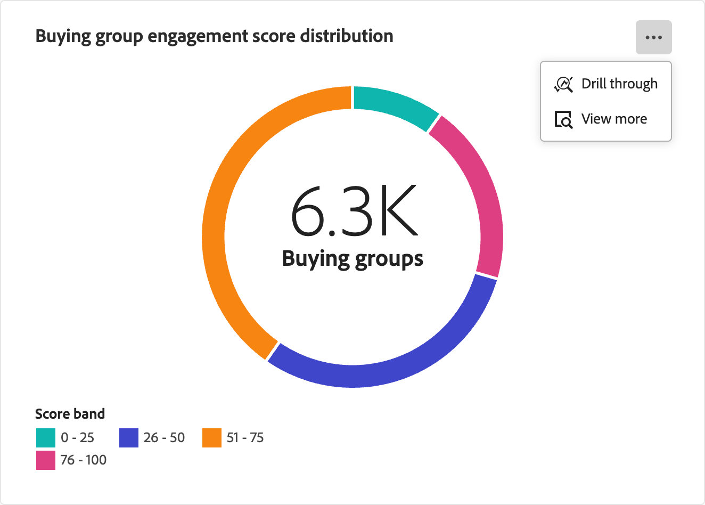
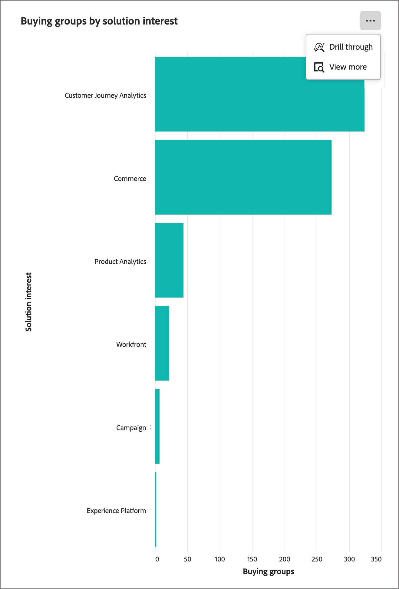
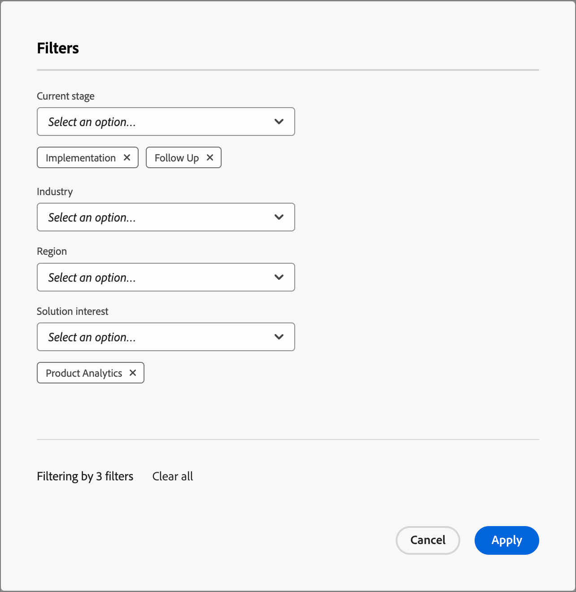
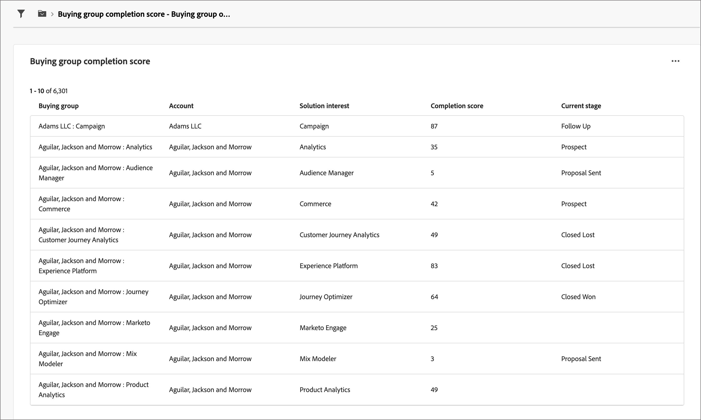
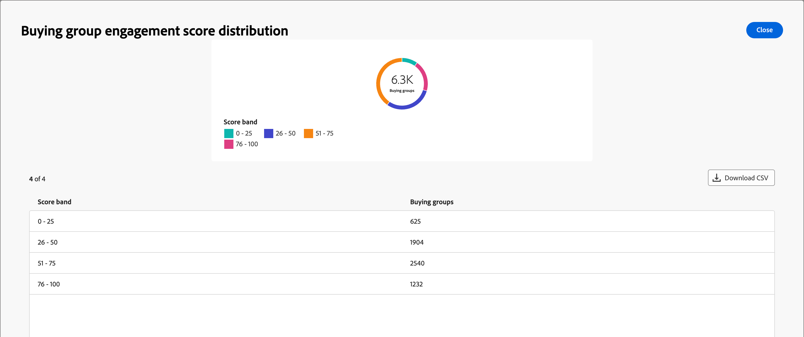

# 購買グループの概要ダッシュボード

購買グループの概要ダッシュボードは、B2B セールスの引き継ぎプロセス向けに設計されています。 マーケティング部門は、購買グループとそのメンバーを&#x200B;_準備完了_&#x200B;個まで共有し、必要なデータをセールス部門に送信して実行できます。 このプロセスにより、マーケティング部門から営業部門へのスムーズな移行が可能になります。

セールスの引き継ぎは次のとおりです。

* **データの引き継ぎ**: マーケティング部門は&#x200B;_ready_&#x200B;のターゲットデータを特定し、CSV形式で営業部門がアクセスできるようにします。 
* **販売承認**：営業担当者が手動でレビューし、_ready_&#x200B;のターゲットをパイプラインに組み込みます。

このダッシュボードにアクセスするには、左側のナビゲーションで「**[!UICONTROL アカウント]**」を展開し、**[!UICONTROL 購買グループ]**」を選択します。 デフォルトで表示されない場合は、**[!UICONTROL 概要]** タブを選択します。

{width="800" zoomable="yes"}
<!--
## Buying Group Status

Gain insights into your buying groups' progression with the Buying Group Status view. This visualization showcases the distribution of your buying groups categorized by their most recent status update within a specified time frame.

{width="800" zoomable="yes"}

**[!UICONTROL Status]** (y-axis): Track the journey of buying groups through various stages.
**[!UICONTROL Number of Buying Groups]** (x-axis): Quantify the number of buying groups at each status, providing a clear metric of your funnel's health and activity.

To generate a shareable PDF of your current view, click **[!UICONTROL Export]** at the top-right corner of the page. 
-->

## 購買グループの完了スコア分布

このビジュアライゼーションは、完了スコアに基づく購買グループの分布を示しており、4つの異なるスコアバンドに分類されています。 中央の図は購買グループの総数を表し、全体的な進捗状況を素早く示しています。 セグメント化された色は、各スコア範囲内の購買グループの割合を示しているので、完了傾向を一目で把握できます。

詳細な情報を表示するには、右上の「**...**」メニューアイコンをクリックします。

{width="500"}

## 購買グループのエンゲージメントスコア分布

このビジュアライゼーションは、エンゲージメントスコアにもとづく購買グループの分布を示しています。4つの異なるスコアバンドに分類されています。 中央の図は購買グループの総数を表し、全体的な進捗状況を素早く示しています。 セグメント化された色は、各スコア範囲内の購買グループの割合を示しているので、完了傾向を一目で把握できます。

詳細な情報を表示するには、右上の「**...**」メニューアイコンをクリックします。

{width="500"}

## ソリューションに対する関心別の購買グループ

このビジュアライゼーションは、ソリューションへの関心ごとに購買グループの分布を示しており、最も関心を生み出すソリューションを特定するのに役立ちます。 各バーは特定のソリューションを表し、その長さは、その関心に関連する購買グループの数を示しています。 この棒グラフは、ソリューションの需要動向を明確かつ即座に把握するのに役立ちます。

詳細な情報を表示するには、右上の「**...**」メニューアイコンをクリックします。 **ドリルスルー**&#x200B;または&#x200B;**詳細を表示**&#x200B;を選択します。

{width="500"}

## データのフィルタリング

左上の&#x200B;_フィルター_ （）アイコンをクリックして、次のいずれかの属性を使用して、表示されたデータをフィルタリングします。

* 現在のステージ
* 業界
* 地域
* ソリューションに対する関心

{width="500"}

データのフィルタリングに使用する各属性に対して値をいくつでも選択し、**[!UICONTROL 適用]**&#x200B;をクリックします。

## データの活用

データにエンゲージするには、_詳細_ （**...**）を使用します 各グラフの右上にメニューがあります。

### [!UICONTROL &#x200B; ドリルスルー]

個々のグループスコアまたは分布を詳細に分析するには、**[!UICONTROL ドリルスルー]**&#x200B;を選択します。

{width="700" zoomable="yes"}

ダッシュボードに適用されたグローバルフィルターは引き継がれます。 左上の&#x200B;_フィルター_ （）アイコンをクリックして、[&#x200B; ドリルスルー表示の属性フィルター](#filter-the-data)を変更します。

_詳細_ （**...**）をクリックできます 右上のメニューで、**[!UICONTROL 詳細を表示]**&#x200B;から[拡張データを表示](#view-more)を選択します。

### [!UICONTROL 詳細を表示]

詳細データとインサイトを表示するには、**[!UICONTROL 詳細を表示]**&#x200B;を選択します。

{width="700" zoomable="yes"}

表示されるポップアップには、購買グループの分布の内訳を示すチャートとテーブルが含まれています。

データをダウンロードするには、データテーブルの右上にある「**[!UICONTROL CSVをダウンロード]**」をクリックします。 概要ダッシュボードに戻るには、**[!UICONTROL 閉じる]**&#x200B;をクリックします。
