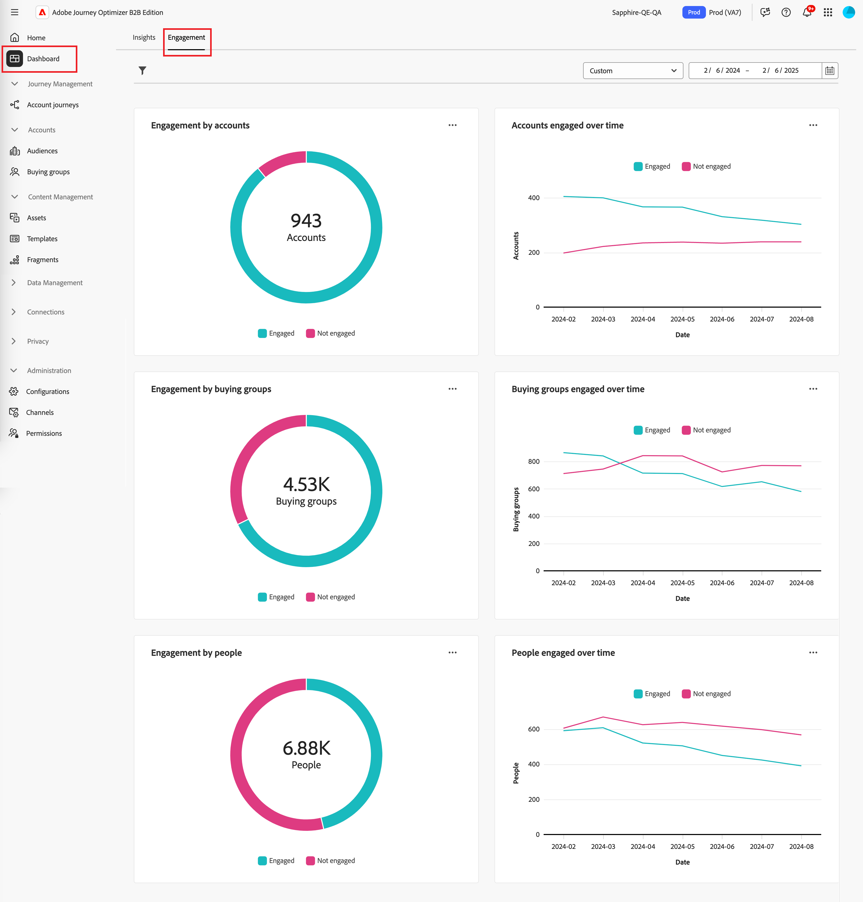
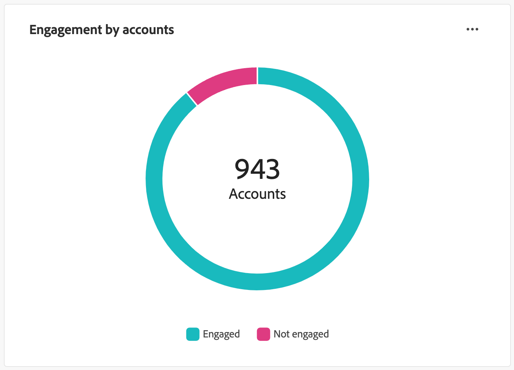
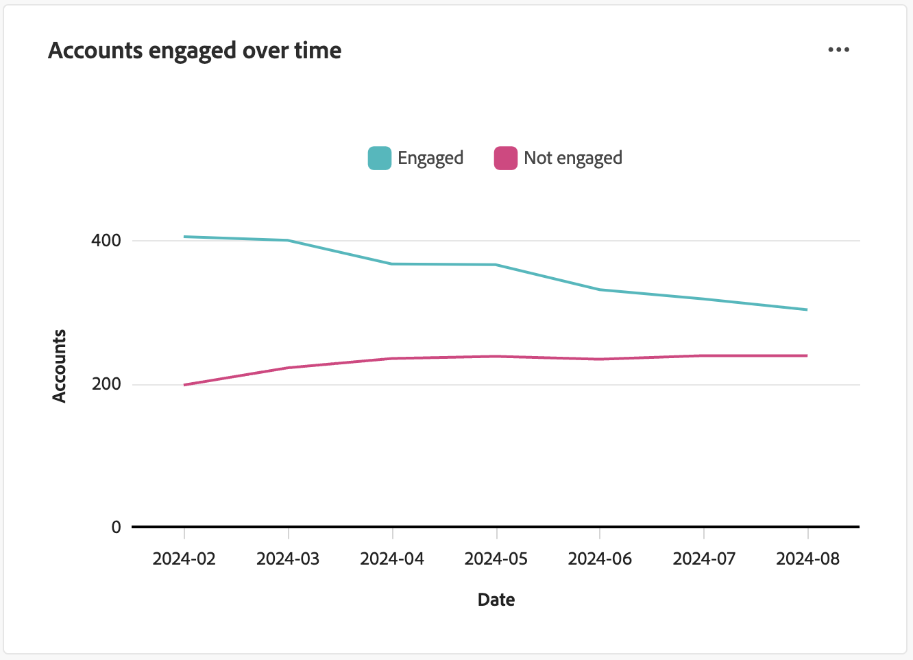
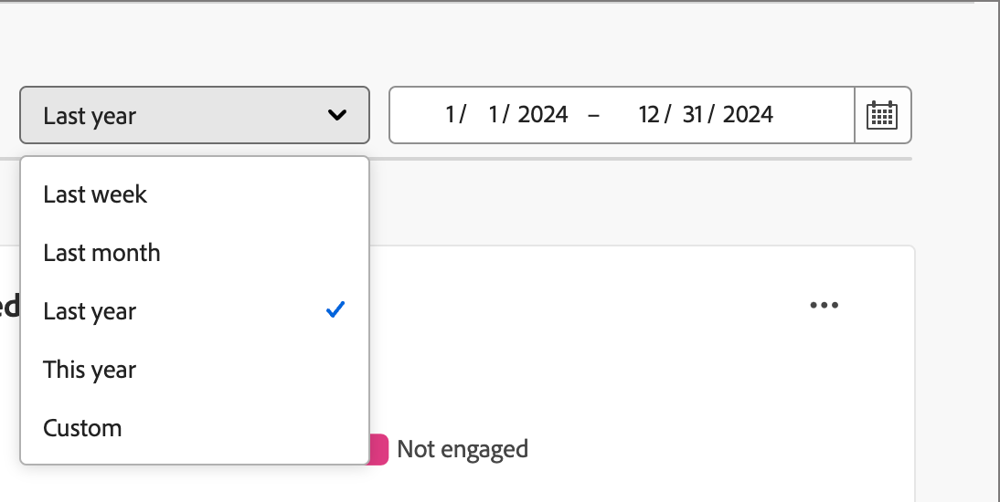
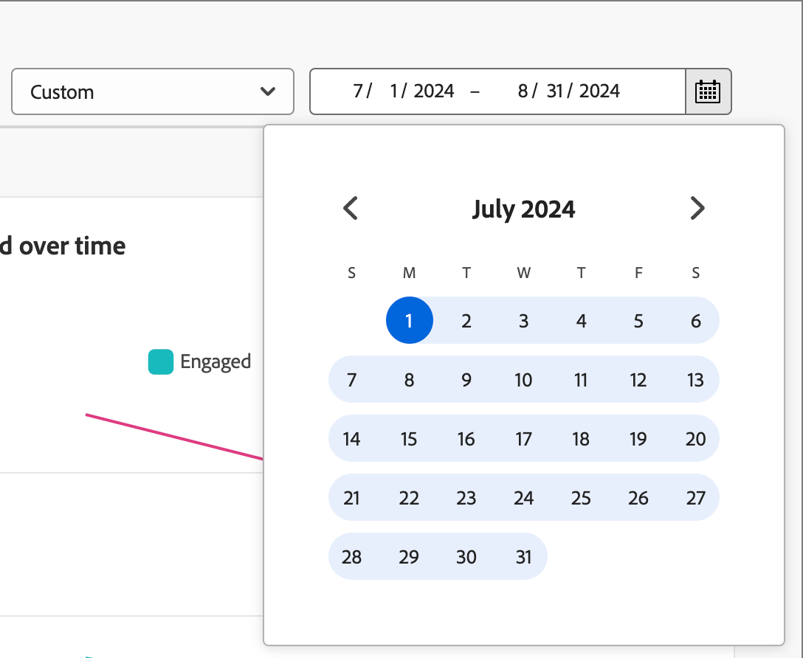
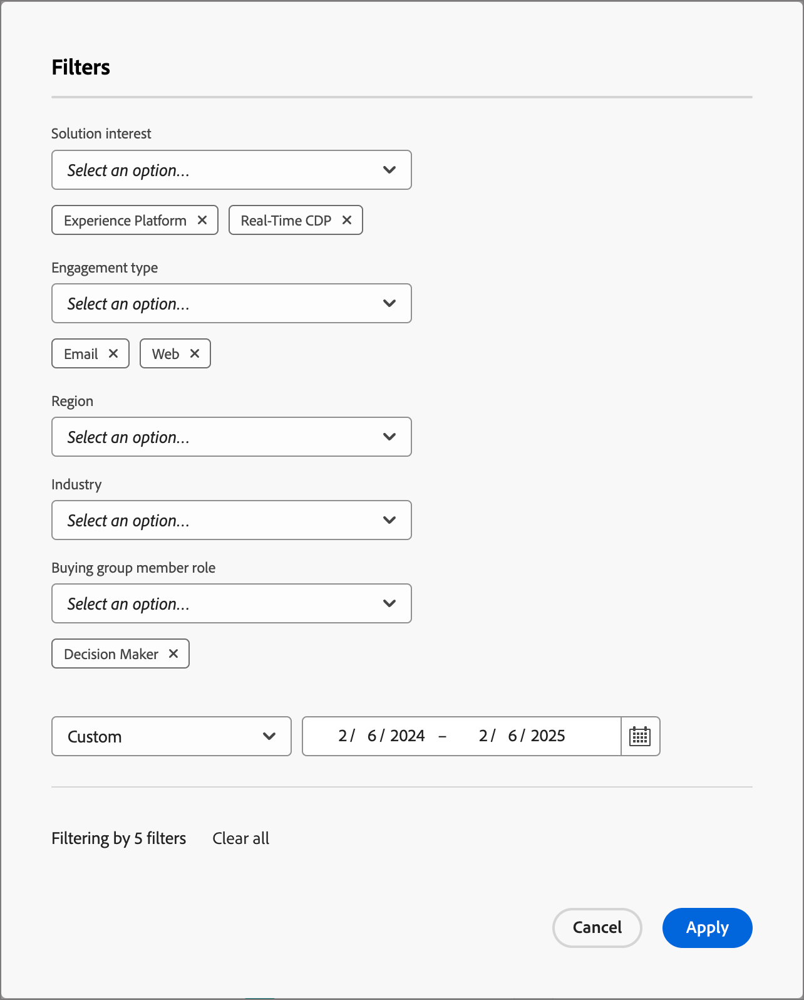
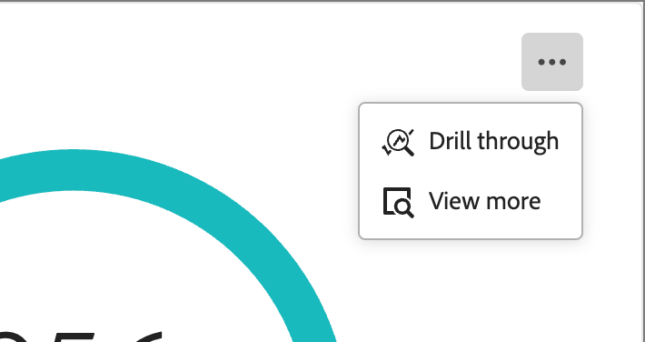
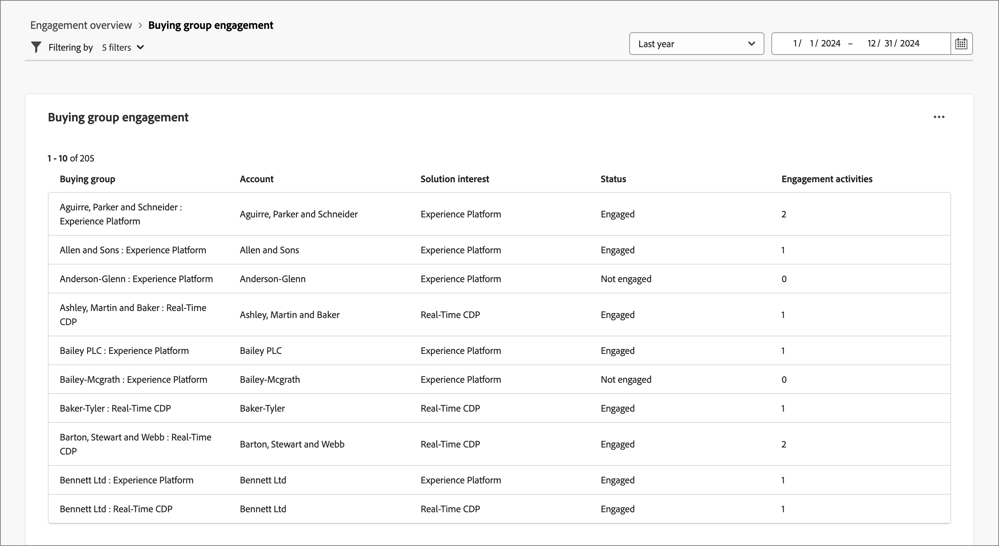
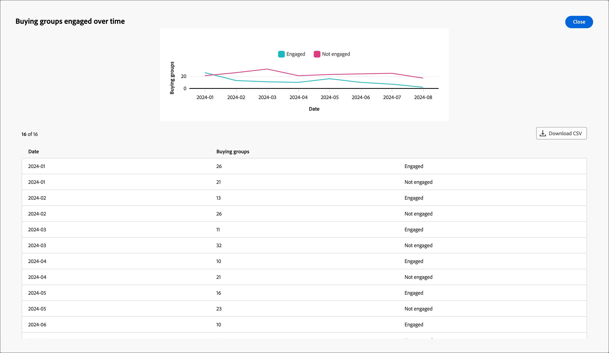

# エンゲージメント概要ダッシュボード

このダッシュボードは、エンゲージメントの包括的なビューを提供し、スナップショットドーナツチャートやトレンドを明らかにする折れ線チャートを通じて、アカウントと個人のインタラクションのリアルタイムの指標を時系列で紹介します。 エンゲージメント施策を効果的に監視し、戦略を策定できます。

_エンゲージメントダッシュボード_&#x200B;にアクセスするには、左側のナビゲーションで&#x200B;**[!UICONTROL ダッシュボード]**&#x200B;項目を選択します。 次に、ページ上部の「**[!UICONTROL エンゲージメント]**」タブを選択します。

<!-- To generate a shareable PDF of your current view, click **[!UICONTROL Export]** at the top-right corner of the page. To engage with the data, use the action menu in the top-right corner. -->

{width="800" zoomable="yes"}

## アカウント別エンゲージメント / 購買グループ / 人物別

円グラフは、アカウント、購買グループ、または個人を、エンゲージ済みカテゴリーと非エンゲージ済みカテゴリーに分けます。 中央の図は、各カテゴリ内の合計数を示しており、全体的なエンゲージメントを一目で把握することができます。

{width="500"}

## アカウント/購買グループ/長期的なエンゲージメント

この折れ線グラフには、アカウントや個人のエンゲージメントレベルが時間の経過とともに表示されます。 「エンゲージ済み」と「エンゲージなし」の別々の行を、タイムスタンプ付きの横軸と共に視覚化することで、傾向やパターンをピンポイントで特定できます。 行にカーソルを合わせると、任意の日付の正確な指標を表示できます。

{width="500"}

## データのフィルタリング

表示されるデータは、日付範囲と属性でフィルタリングできます。

### 日付範囲フィルター

右上の&#x200B;_[!UICONTROL 日付範囲フィルター]_&#x200B;を使用して、日付範囲に従ってデータをフィルタリングします。

{width="380"}

**[!UICONTROL カスタム]**&#x200B;範囲では、カレンダーツールを使用して開始日と終了日を指定できます。 終了日は、デフォルトで現在の日付になります。

{width="380"}

### 属性フィルター

左上の&#x200B;_フィルター_ （）アイコンをクリックして、次のいずれかの属性を使用して、表示されたデータをフィルタリングします。

* ソリューションに対する関心
* エンゲージメントタイプ
* 地域
* 業界
* 購買グループメンバーの役割

{width="500"}

データのフィルタリングに使用する各属性に対して値をいくつでも選択し、**[!UICONTROL 適用]**&#x200B;をクリックします。

## データの活用

データを使用するには、各グラフの右上にある&#x200B;**...** メニューを使用します。

{width="300"}

### ドリルスルー

円グラフの場合、個々のグループエンゲージメントデータを詳細に分析するには、**[!UICONTROL ドリルスルー]**&#x200B;を選択します。

グローバルフィルター（データ範囲と属性）がダッシュボードに適用されます。 左上の&#x200B;_フィルター_ （）アイコンをクリックして、[ ドリルスルー表示の属性フィルター](#filter-the-data)を変更します。 右上の日付範囲セレクターを使用して、ドリルスルー表示の日付範囲](#date-range-filter)を[変更します。

{width="700" zoomable="yes"}

| アカウント別のエンゲージメント | 購買グループ別のエンゲージメント | 顧客別のエンゲージメント |
| ---------------------- | --------------------------- | -------------------- |
| <li>アカウント名 <li>ステータス <li>エンゲージメント済みの人数（数値）<li>エンゲージメント活動（数値） <li>最終エンゲージメント（日付） | <li>購買グループ <li>アカウント <li>ソリューションに対する関心 <li>ステータス <li>エンゲージメント活動（数値） | <li>名前 <li>ステータス <li>Email （address） <li>エンゲージメント活動（数値） <li>最終エンゲージメント（日付） |

右上の&#x200B;**...** メニューアイコンをクリックし、**[!UICONTROL 詳細を表示]**&#x200B;から[拡張データとインサイトを表示](#view-more)を選択できます。

### さらに表示

拡張データとインサイトについては、**[!UICONTROL 詳細を表示]**&#x200B;を選択してください。

{width="700" zoomable="yes"}

グラフに応じて、次の拡張データがあります。

| アカウント別/購買グループ別/人物別のエンゲージメント | アカウント/購買グループ/時間の経過とともにエンゲージした人物 |
| ----------------------------------------------- | -------------------------------------------------- |
| <li>エンゲージ済み <li>未エンゲージ | <li>日付 <li>アカウント/購買グループ/人物（数値） <li>エンゲージメント/非エンゲージメント |

拡張データをコピーするには、右上の「**[!UICONTROL CSVをダウンロード]**」をクリックします。
