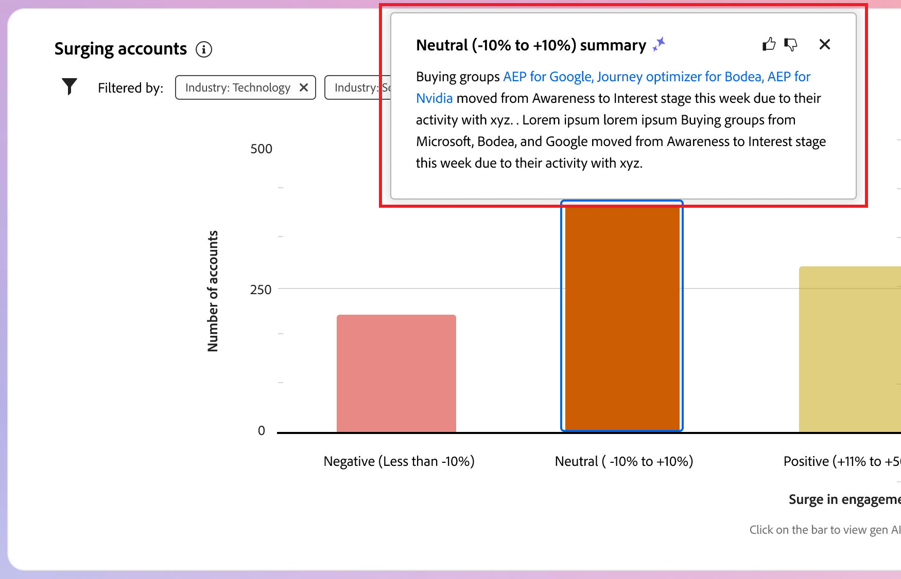

# インテリジェントダッシュボード

インテリジェントダッシュボードは、購入グループとアカウントの指標の包括的なビューを提供し、マーケティング活動をより効果的に監視および戦略するのに役立ちます。

_インテリジェントダッシュボード_ にアクセスするには、左側のナビゲーションで **[!UICONTROL ダッシュボード]** 項目を選択します。

{width="800" zoomable="yes"}

また、インテリジェントダッシュボードでは、次の 2 種類の生成 AI 機能を含むアカウントおよび購入グループの詳細ページにもアクセスできます。

* アカウントと購入グループの概要
* ユーザー、購入グループおよびアカウントのインテント検出

{{intent-data-note}}

インテリジェントダッシュボードから提供される情報やインサイトを活用するには、Journey Optimizer B2B edition インスタンスに必要な項目を用意する必要があります。

| タイプ | 要件 |
| ---- | ----------- |
| [ 購入グループステージ ](#buying-group-stages) | 購買グループ ステージ **および** 作成した購買グループに追加する）を設定します。 |
| [ 購入グループのハイライト ](#buying-group-highlights) | 購買グループ ステージ **および** 作成した購買グループに追加する）を設定します。 |
| [ アカウントの急増 ](#surging-accounts) | 1 つ以上の公開済みジャーニー **または** が購入グループを作成しました。 |
| [ アカウントのハイライト ](#account-highlights) | 1 つ以上の公開済みジャーニー **または** が購入グループを作成しました。 |
| [ 連絡先の範囲 ](#contact-coverage) | 1 つ以上の購買グループが作成されました（ステージは不要です）。 |
| [ 連絡先の重複 ](#contact-overlap) | 1 つ以上の購買グループが作成されました（ステージは不要です）。 |
| [ アカウントの詳細ページ ](../accounts/account-details.md) | 1 つ以上の公開済みジャーニー。 |
| [ 購入グループの詳細ページ ](../buying-groups/buying-group-details.md) | 1 つ以上の購買グループが作成されました（ステージは不要です）。 |

## 購買グループステージ {#buying-group-stages}

>[!CONTEXTUALHELP]
>id="ajo-b2b_intelligent_dashboard_buying_group_stages"
>title="購買グループステージ"
>abstract="このグラフでは、設定されたトランジションルールに基づいて、様々なステージにわたる購買グループの進行状況の概要を示します。最初のバーは、選択した時間枠の最初の日に特定のステージにある購買グループの数を、選択した時間枠の最終日と比較して示します。"

_[!UICONTROL 購入グループステージ]_ チャートは、様々なステージにわたる購入グループの進行状況の概要を提供します（[ 管理者が設定したトランジションルールに基づいて ](../buying-groups/buying-group-stages.md)）。

>[!NOTE]
>
>購入グループステージを利用するには、購入グループステージを設定する必要があります。 ステージと、購入グループのステージを定義して有効にする方法について詳しくは、[ 購入グループステージ ](../buying-groups/buying-group-stages.md) を参照してください。

{width="800" zoomable="yes"}

このグラフでは、購入グループステージモデルの最近公開されたバージョンの購入グループステージを使用します。 ステージごとに 2 つのバーがあります。 最初のバーは、選択した時間枠の最初の日付の購入グループの数を示します。 2 つ目は（比較して）時間枠の最後の日付の購入グループの数です。 各バーにカーソルを合わせると、各ステージの購入グループの数が表示されます。

{width="400"}

### 生成 AI の概要

バーをクリックして、選択した期間のそのステージの購入グループの生成 AI の概要を表示します。

{width="500"}

生成された概要には、設定されたトランジションルールに基づいて、様々なステージにわたる購入グループの進行状況の概要が表示されます。

### 期間 {#time-period-stages}

右上の日付フィルターを使用して、データビジュアライゼーションの日付範囲を変更します。 下向き矢印をクリックして相対的な日付範囲を設定するか、カスタムの開始日と終了日を設定します。

<!-- {width="300"} -->

### 属性フィルター {#attribute-filter-stages}

左上の _フィルター_ （）アイコンをクリックし、次の属性のいずれかを使用してデータ表示をフィルタリングします。

* ソリューションの関心
* アカウント
* ステージ名

<!-- Add screen when the UI is available {width="500"} -->

## 購買グループのハイライト {#buying-group-highlights}

>[!CONTEXTUALHELP]
>id="ajo-b2b_intelligent_dashboard_buying_group_highlights_engagement"
>title="上位 5 個のエンゲージメント別購買グループ"
>abstract="正規化されたエンゲージメントスコアに基づく上位の関与した購買グループ。"

>[!CONTEXTUALHELP]
>id="ajo-b2b_intelligent_dashboard_buying_group_highlights_velocity"
>title="上位 5 個の高速購買グループ"
>abstract="ステージの進行速度に基づく購買グループ。"

>[!CONTEXTUALHELP]
>id="ajo-b2b_intelligent_dashboard_buying_group_highlights_stagnant"
>title="上位 5 個の停滞購買グループ"
>abstract="高い完全性スコアにもかかわらず、ステージを進めていない停滞購買グループ。"

_[!UICONTROL 購入グループのハイライト]_ セクションは 3 行に整理され、興味のある購入グループに関する情報を組織に示します。

{width="800" zoomable="yes"}

* **エンゲージメント別の上位 5 件の購入グループ** – この行には、正規化されたエンゲージメントスコアに基づいて、上位のエンゲージメントのある購入グループが表示されます。
* **上位 5 件の高速購入グループ** – この行には、購入グループステージで進行しているベロシティに基づく上位の購入グループが表示されます。
* **上位 5 つの停滞した購入グループ** – この行には、完全性スコアが高いにもかかわらずステージを進んでいない最も停滞した購入グループが表示されます。

各カードには、次のデータが含まれます。

* **_購入グループ名_**。 名前をクリックして、購買グループの詳細ページを開きます。
* **_アカウント名_**。 名前をクリックして、アカウントの詳細ページを開きます（アカウントの詳細ページへのハイパーリンク）。
* 購買グループの **_現在のステージ_**。
* **_エンゲージメントスコア_** （すべての購入グループで正規化されたもの）。 すべての購入グループのトップスコアが同じ場合は、最後に更新されたスコアが表示されます。
* **_完全性スコア_** （1 ～ 100 の範囲）。 すべての購入グループのトップスコアが同じ場合は、最後に更新されたスコアが表示されます。
* **_カテゴリインテント_**。 _[!UICONTROL 詳細を表示]_ をクリックして、インテント データを表示します。

  {width="500" zoomable="yes"}

   * 詳細ポップアップには、カテゴリ名が表示され、最上位にインテントレベルが表示されます。
   * 各行のデータは、製品名、製品インテントの強さ、インテントの強さによる上位のキーワードという列で整理されています。
   * カテゴリ、製品およびキーワードの並べ替え順は、大から小までです。 各タイプの 1 つ以上のインテント強度が同じ場合、並べ替えにはアルファベット順が使用されます。

  {{intent-data-note}}

_購入グループのハイライト_ パネルの右上にある「**[!UICONTROL すべて表示]**」をクリックして、購入グループのリストページに移動します。

### 属性フィルター {#attribute-filter-bg-highlights}

左上の _フィルター_ （）アイコンをクリックし、次の属性のいずれかを使用してデータ表示をフィルタリングします。

* ソリューションに対する関心
* 購買グループ
* アカウント

<!-- Add screen when the UI is available {width="500"} -->

### 期間 {#time-period-bg-highlights}

右上の日付フィルターを使用して、データビジュアライゼーションの日付範囲を変更します。 下向き矢印をクリックして相対的な日付範囲を設定するか、カスタムの開始日と終了日を設定します。

<!-- {width="300"} -->

## 急増するアカウント {#account-surge}

>[!CONTEXTUALHELP]
>id="ajo-b2b_intelligent_dashboard_account_surge"
>title="アカウント急増"
>abstract="選択した時間枠内にエンゲージメントの勢いが大幅に変化したアカウント。"

「_[!UICONTROL 急増するアカウント]_」セクションには、選択した期間内のエンゲージメントの勢いが大幅に変化したアカウントのビジュアライゼーションが表示されます。

>[!NOTE]
>
>アカウントのサージデータは、アカウントジャーニーまたは購入グループを通じてJourney Optimizer B2B editionによってアカウントオーディエンスに取り込まれるアカウントに限定されます。

{width="800" zoomable="yes"}

各バーにポインタを合わせると、各カテゴリのアカウント数が表示されます。

{width="400"}

バーをクリックすると、選択した時間枠のカテゴリ内のアカウントの生成 AI の概要が表示されます。

{width="500"}

### 属性フィルター {#attribute-filter-acct-surge}

左上の _フィルター_ （）アイコンをクリックし、次の属性のいずれかを使用してデータ表示をフィルタリングします。

* ソリューションに対する関心
* 業界
* 地域

<!-- Add screen when the UI is available {width="500"} -->

### 期間 {#time-period-acct-surge}

右上の日付フィルターを使用して、データビジュアライゼーションの日付範囲を変更します。 下向き矢印をクリックして相対的な日付範囲を設定するか、カスタムの開始日と終了日を設定します。

<!-- {width="300"} -->

## アカウントのハイライト {#account-highlights}

>[!CONTEXTUALHELP]
>id="ajo-b2b_intelligent_dashboard_account_highlights_surging"
>title="急増するアカウント"
>abstract="選択した時間枠内にエンゲージメントの勢いが大幅に増加したアカウント。 "

>[!CONTEXTUALHELP]
>id="ajo-b2b_intelligent_dashboard_account_highlights_at_risk"
>title="リスクのあるアカウント"
>abstract="選択した時間枠内にエンゲージメントの勢いが大幅に減少したアカウント。"

_[!UICONTROL アカウントのハイライト表示]_ セクションは 2 行に整理され、組織が関心を持つアカウントに関する情報が表示されます。

>[!NOTE]
>
>アカウントハイライトデータは、アカウントジャーニーまたは購入グループを通じてアカウントオーディエンスのJourney Optimizer B2B editionによって取り込まれるアカウントに限定されます。

{width="800" zoomable="yes"}

* **急増するアカウント** – この行には、選択した期間でエンゲージメントの勢いが大幅に増加したアカウントが表示されます。
* **危険なアカウント** – この行には、選択した期間に、エンゲージメントの勢いが大幅に低下したアカウントが表示されます。

各カードには、次のデータが含まれます。

* **_アカウント名_**。 名前をクリックして、アカウントの詳細ページを開きます。
* アカウントの **_生成 AI の概要_**。
* **_キーワードインテント_**。 _[!UICONTROL 詳細を表示]_ をクリックして、インテント データを表示します。

  {width="500" zoomable="yes"}

   * 詳細ポップアップには、カテゴリ名が表示され、最上位にインテントレベルが表示されます。
   * 各行のデータは、製品名、製品インテントの強さ、インテントの強さによる上位のキーワードという列で整理されています。
   * カテゴリ、製品およびキーワードの並べ替え順は、大から小までです。 各タイプの 1 つ以上のインテント強度が同じ場合、並べ替えにはアルファベット順が使用されます。

  {{intent-data-note}}
<!-- 
At the top right of the _Buying group highlights_ panel, click **[!UICONTROL View All]** to navigate to the Buying groups list page. -->

### 属性フィルター {#attribute-filter-acct-highlights}

左上の _フィルター_ （）アイコンをクリックし、次の属性のいずれかを使用してデータ表示をフィルタリングします。

* ソリューションに対する関心
* 購買グループ

<!-- Add screen when the UI is available {width="500"} -->

### 期間 {#time-period-acct-highlights}

右上の日付フィルターを使用して、データビジュアライゼーションの日付範囲を変更します。 下向き矢印をクリックして相対的な日付範囲を設定するか、カスタムの開始日と終了日を設定します。

<!-- {width="300"} -->

## 連絡先の適用範囲 {#contact-coverage}

>[!CONTEXTUALHELP]
>id="ajo-b2b_intelligent_dashboard_contact_coverage"
>title="連絡先の適用範囲"
>abstract="ソリューションの興味に関連付けられた特定の役割を持つ連絡先の数を表示します。役割とソリューションの興味の割り当ては、購買グループ テンプレートに基づきます。"

「_[!UICONTROL 連絡先の対象範囲]_」セクションには、ソリューションの関心に関連付けられた特定の役割を持つ連絡先の数のビジュアライゼーションが表示されます。 役割とソリューションの興味の割り当ては、購買グループ テンプレートに基づきます。

>[!NOTE]
>
>連絡先カバレッジデータは、Journey Optimizer B2B edition インスタンスで作成された購入グループに基づいています。

{width="800" zoomable="yes"}

各セルにポインタを合わせると、役割またはソリューションの関心のある連絡先の数が表示されます。

{width="400"}

セルをクリックして、役割またはソリューションに関心のある連絡先の詳細情報を表示します。

{width="700" zoomable="yes"}

### 属性フィルター {#attribute-filter-contact-coverage}

左上の _フィルター_ （）アイコンをクリックし、次の属性のいずれかを使用してデータ表示をフィルタリングします。

* ソリューションに対する関心
* アカウント

<!-- Add screen when the UI is available {width="500"} -->

## 連絡先の重複 {#contact-overlap}

>[!CONTEXTUALHELP]
>id="ajo-b2b_intelligent_dashboard_contact_overlap"
>title="連絡先の重複"
>abstract="複数のソリューションの興味に関連付けられた結果、複数の購買グループに属している連絡先のリスト。"

「_[!UICONTROL 連絡先の重複]_」セクションには、複数のソリューションの関心に関連付けられているので、複数の購入グループに属する連絡先のリストが表示されます。

>[!NOTE]
>
>連絡先の重複データは、Journey Optimizer B2B edition インスタンスで作成された購入グループに基づいています。

{width="800" zoomable="yes"}

_情報_ （）をクリックして、次の詳細を含むテーブルを表示します。

* 購買グループ名（名前をクリックして購買グループの詳細ページを開きます）
* 役割
* ソリューションに対する関心
* 製品の意図
* 製品

{width="600" zoomable="yes"}

### 属性フィルター {#attribute-filter-contact-overage}

左上の _フィルター_ （）アイコンをクリックし、次の属性のいずれかを使用してデータ表示をフィルタリングします。

* ソリューションに対する関心
* ロール
* アカウント

<!-- Add screen when the UI is available {width="500"} -->
