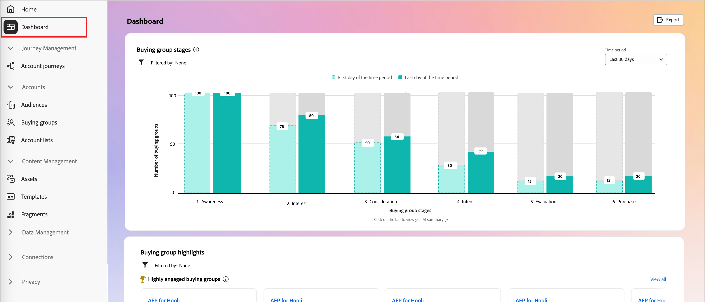
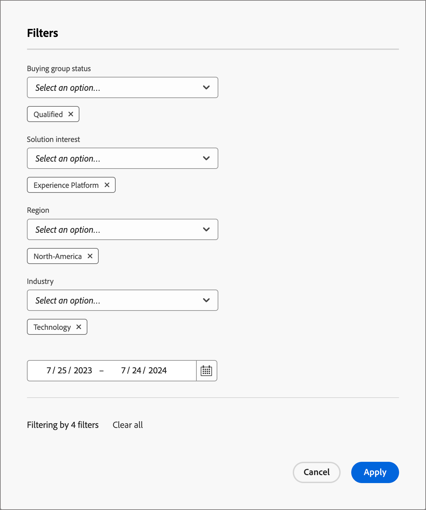
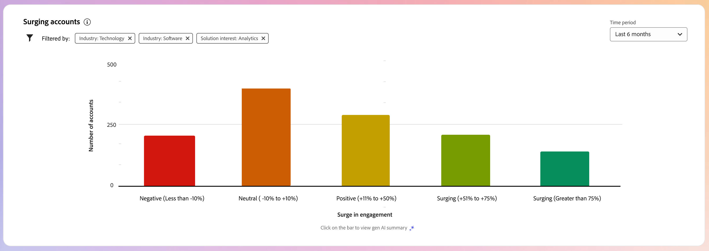
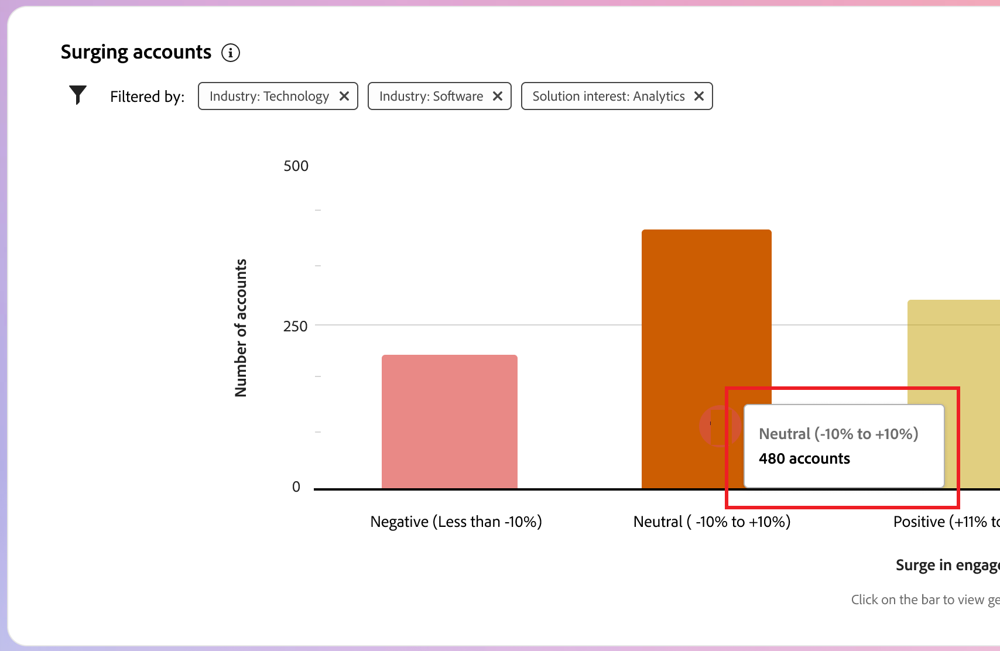
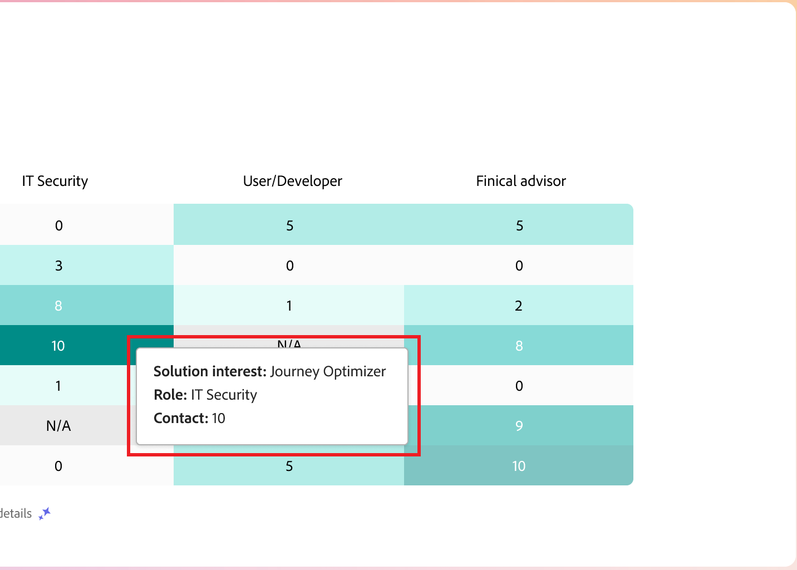
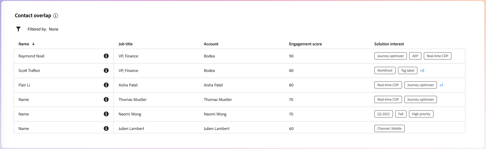

# インテリジェントダッシュボード

インテリジェントダッシュボードは、購入グループとアカウントの指標の包括的なビューを提供し、マーケティング活動をより効果的に監視および戦略するのに役立ちます。

_インテリジェントダッシュボード_ にアクセスするには、左側のナビゲーションで **[!UICONTROL ダッシュボード]** 項目を選択します。

{width="800" zoomable="yes"}

また、インテリジェントダッシュボードでは、次の 2 種類の生成 AI 機能を含むアカウントおよび購入グループの詳細ページにもアクセスできます。

* アカウントと購入グループの概要
* ユーザー、購入グループおよびアカウントのインテント検出

{{intent-data-note}}

インテリジェントダッシュボードから提供される情報やインサイトを活用するには、Journey Optimizer B2B edition インスタンスに必要な項目を用意する必要があります。

| タイプ | 要件 |
| ---- | ----------- |
| [ 購入グループステージ ](#buying-group-stages) | 購買グループ ステージ **および** 作成した購買グループに追加する）を設定します。 |
| [ 購入グループのハイライト ](#buying-group-highlights) | 購買グループ ステージ **および** 作成した購買グループに追加する）を設定します。 |
| [ アカウントの急増 ](#surging-accounts) | 1 つ以上の公開済みジャーニー **または** が購入グループを作成しました。 |
| [ アカウントのハイライト ](#account-highlights) | 1 つ以上の公開済みジャーニー **または** が購入グループを作成しました。 |
| [ 連絡先の範囲 ](#contact-coverage) | 1 つ以上の購買グループが作成されました（ステージは不要です）。 |
| [ 連絡先の重複 ](#contact-overlap) | 1 つ以上の購買グループが作成されました（ステージは不要です）。 |
| [ アカウントの詳細ページ ](../accounts/account-details.md) | 1 つ以上の公開済みジャーニー。 |
| [ 購入グループの詳細ページ ](../buying-groups/buying-group-details.md) | 1 つ以上の購買グループが作成されました（ステージは不要です）。 |

## 購買グループステージ {#buying-group-stages}

>[!CONTEXTUALHELP]
>id="ajo-b2b_intelligent_dashboard_buying_group_stages"
>title="購買グループステージ"
>abstract="このグラフでは、設定されたトランジションルールに基づいて、様々なステージにわたる購買グループの進行状況の概要を示します。 最初のバーは、選択した時間枠の最初の日に特定のステージにある購買グループの数を、選択した時間枠の最終日と比較して示します。"

_[!UICONTROL 購入グループステージ]_ チャートは、様々なステージにわたる購入グループの進行状況の概要を提供します（[ 管理者が設定したトランジションルールに基づいて ](../buying-groups/buying-group-stages.md)）。

>[!NOTE]
>
>購買グループのステージを利用するには、購買グループのステージを設定する必要があります。 購買グループのステージについて詳しくは、[購買グループのステージ ](../buying-groups/buying-group-stages.md)を参照してください。

{width="800" zoomable="yes"}

このグラフは、購買グループのステージモデルの中で最近公開されたバージョンの購買グループのステージを使用しています。 各ステージには2つのバーがあります。 最初のバーは、選択した時間枠の最初の日付における購買グループの数を示します。 2つ目（比較）は、時間枠の最後の日付における購買グループの数です。 各バーにカーソルを合わせると、各ステージの購買グループの数を確認できます。

{width="400"}

### 生成AIによる要約

バーをクリックすると、選択した期間のそのステージにおける購買グループの生成AI概要が表示されます。

{width="500"}

生成された概要では、設定された移行ルールにもとづいて、様々なステージにおける購買グループの進捗状況の概要を確認できます。

### 期間 {#time-period-stages}

右上の日付フィルターを使用して、データビジュアライゼーションの日付範囲を変更します。 下向き矢印をクリックして相対的な日付範囲を設定するか、カスタムの開始日と終了日を設定します。

<!-- {width="300"} -->

### 属性フィルター {#attribute-filter-stages}

左上の&#x200B;_フィルター_ （）アイコンをクリックして、次のいずれかの属性を使用してデータ表示をフィルターします。

* ソリューションへの関心
* アカウント
* ステージ名

<!-- Add screen when the UI is available {width="500"} -->

## 購買グループのハイライト {#buying-group-highlights}

>[!CONTEXTUALHELP]
>id="ajo-b2b_intelligent_dashboard_buying_group_highlights_engagement"
>title="上位 5 個のエンゲージメント別購買グループ"
>abstract="正規化されたエンゲージメントスコアに基づく上位の関与した購買グループ。"

>[!CONTEXTUALHELP]
>id="ajo-b2b_intelligent_dashboard_buying_group_highlights_velocity"
>title="上位 5 個の高速購買グループ"
>abstract="ステージの進行速度に基づく購買グループ。"

>[!CONTEXTUALHELP]
>id="ajo-b2b_intelligent_dashboard_buying_group_highlights_stagnant"
>title="上位 5 個の停滞購買グループ"
>abstract="高い完全性スコアにもかかわらず、ステージを進めていない停滞購買グループ。"

購買グループのハイライト _[!UICONTROL 購買グループのハイライト]_ セクションは、3つの行に整理され、組織に関心のある購買グループに関する情報を表示します。

{width="800" zoomable="yes"}

* **エンゲージメント別の上位5つの購買グループ** – この行には、正規化されたエンゲージメントスコアに基づいて、最もエンゲージメントの高い購買グループが表示されます。
* **上位5つの高速な購買グループ** – この行には、購買グループのステージを進んでいる速度に基づいて、上位の購買グループが表示されます。
* **上位5つの停滞している購買グループ** – この行には、高い完全性スコアにもかかわらずステージを進んでいない最も停滞している購買グループが表示されます。

各カードには、次のデータが含まれます。

* **_購買グループ名_**。 名前をクリックして購買グループの詳細ページを開きます。
* **_アカウント名_**。 名前をクリックして、アカウントの詳細ページ（アカウントの詳細ページにハイパーリンク）を開きます。
* 購買グループの&#x200B;**_現在のステージ_**。
* **_エンゲージメントスコア_** （すべての購買グループで正規化）。 すべての購買グループの上位スコアが同じ場合は、最後に更新されたスコアが表示されます。
* **_完全性スコア_** （1 ～ 100の範囲）。 すべての購買グループの上位スコアが同じ場合は、最後に更新されたスコアが表示されます。
* **_カテゴリの意図_**。 「_[!UICONTROL 詳細を表示]_」をクリックして、インテントデータを表示します。

  {width="500" zoomable="yes"}

   * 詳細ポップアップには、カテゴリ名とインテントレベルが上部に表示されます。
   * 各行のデータは、商品名、製品の意図の強さ、意図の強さ別の上位キーワードなどの列で構成されています。
   * 並べ替え順序は、カテゴリ、製品、キーワードに対して高から低です。 各タイプの1つ以上が同じ意図の強さを持つ場合、並べ替えではアルファベット順が使用されます。

  {{intent-data-note}}

_購買グループのハイライト_ パネルの右上にある「**[!UICONTROL すべて表示]**」をクリックして、購買グループのリストページに移動します。

### 属性フィルター {#attribute-filter-bg-highlights}

左上の&#x200B;_フィルター_ （）アイコンをクリックして、次のいずれかの属性を使用してデータ表示をフィルターします。

* ソリューションに対する関心
* 購買グループ
* アカウント

<!-- Add screen when the UI is available {width="500"} -->

### 期間 {#time-period-bg-highlights}

右上の日付フィルターを使用して、データビジュアライゼーションの日付範囲を変更します。 下向き矢印をクリックして相対的な日付範囲を設定するか、カスタムの開始日と終了日を設定します。

<!-- {width="300"} -->

## 急増するアカウント {#account-surge}

>[!CONTEXTUALHELP]
>id="ajo-b2b_intelligent_dashboard_account_surge"
>title="アカウント急増"
>abstract="選択した時間枠内にエンゲージメントの勢いが大幅に変化したアカウント。"

「_[!UICONTROL 急増アカウント]_」セクションには、選択した時間枠内のエンゲージメントの勢いが大幅に変化したアカウントのビジュアライゼーションが表示されます。

>[!NOTE]
>
>アカウントのサージデータには、Journey Optimizer B2B editionがアカウントジャーニーまたは購買グループを通じて取り込むアカウントのみが含まれます。

{width="800" zoomable="yes"}

各バーにカーソルを合わせると、各カテゴリーのアカウント数が表示されます。

{width="400"}

バーをクリックすると、選択した時間枠のカテゴリ内のアカウントの生成AI概要が表示されます。

{width="500"}

### 属性フィルター {#attribute-filter-acct-surge}

左上の&#x200B;_フィルター_ （）アイコンをクリックして、次のいずれかの属性を使用してデータ表示をフィルターします。

* ソリューションに対する関心
* 業界
* 地域

<!-- Add screen when the UI is available {width="500"} -->

### 期間 {#time-period-acct-surge}

右上の日付フィルターを使用して、データビジュアライゼーションの日付範囲を変更します。 下向き矢印をクリックして相対的な日付範囲を設定するか、カスタムの開始日と終了日を設定します。

<!-- {width="300"} -->

## アカウントのハイライト {#account-highlights}

>[!CONTEXTUALHELP]
>id="ajo-b2b_intelligent_dashboard_account_highlights_surging"
>title="急増するアカウント"
>abstract="選択した時間枠内にエンゲージメントの勢いが大幅に増加したアカウント。 "

>[!CONTEXTUALHELP]
>id="ajo-b2b_intelligent_dashboard_account_highlights_at_risk"
>title="リスクのあるアカウント"
>abstract="選択した時間枠内にエンゲージメントの勢いが大幅に減少したアカウント。"

「_[!UICONTROL アカウントのハイライト]_」セクションは、組織に関心のあるアカウントに関する情報を表示するために2行に整理されています。

>[!NOTE]
>
>アカウントハイライトデータには、Journey Optimizer B2B editionがアカウントジャーニーまたは購買グループを通じて取り込むアカウントのみが含まれます。

{width="800" zoomable="yes"}

* **急増アカウント** – この行には、選択した時間枠にわたってエンゲージメントの勢いが大幅に増加したアカウントが表示されます。
* **リスクのあるアカウント** – この行には、選択した時間枠にわたってエンゲージメントの勢いが大幅に減少したアカウントが表示されます。

各カードには、次のデータが含まれます。

* **_アカウント名_**。 名前をクリックして、アカウントの詳細ページを開きます。
* アカウントの&#x200B;**_生成AI概要_**。
* **_キーワードインテント_**。 「_[!UICONTROL 詳細を表示]_」をクリックして、インテントデータを表示します。

  {width="500" zoomable="yes"}

   * 詳細ポップアップには、カテゴリ名とインテントレベルが上部に表示されます。
   * 各行のデータは、商品名、製品の意図の強さ、意図の強さ別の上位キーワードなどの列で構成されています。
   * 並べ替え順序は、カテゴリ、製品、キーワードに対して高から低です。 各タイプの1つ以上が同じ意図の強さを持つ場合、並べ替えではアルファベット順が使用されます。

  {{intent-data-note}}
<!-- 
At the top right of the _Buying group highlights_ panel, click **[!UICONTROL View All]** to navigate to the Buying groups list page. -->

### 属性フィルター {#attribute-filter-acct-highlights}

左上の&#x200B;_フィルター_ （）アイコンをクリックして、次のいずれかの属性を使用してデータ表示をフィルターします。

* ソリューションに対する関心
* 購買グループ

<!-- Add screen when the UI is available {width="500"} -->

### 期間 {#time-period-acct-highlights}

右上の日付フィルターを使用して、データビジュアライゼーションの日付範囲を変更します。 下向き矢印をクリックして相対的な日付範囲を設定するか、カスタムの開始日と終了日を設定します。

<!-- {width="300"} -->

## 連絡先の適用範囲 {#contact-coverage}

>[!CONTEXTUALHELP]
>id="ajo-b2b_intelligent_dashboard_contact_coverage"
>title="連絡先の適用範囲"
>abstract="ソリューションの興味に関連付けられた特定の役割を持つ連絡先の数を表示します。 役割とソリューションの興味の割り当ては、購買グループ テンプレートに基づきます。"

「_[!UICONTROL 連絡先のカバー範囲]_」セクションには、ソリューションへの関心に関連付けられた特定の役割を持つ連絡先の数が視覚化されます。 役割とソリューションの興味の割り当ては、購買グループ テンプレートに基づきます。

>[!NOTE]
>
>連絡先のカバー範囲データは、Journey Optimizer B2B edition インスタンスで作成された購買グループに基づいています。

{width="800" zoomable="yes"}

各セルにカーソルを合わせると、役割/ソリューションの関心のある連絡先の数が表示されます。

{width="400"}

セルをクリックして、役割/ソリューションの関心のある連絡先の詳細情報を表示します。

{width="700" zoomable="yes"}

### 属性フィルター {#attribute-filter-contact-coverage}

左上の&#x200B;_フィルター_ （）アイコンをクリックして、次のいずれかの属性を使用してデータ表示をフィルターします。

* ソリューションに対する関心
* アカウント

<!-- Add screen when the UI is available {width="500"} -->

## 連絡先の重複 {#contact-overlap}

>[!CONTEXTUALHELP]
>id="ajo-b2b_intelligent_dashboard_contact_overlap"
>title="連絡先の重複"
>abstract="複数のソリューションの興味に関連付けられた結果、複数の購買グループに属している連絡先のリスト。"

「_[!UICONTROL 連絡先の重複]_」セクションには、複数のソリューションの関心に関連付けられた結果、複数の購買グループに属する連絡先のリストが表示されます。

>[!NOTE]
>
>連絡先の重複データは、Journey Optimizer B2B edition インスタンスで作成された購買グループに基づいています。

{width="800" zoomable="yes"}

_情報_ （）をクリックすると、次の詳細を含むテーブルが表示されます。

* 購買グループ名（名前をクリックして購買グループの詳細ページを開きます）
* 役割
* ソリューションに対する関心
* 製品インテント
* 製品

{width="600" zoomable="yes"}

### 属性フィルター {#attribute-filter-contact-overage}

左上の&#x200B;_フィルター_ （）アイコンをクリックして、次のいずれかの属性を使用してデータ表示をフィルターします。

* ソリューションに対する関心
* ロール
* アカウント

<!-- Add screen when the UI is available {width="500"} -->
