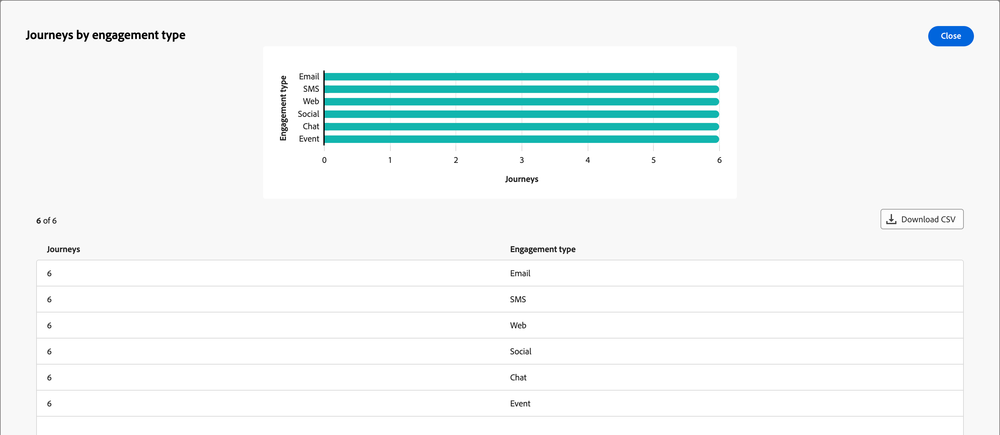

# アカウントジャーニーの概要ダッシュボード

このダッシュボードでは、アクティブなアカウントジャーニーの包括的な概要を提供し、完了を分類および定量化する円と棒グラフ、エンゲージメントアクティビティを使用して、アカウントの進捗状況を詳しく説明します。 マーケターは、主要な配信とエンゲージメント指標を通じて、メールとSMS チャネルの有効性を評価できます。

この概要は、公開されたアカウントジャーニーで利用でき、データがチャートとテーブルの入力を開始するのに約4時間かかります。

{width="700" zoomable="yes"}

## ジャーニー完了率の分布

このグラフは、完了率に基づくジャーニーの分布を示しており、4つの異なるスコアバンドに分類されています。 中央の図はジャーニーの総数を表し、全体的な進捗状況を素早く示しています。 セグメント化された色は、各スコア範囲内のジャーニーの割合を示しているので、完了傾向を一目で評価できます。

詳細な情報を表示するには、右上の「**...**」メニューアイコンをクリックします。

{width="500"}

## エンゲージメントタイプ別ジャーニー

この棒グラフは、エンゲージメントタイプに基づくジャーニーの分布を表示し、ジャーニーをまたいで最も使用されたエンゲージメントを特定するのに役立ちます。 各バーは特定のエンゲージメントタイプを表し、長さはそのタイプのアクティビティを含むジャーニーの数を示します。 この可視化により、アカウントジャーニー内のエンゲージメントの傾向を明確かつ即座に把握できます。

詳細な情報を表示するには、右上の「**...**」メニューアイコンをクリックします。

{width="500"}

## データの活用

データを使用するには、各グラフの右上にある&#x200B;**...** メニューを使用します。

### [!UICONTROL  ドリルスルー]

円グラフで、データの詳細な分析を行うには、**[!UICONTROL ドリルスルー]**&#x200B;を選択します。

{width="700" zoomable="yes"}

_詳細_ （**...**）をクリックできます 右上のメニューで、**[!UICONTROL 詳細を表示]**&#x200B;から[拡張データを表示](#view-more)を選択します。

### [!UICONTROL 詳細を表示]

詳細データとインサイトを表示するには、**[!UICONTROL 詳細を表示]**&#x200B;を選択します。

{width="700" zoomable="yes"}

表示されるポップアップには、ジャーニーデータの内訳を示すチャートとテーブルが含まれます。

データをダウンロードするには、データテーブルの右上にある「**[!UICONTROL CSVをダウンロード]**」をクリックします。 _概要_ ダッシュボードに戻るには、**[!UICONTROL 閉じる]**&#x200B;をクリックします。
