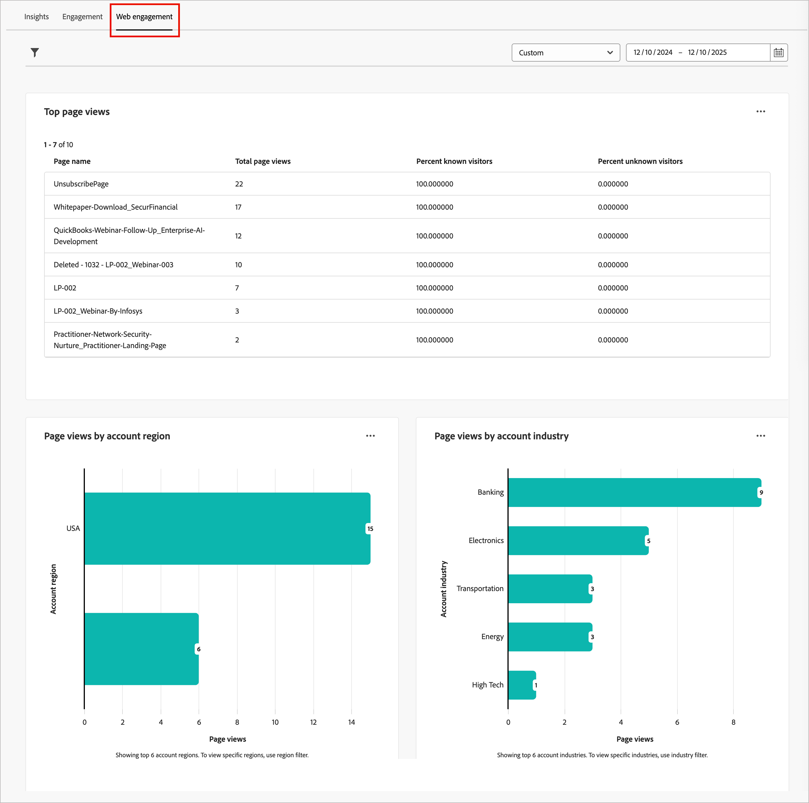
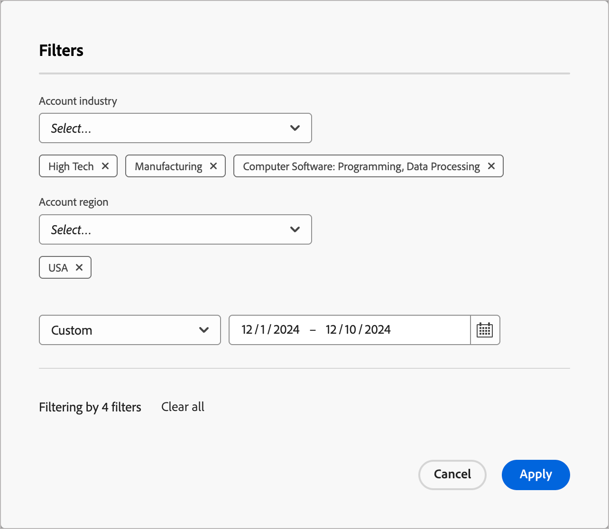
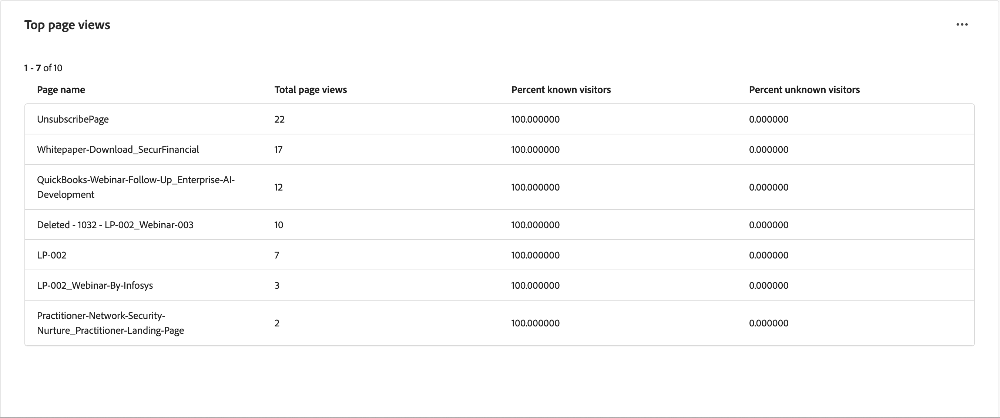
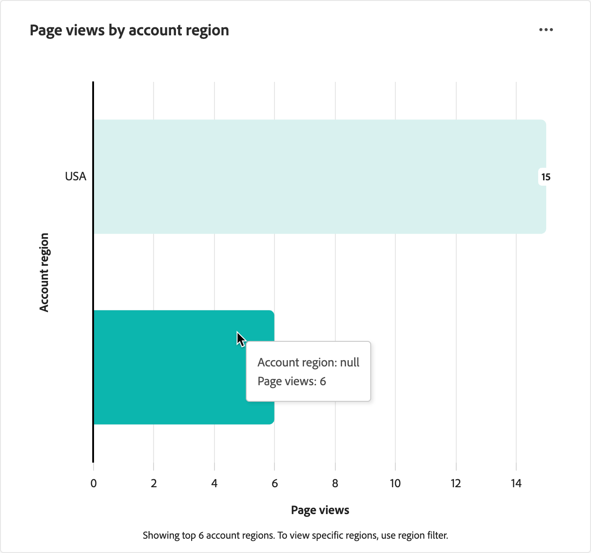

# Web エンゲージメントダッシュボード

Web エンゲージメントダッシュボードでは、web 訪問者が主要コンテンツとやり取りする方法を可視化します。 アカウントの業界や地域をまたいだデータをセグメント化し、エンゲージメントのトレンドを理解するのに役立ちます。 このダッシュボードを使用すると、コンテンツ戦略とアカウントのターゲティングを示す web 行動パターンを表示して、戦略的な意思決定をサポートできます。

_Web エンゲージメントダッシュボード_ にアクセスするには、左側のナビゲーションで **[!UICONTROL ダッシュボード]** 項目を選択します。 次に、ページ上部の「**[!UICONTROL Web エンゲージメント]**」タブを選択します。

{width="700" zoomable="yes"}

## データのフィルタリング

左上の _フィルター_ （）アイコンをクリックし、次の属性のいずれかを使用して表示されたデータをフィルタリングします。

* **[!UICONTROL アカウント地域]** - アカウントに関連付けられた、選択した 1 つ以上の地理的地域でデータをフィルタリングします。
* **[!UICONTROL アカウント業界]** - アカウントに関連付けられた、選択した 1 つ以上の業界の分類でデータをフィルタリングします。
* **[!UICONTROL 日付範囲]** – 選択した日付範囲でデータをフィルタリングします。 デフォルトの範囲は現在の日付です。

{width="500"}

データのフィルタリングに使用する各属性の値を選択し、「**[!UICONTROL 適用]**」をクリックします。

## [!UICONTROL  上位のページビュー ] {#top-page-views}

>[!CONTEXTUALHELP]
>id="ajo-b2b_web_engagement_top_page_views"
>title="上位ページビュー数"
>abstract="Web サイト上で最も頻繁に表示されるページで、最もトラフィックが多いコンテンツを特定するのに役立ちます。"

この表には、最も閲覧された web ページの上位 10 位が表示され、訪問者から最も共感を得られるコンテンツを特定するのに役立ちます。 データには、次のものが含まれます。

| 列 | 説明 |
| ------ | ----------- |
| ページ名 | Web ページの名前またはタイトル。 |
| 合計表示数 | ページが表示された合計数。 |
| 既知訪問者（%） | 既知の（特定された）訪問者に起因するページビューの割合。 |
| 未知の訪問者（%） | 未知（匿名）の訪問者に起因するページビューの割合。 |

{width="650" zoomable="yes"}

## [!UICONTROL  アカウント地域別ページビュー] {#page-views-by-region}

>[!CONTEXTUALHELP]
>id="ajo-b2b_web_engagement_page_views_by_region"
>title="アカウント地域別ページビュー数"
>abstract="関連アカウントの地理的地域別にセグメント化されたweb訪問者分布。"

このビジュアライゼーションでは、アカウント領域ごとにセグメント化された訪問者数が表示されます。 web トラフィックがさまざまな地域でどのように異なるのかを示し、それぞれの地域のオーディエンスに合わせてコンテンツやキャンペーンをカスタマイズできます。 グラフ内の棒にカーソルを合わせると、次のような詳細が表示されます。

* アカウント地域の名前
* ページビュー数

{width="500" zoomable="yes"}

## アカウント業界別[!UICONTROL  ページビュー] {#page-views-by-industry}

>[!CONTEXTUALHELP]
>id="ajo-b2b_web_engagement_page_views_by_industry"
>title="アカウント業種別ページビュー数"
>abstract="関連アカウントの業界分類でセグメント化されたweb訪問者分布。"

このビジュアライゼーションには、アカウント業界ごとにセグメント化された訪問者数が表示されます。 このグラフは、web トラフィックがさまざまな業界でどのように異なるかを理解し、業界固有のコンテンツ戦略を策定するのに役立ちます。 グラフ内の棒にカーソルを合わせると、次のような詳細が表示されます。

* アカウント業界の名前
* ページビュー数

アカウント業界別{width="500" zoomable="yes"}

## データの活用

データを使用するには、_詳細_ （**...**）を使用します 各グラフの右上にあるメニューで、**[!UICONTROL 詳細を表示]**&#x200B;を選択して、拡張データとインサイトを表示します。

表示されるポップアップには、データの分類を示すグラフと表が含まれます。

データをダウンロードするには、データテーブルの右上にある「**[!UICONTROL CSVをダウンロード]**」をクリックします。

{width="700" zoomable="yes"}
