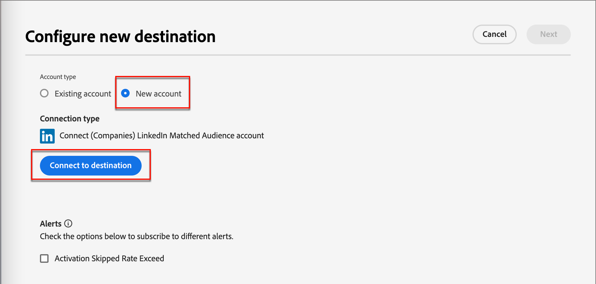
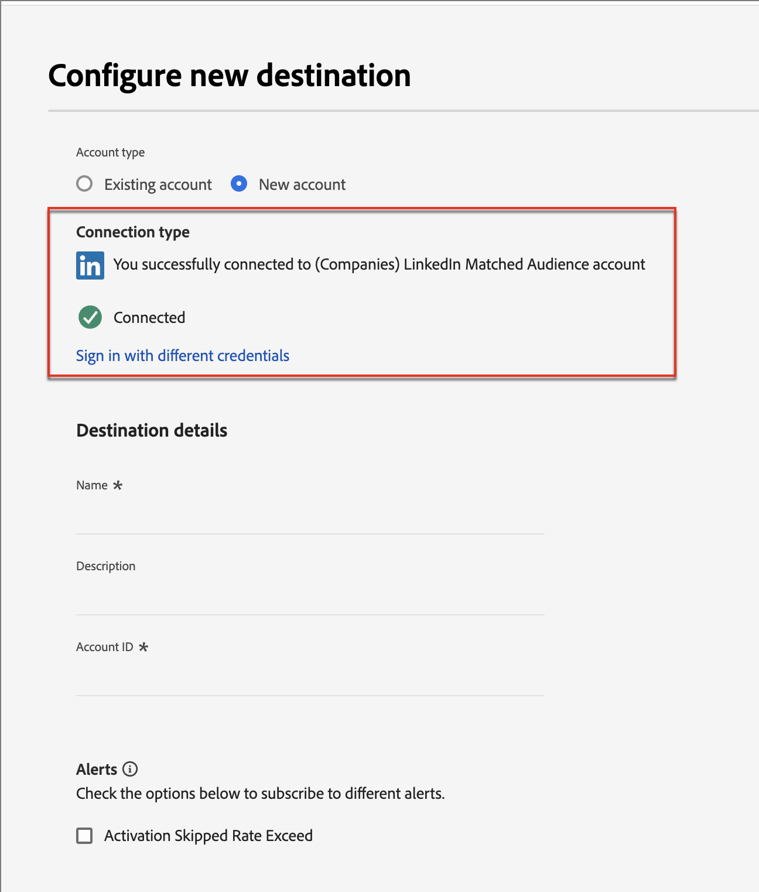
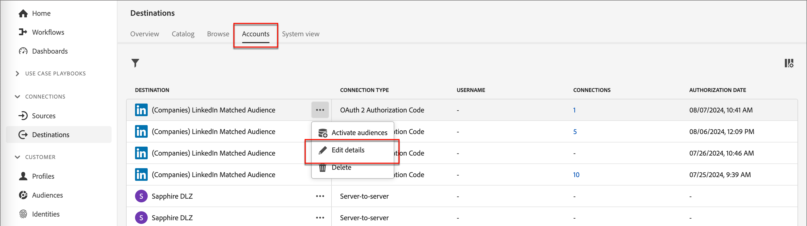
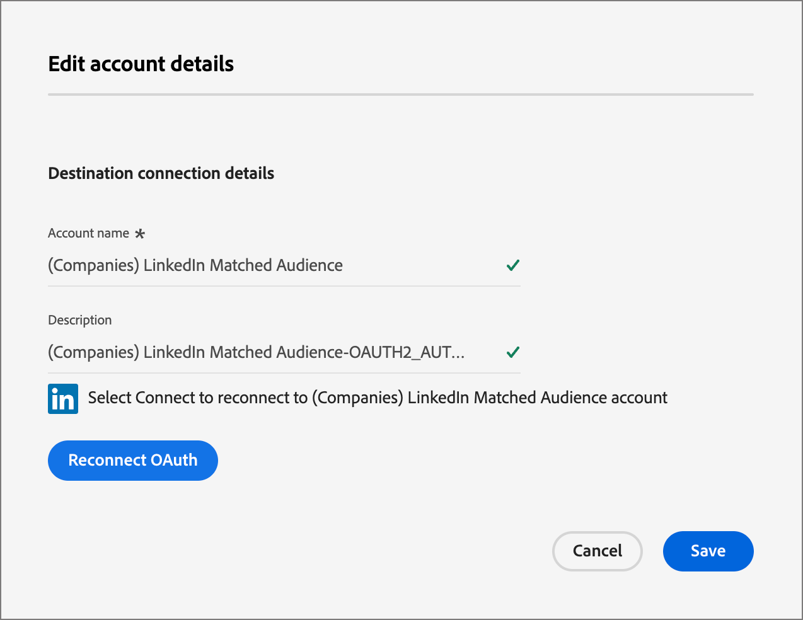
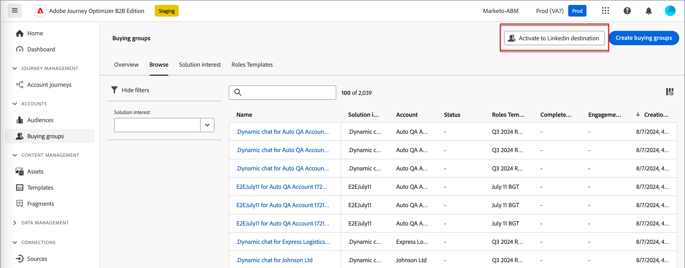
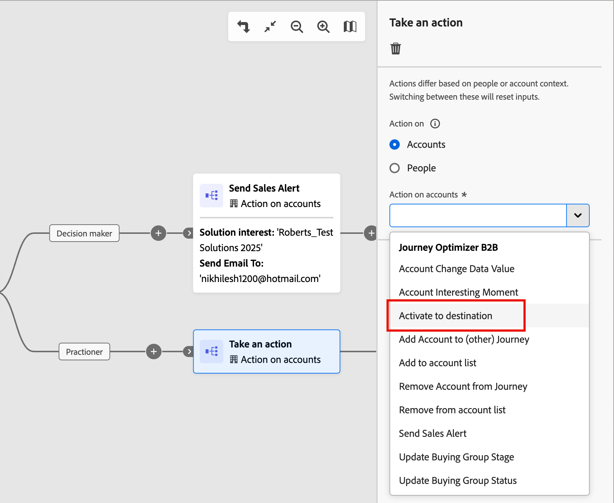
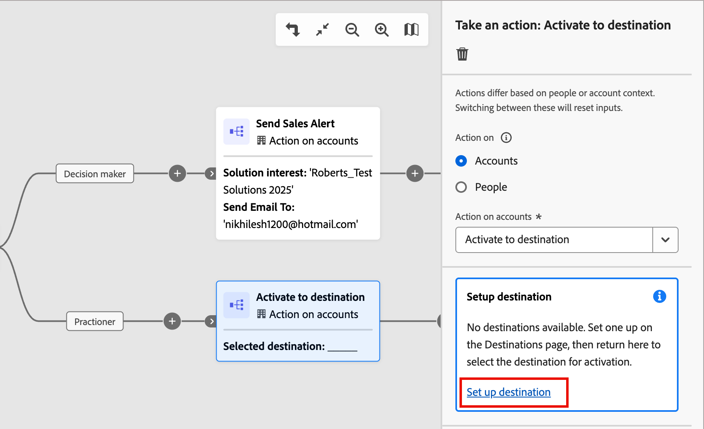

# LinkedIn Account Matched audiences

[!DNL Journey Optimizer B2B Edition]は、アカウントに一致するオーディエンスを通じてLinkedIn広告オーディエンスを生成する機能を提供しており、購買グループの空の役割を埋めるために設計されています。 一連の購買グループフィルターを定義することで、LinkedIn の一致するオーディエンスを維持し、購買グループのパラメーターに一致する見込み客をターゲットにすることができます。 _アクションを実行_ ノードからアカウントジャーニーからオーディエンスをアクティブ化することもできます。

この機能は、Experience Platform の宛先を活用して統合のいくつかの側面を管理します。 最大10個のデータフローがあります。

Journey Optimizer B2B editionからデータフローを開始する前に、Experience Platform アプリケーションでLinkedIn Campaign Manager アカウントが設定された[&#x200B; （Companies） LinkedIn Matched Audience destination connector](https://experienceleague.adobe.com/en/docs/experience-platform/destinations/catalog/social/linkedin#connect){target="_blank"}の少なくとも1つのインスタンスが必要です。

## 新しい LinkedIn アカウント接続を設定 {#linkedin-destination-setup}

>[!CONTEXTUALHELP]
>id="ajo-b2b_linkedin_destination_setup"
>title="LinkedIn の宛先の設定は必須です"
>abstract="購買グループ別にフィルタリングされたアカウントを LinkedIn の宛先に送信し、潜在的な購買グループのメンバーに関与します。 フィルタリングされたアカウントの 10 個の異なるグループに対して、最大 10 個のデータフローを作成できます。 この機能の使用を開始するには、まず Linkedin の宛先を追加します。"

1. Experience Platformで、左側のナビゲーションで&#x200B;**[!UICONTROL Connections]**&rbrace; > **[!UICONTROL Destinations]**&#x200B;に移動し、「**[!UICONTROL カタログ]**」タブを選択します。

1. カタログで、**[!UICONTROL （Companies） LinkedIn Matched Audience]** コネクタを見つけます。

   >[!TIP]
   >
   >検索ボックスに`LinkedIn`と入力すると、コネクタをすばやく見つけることができます。

1. コネクタカードで、_詳細_ （**...**&#x200B;をクリックします。 アイコンをクリックし、**[!UICONTROL 新しい宛先を設定]**&#x200B;を選択します。

   {width="800" zoomable="yes"}

1. **[!UICONTROL 新しいアカウント]**&#x200B;を選択し、**[!UICONTROL 宛先]**&#x200B;に接続をクリックします。

   {width="500"}

1. LinkedInの資格情報を入力してログインします。

   認証後、LinkedIn アカウントはExperience Platformの宛先として接続されます。

   {width="400"}

   >[!IMPORTANT]
   >
   >この時点で、**宛先の詳細&#x200B;_を_入力しないでください**。 接続だけが必要です。

## アカウント詳細の更新

LinkedIn アカウントの名前と説明は、Journey Optimizer B2B editionの購買グループに表示されます。 この情報を更新して、購買グループを扱うマーケターが容易に特定できるようにすることがベストプラクティスです。 アカウントの詳細は、Experience PlatformまたはJourney Optimizer B2B edition UIで変更できます。

1. Go to **[!UICONTROL Connections]** > **[!UICONTROL Destinations]** in the left navigation and select the **[!UICONTROL Accounts]** tab.

1. For the new account that you created, click the _More_ (**...**) menu and choose **[!UICONTROL Edit details]**.

   {width="800" zoomable="yes"}

1. In the dialog, update the name and description.

   {width="500"}

1. 「**[!UICONTROL 保存]**」をクリックします。

## Activate the account for buying groups

>[!NOTE]
>
>If you already have ten dataflows, you cannot create another. If you are at the maximum, delete one in Experience Platform before you create a new one in Journey Optimizer B2B Edition.

1. Journey Optimizer B2B Edition で、左側のナビゲーションにある&#x200B;**[!UICONTROL アカウント]**／**[!UICONTROL 購買グループ]**&#x200B;に移動します。

1. 「**[!UICONTROL 参照]**」タブを選択します。

1. Click **[!UICONTROL Activate to LinkedIn Destination]** at the top right.

   {width="800" zoomable="yes"}

1. Give the dataflow a descriptive name and description (optional).

   After you save it, the name that you specify for the dataflow is prepended with _AJOB2B_ to aid in identifying the dataflow in Experience Platform.

1. Enter the [Account ID of your LinkedIn Campaign Manager Account](https://www.linkedin.com/help/lms/answer/a424270).

   You can find your Account ID by your Account Name in the Campaign Manager UI.

   {width="700" zoomable="yes"}

1. Click **[!UICONTROL Select buying group filters]** and define the parameters of your account audience.

   >[!IMPORTANT]
   >
   >At this time, filters cannot be edited after the dataflow is activated. Double-check your work before you activate the dataflow.

   {width="400"}

   **[!UICONTROL エンゲージメントスコア]**&#x200B;の場合、演算子 `Between` は、パーセンテージ範囲と同様に包括的です。 例えば、5.1 と 5 は、どちらも 5 と 6 の&#x200B;_間_&#x200B;にあります。

   Empty conditions are treated like `Is Any`.

   Click **[!UICONTROL Save]** to add the specified filters.

1. Click **[!UICONTROL Select LinkedIn destination]** and choose the configured LinkedIn destination that you want to use.

   Upon activation, this setting creates the dataflow using the destination configuration and a corresponding virtual segment.

1. Double-check your settings and click **[!UICONTROL Activate]** at the top right.

   Click **[!UICONTROL Activate]** again in the confirmation dialog.

   A banner is displayed with a link to your dataflows menu in Experience Platform so that you can check the dataflow record.

## Activate an audience from an account journey

Starting with the 2025.10 release, use the _Activate to Destination_ action for accounts to activate accounts to a LinkedIn destination directly from your journey. Use the action for a LinkedIn destination to streamline campaign execution by eliminating multi-system handoffs and reducing latency. For example, as a marketer, you can automatically activate high-intent accounts to LinkedIn for retargeting when key buying roles are missing, or re-engage dormant accounts based on inactivity filters.

1. With the _Take an action_ node selected in the journey canvas, set the **[!UICONTROL Action on accounts]** to **[!UICONTROL Activate to destination]**.

   {width="550" zoomable="yes"}

1. From the node properties on the right, choose the destination.

   * If there are one or more destinations created, you can click **[!UICONTROL Select destination]** to choose an existing destination.

   * If there are no existing destinations, or you want to create a new destination, click **[!UICONTROL Set up destination]**.

     {width="550" zoomable="yes"}

     This action opens the the Destinations catalog page in a new browser tab.

   {width="600" zoomable="yes"}

1. In the dialog, select the configured LinkedIn destination and click **[!UICONTROL Save]**.

   {width="700" zoomable="yes"}

1. Enter the **[!UICONTROL Audience name]** that is used to identify the activated audience in the destination.

   {width="550" zoomable="yes"}

## Orchestrate paid media engagement

You can engage with account members through a paid media channel, such as LinkedIn Ad audiences, to acquire, nurture, and qualify them for Sales. Use a _Take an action_ node in an account journey to automate engagement with key members of an account through an external channel that is a best fit for different account members.

>[!VIDEO](https://video.tv.adobe.com/v/3448649/?learn=on)