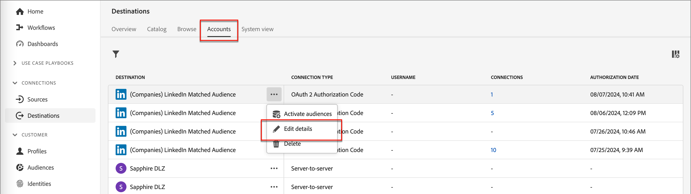

# LinkedIn Account Matched Audiences

Journey Optimizer B2B editionは、アカウントでマッチしたオーディエンスを通じて LinkedIn Ad オーディエンスを生成する機能を提供し、顧客が購入グループで空の役割を果たすのを支援するように設計されています。 購入グループフィルターのセットを定義することで、LinkedIn でマッチしたオーディエンスを維持し、購入グループパラメーターに一致する見込み客をターゲットにすることができます。 この機能は、Experience Platform の宛先を活用して統合のいくつかの側面を管理します。データフローの上限は 10 個です。

Journey Optimizer B2B editionからデータフローを開始する前に、一致したオーディエンスの [ （会社） LinkedIn 宛先コネクタのインスタンスが少なくとも 1 つ必要で ](https://experienceleague.adobe.com/en/docs/experience-platform/destinations/catalog/social/linkedin#connect){target="_blank"}Experience Platform アプリケーションに LinkedIn Campaign Manager アカウントが設定されている必要があります。

## 新しい LinkedIn アカウント接続を設定 {#linkedin-destination-setup}

>[!CONTEXTUALHELP]
>id="ajo-b2b_linkedin_destination_setup"
>title="LinkedIn の宛先の設定は必須です"
>abstract="購買グループ別にフィルタリングされたアカウントを LinkedIn の宛先に送信し、潜在的な購買グループのメンバーに関与します。フィルタリングされたアカウントの 10 個の異なるグループに対して、最大 10 個のデータフローを作成できます。この機能の使用を開始するには、まず Linkedin の宛先を追加します。"

1. Experience Platformで、左側のナビゲーションで **[!UICONTROL 接続]**/**[!UICONTROL 宛先]** に移動し、「**[!UICONTROL カタログ]**」タブを選択します。

1. カタログ内で、**[!UICONTROL （Companies） LinkedIn Matched Audience]** コネクタを見つけます。

   >[!TIP]
   >
   >検索ボックスに `LinkedIn` と入力すると、コネクタをすばやく見つけることができます。

1. コネクタカードで「_詳細_ （**...**）」アイコンをクリックし、「**[!UICONTROL 新しい宛先を設定]**」を選択します。

   {width="800" zoomable="yes"}

1. **[!UICONTROL 新規アカウント]** を選択し、「**[!UICONTROL 宛先に接続]**」をクリックします。

   {width="500"}

1. LinkedIn 資格情報を入力し、ログインします。

   認証後、LinkedIn アカウントはExperience Platformで宛先として接続されます。

   {width="400"}

   >[!IMPORTANT]
   >
   >この時点で、**宛先の詳細 _[!UICONTROL を入力**&#x200B;ないでください]_。 接続のみが必要です。

## アカウントの詳細の更新

LinkedIn アカウントの名前と説明は、Journey Optimizer B2B editionの購買グループに表示されます。 この情報を更新して、購入グループに所属するマーケターが容易に識別できるようにすることがベストプラクティスです。 アカウントの詳細は、Experience PlatformまたはJourney Optimizer B2B edition UI で変更できます。

1. 左側のナビゲーションで **[!UICONTROL 接続]**/**[!UICONTROL 宛先]** に移動し、「**[!UICONTROL アカウント]**」タブを選択します。

1. 作成した新しいアカウントについて、「_詳細_ （**...**）」メニューをクリックし、「**[!UICONTROL 詳細を編集]**」を選択します。

   {width="800" zoomable="yes"}

1. ダイアログで、名前と説明を更新します。

   {width="500"}

1. 「**[!UICONTROL 保存]**」をクリックします。

## 購買グループのアカウントを有効化します

>[!NOTE]
>
>既に 10 個のデータフローがある場合、別のデータフローを作成することはできません。 最大数に達した場合は、Experience Platformで削除してから、Journey Optimizer B2B editionで新しく作成します。

1. Journey Optimizer B2B Edition で、左側のナビゲーションにある&#x200B;**[!UICONTROL アカウント]**／**[!UICONTROL 購買グループ]**&#x200B;に移動します。

1. 「**[!UICONTROL 参照]**」タブを選択します。

1. 右上の **[!UICONTROL LinkedIn の宛先に対してアクティブ化]** をクリックします。

   {width="800" zoomable="yes"}

1. データフローにわかりやすい名前と説明を付けます（オプション）。

   保存すると、Experience Platformでデータフローを識別できるように、データフローに指定した名前の先頭に _AJOB2B_ が付加されます。

1. [LinkedIn キャンペーンマネージャーアカウントのアカウント ID](https://www.linkedin.com/help/lms/answer/a424270) を入力します。

   アカウント ID は、Campaign Manager UI のアカウント名で確認できます。

   {width="700" zoomable="yes"}

1. **[!UICONTROL 購入グループフィルターを選択]** をクリックし、アカウントオーディエンスのパラメーターを定義します。

   >[!IMPORTANT]
   >
   >現時点では、データフローをアクティブ化した後にフィルターを編集することはできません。 データフローをアクティブ化する前に、作業内容を再度確認します。

   {width="400"}

   **[!UICONTROL エンゲージメントスコア]**&#x200B;の場合、演算子 `Between` は、パーセンテージ範囲と同様に包括的です。例えば、5.1 と 5 は、どちらも 5 と 6 の&#x200B;_間_&#x200B;にあります。

   空の条件は `Is Any` のように扱われます。

   「**[!UICONTROL 保存]**」をクリックして、指定したフィルターを追加します。

1. **[!UICONTROL LinkedIn の宛先を選択]** をクリックし、使用する設定済みの LinkedIn の宛先を選択します。

   アクティブ化すると、この設定によって、宛先設定と対応する仮想セグメントを使用してデータフローが作成されます。

1. 設定を再度確認し、右上の **[!UICONTROL アクティブ化]** をクリックします。

   確認ダイアログで **[!UICONTROL アクティブ化]** を再度クリックします。

   バナーとExperience Platformのデータフローメニューへのリンクが表示されるので、データフローレコードを確認できます。

## 有料メディアエンゲージメントの調整

LinkedIn 広告オーディエンスなどの有料メディアチャネルを通じてアカウントメンバーと関わり、メンバーを獲得、育成し、セールスの対象として認定できます。 アカウントジャーニーで _アクションの実行_ ノードを使用し、様々なアカウントメンバーに最適な外部チャネルを通じて、アカウントの主要メンバーとのエンゲージメントを自動化します。

>[!VIDEO](https://video.tv.adobe.com/v/3448649/?learn=on)