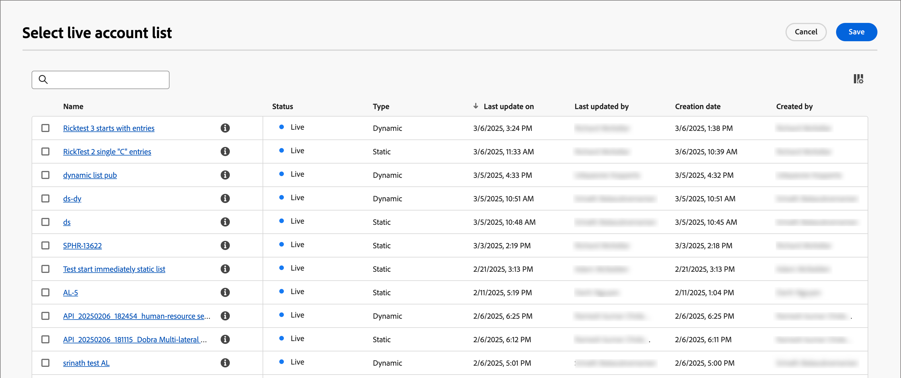

# アカウントオーディエンスジャーニーノード

アカウントオーディエンスノードは、ジャーニーにエントリするアカウントを指定します。 アカウント ジャーニーを[作成する場合](./create-publish-journey.md#create-a-journey)、ジャーニーは常に、入力を定義するアカウント オーディエンス ノードから始まります。

このジャーニーノードには、次のいずれかの入力オプションを使用します。

* **[アカウントオーディエンス](../audiences/account-audience-overview.md)** — アカウントオーディエンスは、Experience Platform Segmentation Serviceから同期する基本的なオーディエンスを表します。
* **[アカウントリスト](../accounts/account-lists.md)** — アカウントリストは、ターゲットジャーニーオーケストレーションに使用する名前付きアカウントのコレクションです。 アカウントリストは、業界、所在地、企業規模などの定義された基準を使用して、名前付きアカウントをターゲットにします。

## アカウントオーディエンスノードのオーディエンスの設定

1. 「**[!UICONTROL アカウントオーディエンス]**」ノードをクリックします。 このアクションは、右側のパネルにノードプロパティを表示します。

   {width="700" zoomable="yes"}

1. ジャーニーに入力するアカウントの入力タイプを選択します。

   * **[!UICONTROL アカウントオーディエンス]**

     「アカウントオーディエンス」オプションを選択します。 次に、**[!UICONTROL アカウントオーディエンスを追加]**&#x200B;をクリックします。

     _[!UICONTROL オーディエンスを追加]_ ダイアログで、以前に作成したオーディエンスセグメントを選択します。 次に、**[!UICONTROL オーディエンスを追加]**&#x200B;をクリックします。

     {width="700" zoomable="yes"}

   * **[!UICONTROL アカウントリスト]**

     アカウントリストオプションを選択します。 「**[!UICONTROL アカウントリストを追加]**」をクリックします。

     _[!UICONTROL ライブアカウントリストを選択]_ ダイアログで、公開されたアカウントリストを選択します。 次に、「**[!UICONTROL 保存]**」をクリックします。

     {width="700" zoomable="yes"}

     アカウントリストの作成と公開について詳しくは、[&#x200B; アカウントリスト &#x200B;](../accounts/account-lists.md)を参照してください。

## オーディエンスセグメントの作成

1. 左側のナビゲーションで、**[!UICONTROL アカウント]**/**[!UICONTROL オーディエンス]**&#x200B;を選択します。

1. 右上隅の「**[!UICONTROL オーディエンスを作成]**」をクリックします。

   {width="800" zoomable="yes"}

1. [&#x200B; セグメント化サービスガイド &#x200B;](https://experienceleague.adobe.com/ja/docs/experience-platform/segmentation/types/account-audiences){target="_blank"}の手順に従います。
